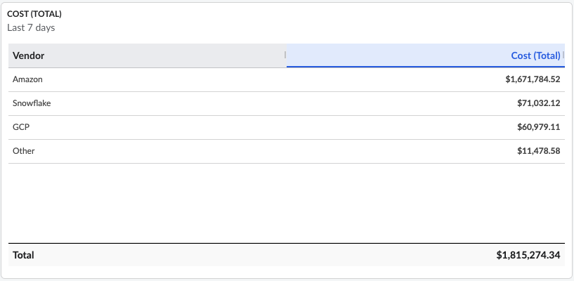

# Widget de tabla

El widget de tabla permite obtener una visión general detallada de los datos y se utiliza para realizar un análisis preciso y exhaustivo de los costes. El widget de tabla se puede crear utilizando datos de «coste y consumo» o de «utilización».

Los usuarios pueden seleccionar hasta 15 dimensiones y hasta 8 métricas para crear la tabla.

Las tablas se pueden ordenar según cualquiera de las dimensiones o métricas seleccionadas.

Por último, para que el widget de tabla resulte más claro, los usuarios pueden optar por mostrar en la tabla únicamente los N valores más altos o los N valores más bajos. Los valores restantes se agruparán en la categoría «Otros».

Los widgets de tabla de los paneles de control de « Cloudability » suman automáticamente todas las filas y muestran el valor total en la parte inferior del widget.

**Tema principal:** [Crear o editar un widget en un panel de control](../product/create-or-edit-a-widget-in-a-dashboard.html)
