# Cloudability o: Novedades en 2024

## Filtrado estadístico de la interfaz de usuario del inventario de recursos – 25 de diciembre de 2024

Con esta versión, hemos incorporado una nueva opción en la interfaz de usuario del Inventario de recursos (tanto en AWS como en Azure ) que te permite seleccionar y visualizar un subconjunto de los datos del Inventario de recursos. A partir de los datos de inventario generados para un servicio y un periodo de tiempo concretos, ahora puedes optar por mostrar un subconjunto de esos datos, ya sea el número x de recursos principales o el porcentaje x de recursos principales, en función de la métrica de coste o de utilización que prefieras.

Por ejemplo: «Inventario de recursos» muestra 1000 registros de un servicio de « EC2 » correspondientes a un periodo de siete días. Puedes filtrar aún más esta visualización seleccionando mostrar solo el 25 % superior de estos recursos, según el coste (total). Al aplicar este filtro, se obtendrían los 250 recursos principales según el «Coste (total)», ordenados de mayor a menor.

## Compatibilidad con la API pública para el inventario de recursos - 24 de diciembre de 2024

Hoy hemos puesto en marcha la compatibilidad con los puntos finales de la API pública tanto para los datos de inventario de AWS como para los de Azure, que actualmente están disponibles a través de la interfaz de usuario de Cloudability. Esta versión responde a las necesidades de aquellos clientes que desean extraer los datos mediante programación. Anteriormente, solo se podía acceder a estos datos desde la interfaz de usuario de Cloudability.

## vCPU «Hours Metric» en « Cloudability » - 20 de diciembre de 2024

Hoy nos complace anunciar la ampliación de la métrica « vCPU Hours» para incluir la compatibilidad con « Google Cloud Platform » ( GCP ). Tras la introducción de este indicador para AWS a principios de este año, los usuarios ahora también pueden obtener información más detallada sobre la utilización de sus recursos de GCP.

vCPU La métrica de horas ofrece una mayor visibilidad sobre la utilización de los recursos, lo que permite una atribución de costes más precisa y una planificación de la capacidad bien fundamentada. Al calcular el tiempo total de ejecución de « vCPUs » en todos los recursos, te permite comprender mejor el proceso y te da la capacidad de optimizar las cargas de trabajo de forma eficaz.

Estamos trabajando para ampliar la compatibilidad con la métrica « vCPU Hours» a Azure, Oracle Cloud Infrastructure (OCI) y IBM Cloud en 2025 y 2026.

## Compromiso de compatibilidad con las operaciones CUD de Cloud SQL de « GCP » - 19 de diciembre de 2024

Hoy hemos incorporado la compatibilidad con las operaciones de lectura y escritura (CUD) de Cloud SQL de GCP.

Este es el tercer tipo de compromiso de « GCP » que admitimos, junto con los CUD de Compute Engine y los Flex-CUD de Compute Engine. GCP Los CUD de Cloud SQL son un compromiso basado en el gasto, en el que el usuario se compromete a gastar una cantidad determinada en dólares a cambio de un descuento sobre los precios bajo demanda. Funcionan de manera similar a los tipos CUD de GCE, ya que se combinan con precios negociados a medida. Ten en cuenta que el descuento de Cloud SQL también se puede negociar y que, con frecuencia, resulta menos ventajoso cuando se negocian grandes descuentos personalizados.

## Interfaz de usuario mejorada de las recomendaciones de compromiso de « GCP » - 19 de diciembre de 2024

Hoy, Cloudability ha presentado una interfaz de usuario mejorada para las recomendaciones de compromiso de GCP.

La experiencia del usuario supuso una mejora con respecto a la implementación existente de los CUD de Compute, gracias a la interfaz de usuario mejorada de las recomendaciones de compromiso de « GCP ».

Además, GCP ya había suministrado anteriormente los Compute Flex-CUD. También hemos incorporado la compatibilidad con los CUD de computación basada en recursos, lo que supone un ahorro mucho mayor en nuestra nueva y mejorada interfaz de usuario.

## Asignación de costes compartidos para estructuras de « Kubernetes » - Interfaz de usuario de Container Insights - 18 de diciembre de 2024

Hoy hemos incorporado la «Asignación de costes compartidos» en la interfaz de usuario de Container Insights. Esta nueva función transforma la forma en que se controlan y se asignan los costes de la infraestructura compartida, como los proxies del sistema y las herramientas de supervisión, dentro de los entornos de « Kubernetes ».

Puntos clave

- Visibilidad detallada : asigna los costes compartidos a espacios de nombres específicos de « Kubernetes », lo que aporta transparencia a los responsables de las aplicaciones y a los centros de coste
- Nuevas métricas : visualiza los costes compartidos asignados en la interfaz de usuario con métricas como «Coste compartido », «Red compartida » y «Memoria compartida», entre otras
- Reglas flexibles : definir y gestionar reglas de asignación de costes compartidos para configuraciones a nivel de toda la organización o específicas de cada clúster

Fecha de inicio : Los costes compartidos se calcularán únicamente a partir de la fecha de lanzamiento de la función. Las consultas anteriores a esta fecha mostrarán resultados vacíos en la columna «Coste compartido».

Comportamiento de la regla :

- Las normas se aplican a fechas futuras (en UTC) y no tienen carácter retroactivo
- Las actualizaciones o eliminaciones surten efecto en la fecha prevista
- Las reglas múltiples funcionan en una relación de unión entre espacios de nombres

Para conocer los pasos detallados de configuración y obtener más aclaraciones, consulta el Centro de ayuda.

Nota: Esta función garantiza una asignación precisa de los costes, lo que te ayuda a mejorar la precisión de los showback y los chargeback de los recursos compartidos.

## La asignación de costes de contenedores ya es compatible con la versión « Kubernetes » de « 1.31 » - 18 de diciembre de 2024

La asignación de costes de contenedores ya es compatible oficialmente con la versión 1.31 de Kubernetes en todos los proveedores. Esta función permite a los clientes obtener información detallada sobre el uso de sus recursos de contenedores y los costes asociados a los clústeres que se ejecutan en Kubernetes 1.31.

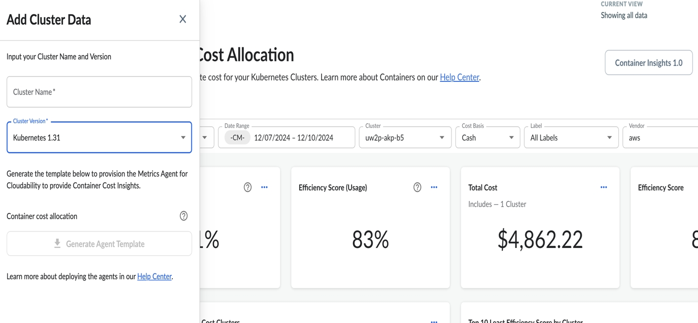

## Cloudability Container Insights: Presentamos la visibilidad detallada a nivel de pod - 17 de diciembre de 2024

Con esta versión, Cloudability ofrece ahora información detallada sobre los costes y el uso a nivel de pod dentro de la función Container Insights. Esta mejora te permite profundizar en una visualización jerárquica exhaustiva, lo que ofrece un nivel de detalle sin precedentes en el análisis de los costes de los contenedores.

Capacidades clave

- Seguimiento detallado de los costes : obtén visibilidad sobre las métricas de costes y uso a nivel de pod
- Navegación jerárquica : explora con total fluidez desde Clúster → Espacio de nombres → Cargas de trabajo → Pods y contenedores
- Información detallada : Comprende la asignación de costes y la utilización de recursos con un nivel de detalle sin precedentes

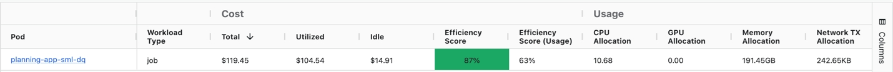

Esta versión mostrará la visibilidad a nivel de pod a partir de la fecha de lanzamiento y no reflejará períodos históricos.

## Cloudability para IBM Cloud – Gestión de costes (GA) - 13 de diciembre de 2024

Apptio anuncia hoy el lanzamiento en versión general (GA) de la integración de IBM Cloud en Cloudability. Esta versión ofrece a los usuarios de « FinOps » un acceso fluido y nativo a los costes de « IBM Cloud », con datos directos de uso dentro de « Cloudability ».

Cómo te puede ayudar esta función

Esta versión permite a los clientes de « IBM Cloud » hacer lo siguiente:

- Imputar los costes de « IBM Cloud » a las unidades de negocio según normas específicas, utilizando automáticamente las dimensiones de negocio de « Cloudability ».
- Analiza su gasto en IBM Cloud y mejora la implicación del equipo aprovechando los análisis a nivel de recursos, los paneles interactivos multicloud y las vistas personalizadas.
- Fomenta la responsabilidad financiera mediante la configuración de presupuestos « IBM Cloud » y notificaciones de eventos.

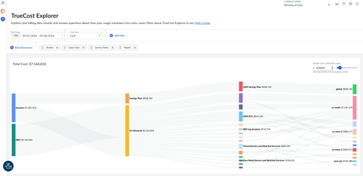

Cómo gestionar tus gastos en « IBM Cloud »

IBM Cloud Los clientes pueden iniciar su proceso de gestión de costes añadiendo las credenciales de su cuenta. Cloudability Recogerá los datos de IBM Cloud del mes en curso una vez que se hayan validado tus credenciales. Para importar datos históricos adicionales, sigue [estos pasos](https://cloud.ibm.com/docs/account?topic=account-exporting-your-usage&interface=ui#access-historical-data "(se abre en una pestaña o una ventana nueva)") y, a continuación, ponte en contacto con el equipo de asistencia de Apptio. Consulta la [documentación de la API](../api-v3/getting_started_with_the_cloudability.html) para obtener acceso programático y gestionar las credenciales de IBM Cloud. Únete a la conversación en la [comunidad « Apptio »](https://community.apptio.com/communities/apptioproducts?communitykey=f67c7e7c-be1c-4053-9845-2376da697342 "(se abre en una pestaña o una ventana nueva)") para obtener más información.

Más información sobre esta versión

En esta versión, también hemos añadido etiquetas personalizadas adicionales específicas de IBM Cloud, que pueden utilizarse como dimensión adicional para la elaboración de informes:

- Nombre del grupo de recursos: cldy:ibm:nombre\_del\_grupo\_de\_recursos
- ID del grupo de recursos: cldy:ibm:resourcegroupid
- ClusterID: cldy:ibm:clusterid
- ID del plan: cldy:ibm:planid
- ID de consumidor: cldy:ibm:consumerid
- Nombre de la instancia como «Nombre del recurso»

Con este lanzamiento de GA, el gasto gestionado por IBM Cloud en Cloudability se incluirá en sus «Costes supervisados» y estará sujeto al «Límite de costes supervisados» que tenga contratado.

## Credenciales de proveedor compartidas entre Cloudability Premium y Turbonomic - 10 de diciembre de 2024

A partir de hoy, las cuentas de CSP ( AWS, Azure y GCP ) y APM ( Datadog, New Relic ) creadas en Cloudability como parte de su paquete Premium se compartirán con Turbonomic. Con esta versión, los clientes de « Cloudability Premium » ya no tienen que configurar las mismas cuentas en la nube en las herramientas Cloudability y Turbonomic, lo que supone un ahorro considerable de tiempo en la configuración.

Las versiones posteriores de « Cloudability Premium » se basan en esta versión para compartir e intercambiar datos. El proceso de aprovisionamiento de clústeres en Cloudability está experimentando un pequeño cambio que ahora permite descargar dos scripts de instalación de agentes diferentes: Cloudability y Turbonomic, en el clúster que se está aprovisionando en Cloudability.

Características

Cloudability Los administradores ya pueden solicitar los permisos adicionales necesarios para que Turbonomic se integre con Cloudability. como parte de Cloudability Premium

implementación. Al añadir cuentas de CSP ( AWS, Azure o GCP ), se solicitan permisos adicionales que Turbonomic necesita para conectarse a dichas cuentas de CSP como parte de los informes de facturación (credenciales básicas) y de los informes de utilización (credenciales avanzadas); también se puede optar por conceder permisos adicionales a Turbonomic para que ejecute acciones o las automatice mediante políticas.

En el caso de los clientes actuales de Cloudability que se actualicen a Cloudability Premium, será necesario modificar todas las cuentas CSP existentes, conceder permisos adicionales y volver a verificarlas para que las mismas cuentas en la nube puedan seguir recopilando y procesando datos.

En el caso de las cuentas APM ( Datadog, New Relic ), es necesario facilitar datos adicionales (y volver a verificarlos en el caso de los clientes actuales de Cloudability que se actualicen a Cloudability Premium ).

Al crear clústeres en Cloudability, los administradores tendrán la opción de descargar los scripts de instalación de los agentes Cloudability, Turbonomic y Kubernetes. Es necesario que ambos agentes estén en ejecución para que la asignación de costes de Kubernetes (de Cloudability ) y las recomendaciones de optimización de costes (de Turbonomic ) funcionen sin problemas.

Cómo te puede ayudar esta función

Es necesario configurar las mismas cuentas de CSP y APM tanto en Cloudability como en Turbonomic para que estos dos productos puedan recopilar, importar y procesar los datos de facturación y uso procedentes de estas fuentes. Para ahorrar tiempo en la configuración, permitimos configurar las cuentas de CSP y APM una sola vez en Cloudability, de modo que ambos productos puedan aprovecharlas y los administradores ahorren tiempo en la configuración. Una vez configuradas y verificadas las cuentas en Cloudability, estas configuraciones se comparten con Turbonomic, lo que permite que las pruebas de Turbonomic se ejecuten sin problemas.

Del mismo modo, al configurar clústeres de Kubernetes, el administrador de Cloudability tiene la opción de descargar tanto los scripts de instalación de Cloudability como los de Kubernetes, junto con las instrucciones de instalación. Solo una vez que ambos estén instalados, funcionarán las funciones de asignación de costes y optimización de costes para los clústeres de « Kubernetes » en implementaciones Premium.

## AWS S3 Ajuste de capacidad - Compatibilidad con la clase de almacenamiento «Glacier Instant Retrieval» - 26 de noviembre de 2024

Hoy, Cloudability ha lanzado la compatibilidad con las recomendaciones de ajuste de capacidad de « AWS S3 » para Glacier Instant Retrieval. A partir de ahora, los clientes empezarán a recibir recomendaciones de ajuste de capacidad para la clase de almacenamiento «Glacier Instant Retrieval», junto con el resto de clases de « S3 » compatibles actualmente.

Antes de esta versión, no se admitían las recomendaciones para esta clase « S3 ».

Dónde encontrar la nueva funcionalidad

No es necesario realizar ninguna configuración adicional para empezar a recibir estas recomendaciones, siempre y cuando Cloudability esté correctamente conectado a Amazon Web Services.

Para utilizar la nueva función, sigue estos pasos:

1. Desde la página de inicio de Cloudability, ve al menú «Optimizar» y selecciona «Ajuste de tamaño».
2. Selecciona la pestaña « AWS » (Configuración de derechos) en la página «Rightsizing» y selecciona la subpestaña « S3 » (Configuración de derechos de acceso). Las recomendaciones de ajuste de tamaño para Glacier Instant Retrieval aparecerán en la lista de recomendaciones si existen y no se han filtrado.

Cómo te puede ayudar esta función

Amazon S3 ofrece una gama de clases de almacenamiento entre las que puedes elegir, en función de los requisitos de rendimiento, acceso a los datos, resiliencia y coste de tus cargas de trabajo. Con el fin de ofrecer recomendaciones sobre el dimensionamiento óptimo para obtener el menor coste de almacenamiento en función de los distintos patrones de acceso, a partir de ahora se proporcionarán recomendaciones para la clase de almacenamiento «Glacier Instant Retrieval», además de las demás clases que admite actualmente Cloudability. La clase de almacenamiento «Glacier Instant Retrieval» se suele utilizar para datos de archivo a los que se necesita acceder de forma inmediata.

## Métricas de sostenibilidad en la nube - 25 de noviembre de 2024

Hoy, Cloudability ha lanzado una serie de indicadores de sostenibilidad en entornos multinube, disponibles de forma limitada\*. A partir de hoy, podrás consultar estas métricas de forma rápida y sencilla para obtener información sobre las emisiones de carbono de su nube pública.

Dónde encontrar estas métricas

Estas nuevas métricas están disponibles en los informes y paneles de control de Cloudability, así como en Apptio BI.

- Emisiones estimadas de carbono ( MTCO2e ): Este indicador recoge las emisiones estimadas de carbono en toneladas métricas de dióxido de carbono equivalente.
- Consumo de energía ( kWh ): Esta métrica recoge la energía consumida en kilovatios-hora.

Estas métricas están disponibles a nivel de recurso para los servicios compatibles.

| AWS | Azure | GCP | OCI |
| --- | --- | --- | --- |
| EC2 | Cálculo (sin GPU) | GCE | Cálculo (sin GPU) |
| EBS | Disco gestionado | Disco persistente |  |
| RDS | Azure Base de datos | Cloud SQL |  |

Estas métricas también pueden combinarse con las distintas métricas de costes disponibles para obtener una visión conjunta tanto de las emisiones de carbono como de los costes de un recurso, o de otras dimensiones como el proveedor, la región y el servicio, entre otras.

Deberías poder utilizar esto con tus configuraciones actuales de vistas, asignaciones de negocio, grupos de cuentas o asignaciones de etiquetas. También están disponibles a través de exportaciones y de las API de Cloudability.

Pasos para utilizar estas métricas

Hemos configurado un panel de control predeterminado en Cloudability para empezar, que se encuentra en «Todos los paneles de control» y se llama «Panel de control de ejemplo sobre sostenibilidad en la nube ».

Para utilizar los indicadores de sostenibilidad en la nube:

1. Accede a la página de inicio de Cloudability.
2. Haz clic en «Nuevo informe» / «Añadir widget».
3. En la sección «Métricas» de « Cloudability », desplázate hasta la categoría «Sostenibilidad».
4. Selecciona las métricas.

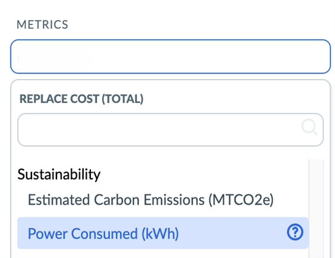

\*Disponibilidad limitada: indica que todas las características y funciones están disponibles, pero que, por el momento, solo se ofrecen a un segmento concreto de clientes. En los próximos meses, esta medida se extenderá a todos los clientes.

Nota:

Estas métricas solo están disponibles para los clientes que dispongan de los SKU Cloudability Enterprise, Cloudability Standard y Cloudability Premium.

## Reprocesamiento de datos de autoservicio - 22 de noviembre de 2024

Hoy anunciamos la disponibilidad general de la función «Reprocesamiento de datos de autoservicio» para nuestros clientes de Cloudability.

Esta función te permite volver a procesar tus datos sin necesidad de recurrir a los equipos de asistencia técnica o de éxito del cliente. En comparación con el proceso basado en solicitudes, esta función ofrece un tiempo de respuesta más rápido, elimina los pasos manuales, aumenta la transparencia en las solicitudes de los usuarios y mejora la experiencia general.

Con esta versión, también hemos solucionado un problema crítico por el que los datos reprocesados no se reflejaban inmediatamente en los informes una vez finalizado el proceso, lo que provocaba retrasos a la hora de consultar la información actualizada. Ahora, una vez finalizado el proceso, puedes consultar inmediatamente los datos reprocesados en «Informes». Además, la pestaña «Estado del trabajo» muestra la hora de finalización del trabajo y el campo «Motivo ».

Durante la fase inicial de implantación, recibimos comentarios de los clientes que exportaban sus datos en la nube desde « Cloudability » (o a través de CDI) a «Costing & Planning» sobre algunas deficiencias en la experiencia de usuario y en el producto. Por lo tanto, hemos decidido suspender temporalmente esta función para los clientes que utilicen la integración de « Cloudability » o «CDI to Costing & Planning»; no obstante, estará disponible para los clientes que solo dispongan de « Cloudability ». Estamos trabajando activamente para mejorar la experiencia y esperamos lanzar la función mejorada a principios del año que viene. Cloudability Los clientes con el módulo «Costing & Planning» que tenían acceso durante la implantación inicial seguirán conservando dicho acceso

Esta función no está activada de forma predeterminada, ya que se trata de una función opcional. Ponte en contacto con el equipo de asistencia para poder acceder a esta función.

Más información sobre esta función

Cuando esta función está activada, se puede acceder a ella yendo a  Organizar  >  Reprocesamiento de datos en  Cloudability

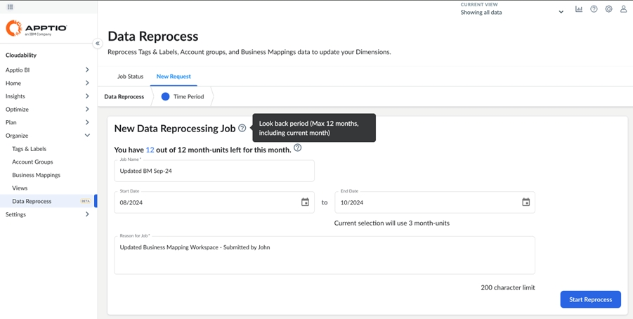

Para los clientes que solo utilizan « Cloudability », este es un proceso de dos pasos para la «Reprocesación», en el que se puede seleccionar el «Período» y enviar el trabajo. También puedes consultar el estado del trabajo en la pestaña «Estado del trabajo ». Para obtener instrucciones detalladas, consulte la [sección "Reprocesamiento de datos para usuarios Cloudability "](../product/data_reprocess.html#data_reprocess__Data).

Para los clientes de Costing & Planning que utilicen « Cloudability » o CDI: esta función está en suspenso. Consulte el documento [Reprocesamiento de datos para Cloudability : usuarios de Costos y Planificación](../product/data_reprocess.html#data_reprocess__Data2).

## Modalidad de cobertura ampliada en toda la cartera de compromisos de « GCP » — 19 de noviembre de 2024

Hoy hemos lanzado la ventana modal de cobertura mejorada en toda la cartera de compromisos de « GCP ».

Esta mejora no solo optimiza la ventana emergente de cobertura ya publicada en la página «Cartera de compromisos Flex-CUDs» de GCP, sino que también amplía dicha ventana emergente a todas las páginas de carteras de GCP. Hemos simplificado la terminología y hemos dividido el modal en dos secciones. La sección dedicada al cálculo del porcentaje de cobertura incluye toda la información necesaria para calcular la cobertura de esa página concreta. La sección «Resumen de la cobertura por proveedor» recoge, para mayor comodidad, los valores de cobertura a nivel de proveedor.

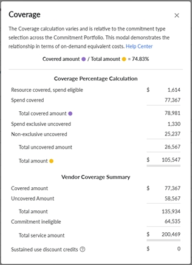

## Apptio Transición comunitaria a IBM TechXchange - 1 de noviembre de 2024

En la actualidad, la Comunidad Apptio ha pasado a llamarse IBM TechXchange.

A continuación se enumeran las mejores prácticas para sacar el máximo partido a la experiencia de IBM TechXchange.

- Utiliza y añade a tus favoritos [esta nueva página de inicio](https://community.ibm.com/community/user/apptio/home "(se abre en una pestaña o una ventana nueva)") de los grupos temáticos de « Apptio ».
- Acceda al grupo temático que se ajuste a sus necesidades; algunos de los grupos temáticos con los que está familiarizado se han combinado en nuevos grupos temáticos.

Están disponibles los siguientes grupos temáticos:

- [Apptio](https://community.ibm.com/community/user/apptio/communities/community-home?communitykey=4100dfb8-fc23-4203-83c7-019253cf7c0b "(se abre en una pestaña o una ventana nueva)") : Fundamentos de la contabilidad de costes, Contabilidad de costes estándar (CT-Foundation), Apptio Planning (ITP/ITFMF), Facturación (Billing Standard), Análisis comparativo (Benchmarking), Integración de ServiceNow
- [Cloudability](https://community.ibm.com/community/user/apptio/communities/community-home?communitykey=15c0e07d-35c0-49de-a84b-019253d13376 "(se abre en una pestaña o una ventana nueva)") : Cloudability Financial Planning, Cloudability TotalCost, Apptio Turbonomic Integración
- [https://community.ibm.com/community/user/apptio/communities/community-home?communitykey=55a3712d-1835-4ec2-bcd7-603e88cd9dd2](https://community.ibm.com/community/user/apptio/communities/community-home?communitykey=55a3712d-1835-4ec2-bcd7-603e88cd9dd2 "(se abre en una pestaña o una ventana nueva)")
- [Plataforma](https://community.ibm.com/community/user/apptio/communities/community-home?communitykey=44bcb0d2-5ce6-4504-89eb-019253d3b5d8 "(se abre en una pestaña o una ventana nueva)") : Apptio BI, ATUM, Automated Data Management, DataLink, Frontdoor, TBM Studio
- [Apptio para todos](https://community.ibm.com/community/user/apptio/communities/community-home?communitykey=2e85ed45-9b8a-486c-bd55-019253d466eb "(se abre en una pestaña o una ventana nueva)")

- Una vez que estés en tu grupo temático, lee y contribuye a todos los contenidos habituales, como enlaces rápidos, debates, preguntas y blogs.
- Echa un vistazo a [estos recursos](https://community.ibm.com/community/user/participate/resources "(se abre en una pestaña o una ventana nueva)") sobre cómo moverte por la comunidad y sacarle partido.
- Empieza a enviar solicitudes de mejoras en « [IBM Ideas](https://login.ibm.com/idaas/mtfim/sps/idaas/login?client_id=nwnjmzc5njetmzlkyi00&target=https%3a%2f%2flogin.ibm.com%2foidc%2fendpoint%2fdefault%2fauthorize%3fqsid%3dc75ff073-50e8-4426-8979-7e4b6b992e80%26client_id%3dnwnjmzc5njetmzlkyi00 "(se abre en una pestaña o una ventana nueva)") ».

  - IBM utiliza un portal unificado de ideas en  [ideas.ibm.com](https://ideas.ibm.com/ "(se abre en una pestaña o una ventana nueva)")  para que puedas aportar ideas sobre todos los productos. A partir de hoy, esa lista se ha ampliado para incluir los productos recientemente adquiridos a Apptio. Las ideas presentadas antes de la adquisición se pondrán a disposición de los equipos de producto y podrán añadirse al portal en una fecha futura para garantizar la continuidad.

Ponte en contacto con el equipo de la comunidad a través de nuestra nueva dirección de correo electrónico,  [support@communitysite.ibm.com](mailto:support@communitysite.ibm.com "(se abre en una pestaña o una ventana nueva)"),  si tienes alguna duda o necesidad.

## Proveedores externos y asistencia de FOCUS - 29 de octubre de 2024

Hoy hemos lanzado la gestión de costes para proveedores de servicios en la nube externos de forma nativa en Cloudability.

Esto supone una mejora significativa para Cloudability, ya que simplifica la forma en que los profesionales de FinOps gestionan los costes de proveedores como Datadog, Databricks y Snowflake. El hecho de disponer de estos datos de costes y uso de forma nativa en la plataforma Cloudability permite utilizarlos en funciones como Business Mapping, Views y Dashboards. Dependiendo del proveedor, estos datos pueden importarse mediante un conector directo o a través del esquema FOCUS, ampliamente adoptado en el sector.

Esta versión permite a los clientes de « Cloudability » hacer lo siguiente:

- Importa datos de facturación de Datadog, Databricks, Snowflake y MongoDB a través de conectores directos y de otros proveedores mediante exportaciones compatibles con FOCUS.
- Imputar estos costes a la empresa según sus normas específicas, aprovechando las funciones de asignación de etiquetas, grupos de cuentas y asignación empresarial.
- Analiza este gasto y mejora la implicación del equipo con paneles interactivos multicloud y vistas personalizadas.
- Fomenta la responsabilidad financiera mediante la elaboración de presupuestos y el envío de notificaciones sobre eventos.

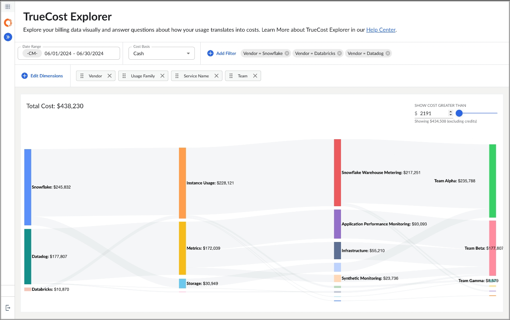

FOCUS: entrada

Cloudability Ahora los clientes pueden disfrutar de mayor flexibilidad al importar datos de costes y consumo desde cualquier fuente de datos o proveedor adicional que aún no sea compatible con los conectores directos. Los datos de facturación deben convertirse al formato FOCUS y cargarse en las cuentas de almacenamiento de AWS, Azure o GCP. Una vez validado el proceso de acreditación, los clientes podrán informar sobre este gasto adicional y asignarlo de nuevo a la empresa.

Empieza hoy mismo a gestionar el gasto en proveedores externos

Puedes comenzar tu proceso de gestión de costes añadiendo las credenciales de tus cuentas siguiendo las instrucciones del Centro de ayuda de [Datadog](../admin/connect-datadog-cost-usage_data.html), [Databricks](../admin/connect-databricks.html), [MongoDB](../admin/connect-mongodb.html), [Snowflake](../admin/connect-snowflake.html) y [FOCUS ingress](../admin/connect-custom-data-focus-ingress.html). Por defecto, Cloudability importará los datos del mes actual una vez que se hayan validado tus credenciales. Si deseas que se incorporen datos de meses adicionales, ponte en contacto con el equipo de Apptio.

## Planificación de la carga de trabajo - Plantillas de carga de trabajo - 24 de octubre de 2024

Hoy hemos presentado las plantillas de planificación de cargas de trabajo, que permiten a los usuarios crear cargas de trabajo que se pueden compartir fácilmente como plantillas en toda la organización.

Las plantillas de cargas de trabajo pueden utilizarse para personalizar aplicaciones, para dar a conocer a otros usuarios configuraciones y recursos aprobados para nuevas aplicaciones, o para compartir ejemplos concretos de cargas de trabajo. Estas plantillas las gestionan los usuarios con permisos de administrador de « Cloudability », y cualquier persona de la organización puede duplicarlas para utilizarlas en la planificación de nuevas aplicaciones.

Anteriormente, los usuarios de Workload Planning podían compartir cargas de trabajo, pero estas no eran visibles en toda la organización de forma predeterminada. Con esta versión, los equipos de « FinOps », así como los equipos de arquitectos o de ingeniería, pueden gestionar y compartir fácilmente las configuraciones aprobadas en Cloudability.

Creación de plantillas de planificación de la carga de trabajo

Para crear una plantilla, los usuarios con permisos de administrador de Cloudability solo tienen que crear una carga de trabajo, añadir los recursos necesarios y seleccionar «Guardar como plantilla» en el paso «Resumen ». Los usuarios pueden exportar una plantilla, así como duplicarla para editar la copia.

## AWS Rightsizing - Compatibilidad con la recopilación de datos de memoria «MB disponibles» - 23 de octubre de 2024

Hoy, Cloudability ha lanzado AWS, una función de optimización del soporte para el consumo de métricas de utilización de memoria a través de la métrica «MB disponibles» en el agente CloudWatch para equipos Windows AWS.

A partir de hoy, los clientes pueden utilizar la configuración de la métrica «Mbytes disponibles» para proporcionar a Cloudability datos de memoria más precisos que se utilizarán en las recomendaciones de ajuste de recursos.

Antes de esta versión, Cloudability AWS rightsizing solo admitía el uso de las métricas de utilización de memoria de AWS para equipos con Windows mediante la métrica «% de bytes comprometidos en uso». Ambas métricas seguirán siendo compatibles en el futuro.

Más información sobre esta versión

Para habilitar la métrica de memoria «Mbytes disponibles» para el consumo, sigue estos pasos:

1. En « Cloudability », ve al menú «Optimizar » y, a continuación, selecciona «Rightsizing ».
2. Selecciona la pestaña « AWS » en la página «Rightsizing», cuyo valor por defecto es « EC2 ».

Las métricas de memoria disponibles se muestran en un gráfico en el panel de detalles de la recomendación de ajuste de recursos.

AWS Ofrece varias opciones para incluir métricas de memoria en el agente de CloudWatch. Aunque ya existía la posibilidad de consultar las métricas de memoria para equipos con Windows mediante la métrica «% de bytes comprometidos enuso », algunos clientes ya habían configurado la métrica «MB disponibles» y, por lo tanto, no veían las métricas de memoria en sus recomendaciones de ajuste de recursos. Además de ofrecer mayor flexibilidad a los clientes, «Mbytes disponibles» es, de hecho, una métrica de memoria más precisa, ya que representa directamente la cantidad de RAM libre, a diferencia de la métrica «% de bytes comprometidos enuso », que abarca tanto la memoria física como la virtual y, por lo tanto, puede resultar menos precisa.

## Ajuste de la capacidad de Compute Group: opción de filtrado para reducir el número máximo de instancias - 22 de octubre de 2024

Hoy, Cloudability ha lanzado una nueva opción de filtrado a nivel de página para las páginas sobre el ajuste del tamaño de los grupos de computación ( AWS EC2 ASG, GCP GCE MIG), que ofrece un nuevo método para filtrar las recomendaciones.

Anteriormente, al seleccionar la opción «Reducción del número de instancias», se filtraban las recomendaciones que mostraban una reducción del número de instancias, si las hubiera, para el tipo de instancia actual. Las demás opciones de recomendación para una instancia, si las hay, aparecerán en el panel de detalles, como de costumbre, justo después de la recomendación principal. Esto permite mostrar de forma fácil y rápida el ahorro de costes conseguido al reducir el número de instancias de un grupo de computación sin realizar otros cambios.

Dónde encontrar esta nueva funcionalidad

1. En el menú de navegación principal de Cloudability, ve a «Optimizar» y selecciona «Ajuste de tamaño ».
2. Selecciona la pestaña « AWS » o « GCP » en la página «Rightsizing» y ve a la subpestaña del grupo de computación ( EC2, ASG o GCE MIG ).
3. Selecciona el menú desplegable «Opciones » y elige «Reducción de los más populares » para filtrar las recomendaciones.

Más información sobre esta versión

Ya existía una función que permitía a los clientes filtrar las recomendaciones de grupos de computación para que solo se mostraran aquellas en las que se había reducido el número de instancias. Sin embargo, esto seguía requiriendo más reflexión y esfuerzo para cambiar de tipo de instancia cuando las recomendaciones así lo exigían. Esta nueva función filtra las recomendaciones para mostrar únicamente aquellos casos en los que el tipo de instancia no cambia, pero se sugiere una reducción del número de instancias como recomendación principal. Esto permite a los clientes identificar rápidamente y aprovechar las oportunidades de ahorro «al alcance de la mano», que solo requieren una reducción del número de instancias del grupo de computación. Estas recomendaciones también aparecen como la recomendación principal para facilitar su uso.

## Ampliación de la compatibilidad con tipos de sistemas operativos para máquinas virtuales en la planificación de cargas de trabajo - 21 de octubre de 2024

Hoy hemos lanzado la compatibilidad con nuevos tipos de sistemas operativos en la planificación de cargas de trabajo en distintos proveedores de servicios en la nube. Gracias a esta mejora, los usuarios pueden obtener presupuestos y recomendaciones de VM basadas en los siguientes 11 sistemas operativos:

- Red Hat Enterprise Linux
- Red Hat Enterprise Linux con HA
- Red Hat Enterprise Linux con SQL Server Web
- Red Hat Enterprise Linux con el estándar « SQL Server »
- Red Hat Enterprise Linux con « SQL Server » Enterprise
- Red Hat Enterprise Linux for SAP
- SUSE Linux Enterprise Server
- Windows Server con « SQL Server » Standard
- Windows Server con SQL Server Web
- Windows Server con SQL Server Enterprise
- Ubuntu A favor

Antes de esta versión, la función de planificación de cargas de trabajo solo era compatible con los sistemas operativos Windows y Linux, lo que limitaba los resultados de las recomendaciones sobre recursos de computación. Gracias a la posibilidad de visualizar los recursos de VM en más tipos de sistemas operativos, los usuarios pueden ahora encontrar opciones más rentables para sus cargas de trabajo comparando entre distintos proveedores.

## Compatibilidad con la granularidad diaria para los datos del inventario de recursos - 14 de octubre de 2024

Hoy hemos incorporado la compatibilidad con la granularidad diaria para los datos de inventario de recursos de Cloudability. Anteriormente, Resource Inventory solo admitía datos agregados mensuales para todas sus medidas (dimensiones y métricas).

Con esta versión, los usuarios podrán consultar los datos diarios del inventario de recursos correspondientes a un intervalo de fechas concreto mediante el selector de fechas de la aplicación. (Mínimo de 1 día y máximo de 31 días por informe)

## Presentamos el permiso de administrador de facturación en Cloudability - 9 de octubre de 2024

Hoy hemos introducido un nuevo permiso de Front Door denominado « OrgCurrencyFeatureAccess » para Cloudability. Este permiso permite a los usuarios acceder a la pestaña «Moneda» del perfil gestionado.

Con este permiso, los usuarios pueden establecer la moneda predeterminada de la organización. Actualmente, este permiso se configura desde el portal Active Admin. Trasladarlo a la «Página de inicio» nos ayudará a centralizar allí todos nuestros permisos.

Nota: El permiso de administrador de facturación del portal Active Admin estará disponible hasta el 31 de enero de 2025, fecha a partir de la cual dejará de estar disponible.

## Presentación de « Cloudability » en la región de Oriente Medio - 30 de septiembre de 2024

Hoy hemos presentado la puesta en marcha de Cloudability, nuestra plataforma de gestión de costes en la nube, en la región de Oriente Medio, ubicada en un centro de datos de los Emiratos Árabes Unidos.

Cómo te puede ayudar esta función

Esta versión da respuesta a las necesidades específicas de nuestros clientes de la región de Oriente Medio, garantizando que sus datos permanezcan dentro de los límites regionales. Mediante la localización de nuestros servicios, nuestro objetivo es ayudar a las organizaciones a reforzar sus medidas de cumplimiento normativo y a ajustarse a las directrices relativas a los datos sobre la gestión de costes en la nube.

Más información sobre el lanzamiento

El lanzamiento del servicio de alojamiento Cloudability en la región de Oriente Medio reviste una gran importancia para nuestros clientes que operan en esta zona. Ofrece una solución de gestión de costes en la nube fiable y conforme a la normativa, que da prioridad a la residencia de los datos, mejora la privacidad de los mismos y se ajusta a las directrices de protección de datos.

Nota: Los clientes con sede en la región de Oriente Medio que estén interesados en migrar desde EE. UU. o la UE a dicha región pueden ponerse en contacto con sus respectivos gestores de cuenta o con el equipo de éxito del cliente. No es necesario realizar ninguna configuración ni instalación adicional para los clientes que se den de alta directamente en Cloudability en la región de Oriente Medio.

## Se han añadido alertas de vencimiento de compromisos para todos los tipos de compromiso compatibles - 27 de septiembre de 2024

Hoy, Cloudability anuncia la compatibilidad con los descuentos basados en compromisos para todos los tipos de compromiso que antes no eran compatibles, incluidos los planes de ahorro AWS, los planes de ahorro de Azure, los CUD GCP Compute Engine y los CUD flexibles de GCP Compute Engine.

Además, se ha actualizado la plantilla de correo electrónico para que utilice una terminología independiente del proveedor y se han añadido campos adicionales con el fin de mejorar la alerta.

## Cloudability - Permisos detallados para las vistas - 26 de septiembre de 2024

Hoy incorporamos dos mejoras con esta versión.

- Añadir un nuevo permiso en Front Door denominado « ViewsFeatureCreateOwnViewsAccess », que permita a los usuarios a los que se les asigne este permiso crear, actualizar y eliminar las vistas que ellos mismos hayan creado, y tener acceso de solo lectura a las vistas creadas por otros usuarios.
- Anteriormente, un usuario sin derechos de administrador (rol personalizado) al que se le había asignado el permiso « ViewsFeatureFullAccess » no podía editar las vistas creadas por otros usuarios. Con esta versión, los usuarios con este rol podrán actualizar o eliminar cualquier vista añadida en su organización de Cloudability.

El impacto para los clientes actuales sería que cualquier rol de usuario de su organización, ya sea un rol de nivel de administrador o un rol personalizado con el permiso « ViewsFeatureFullAccess », podrá ahora editar o eliminar cualquier vista creada por cualquier persona de su organización. Si desean restringir este acceso, habrá que asignar a dichos usuarios un rol personalizado con el permiso « ViewsFeatureCreateOwnViewsAccess ». Si tanto ViewsFeatureFullAccess como ViewsFeatureCreateOwnViewsAccess están asignados al mismo rol, entonces ViewsFeatureFullAccess, al tener mayores privilegios, tiene prioridad.

## Cloudability Container Insights: Presentamos la función para compartir paneles de control - 19 de septiembre de 2024

Hoy nos complace anunciar el lanzamiento de la función «Compartir paneles» para Container Insights 2.0, diseñada para mejorar la colaboración y agilizar el acceso a las métricas clave de los contenedores en toda la organización.

Puntos clave

- Compartir paneles personalizados: Ahora los usuarios pueden compartir sus paneles personalizados a nivel interno con toda su organización o con miembros concretos del equipo, lo que permite una difusión más amplia de la información.

- Permisos del panel de control: ajusta el control de acceso asignando uno de los siguientes roles:

  - Editor: Puede modificar el panel de control y gestionar los permisos de acceso compartido.
  - Usuario con derechos de visualización: Tiene acceso de solo lectura, sin posibilidad de editar ni compartir el panel de control.

Los permisos se gestionan fácilmente y se supervisan en tiempo real, lo que garantiza la transparencia sobre quién puede acceder a cada panel de control y modificarlo. El propietario del panel de control conserva el control total, incluida la posibilidad de editar, compartir y eliminar el panel de control.

- Destacados y favoritos: Los usuarios pueden marcar los paneles como favoritos, lo que les permite acceder fácilmente a ellos desde una lista desplegable. Los paneles marcados con una estrella aparecen en la parte superior de la lista, ordenados alfabéticamente para facilitar el acceso.

- Mejora de la colaboración: Facilita un trabajo en equipo fluido permitiendo a los compañeros contribuir a los paneles compartidos, ya sea editándolos o consultándolos. Esto garantiza que todo el mundo tenga acceso a la información más actualizada. Aunque los usuarios no pueden filtrar ni mover los widgets del panel de control, pueden utilizar la opción «Guardar como panel de control» para crear un nuevo panel de control basado en el original, lo que les permite explorar los datos y personalizarlos según sus necesidades.

Cómo empezar

1. Crear un panel de control: Crea un panel de control personalizado añadiendo métricas clave y widgets que se adapten a tus necesidades.

1. Compartir: Utiliza la opción de compartir del panel de control para conceder acceso a toda la organización o a miembros concretos del equipo, asignándoles los roles adecuados.

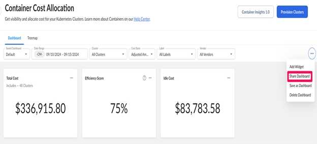

1. Gestionar permisos: controla y actualiza quién puede ver, editar o gestionar el panel de control mediante ajustes intuitivos.

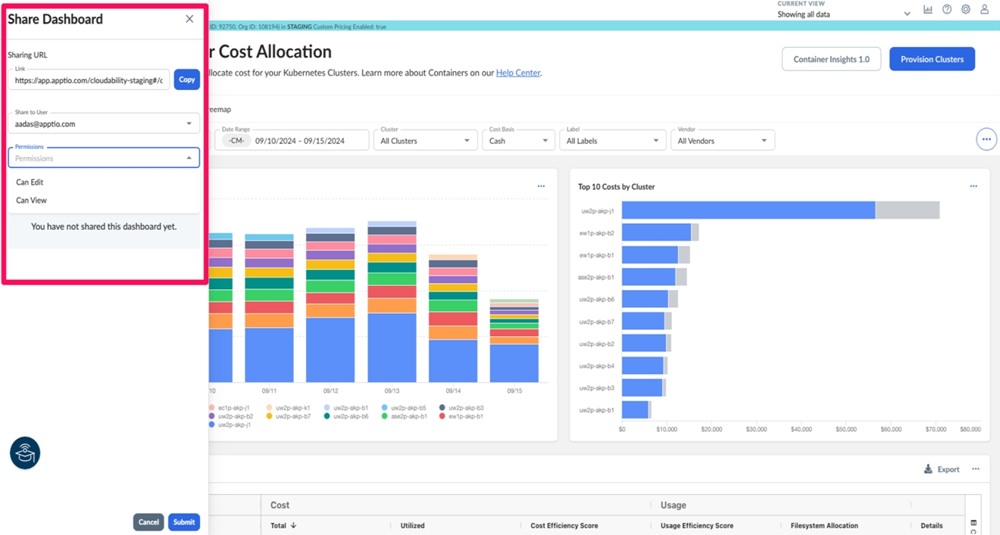

Esta función simplifica el intercambio de métricas clave de los contenedores, lo que hace que la información sea más accesible y útil para todos los equipos. Al mejorar la colaboración, los equipos pueden tomar mejores decisiones y garantizar que todos estén en sintonía con respecto a los datos clave sobre los contenedores.

## Se ha añadido la dimensión «Nombre del recurso» para la facturación por nivel de recurso de « GCP » - 17 de septiembre de 2024

Hoy hemos lanzado una nueva dimensión de informes, «Nombre del recurso », en las herramientas de análisis de Cloudability. Por el momento, este lanzamiento está disponible para GCP, pero pronto se actualizará para Azure y OCI.

Novedades de esta versión

Esta dimensión representa el nombre que se asigna a los recursos de GCP, como el nombre de una instanci VM, el nombre de un disco o el nombre de una base de datos. Este detalle coincide con lo que ven los usuarios en la consola de GCP al interactuar con los recursos y se ajusta a la columna «Nombre global del recurso» de la facturación a nivel de recurso de GCP. Esta es la primera de varias versiones que servirán como actualizaciones fundamentales para nuestra compatibilidad con los descuentos basados en compromisos.

Ventajas para los usuarios

Atribución de costes a los recursos : los usuarios pueden asociar inmediatamente los costes a su infraestructura.

Informes y paneles de control fáciles de usar : los usuarios dispondrán de una mayor claridad en los informes, lo que eliminará la necesidad de analizar detalles innecesarios, como las rutas completas de la API.

## Cartera consolidada de compromisos y mejoras - 12 de septiembre de 2024

Hoy hemos lanzado tres mejoras en la cartera de compromisos, que abarcan cada uno de los tres proveedores compatibles.

Novedades de esta versión

- Cartera de compromisos consolidada : Las páginas «Cartera de reservas» y «Planificador RI» se han actualizado a «Cartera de compromisos» y «Recomendaciones de compromisos», respectivamente, para reflejar una nomenclatura independiente del proveedor. Además, la gestión de los compromisos basados en el gasto se ha consolidado ahora en la sección «Proveedores» de la página de la cartera única, y las páginas de compromisos se han reorganizado y agrupado bajo la sección «Optimizar ».
- AWS & Azure Mejoras en la cartera de planes de ahorro : Se han actualizado la tabla y los indicadores clave de rendimiento (KPI), y se ha añadido el panel de detalles para que coincida con sus equivalentes en las instancias reservadas.
- GCP Mejoras en la cartera : se han añadido las páginas «Todos los compromisos» y «Todo el cálculo» para mostrar el rendimiento a nivel agregado. Los KPI actualizados de la página de la cartera de CUD de Compute basados en recursos coinciden ahora con los de Compute Flex CUD de GCP. Por último, las tablas agrupadas y no agrupadas reflejan la propiedad y cómo el uso compartido afecta al rendimiento.

Esta es la primera de varias versiones que servirán como actualizaciones fundamentales para nuestra compatibilidad con los descuentos basados en compromisos. Para obtener más información sobre los compromisos, consulta [la sección «Primeros pasos con la cartera de compromisos](../product/commitment-portfolio.html) ». Únete al debate en nuestro [anuncio de la comunidad](https://community.apptio.com/login?returnurl=https%3a%2f%2fcommunity.apptio.com%2fviewdocument%2fnotice-upcoming-launch-consolidate%3fcommunitykey%3df67c7e7c-be1c-4053-9845-2376da697342%26tab%3dlibrarydocuments "(se abre en una pestaña o una ventana nueva)").

## Soporte de RIS Column para Business Dimensions - 5 de septiembre de 2024

Con esta versión, los usuarios del inventario de recursos tienen la posibilidad de añadir dimensiones empresariales como columna en la interfaz de usuario de Cloudability para sus informes de inventario.

Esto les ayudaría a comparar sus datos de inventario con las dimensiones empresariales creadas en su organización.

## Cloudability Container Insights: Presentación del indicador clave de rendimiento (KPI) «Puntuación de eficiencia (uso)» - 3 de septiembre de 2024

Con esta versión, Cloudability ha introducido una nueva métrica de KPI, la «Puntuación de eficiencia (uso)», que ofrece una visión clara y práctica de la eficiencia en términos de costes de todos los recursos dentro de un contenedor, un espacio de nombres, una carga de trabajo, un clúster y mucho más. Esta métrica está disponible como una opción predefinida que los usuarios pueden añadir fácilmente a sus paneles de control seleccionándola de la categoría de widgets predefinidos, en la sección «Añadir widget ».

¿Qué es la puntuación de eficiencia (uso)?

La puntuación de eficiencia (uso) se calcula comparando el coste de los recursos consumidos activamente (uso) con el coste total de los recursos reservados (aprovechados o asignados). Esta puntuación ayuda a los equipos a evaluar la eficacia con la que se están utilizando los recursos reservados y pone de relieve ineficiencias como el exceso de aprovisionamiento o la infrautilización. Una puntuación más alta indica una mayor eficiencia en el uso de los recursos, mientras que una puntuación más baja pone de manifiesto áreas en las que podría mejorarse.

Este indicador clave de rendimiento (KPI) está diseñado para proporcionar a los equipos una visión más detallada de la utilización de sus recursos, lo que facilita la toma de decisiones en materia de asignación de recursos, ajuste de la plantilla y estrategias de optimización.

## Cloudability para « IBM Cloud » – Gestión de costes (Beta) - 30 de agosto de 2024

Apptio anuncia hoy el lanzamiento de la integración de IBM Cloud en Cloudability. Esta versión ofrece a los usuarios de « FinOps » un acceso fluido y nativo a los costes de « IBM Cloud », con datos directos de uso dentro de « Cloudability ».

Cómo te puede ayudar esta función

Esta versión permite a los clientes de « IBM Cloud » hacer lo siguiente:

- Imputar los costes de « IBM Cloud » a las unidades de negocio según normas específicas, utilizando automáticamente las dimensiones de negocio de « Cloudability ».
- Analiza su gasto en IBM Cloud y mejora la implicación del equipo aprovechando los análisis a nivel de recursos, los paneles interactivos multicloud y las vistas personalizadas.
- Fomenta la responsabilidad financiera mediante la configuración de presupuestos « IBM Cloud » y notificaciones de eventos.

Cómo gestionar tus gastos en « IBM Cloud »

IBM Cloud Los clientes pueden iniciar su proceso de gestión de costes añadiendo las credenciales de su cuenta. Cloudability Recogerá los datos de IBM Cloud del mes en curso una vez que se hayan validado tus credenciales. Si necesitas incorporar datos adicionales, ponte en contacto con el equipo de Apptio. Consulta la [documentación de la API](../api-v3/getting_started_with_the_cloudability.html) para obtener acceso programático y gestionar las credenciales de IBM Cloud. Únete a la conversación en la [comunidad « Apptio »](https://community.apptio.com/blogs/alok-jain/2024/08/26/cloudability-for-ibm-cloud-cost-management-faq "(se abre en una pestaña o una ventana nueva)") para obtener más información.

Más información sobre esta versión

No se te cobrará ningún gasto por el servicio de nube gestionada de IBM Cloud durante el periodo Deta. No obstante, el gasto gestionado por IBM Cloud en Cloudability se incluirá en tus «Costes supervisados» tras el lanzamiento de la versión general (GA) y estará sujeto al límite de costes supervisados establecido en tu contrato. Actualmente, el lanzamiento de GA está previsto para el 15 de noviembre de 2024, aunque podría posponerse a una fecha posterior.

## GCP Rightsizing – Asistencia para la facturación detallada – 28 de agosto de 2024

Con esta versión, Cloudability ha incorporado la compatibilidad con la facturación por niveles detallados en « GCP Rightsizing», lo que permite varias funciones nuevas que antes no estaban disponibles.

A partir de hoy, los usuarios que tengan activada la facturación detallada de « GCP » observarán que « GCP Rightsizing» ahora incluye:

- Una opción de «base de coste efectiva» para las recomendaciones de Compute
- Compatibilidad con vistas basadas en asignaciones de etiquetas, asignaciones de negocio y grupos de cuentas
- Compatibilidad con el filtrado basado en asignaciones de etiquetas/negocios
- Asignaciones de etiquetas de recursos visibles desde el panel de detalles de la recomendación
- Exportaciones que contienen asignaciones de etiquetas de recursos

Antes de esta versión, Cloudability GCP Rightsizing no disponía de ningún medio para acceder a los datos detallados necesarios para ofrecer estos elementos de compatibilidad con las funciones de CSP.

Esta funcionalidad ya estaba disponible para los clientes en las áreas correspondientes de ajuste de recursos de AWS y Azure, pero no estaba disponible para GCP. Los mismos problemas que se producían al ajustar el tamaño de AWS y Azure sin estas funciones se han resuelto ahora también para GCP. La base de coste efectiva tiene en cuenta el impacto histórico de las instancias reservadas (RI) y los planes de ahorro (SP) a la hora de calcular el coste del tipo de recurso actual durante el periodo de referencia. La compatibilidad con vistas y filtros basados en asignaciones de etiquetas, asignaciones de negocio y grupos de cuentas permite a los usuarios crear y visualizar una experiencia y un conjunto de datos más personalizados. Las asignaciones de etiquetas visibles de los recursos permiten a los usuarios ver qué asignaciones de etiquetas están asociadas a un recurso, con el fin de tomar una decisión más fundamentada sobre una recomendación. Las exportaciones que contienen asignaciones de etiquetas de recursos también proporcionan a los usuarios esta información adicional, que luego puede utilizarse en cualquier contexto en el que el cliente utilice dichas exportaciones.

Cómo activar la facturación detallada de « GCP »

Para configurar la facturación detallada de GCP, consulta «[Añadir una nueva credencial de cuenta para la facturación detallada](../admin/connect-google-cloud.html) ».

Ten en cuenta también que la compatibilidad con la facturación detallada de GCP no incluye, por el momento, los datos de costes de los clústeres de GKE.

Dónde encontrar esta nueva funcionalidad

1. En el menú de navegación principal de Cloudability, ve a la opción de menú «Optimizar» y selecciona «Ajuste de tamaño ».
2. Selecciona la pestaña « GCP » en la página «Rightsizing». Las funciones adicionales que incluye esta versión estarán disponibles aquí.

## Mejoras en la interfaz de usuario del inventario de recursos - 26 de agosto de 2024

Con esta versión, hemos estandarizado la interfaz de usuario del Inventario de recursos específica para los elementos, como parte de la estandarización general de la plataforma y del cumplimiento de las normas de accesibilidad.

Estos elementos son los siguientes.

1. El estilo de visualización de las pestañas « AWS » y « Azure » de la parte superior debe ser coherente con el de los demás módulos de Cloudability.
2. El estilo de visualización del menú desplegable de servicio y mes, así como los textos de marcador de posición, deben ser coherentes con los de otros módulos de Cloudability.
3. Tamaño y grosor de la fuente.
4. Tamaño y estilo de visualización de los iconos de exportación y medidas situados en la esquina superior derecha de la tabla «Inventario ».
5. Experiencia en la carga de datos.
6. Estilo de visualización de los iconos «Mostrar» / «Ocultar» de las medidas (dimensiones/métricas).

## Cloudability Mejoras en Container Insights 2.0 - 16 de agosto de 2024

Filtro global para pares clave/valor de etiquetas

Hemos incorporado una nueva opción de filtro global en el panel de control de Container Insights, que te permite filtrar tus datos de costes y uso en función de pares específicos de clave y valor de etiquetas. Esta mejora ofrece una visión más detallada de tus cargas de trabajo en contenedores, ya que permite filtrar según etiquetas como «app», «env» o cualquier otra etiqueta personalizada que utilices en tus entornos.

Características principales

- Filtro de claves de etiqueta: Selecciona una de las claves de etiqueta disponibles para limitar la visualización de los datos de costes a cargas de trabajo o entornos específicos.
- Filtro por valores de etiqueta: Refina aún más tu filtro especificando valores de etiqueta, lo que te proporcionará información precisa sobre la asignación de costes.

Para utilizar esta función, debes introducir al menos un valor de etiqueta para el filtrado. También puedes seleccionar varios valores según tus necesidades. Nuestro objetivo es facilitarte el uso de las etiquetas de tus entornos para crear paneles de control intuitivos, lo que te permitirá obtener una visión más detallada de los costes de tus contenedores.

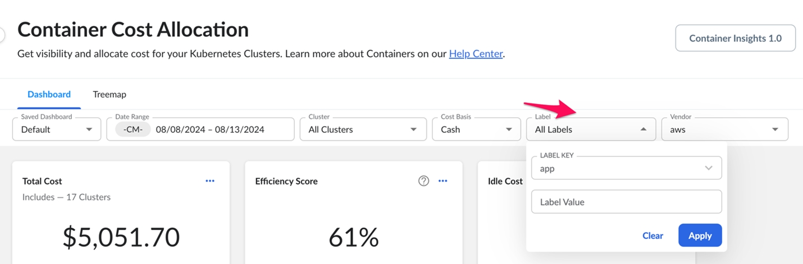

Widgets de tabla personalizables

Partiendo de nuestras capacidades actuales en materia de widgets personalizados de KPI y gráficos, hemos incorporado ahora widgets de tablas personalizadas en el panel de control de «Asignación de costes de contenedores», lo que mejora su capacidad para adaptar la visibilidad de los costes a sus necesidades específicas.

Esta función te permite modificar y configurar los widgets de tabla para presentar los datos que mejor se adapten a tus necesidades.

Características principales:

- Selección de tablas: muestra datos de costes y uso por clúster, etiqueta, nodo o espacio de nombres, lo que te ofrece flexibilidad a la hora de visualizar y gestionar tus recursos de Kubernetes.
- Condiciones de filtrado: Personaliza tu tabla aplicando filtros basados en diversas medidas, como clúster, espacio de nombres, carga de trabajo, contenedor, nodo o etiquetas específicas como «app», «env», «project» y otras. Esto te ayuda a centrarte en los datos más relevantes para tu análisis.
- Funcionalidad de edición de widgets: edita fácilmente los widgets de tabla existentes para ajustar los datos mostrados o los criterios de filtrado, asegurándote de que tu panel de control refleje la información más actualizada y relevante.
- Opciones de exportación: Una vez que hayas personalizado tu widget, podrás exportar los datos para su posterior análisis o para elaborar informes.

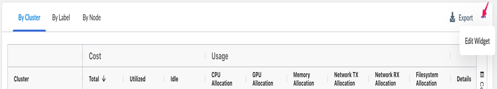

## Planificación de la carga de trabajo: compatibilidad con GPU para máquinas virtuales - 16 de julio de 2024

Hoy hemos lanzado la compatibilidad con la configuración de la GPU para máquinas virtuales en la planificación de cargas de trabajo. Gracias a esta mejora, los usuarios pueden especificar fácilmente el número de GPU que necesitan para sus cargas de trabajo y reciben estimaciones de costes y recomendaciones sobre los recursos de GPU disponibles en AWS, Azure, GCP y OCI.

Antes de esta versión, Workload Planning solo era compatible con unas pocas instancias de GPU de distintos proveedores y no ofrecía información sobre los requisitos específicos de las GPU. Ahora, los usuarios no solo pueden comparar los costes entre distintos proveedores, sino también visualizar detalles de configuración como el número de GPU, la memoria de la GPU y el modelo de la GPU (cuando los proveedores de servicios en la nube faciliten esta información), lo que les ayuda a encontrar el recurso de GPU más rentable para sus cargas de trabajo.

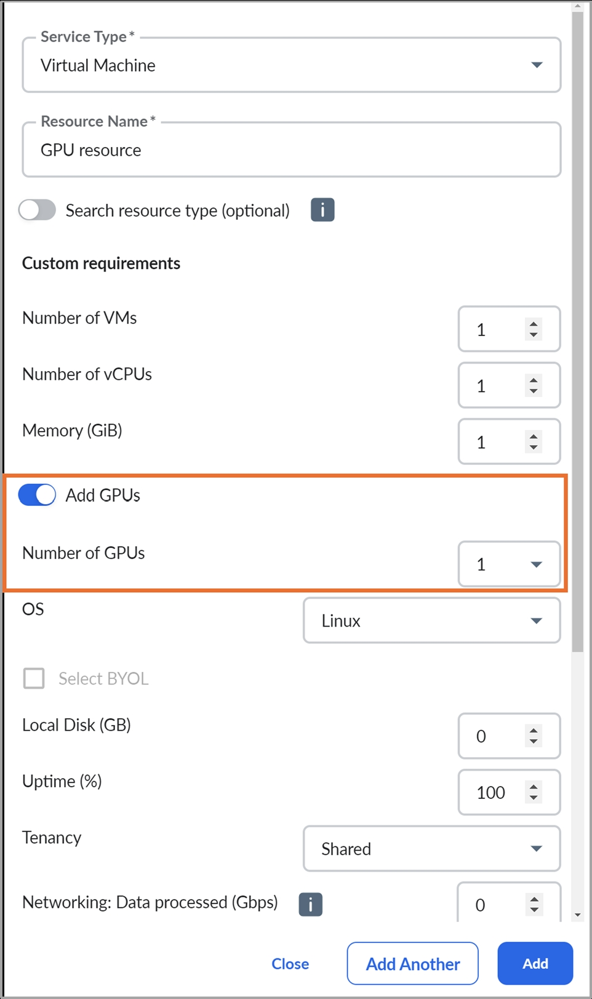

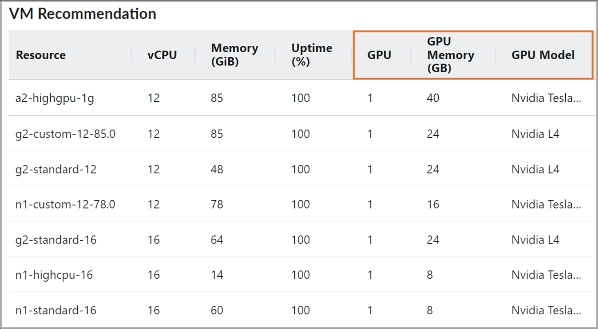

## Asistencia técnica para el informe de costes y uso (CUR) de « AWS » 2.0 - 16 de julio de 2024

Hoy hemos lanzado la compatibilidad con el informe de costes y uso (CUR) de AWS 2.0/ y la exportación de datos estándar en Cloudability. A partir de hoy, los usuarios de « Cloudability » pueden utilizar AWS CUR 2.0 para importar sus datos de costes y uso de AWS.

Esto amplía el formato de datos compatible con los informes de costes y uso de « AWS », que ahora incluye un par de opciones:

- AWS CUR heredado
- AWS Exportación de datos estándar / CUR 2.0

Antes de esta versión, Cloudability solo admitía la exportación « AWS CUR », que ahora se denomina «Legacy CUR » según AWS.

Los clientes actuales que utilicen el CUR heredado de AWS pueden seguir utilizando dicho CUR sin que ello afecte a la ingesta de datos ni a la disponibilidad de los mismos en Cloudability.

Cómo activarlo

Los clientes deberán configurar la exportación de datos estándar «CUR 2.0/ » en la consola de AWS.

El cliente debe configurar lo siguiente en la consola de AWS :

- Exportación de datos estándar

- CUR 2.0

  - Incluir los ID de los recursos
  - Granularidad temporal  como  Por hora
  - Selección de columnas - Todas (Se seleccionarán todas las columnas de forma predeterminada)
  - Tipo de compresión y formato de archivo: gzip - texto/csv
  - Control de versiones de archivos como Sobrescribir el archivo de exportación de datos existente

Nota: El formato Parquet no es compatible con CUR 2.0.

Una vez configurados los ajustes anteriores, sigue los pasos que se indican a continuación en Cloudability

1. Ve a Configuración > Credenciales de proveedor > AWS.
2. Selecciona y edita la cuenta del «Pagador principal ».
3. Agregue el nuevo nombre del bucket S3, el prefijo del informe de costos y uso, y el nombre del informe de costos y uso en Cloudability.
4. Guarda y descarga la plantilla CFT.
5. Ejecuta la plantilla CFT.
6. Verificar credenciales.

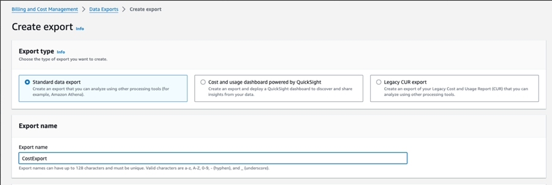

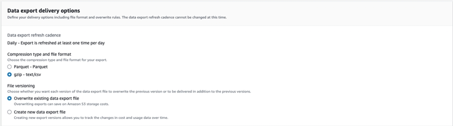

## GCP Compatibilidad con tipos de máquinas virtuales personalizadas (sistema operativo Windows) para la planificación de cargas de trabajo - 11 de julio de 2024

Hoy nos complace anunciar la incorporación de estimaciones de costes para máquinas virtuales personalizadas de GCP con el sistema operativo «Windows» en Workload Planning, compatibles con los tipos de máquina N4, N2, N2D, E2 y N1.

Se trata de una ampliación del lanzamiento « [GCP](#gcp_custom_virtual_machine_type_support_for_workload_planning_%E2%80%93_june_14,_2024_ "(se abre en una pestaña o una ventana nueva)") : compatibilidad con tipos de máquinas virtuales personalizadas», anunciado el 14 de junio de 2024.

## Permisos de solo lectura para el módulo «Presupuestos» en Cloudability - 11 de julio de 2024

Hoy nos complace presentar un nuevo permiso de usuario en Front Door denominado « BudgetsFeatureViewOnlyAccess », que permite a los usuarios (a los que se les haya asignado este permiso) ver y suscribirse a los presupuestos creados en su organización.

Este permiso no permite a los usuarios crear nuevos presupuestos ni modificar ( Editar / Eliminar ) los presupuestos existentes.

## Cloudability Container Insights 2.0 - 11 de julio de 2024

Hoy nos complace anunciar una serie de mejoras importantes en Cloudability Container Insights. Container Insights 2.0 presenta varias mejoras destinadas a ofrecer información detallada sobre las cargas de trabajo en contenedores dentro de los clústeres de Kubernetes y OpenShift. Esta versión presenta un diseño actualizado y nuevas funciones, como la puntuación de eficiencia y una funcionalidad de desglose ampliada.

La nueva interfaz de usuario es la página de inicio predeterminada de la función «Container Insights ». No obstante, puedes alternar fácilmente entre ambas experiencias haciendo clic en el botón que aparece en las capturas de pantalla que se muestran a continuación.

Nota:

No vamos a dejar de ofrecer el servicio «Container Insights» 1.0 de forma inmediata. Tendrás la opción de alternar entre las dos versiones durante un tiempo para que te familiarices con la nueva interfaz. Informaremos de forma proactiva sobre la futura fecha de retirada de Container Insights 1.0.

Funcionalidades introducidas

1. Paneles personalizables

   Hemos añadido paneles personalizables que te permitirán crear visualizaciones y supervisar los indicadores clave de rendimiento (KPI) que te interesan.

   Entre sus capacidades se incluyen:

   - Panel de control predeterminado: incluye widgets preconfigurados que permiten obtener información rápida sobre el coste total del clúster, el coste por inactividad y otras métricas esenciales. Cada usuario tiene su propio panel de control predeterminado.
   - Índice de eficiencia: una nueva métrica para evaluar la eficiencia en la asignación de recursos.
   - Visualización mejorada: incluye indicadores clave de rendimiento (KPI), líneas de tendencia, los X widgets principales, gráficos de series temporales y widgets de tabla para ofrecer una visión completa de tu huella de contenedores.
   - Funciones de personalización:

     Compatibilidad con el filtro de proveedores de servicios en la nube para el filtrado a nivel de panel de control

     Funcionalidad de selección múltiple para la selección de clústeresEsta versión permite crear paneles personalizados, además de ofrecer diversos tipos de widgets personalizados. También puedes eliminar y añadir widgets personalizados en el panel de control predeterminado, y configurarlos como tus paneles de control personalizados.
2. Vista de mapa de árbol

   La vista «Treemap» ofrece una visualización jerárquica de los clústeres, lo que permite realizar un análisis más detallado hasta el nivel de contenedor:

   - Visualización jerárquica: permite profundizar desde los clústeres hasta los espacios de nombres, las cargas de trabajo y los contenedores.
   - Visualización de la puntuación de eficiencia: integra las puntuaciones de eficiencia en la vista «Treemap» para realizar evaluaciones rápidas.

   Tanto los cuadros de mando como la vista de mapa de árbol admiten filtros globales para fecha, grupos y base de coste.   
    Los widgets están organizados con los indicadores clave de rendimiento (KPI) en la parte superior y las tablas en la parte inferior para garantizar una visibilidad óptima.

   Funcionalidad detallada de desglose

   Nuestra funcionalidad mejorada de desglose permite una navegación fluida:

   - Desde el panel de control, ve al widget de tabla y selecciona un clúster para ver sus espacios de nombres en la vista de mapa de árbol.
   - Selecciona un espacio de nombres en un «treemap» para explorar las cargas de trabajo que lo componen.
   - Al hacer clic en una carga de trabajo, se muestran los contenedores que la componen.

     En cada nivel de detalle, puedes conocer los distintos componentes de coste y la puntuación de eficiencia.

     Información adicional

     Para obtener información detallada sobre los contenedores de una carga de trabajo:

     - Haz clic en un contenedor para ver los nodos sobre los que está operando.
     - Las actualizaciones del panel de detalles proporcionan información relevante para cada grupo de contenedores, lo que garantiza que tengas acceso a los detalles más pertinentes.Nueva columna de costes: Gastos varios

     Como parte de esta actualización, presentamos una nueva columna en la página «Container Insights» denominada «Costes varios», disponible en el widget «Tabla». Esta columna reflejará los costes específicos de cada clúster y, en un principio, tendrá un valor nulo para todos los proveedores de servicios en la nube (CSP). En primer lugar, pondremos este servicio a disposición de GCP, y tenemos previsto ampliar la cobertura a otros proveedores de servicios de comunicaciones (CSP) en un futuro próximo. Estos costes abarcan los gastos adicionales asociados a las aplicaciones en contenedores que van más allá de los nodos, los volúmenes y la transferencia de datos. Incluyen diversos servicios y recursos necesarios para el funcionamiento de los clústeres, lo que ofrece una visión global de todos los costes relacionados con la ejecución de aplicaciones en contenedores.
3. Puntuación de rentabilidad

   El «Cost Efficiency Score» es un indicador clave de rendimiento (KPI) que mide la rentabilidad global de la asignación de recursos en un entorno de contenedores. Compara el coste utilizado con lo que se considera la parte proporcional o el coste total. Para comprender este indicador, hay que analizar tres tipos principales de costes: el coste de participación equitativa, el coste de utilización y el coste por inactividad.

   Coste proporcional / Coste total

   El coste proporcional representa la proporción del coste total del nodo que se atribuye a un contenedor en función del porcentaje de cada recurso (CPU, memoria, GPU) que se le ha asignado. Esto se calcula multiplicando el coste del nodo de cada recurso por el porcentaje de reparto equitativo de ese recurso asignado al contenedor. El coste total de reparto equitativo de un contenedor es la suma de estos importes correspondientes a todos los recursos.

   Coste de utilización

   El coste de utilización refleja el coste real de los recursos utilizados por un contenedor. Se calcula multiplicando el coste del nodo de cada recurso por el porcentaje de utilización de dicho recurso en el nodo. Al igual que el coste de reparto equitativo, el coste total de utilización de un contenedor es la suma de los costes de utilización de todos los recursos.

   Coste de inactividad

   El coste de inactividad se calcula restando el coste de utilización del coste de participación equitativa. Representa el coste de los recursos que se han asignado pero no se han utilizado, lo que indica una falta de eficiencia.

   Cálculo de la puntuación de rentabilidad

   La puntuación de eficiencia de costes se calcula comparando el coste utilizado con el coste de reparto equitativo, lo que refleja la eficiencia en el uso de los recursos en todos los recursos de un contenedor, espacio de nombres, carga de trabajo o clúster. Esta puntuación ayuda a identificar ineficiencias y posibles áreas de optimización, como el ajuste del tamaño de los clústeres o los nodos, o la mejora de las restricciones de afinidad de los pods de las cargas de trabajo.

   Una puntuación de eficiencia de costes más baja indica una mayor ineficiencia, lo que sugiere que existen oportunidades más significativas de ahorro y optimización de costes en ese entorno.

Nota:

Si tienes alguna pregunta sobre esta función o quieres enviarnos tus comentarios, ponte en contacto con el servicio de asistencia.

## La función «Asignación de costes de contenedores» ya es compatible con la versión « Kubernetes » 1.30 - 8 de julio de 2024

Hoy nos complace anunciar que la asignación de costes de contenedores ya es oficialmente compatible con la versión 1.30 de Kubernetes en todos los proveedores.

Esta función permite a los clientes obtener información detallada sobre el uso de sus recursos de contenedores y los costes asociados a los clústeres que se ejecutan en Kubernetes 1.30.

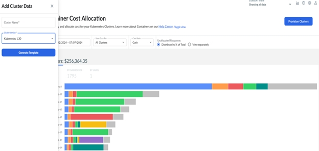

## Ampliación de las asignaciones de etiquetas y rótulos - 4 de julio de 2024

Hemos aumentado en 20 el número de asignaciones de etiquetas y marcas disponibles en Cloudability.

Esto significa que los clientes ahora pueden disponer de hasta 50 dimensiones de informe en la plataforma específicas para las etiquetas o rótulos asignados. Esto resultará especialmente útil para los clientes que utilicen un entorno multinube y cuenten con numerosas claves de etiquetas en su entorno. Cloudability Los administradores pueden añadir estas asignaciones adicionales en la función «Asignación de etiquetas y rótulos».

## Mejora de los recursos etiquetables - 4 de julio de 2024

Hoy hemos introducido una mejora significativa para los recursos etiquetables en Cloudability. Históricamente, Tag Explorer definía de forma amplia el «gasto etiquetable» como cualquier partida de gastos que tuviera un ID de recurso. Esto provocó que algunas partidas de gastos se clasificaran como «etiquetables», aunque el uso subyacente no fuera etiquetable. Con esta versión, Tag Explorer ahora dispone de información integrada sobre qué servicios específicos de AWS y Azure admiten el etiquetado, lo que permite una categorización precisa en las pestañas «Gasto etiquetable» y «Gasto no etiquetable».

Si deseas que se aplique esta modificación a meses anteriores para facilitar el análisis histórico de etiquetas, solicita un nuevo procesamiento a tu equipo de atención al cliente.

## Planificación de la carga de trabajo: compatibilidad con OCI Burstable VM - 1 de julio de 2024

Con esta versión, Workload Planning ofrece ahora recomendaciones para las máquinas virtuales con capacidad de picos de OCI, lo que permite a los usuarios aprovechar las capacidades de picos, que constituyen una solución rentable para cargas de trabajo con patrones de uso de CPU variables.

Novedades de esta versión

Anteriormente, la herramienta de planificación de la carga de trabajo ofrecía recomendaciones para máquinas virtuales, sin la opción de seleccionar instancias con capacidad de ampliación, que sí estaba disponible en el estimador de costes de OCI. Con esta versión, los usuarios ya pueden elegir una utilización de CPU de referencia del 12.5 % o del 50 % para las instancias con capacidad de picos, lo que representa una fracción de cada núcleo de CPU. El valor de referencia indica el número mínimo de CPU que se pueden utilizar de forma continua.

Para cada línea de referencia, la Planificación de la carga de trabajo proporciona la estimación de costes asociada: si se opta por una línea de referencia del 12.5 %, se obtiene un ahorro de hasta el 87.5 %, mientras que una línea de referencia del 50 % ofrece un ahorro de hasta el 50 %.

Nota:

Hay cuatro tipos de máquinas virtuales de OCI que admiten configuraciones con capacidad de picos: VM.Standard3.Flex, VM.Standard.E3.Flex, VM.Standard.E4.Flex y VM.Standard.E5.Flex.

Actualización importante

Recientemente hemos incorporado la compatibilidad con las fechas de lanzamiento de algunos servicios en Resource Inventory (instantáneas de EBS, instancias de RDS, buckets de S3 e instantáneas de Redshift ). Sin embargo, con la fecha de lanzamiento de una instantánea de « EBS », nos hemos encontrado con un problema de rendimiento en el proceso de cálculo de costes de Cloudability, por lo que hemos decidido retrasar las fechas de lanzamiento de las instantáneas de « EBS » en Resource Inventory. Volveremos a poner en marcha esta función en cuanto dispongamos de una solución alternativa estable. Ten en cuenta que las fechas de lanzamiento de los servicios distintos de las instantáneas de « EBS » seguirán estando disponibles para su uso.

## Compatibilidad del inventario de recursos con las vistas creadas con Business Dimensions - 26 de junio de 2024

Hoy hemos lanzado la compatibilidad con el Inventario de recursos para las vistas creadas mediante dimensiones de negocio.

Anteriormente, Resource Inventory no podía resolver las vistas creadas mediante dimensiones de negocio y, cada vez que un usuario seleccionaba una vista creada con una dimensión de negocio, solía aparecer una página con el mensaje «Vista restringida ». Con esta versión, Resource Inventory comenzará a resolver las vistas creadas mediante dimensiones de negocio y podrá gestionar de forma efectiva cualquier vista de « Cloudability » creada por el cliente.

Más información sobre esta versión

Por lo tanto, también eliminaríamos el acceso privilegiado actual al inventario de recursos a través del permiso «Front Door» denominado « AWSResourceInventoryFullAccess » y habilitaríamos esta función para todos los usuarios de la organización del cliente, ya que el usuario administrador ahora puede definir límites de datos para los datos del inventario de recursos mediante vistas.

Además, hemos eliminado el permiso privilegiado de Front Door vinculado a la función «Inventario de recursos» ( AWSResourceInventoryFullAccess ). De este modo, la función estaría disponible para todos los usuarios de una organización, independientemente de los permisos que tengan, al igual que ocurre con módulos como «Informes», «True Cost Explorer», etc.

Por lo tanto, también eliminaríamos el acceso privilegiado actual al inventario de recursos a través del permiso «Front Door» denominado « AWSResourceInventoryFullAccess » y habilitaríamos esta función para todos los usuarios de la organización del cliente, ya que el usuario administrador ahora puede definir límites de datos para los datos del inventario de recursos mediante vistas.

Ya hemos eliminado el permiso privilegiado de Front Door vinculado a la función «Inventario de recursos» ( AWSResourceInventoryFullAccess ). De este modo, la función estaría disponible para todos los usuarios de una organización, independientemente de los permisos que tengan, al igual que ocurre con módulos como «Informes», «True Cost Explorer», etc.

## Mejora de la experiencia de usuario en la gestión de credenciales de proveedores - 24 de junio de 2024

Hoy hemos lanzado una serie de actualizaciones en las «Credenciales de proveedor» que ofrecen una mejor experiencia de usuario a los usuarios de Cloudability. Dado que Cloudability está ampliando la integración de fuentes de datos, hemos introducido una interfaz de usuario más escalable para nuevas fuentes de datos, con un mejor rendimiento, compatible con A11y y que ofrece una mejor experiencia de usuario.

Novedades de esta versión

Con esta versión, podrás:

- Identifica rápidamente las fuentes de datos disponibles en Cloudability.
- Disponer de una interfaz de usuario que sea escalable, teniendo en cuenta las integraciones actuales y las futuras ampliaciones.
- Disfruta de una interfaz de usuario de A11y que cumple con las normas de accesibilidad.
- Disfruta de un mejor rendimiento en los tiempos de carga de la interfaz de usuario de las credenciales de proveedor.
- Utiliza las nuevas funciones de filtrado y búsqueda en las columnas individuales de las credenciales de los proveedores.
- Expandir y contraer todas las cuentas a nivel de la cuenta principal de pago o facturación.
- Ordena los datos por cada columna.
- Ofrecen una mejor legibilidad, ya que hemos mejorado los índices de contraste.

Pasos para ver la nueva interfaz de usuario

1. En Cloudability, ve a Configuración > Credenciales de proveedor.
2. Para añadir una nueva fuente de datos, haz clic en «Añadir fuente de datos ». Esto mostrará todas las fuentes de datos disponibles para un cliente. 
3. Selecciona una fuente de datos a la que quieras asignar credenciales.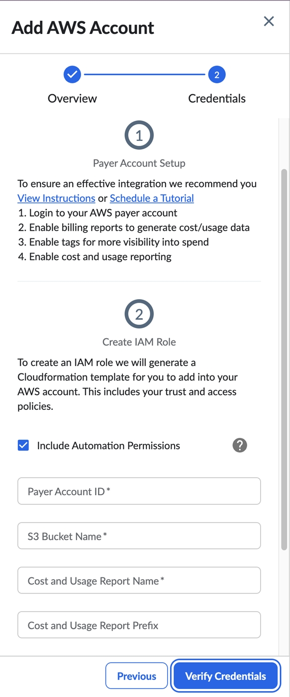
4. Ahora aparece en la parte derecha la ventana emergente «Añadir cuenta» durante el proceso de autenticación.
5. Una vez que hayas introducido tus credenciales, podrás ver una pestaña correspondiente a la fuente de datos.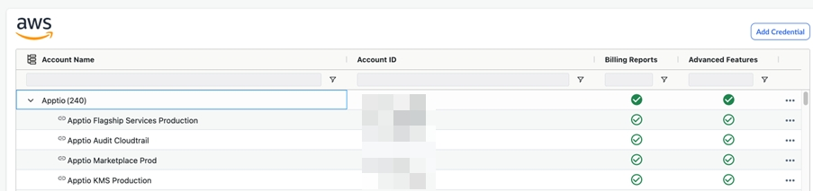

   Nota:

   Los pasos para la acreditación de cada fuente de datos siguen siendo los mismos.
6. En esta pestaña, podrás  Buscar  y  Filtro  en columnas concretas. 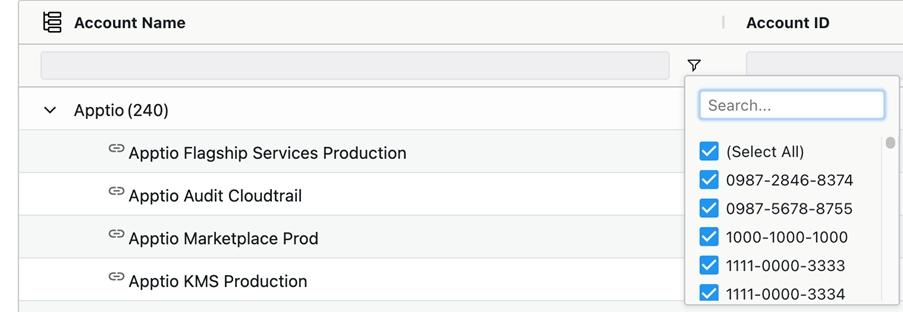
7. Haz clic en «…» para realizar diversas acciones, como antes. Hemos añadido texto junto a los iconos:
   - Ver detalles
   - Editar cuenta
   - Volver a verificar la cuenta
   - Archive
   - Suprimir
8. Las cuentas principales (la cuenta del pagador principal y la cuenta de facturación, entre otras) aparecerán ocultas de forma predeterminada. Haz clic en cada cuenta para ver el siguiente nivel de subcuentas (cuentas vinculadas, suscripciones o proyectos, entre otros) o utiliza los iconos «Expandir todo» y «Contraer todo», que se han incorporado recientemente. 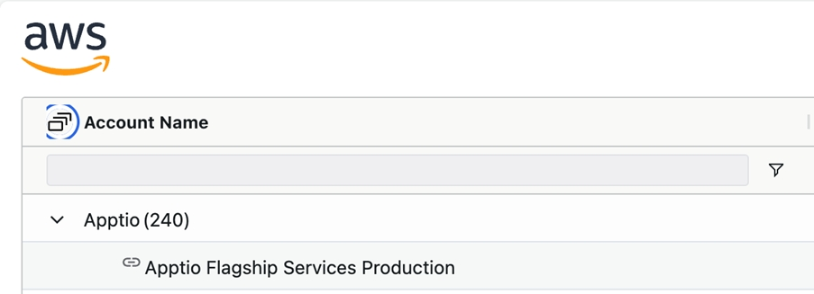
9. La interfaz de usuario de «Credenciales de proveedor» ahora admite la carga diferida, lo que mejora el rendimiento en los tiempos de carga de la interfaz.

## Compatibilidad con tipos de máquinas virtuales personalizadas para la planificación de cargas de trabajo – 14 de junio de 2024

Con esta versión, los usuarios de Workload Planning ya pueden obtener estimaciones de costes para máquinas virtuales personalizadas de GCP, compatibles con los tipos de máquina N4, N2, N2D, E2 y N1.

Novedades de esta versión

Anteriormente, la función de planificación de la carga de trabajo solo admitía tipos de máquina predefinidos para « GCP », que cuentan con un número predeterminado de « vCPUs » y una cantidad fija de memoria, y se facturan a un precio fijo. Con esta versión, Workload Planning ofrece recomendaciones para máquinas virtuales estándar y personalizadas, basadas en los datos introducidos sobre el tipo de máquina virtual ( vCPU ) y la memoria. Te permite elegir la potencia de procesamiento y la cantidad de memoria sin tener que cambiar de tipo de equipo. Si no existe una combinación de « vCPU » y memoria, Workload Planning dará prioridad al requisito de « vCPU » y buscará la cantidad de memoria más cercana.

Nota:

Esta versión solo es compatible con el sistema operativo «Free», que aparece como « Linux » en Workload Planning, mientras que las máquinas virtuales personalizadas con el sistema operativo «Windows» serán compatibles en una versión futura.

## Compatibilidad de RIS con la dimensión «Fecha de lanzamiento» para más servicios - 14 de junio de 2024

Con esta versión, Resource Inventory admitirá la dimensión «fecha de lanzamiento» para los siguientes servicios de AWS :

1. EBS Instantáneas
2. RDS Casos
3. Redshift Instantáneas
4. S3 Cubos
   1. s3:ListAllMyBuckets
   2. redshift:DescribeClusterSnapshots

Más información sobre esta versión

Los usuarios actuales de Cloudability deben añadir estos dos nuevos permisos para poder acceder a las dimensiones de fecha de lanzamiento de S3 y Redshift :

Se recomienda asignar estos permisos a un rol de IAM de Cloudability a través de la consola de AWS, accediendo a IAM > Gestión de acceso > Roles > Rol deCloudability (o al rol personalizado que hayas creado para Cloudability ) y asignar los dos permisos anteriores a Cloudability MonitorResourcesPolicy en la pestaña Permisos.

Nota:

En el caso de los nuevos usuarios, estos permisos ya estarían incluidos en el script de acreditación « AWS ».

## Permisos de «solo visualización» detallados para los módulos «Organizar» y «Presupuestos» en Cloudability - 14 de junio de 2024

Con esta versión, hemos introducido tres nuevos permisos en el módulo «Organizar» de Cloudability que permiten a los usuarios (con los permisos asignados) acceder y ver los datos en las pantallas correspondientes, pero no editarlos.

Novedades de esta versión

Los tres nuevos permisos son:

| Nombre del permiso | Descripción |
| --- | --- |
| AccountGroupManagementFeatureViewOnlyAccess | Permitir a los usuarios, asignados a un rol con este permiso, ver las cuentas y los grupos de cuentas que aparecen en el elemento de menú «Grupos de cuentas» de Cloudability, pero sin poder editarlos |
| BusinessMappingsFeatureViewOnlyAccess | Permitir a los usuarios, asignados a un rol con este permiso, ver las correspondencias empresariales y sus definiciones en el elemento de menú «Correspondencias empresariales» de Cloudability, pero sin poder editarlas |
| TagsAndLabelsFeatureViewOnlyAccess | Permitir a los usuarios asignados a un rol con este permiso ver todas las dimensiones de Cloudability y sus claves de etiqueta asociadas, así como las etiquetas de Kubernetes en el elemento de menú «Etiquetas» de Cloudability, pero sin poder editarlas |

## Columnas de exportación que se muestran en la interfaz de usuario del inventario de recursos – 13 de junio de 2024

Con esta versión, dispondrás de una opción de exportación adicional (en la parte superior derecha de la tabla de inventario), además de la exportación de todos los datos de inventario, que te permitirá exportar únicamente los datos de las columnas que se muestran en la interfaz de usuario. Anteriormente, no era posible exportar (a CSV ) únicamente las columnas seleccionadas en la interfaz de usuario del inventario de recursos.

## Preferencias de ajuste de tamaño – Storage/S3 Asistencia para la exclusión de clases – 30 de mayo de 2024

Hoy, Cloudability ha lanzado nuevos ajustes globales dentro de la sección «Preferencias de Rightsizing» que te permiten excluir las recomendaciones de « storage/S3 » de objetos para clases de almacenamiento específicas, en función de los valores que hayas introducido.

Novedades de esta versión

Antes de esta versión, Cloudability solo ofrecía filtrado por clases para las recomendaciones de optimización del almacenamiento de objetos a nivel de página y únicamente para las recomendaciones principales, sin posibilidad de filtrar de forma global ni por recomendación individual.

A partir de hoy, podrás filtrar de forma rápida y sencilla las recomendaciones de optimización del almacenamiento de objetos ( storage/S3 ) a nivel global para ocultar las recomendaciones relativas a clases de almacenamiento de objetos no deseadas.

Para activar esta función, sigue los pasos que se indican a continuación:

1. Desde el menú de navegación principal de Cloudability, acceda a la opción de menú «Configuración» y seleccione «Preferencias de Rightsizing ».
2. Selecciona la pestaña «Preferencias de almacenamiento de objetos» en la página y marca la casilla «Excluir recomendaciones en las que la clase de almacenamiento recomendada contenga los siguientes valores».
3. Con esta opción, aparecerán cuadros de texto en los que podrás introducir valores adicionales; de este modo, se excluirán todas las recomendaciones de almacenamiento de objetos en las que la clase contenga dichos valores.

   Nota:

   Los cambios en esta configuración pueden tardar hasta 24 horas en surtir efecto.

## Cloudability Mejoras en la familia de aplicaciones – 28 de mayo de 2024

Hoy hemos lanzado una serie de mejoras en la familia de productos « Cloudability Usage». Estas mejoras se aplican a los datos de costes de « Cloudability » procedentes de tres proveedores de servicios en la nube (CSP): Amazon Web Services ( AWS ), Microsoft Azure y Google Cloud Platform ( GCP ). Esta actualización mejora la calidad de la asignación y ofrece una mayor cobertura para que las partidas de costes se clasifiquen en la familia de uso adecuada.

Cómo te puede ayudar esta función

Este cambio supondrá una reducción del número de partidas no asignadas (asignadas como «Otros»), subsanará las inexactitudes detectadas anteriormente y mejorará las asignaciones existentes. Además, ahora se han incluido en el mapa más servicios de todos los proveedores de servicios de comunicaciones (CSP). Los cambios se aplican a las partidas de gastos a partir del 1 de mayo de 2024 y, de forma automática, a cualquier mes que se vuelva a procesar.

A continuación se muestran algunos ejemplos de lo que podría cambiar como consecuencia de ello:

- Es posible que observes que la solicitud de la API de la familia «Usage» cambie a «IO» en algunos servicios, como AWS y Sagemaker. El cambio afecta principalmente a las operaciones de lectura y escritura.
- En el caso concreto de « AWS », es posible que observes cambios de «IO» a «Data Transfer». El objetivo es ajustarlo a las unidades subyacentes ( BytesTransferred ) por las que se te cobra.

## Mejoras en la usabilidad de la página «Etiquetas y rótulos» – 23 de mayo de 2024

Con esta versión, hemos introducido dos mejoras:

1. Anteriormente, cuando realizabas una búsqueda y añadías una clave de etiqueta concreta a una dimensión de « Cloudability », el texto de la búsqueda y los resultados solían desaparecer, lo que dificultaba la selección múltiple de varias claves de etiqueta a partir del mismo texto de búsqueda. Ahora puedes conservar el texto de la búsqueda y los resultados de la misma incluso después de añadir una clave de etiqueta.
2. Antes, los nombres de las etiquetas con cadenas largas se cortaban, lo que dificultaba la lectura de su nombre completo. Ahora hemos ajustado la altura de la fila para que se muestre el nombre completo de la clave de la etiqueta y también hemos añadido una información emergente para facilitar su lectura.

## Incorporación de nuevos indicadores clave de rendimiento (KPI) para «Recursos totales» y «Instantáneas totales» en « EC2 » dentro del inventario de recursos – 17 de mayo de 2024

Con esta versión, «Resource Inventory» incorporará dos nuevos indicadores clave de rendimiento (KPI) para « EC2 », lo que te proporcionará una visibilidad más detallada de los datos. Son los siguientes:

1. Recursos totales (número total de recursos de EC2, que incluye tanto las instancias de EC2 como las instantáneas)
2. Total de instantáneas (número total de instantáneas de « EC2 »).

## Asistencia para la fijación de precios personalizados de los CUD de gasto en computación de GCP – 17 de mayo de 2024

Hoy hemos publicado una nueva estructura de precios personalizada para los Compute Flex-CUDs de GCP. Como parte de esta nueva función, podrás alternar entre los precios de venta al público (de catálogo) y los precios personalizados (EDP) al seleccionar la base de coste en las páginas de cartera de reservas y recomendaciones de Cloudability.

Novedades de esta versión

Ya está disponible el botón para alternar entre los precios personalizados y los precios de venta al público, lo que permite cambiar fácilmente de uno a otro cuando sea necesario.

Para activar esta función, sigue los pasos que se indican a continuación:

1. Accede a Cloudability > Optimizar > Planificador de instancias reservadas > GCP > Tipo de compromiso = Compute Engine Flexible-CUDs
2. Accede a Cloudability > Insights > Cartera de reservas > GCP > Tipo de compromiso = Compute Engine Flexible-CUDs

   O bien,

   Cambia la selección de «Base de coste» entre «Minorista» y «Personalizada ».

Más información sobre esta versión:

Esta nueva función aporta mayor flexibilidad a la hora de calcular y estimar los costes de la nube utilizando los conceptos de « Cloudability », con la ventaja añadida de poder decidir de antemano qué modelo de precios se adapta mejor a tus necesidades.

## Normalización de los nombres inconsistentes de las regiones de « Azure » - 17 de mayo de 2024

Hoy hemos lanzado una mejora en Azure relativa a los nombres de las regiones, con el fin de garantizar la coherencia en los informes. Esta mejora normaliza los nombres de las regiones de « Azure ».

Cómo te puede ayudar esta función

Anteriormente, los clientes se encontraban con inconsistencias por las que las mismas regiones de Azure tenían nombres diferentes (por ejemplo, "EastUS" y «US East» para la misma región). Esta versión resolverá el problema y evitará que el cliente tenga que crear tablas de correspondencia adicionales. Esto normalizará los nombres de las regiones de Azure, lo que proporcionará a los clientes el nivel de detalle necesario para la elaboración de informes.

Por ejemplo: tras este cambio, en lugar de mostrar «Hong Kong» o « "HongKong (Asia Oriental)» como región, el informe mostraría « EastAsia::Eastasia ».

## Aplazar o ignorar las recomendaciones de ajuste de tamaño en Cloudability – 14 de mayo de 2024

Hoy hemos lanzado una nueva función de ajuste de recursos que te permite ocultar (posponer) las recomendaciones de ajuste de recursos para recursos específicos durante un periodo de tiempo personalizable. A partir de hoy, puedes posponer determinadas recomendaciones de optimización para mejorar la eficiencia mientras las revisas y las pones en práctica.

Cómo te puede ayudar esta función

Esta función mejora la eficiencia al reducir el número de recomendaciones deseadas que se ofrecen, así como al eliminar cualquier confusión derivada de seguir mostrando recomendaciones que ya se han considerado no aplicables por el momento.

Pasos para activar la función de posponer las recomendaciones de ajuste de recursos

1. Ve al menú de navegación principal de Cloudability, desplázate hasta la opción «Optimizar» y selecciona «Rightsizing ».
2. Selecciona la página del proveedor y del servicio de «Rightsizing» que desees.

## OCI - Tipo de instancia, categoría de instancia y familia de instancias compatibles – 11 de mayo de 2024

Hoy hemos lanzado la compatibilidad con tres dimensiones para las instancias de OCI Compute: «tipo de instancia», «categoría de instancia» y «familia de instancias». Estas dimensiones te proporcionan un mayor nivel de detalle y flexibilidad a la hora de elaborar informes sobre tu gasto en OCI y realizar un seguimiento de los costes por proveedor.

Más información sobre este comunicado

Antes de esta versión, había que utilizar la dimensión «descripción del artículo» para generar informes sobre las instancias de OCI. Sin embargo, este enfoque planteaba dificultades a la hora de generar informes de forma fluida e identificar fácilmente los picos de costes. Con esta versión, ya puedes aprovechar estas tres nuevas dimensiones para generar informes sobre tu gasto en OCI, así como para comprender mejor y clasificar las instancias de computación.

Nota:

Esta mejora requerirá que vuelvas a procesar los datos para garantizar que las nuevas dimensiones se apliquen correctamente a tus registros anteriores.

## Azure MCA - Compatibilidad con las API de gestión de costes de « Azure » – 9 de mayo de 2024

Esta versión incorpora la compatibilidad con las API de gestión de costes de Azure mediante las credenciales de Cloudability para los clientes de MCA de Azure, además de permitir el uso de las exportaciones de Azure. Ahora puedes utilizar estas API en Cloudability para obtener tanto el coste real como el amortizado, mediante las API de gestión de costes.

Pasos para acreditar una cuenta MCA de Azure mediante las API de gestión de costes de Azure

1. Accede a la página de acreditación de « Cloudability » y selecciona « Azure ».
2. Haz clic en «Añadir credencial».
3. Selecciona «Acuerdo de cliente de Microsoft» (MCA) como tipo de cuent Azure.
4. Introduzca el ID de la cuenta de facturación Azure, el ID del inquilino Azure y el ID de la suscripción.
5. Introduce «NA» en los demás campos.
6. Haz clic en «Generar script de configuración ».
7. Descarga e instala el script « PowerShell » en Azure.
8. Haz clic en «Verificar credenciales» en la interfaz de usuario de Cloudability.

   La marca verde indica que la incorporación de la cuenta mediante las API de gestión de costes de Azure se ha realizado correctamente.

   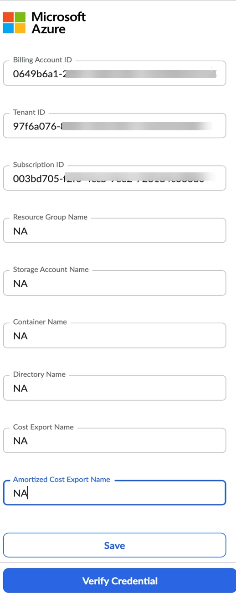

Los clientes actuales de MCA que tengan exportaciones a Azure utilizando Azure Storage no tienen que hacer nada. En el caso de las exportaciones de Azure que utilicen Azure Storage, seguiremos obteniendo los archivos de Cost Management de Azure desde la ubicación configurada.

## Reunión general sobre planificación de la carga de trabajo – 7 de mayo de 2024

Hoy nos complace anunciar la disponibilidad general de « Cloudability : Planificación de cargas de trabajo», lo que supone un hito importante tras su lanzamiento inicial en 2023. Esta función permite a los equipos de « FinOps » y de ingeniería calcular los costes de las nuevas cargas de trabajo, en función de los requisitos de recursos y de los precios personalizados. A la hora de planificar una nueva carga de trabajo, resulta de gran ayuda para los equipos poder comparar fácilmente los precios y las opciones de configuración de los recursos en la nube de AWS, Azure, GCP y OCI, lo que agiliza los procesos de toma de decisiones.

Cómo te puede ayudar esta función

Con esta versión GA, los administradores de Cloudability obtienen un mayor control sobre las recomendaciones de la planificación de cargas de trabajo gracias a la introducción de nuevas preferencias de planificación de cargas de trabajo. Aquí, los administradores pueden configurar las opciones predeterminadas para el tipo de contrato de la carga de trabajo (por ejemplo: «On Demand», «Spot»), los compromisos e introducir más descuentos o recargos. Además, se han mejorado los permisos de planificación de cargas de trabajo, lo que permite a los administradores de Cloudability supervisar las cargas de trabajo creadas por los usuarios de toda su organización, fomentando así la transparencia y facilitando el intercambio fluido de información entre los equipos.

Cloudability La planificación de cargas de trabajo es una funcionalidad pionera en el sector que permite a los usuarios definir cargas de trabajo rentables con todos los recursos necesarios, teniendo en cuenta las opciones de implementación en múltiples proveedores de nube. Esto fomenta una mayor eficiencia y coordinación entre los equipos financieros y técnicos.

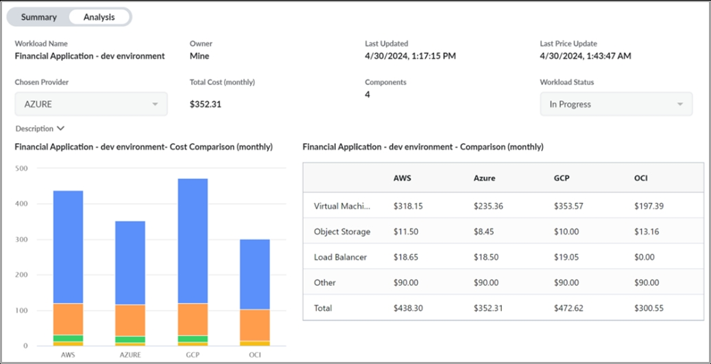

Preferencias de planificación de la carga de trabajo

Los administradores de « Cloudability » tienen acceso por defecto a estos nuevos controles, introducidos como parte de GA. Permite a los equipos de « FinOps » definir de forma centralizada y restringir las opciones para la planificación de cargas de trabajo. Cualquiera de estos ajustes es opcional y no es necesario para utilizar la Planificación de la carga de trabajo.

1. Ve a Cloudability Configuración > Preferencias de planificación de la carga de trabajo.
2. Desactiva la disponibilidad de un CSP concreto utilizando la opción «Permitir proveedor de servicios ».
3. Define las preferencias de tipo de arrendamiento y las opciones predeterminadas de compromiso para tus usuarios. También tienes la opción de bloquear la selección de compromiso para los usuarios.
4. Incorpora cualquier descuento o recargo adicional a los costes de tu carga de trabajo. Ten en cuenta que esto se suma a cualquier precio personalizado, que ya se tiene en cuenta en la planificación de la carga de trabajo.
5. Haz clic en «Guardar» para aplicar los cambios de inmediato. Los cambios en las preferencias afectarán tanto a las cargas de trabajo actuales como a las nuevas. 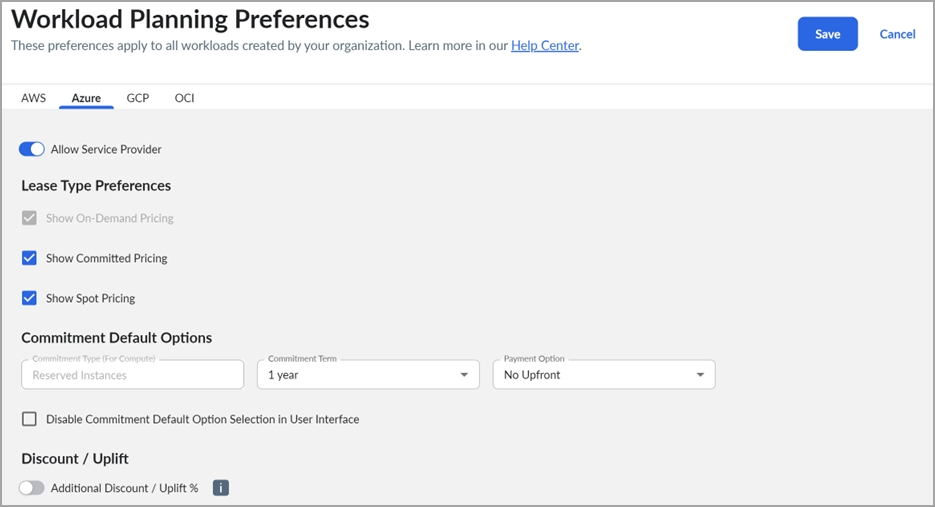

   Permisos para la planificación de la carga de trabajo

   Cloudability Los administradores tienen acceso a «Planificación de la carga de trabajo» y a «Preferencias de planificación de la carga de trabajo» gracias a su permiso « WorkloadPlacementFullAccess ». Pueden crear y gestionar sus cargas de trabajo, consultar las cargas de trabajo creadas por todos los usuarios de su organización (sin derecho a editarlas) y actualizar las preferencias de planificación de cargas de trabajo. Pueden editar los trabajos de otras personas cuando estos se compartan directamente con ellos y se les concedan derechos de edición.

   Por defecto, los usuarios que no son administradores pueden crear y editar sus propias cargas de trabajo gracias al permiso « WorkloadPlanningFeatureCanAccess ». También pueden ver y, en su caso, editar las cargas de trabajo que se les han compartido, en función de los permisos que les haya concedido el propietario de la carga de trabajo.

   Hemos creado un permiso adicional: WorkloadPlanningPreferencesViewOnly. Se puede añadir a un rol personalizado para ver las preferencias de planificación de la carga de trabajo, lo que ayudará a los usuarios a comprender mejor la configuración de la función.

   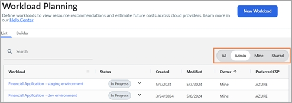

   Asistencia para precios personalizados

   La planificación de la carga de trabajo siempre muestra los costes, incluidos los precios personalizados (por ejemplo, para EDP), para AWS, Azure y OCI. Si las organizaciones no tienen un acuerdo de precios personalizado con un proveedor concreto, se aplicarán por defecto los precios «al por menor».

   En el caso de « GCP », puedes habilitar la exportación de datos de precios personalizados desde su cuenta de facturación de GCP para obtener precios personalizados en «Workload Planning».

   Más información sobre este comunicado

   Visite [Obtener recomendaciones para la planificación de la carga de trabajo](../product/get-recommendations-for-workload-planning.html) y [Preferencias de planificación de la carga de trabajo](../product/workload-planning-preferences.html) para obtener más información o únase a la discusión en [la comunidad Apptio](https://community.apptio.com/login?returnurl=https%3a%2f%2fcommunity.apptio.com%2fblogs%2fsoline-plichta%2f2024%2f05%2f08%2fcloudability-workload-planning-ga-faq "(se abre en una pestaña o una ventana nueva)").

## Método de ajuste del uso mínimo para los Flex-CUD de computación de « GCP » – 6 de mayo de 2024

Hoy hemos publicado un nuevo método de ajuste de las recomendaciones de compromiso para los Compute Flex-CUD de GCP, denominado «Uso mínimo». Con esta versión, puedes ajustar la recomendación en función del gasto correspondiente a la hora mínima de uso. Esto incluye la posibilidad de excluir el 1 % y el 5 % de las horas de uso con menor consumo.

Nota: No se requieren credenciales ni permisos adicionales.

## Compatibilidad con las exportaciones de datos de gestión de costes de « Azure » a « Azure Storage » mediante la partición de archivos – 6 de mayo de 2024

A partir de hoy, Cloudability admitirá las exportaciones de datos de gestión de costes de Azure a Azure Storage con particionamiento habilitado para los clientes de Azure. Esto sería aplicable a ambos tipos de exportaciones:

- Detalles de costes y consumo (reales)
- Detalles de costes y uso (amortizados)

  Cómo te puede ayudar esta función

  Recientemente, Azure ha mejorado la experiencia de almacenamiento en Azure para los clientes y ha establecido como opción predeterminada la partición de las exportaciones, lo que divide el archivo exportado en varios archivos, en función del tamaño del conjunto de datos.

  Antes de esta versión, Cloudability no admitía archivos de exportación de gestión de costes con particiones, lo que provocaba problemas en la importación de datos para los clientes de Azure en las exportaciones recién creadas. Esto ya no supone ningún problema, ya que Cloudability ahora admite archivos « Azure » con la partición activada.

  Nota:

  Se trata de un cambio en el backend y no implica ningún cambio ni actualización en la interfaz de usuario de Cloudability. Azure La importación de datos para los clientes con exportaciones más antiguas continuará sin que estos tengan que realizar ningún cambio.

  Nota:

  Los clientes que hayan activado la partición de archivos al crear exportaciones de gestión de costes deben crear una nueva exportación antes de añadir credenciales en Cloudability.

## Recomendaciones para optimizar las funciones de « AWS Lambda » en « Cloudability » – 19 de abril de 2024

A partir de hoy, los usuarios pueden obtener recomendaciones sobre el ajuste adecuado de las funciones de « AWS Lambda », lo que les ofrece oportunidades de ahorro de costes al identificar los recursos cuyo tamaño puede modificarse para adaptarse mejor a sus cargas de trabajo subyacentes.

Antes de esta versión, las recomendaciones de ajuste de plantilla para las funciones de « AWS Lambda » no estaban disponibles en « Cloudability ». El hecho de ofrecer estas recomendaciones directamente en Cloudability proporciona a los usuarios una fuente de recomendaciones más amplia e independiente para optimizar aún más su inversión en AWS.

Cómo activar las recomendaciones de ajuste de recursos para AWS Lambda

Para activar esta función, sigue los pasos que se indican a continuación:

1. Activa [la supervisión mejorada de Lambda Insights](https://docs.aws.amazon.com/lambda/latest/dg/monitoring-insights.html "(se abre en una pestaña o una ventana nueva)") para que Cloudability pueda recuperar las métricas de memoria de tus funciones Lambda.
2. Crea o descarga la plantilla actualizada de credenciales de « AWS » en Cloudability y, a continuación, sube la nueva plantilla de credenciales a la consola de administración de AWS.
3. En el menú de navegación principal de Cloudability, ve a la opción de menú «Optimizar » y selecciona «Ajuste de tamaño ».
4. Selecciona la pestaña « AWS » en la página «Rightsizing » y, en la sección de servicios de « AWS » disponibles, selecciona la pestaña «Lambda ». Aquí se mostrarán las recomendaciones existentes sobre el ajuste de la capacidad de Lambda.

Nota:

Estas recomendaciones, así como los datos en los que se basan, estarán ahora disponibles en todas las secciones de Cloudability en las que se muestran datos de ajuste de tamaño para otros servicios de AWS.

## Clasificación de dimensiones y métricas en la interfaz de usuario del inventario de recursos – 3 de abril de 2024

Hemos añadido encabezados en la configuración de la tabla (menú deslizante de la izquierda) de la interfaz de usuario del Inventario de recursos, que separarán las dimensiones y las métricas en dos secciones distintas.

En esta versión, las dimensiones aparecerían en la parte superior, mientras que las métricas aparecerían en la parte inferior al desplazarse hacia abajo en la configuración de la tabla.

## Presentación de « Cloudability » en la región de Asia-Pacífico – 2 de abril de 2024

Esta versión presenta la disponibilidad de Cloudability, nuestra plataforma de gestión de costes en la nube, en la región de Asia-Pacífico.

Cómo te puede ayudar esta función

Esta versión da respuesta a las necesidades específicas de nuestros clientes de la región APAC, garantizando que sus datos permanezcan dentro de los límites de dicha región. Mediante la localización de nuestros servicios, nuestro objetivo es ayudar a las organizaciones a reforzar sus medidas de cumplimiento normativo y a ajustarse a las directrices relativas a los datos sobre la gestión de costes en la nube.

Más información sobre el lanzamiento

El lanzamiento del servicio de alojamiento Cloudability en la región de Asia-Pacífico reviste una gran importancia para nuestros clientes que operan en esta región. Ofrece una solución de gestión de costes en la nube fiable y conforme a la normativa, que da prioridad a la residencia de los datos, mejora la privacidad de los mismos y se ajusta a las directrices de protección de datos.

Nota:

Los clientes con sede en la región de Asia-Pacífico que estén interesados en migrar de EE. UU. a dicha región pueden ponerse en contacto con sus respectivos gestores de cuenta o con el equipo de éxito del cliente.

Nota:

No se requiere ninguna configuración ni instalación adicional para los clientes de la región APAC que se incorporen directamente a Cloudability.

## Descuento basado en el compromiso para los descuentos de uso comprometido flexibles de Compute Engine de GCP – 28 de marzo de 2024

Hoy hemos lanzado la función de descuentos basados en compromisos para los compromisos basados en el gasto de Compute Engine de « GCP » (CUD flexibles).

A partir de hoy, los usuarios tendrán acceso a dos nuevas páginas:

- Desde la página «Cartera de compromisos», los usuarios pueden obtener información sobre el rendimiento, configurar alertas de vencimiento y gestionar su cartera de CUD flexibles.

- Desde la página «Recomendaciones de compromiso», los usuarios pueden recibir y ajustar recomendaciones óptimas para evaluar futuras compras de compromiso.

Cómo te puede ayudar esta función

Con esta versión, hemos reconfigurado e introducido un nuevo conjunto de indicadores clave de rendimiento (KPI) y metadatos de compromiso en las páginas de la cartera y de recomendaciones. Esta información te ayudará a gestionar y comprender mejor el rendimiento de tus compromisos actuales. Para aquellos clientes que no hayan introducido suficientes comentarios debido a la incertidumbre a la hora de aplicar el riesgo financiero a las decisiones de compromiso, las mejoras que hemos introducido en la página «Recomendaciones de compromiso» les darán la confianza necesaria para asumir compromisos más ambiciosos y aumentar así el ahorro neto.

Más información sobre el lanzamiento

En las próximas versiones, seguiremos incorporando nuevas funcionalidades para ayudarte a comprender las ventajas e inconvenientes de los distintos plazos, tipos y estrategias de compromiso. Reorganizaremos la arquitectura de la información de la funcionalidad de «Descuentos basados en compromisos» y trataremos de dar soporte a la mayoría de los tipos de compromisos basados en el gasto de « GCP ».

Nota:

Las páginas «Cartera de reservas» y «Planificador de instancias reservadas» pasarán a llamarse «Cartera de compromisos» y «Recomendaciones de compromisos », respectivamente, y pronto se reorganizarán una junto a la otra dentro de la sección «Optimizar ».

## Asignación de costes de contenedores para la versión « Kubernetes » ( 1.29 ) – 26 de marzo de 2024

La asignación de costes de contenedores ya es compatible oficialmente con la versión 1.29 de Kubernetes en todos los proveedores.

Esta función permite a los clientes obtener información detallada sobre el uso de sus recursos de contenedores y los costes asociados a los clústeres que se ejecutan en Kubernetes, versión 1.29.

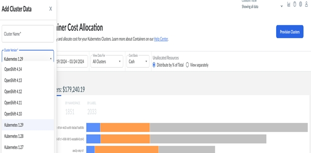

## Soporte de OCI en la planificación de cargas de trabajo – Mejoras – 26 de marzo de 2024

Hoy hemos lanzado dos mejoras en la función «Compatibilidad con OCI en la planificación de cargas de trabajo»:

• Ahora puedes seleccionar la opción de precios «Reserva de capacidad» para tus máquinas virtuales de OCI.

• Puedes consultar las cifras de las unidades de rendimiento de volumen (VPU) de tu «volumen en bloque» de OCI.

Cómo te puede ayudar esta función

Antes de esta versión, los usuarios que deseaban simular cargas de trabajo para OCI en Workload Planning solo podían utilizar los precios «On-Demand» o «Spot» (preemptible). Con esta actualización, ahora puedes seleccionar «Reserva de capacidad» como opción de tipo de contrato de alquiler al añadir un recurso a tu carga de trabajo, de forma similar a la opción disponible en el [Estimador de costes de OCI](https://www.oracle.com/cloud/costestimator.html "(se abre en una pestaña o una ventana nueva)"). Es importante tener en cuenta que la «reserva de capacidad» solo está disponible para máquinas virtuales y ofrece un descuento adicional del 15 %, que se pierde en cuanto se utiliza la capacidad reservada. Para obtener más información sobre la reserva de capacidad de OCI, consulte la [documentación](https://docs.oracle.com/en-us/iaas/content/compute/tasks/reserve-capacity.htm "(se abre en una pestaña o una ventana nueva)") de OCI.

A modo de recordatorio, cualquier «precio personalizado» o «descuento personalizado» para OCI se incluye, por defecto, en el precio del recurso que se muestra en «Planificación de la carga de trabajo».

Reserva de plazas

Ahora puedes seleccionar «Reserva de capacidad» como tipo de arrendamiento preferido para OCI en la información general; la descripción emergente se ha actualizado en consecuencia. Si eliges este tipo de contrato de alquiler, será la opción predeterminada en las recomendaciones para máquinas virtuales.

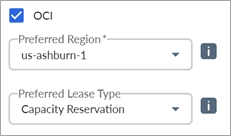

En la recomendación encontrarás opciones de tipos de contrato como «bajo demanda», «reserva de capacidad» y «spot» (preemptible), que te permiten comparar las opciones de precios antes de añadir un recurso a tu carga de trabajo.

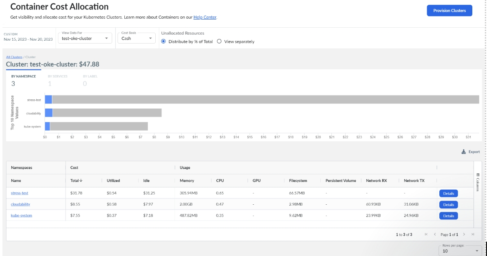

Importes de la VPU

En la pantalla de recomendaciones «Almacenamiento conectado» se puede consultar el volumen de la Unidad de Rendimiento de Volumen (VPU de almacenamiento en bloques de OCI). Esta información no está disponible para otros proveedores de servicios en la nube.

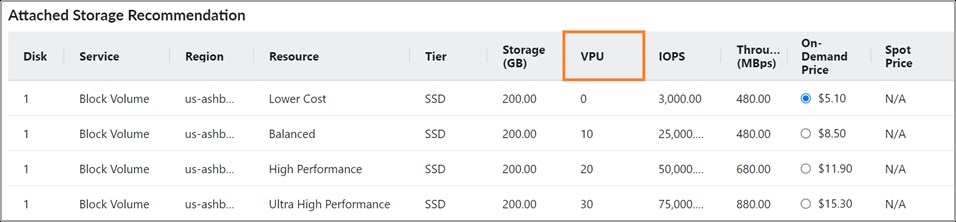

## Mejoras en las métricas de utilización de contenedores en Cloudability – 4 de marzo de 2024

Hemos introducido mejoras en nuestras métricas de utilización en la página de información sobre contenedores de Cloudability.

Esta actualización armoniza las métricas de memoria mostradas con las utilizadas en los cálculos de asignación para mejorar la coherencia, y corrige el uso del sistema de archivos de EKS para garantizar la precisión de los informes. A modo de aclaración, estas mejoras no afectarán al coste ni a la metodología de asignación de costes, y están diseñadas para ofrecer una visión más precisa de los indicadores de utilización en la página de información sobre contenedores.

## Mejora de la métrica «Coste (lista)» en Cloudability – 23 de febrero de 2024

Se ha mejorado la funcionalidad de la métrica «Coste (lista)». Anteriormente, algunos descuentos en tarifas privadas y combinadas aparecían como créditos en la métrica, lo que daba lugar a valores incorrectos. Sin embargo, la métrica «Coste (de catálogo)» se diseñó para proporcionar a los usuarios el coste a petición de cada partida, sin incluir información sobre descuentos ni abonos. Esta mejora resuelve el problema.

## Actualización de los permisos de « Azure » en la interfaz de usuario - 23 de febrero de 2024

Hoy hemos publicado un par de actualizaciones en la lista de permisos de « Azure » que se puede consultar en Cloudability.

• A partir de hoy, los usuarios de « Azure » dispondrán del permiso de rol «Enrollment Reader» para las cuentas EA de Azure y del permiso de rol «Billing Account Reader» para las cuentas MCA de Azure en la interfaz de usuario. Antes de esta versión, a los usuarios solo se les mostraba el permiso del rol «Lector de inscripciones» para todas las cuentas de Azure.

• Para los clientes que utilicen un rol personalizado de « Azure », hemos añadido la siguiente visualización de permisos en la interfaz de usuario. Estos formaban parte de los permisos que solicitamos al autenticar las suscripciones de Azure, pero no aparecían en la interfaz de usuario.

## Aumento del límite máximo de etiquetas « Kubernetes » en la función «Etiquetas y marcas» – 31 de enero de 2024

Hemos aumentado de 10 a 20 el número máximo de etiquetas « Kubernetes » disponibles en nuestra función «Etiquetas y marcas». Con esta mejora, podrás incorporar un mayor número de etiquetas « Kubernetes », lo que facilitará una mejor organización de las dimensiones de las etiquetas sintéticas adaptadas a sus casos de uso específicos.

## Planificación de la carga de trabajo: duplicación de recursos – 23 de enero de 2024

Hoy hemos lanzado la función «Planificación de cargas de trabajo: duplicación de recursos». A partir de hoy, podrás duplicar fácilmente tus recursos dentro de una carga de trabajo. Esta función también te ayudará a planificar tus cargas de trabajo más rápidamente, lo que te permitirá realizar un análisis eficaz de escenarios hipotéticos.

Cómo te puede ayudar esta función

Antes de esta versión, los usuarios se enfrentaban al reto de tener que introducir manualmente sus requisitos varias veces a la hora de evaluar diferentes opciones para sus recursos en la nube o comparar los costes entre distintas regiones. Ahora puedes clonar tus recursos y ajustar los requisitos sin ningún esfuerzo. Esto también te permitirá explorar diversas configuraciones para tus recursos en la nube con facilidad y precisión.

Cómo habilitar la duplicación de recursos dentro de una carga de trabajo

1. Crea una carga de trabajo y añade un recurso.
2. Selecciona el icono «Duplicar recurso» para clonar tu recurso. 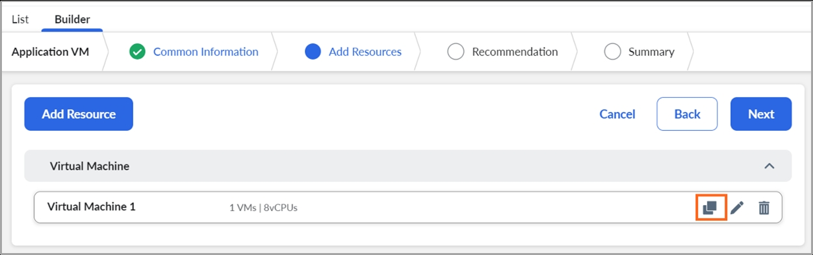
3. Actualiza el nombre del recurso duplicado y modifica los requisitos.

   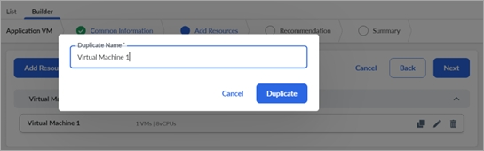

   Nota:

   Ahora puedes disponer de recursos en diferentes regiones dentro de una misma carga de trabajo. Puedes actualizar la región del recurso en la función «Buscar tipo de recurso (opcional)».

Más información sobre el lanzamiento

Ejemplo de caso de uso: Duplicar recursos para comparar los costes de « AWS EC2 » entre dos regiones

1. Crea una carga de trabajo y añade un recurso. Utiliza la opción «Buscar tipo de recurso» para obtener una estimación del coste de un servicio de « t4g.2xlarge » en la región us-west 1.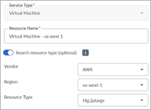
2. Duplica el recurso y cámbiale el nombre.
3. Actualiza la región a us-west-2 para tu recurso duplicado.

   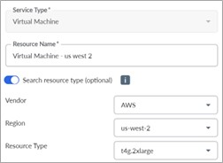

## Ajuste del tamaño del clúster de contenedores – 19 de enero de 2024

Esta versión incorpora recomendaciones de ajuste de recursos para clústeres de « Kubernetes » en AWS, Azure y GCP.

Nos complace presentar la última novedad de nuestro conjunto de herramientas de optimización: el ajuste del tamaño de los clústeres de contenedores. Con el objetivo de permitir a los clientes equilibrar de forma eficiente el ahorro de costes y el rendimiento de la carga de trabajo, esta función ofrece una solución sólida para dimensionar las máquinas virtuales que dan soporte a los clústeres de Kubernetes. Está disponible en la función de ajuste de tamaño de Cloudability, en la pestaña «Contenedores», y los clientes ya pueden empezar a utilizarla hoy mismo.

Cómo te puede ayudar esta función

Cloudability Hasta ahora, los usuarios han podido aprovechar las recomendaciones de ajuste de recursos para optimizar « Kubernetes » a nivel de carga de trabajo, ajustando la configuración de solicitudes y límites de los contenedores. Con este lanzamiento se añade un nuevo conjunto de recomendaciones, esta vez a nivel de clúster. Esta función evalúa los grupos definidos por el proveedor que respaldan cada clúster: grupos de nodos ASG para AWS, grupos de nodos para Azure y GCP. Las recomendaciones se basan en el análisis del uso histórico de los recursos por parte de estos grupos, centrándose en la utilización de la CPU y la memoria. A continuación, para cada clúster, la herramienta recomienda el tipo de instancia y el número de instancias más rentables que satisfagan los requisitos de recursos para cada hora del periodo de referencia.

En el caso de Cloudability, para generar estas recomendaciones a nivel de clúster, importamos los datos de uso de VM mediante las credenciales habituales de AWS, Azure y GCP. En resumen, si ya tienes todo configurado para recibir las recomendaciones de ajuste de tamaño de VM, estas recomendaciones sobre clústeres ya estarán disponibles.

Aspectos más destacados

- En la vista de lista puedes consultar toda la información sobre los clústeres y el resumen de ahorros. La vista detallada de cada clúster incluye gráficos de utilización que facilitan la toma de decisiones.
- Ofrece múltiples recomendaciones por clúster, con combinaciones de tipos y número de instancias en distintos niveles de riesgo, adaptándose a diferentes niveles de comodidad operativa.
- Esta versión no incluye recomendaciones para grupos formados por instancias puntuales.
- Para este lanzamiento, cada recomendación consta de un único tipo de instancia, dando prioridad a la uniformidad y la simplicidad.

## AWS Revisión de los permisos CAR y DBR – 18 de enero de 2024

En esta versión hemos eliminado la visualización de los antiguos permisos de « AWS » para el Informe de facturación detallado (DBR) y el Informe de asignación de costes (CAR).

Ya no está disponible la compatibilidad con los informes « AWS », «Detailed Billing Report» (DBR) y «Cost Allocation Report» (CAR) en Cloudability; sin embargo, en la vista de permisos se seguían mostrando hasta ahora los permisos relacionados con el DBR y el CAR con una «x» roja. En esta versión hemos eliminado la visualización de los permisos DBR y CAR de la interfaz de usuario.

Cómo te puede ayudar esta función

De este modo, se garantiza que los clientes de « AWS » dispongan de una visión más clara de los permisos pertinentes relacionados con los informes de costes y uso de « AWS ».

## Configuración de métricas de costes predeterminadas para los módulos de « Cloudability » – 17 de enero de 2024

Con esta versión, ya es posible establecer una métrica de costes predeterminada específica para cada módulo —como True Cost Explorer y Rightsizing, entre otros— a partir de la lista de todas las métricas compatibles con el módulo en cuestión.

Cómo te puede ayudar esta función

Cada módulo de Cloudability admite un conjunto específico de métricas de costes, como el coste (total), el coste (de catálogo) y el coste (amortizado), entre otras. Anteriormente, «Coste (total)» era la métrica de coste predeterminada que se mostraba en estos módulos. Ahora, esta función te permite establecer la métrica de costes preferida de tu organización como métrica de costes predeterminada para cada módulo. Aparecerá en Perfil > Configuración de la organización en Cloudability, solo para los usuarios con el rol de administrador de Cloudability.

La métrica de costes establecida para cada módulo se aplicará como métrica predeterminada para todos los usuarios de toda la organización de Cloudability.

## Cloudability Incorpora compatibilidad con la infraestructura en la nube de Oracle (OCI) en la planificación de cargas de trabajo - 16 de enero de 2024

Hoy hemos lanzado la compatibilidad con la infraestructura en la nube de Oracle (OCI) en Workload Planning. A partir de hoy, los usuarios pueden calcular fácilmente los costes de las nuevas cargas de trabajo implementadas en OCI, lo que les permite tomar decisiones de aprovisionamiento bien fundamentadas. Además, ahora pueden comparar sin esfuerzo los precios de los recursos en la nube de AWS, Azure, GCP y OCI. Antes de esta versión, los usuarios tenían que utilizar la calculadora de precios de cada proveedor para ello.

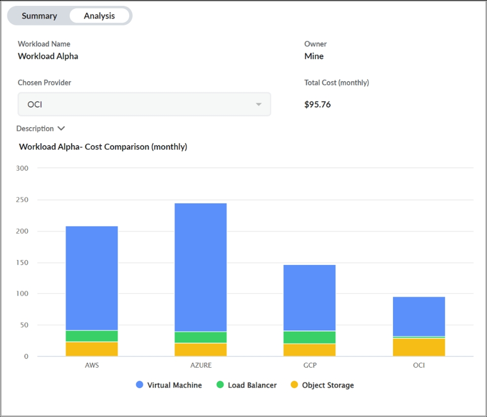

Más información sobre el lanzamiento

Entre los aspectos más destacados de esta versión se incluyen:

- Modelado sencillo de cargas de trabajo en OCI : Ahora puedes modelar sin problemas las cargas de trabajo en OCI con recomendaciones de recursos que abarcan diversos tipos de servicios\*, como máquinas virtuales, almacenamiento conectado, Object Storage y equilibradores de carga.
- Compatibilidad con precios personalizados : Las estimaciones de costes en la planificación de la carga de trabajo incluyen cualquier precio personalizado, lo que te permite planificar de forma más realista.
- Comparación de recursos entre nubes : puedes identificar fácilmente la solución más rentable comparando los requisitos de recursos y las estimaciones de costes de los principales proveedores de servicios en la nube: AWS, Azure, GCP y OCI.

Nota:

La base de datos gestionada aún no es compatible con OCI.

## Cloudability Mejora: Actualización del nombre del servicio « F5 » para las reglas del producto WAF « AWS » - 11 de enero de 2024

En esta versión, hemos corregido la denominación del servicio « “F5 Rules for AWS WAF».

Cómo te puede ayudar esta función

Anteriormente, nuestra solución asignaba erróneamente el cargo del marketplace correspondiente a « “F5 Rules for AWS WAF» al nombre de servicio « AWS WAF». Esto se ha modificado para reflejar con exactitud los cargos correspondientes al servicio denominado « AWS Marketplace». Como parte de esta mejora, también hemos solucionado otros casos excepcionales en los que los cargos del marketplace no se asignaban correctamente a un nombre de servicio de AWS.

## Mejora de la métrica «Coste (total)» en Cloudability para AWS - 5 de enero de 2024

Esta versión introduce una mejora en la métrica «Coste (total)», cuyo impacto es limitado para algunos de los clientes que realizan un seguimiento del gasto en « AWS ». Esto solo afecta a las partidas que se refieren a instancias reservadas (RI) parciales o sin pago por adelantado, mientras que las cifras a nivel agregado se mantienen sin cambios.

Cómo te puede ayudar esta función

Esta mejora te ayudará a aumentar la claridad de los indicadores de costes y a simplificar algunas de las tareas de conciliación.

Más información sobre el lanzamiento

No obstante, la métrica «Coste (total)» siempre ha tenido como objetivo ofrecer una representación fiel del coste de la factura —la columna « “LineItem/UnblendedCost” » del archivo CUR—. Sin embargo, hubo una excepción a esta norma, que se aplicó en su momento para facilitar una [transición](https://www.apptio.com/blog/switch-to-aws-cur/ "(se abre en una pestaña o una ventana nueva)") coherente entre los archivos DBR y CUR. Se aplicó la lógica a estos dos tipos de elementos:

- Para los usos cubiertos por una RI, utiliza “reservation/RecurringFeeForUsage”, en lugar de “LineItem/UnblendedCost”.
- Para partidas recurrentes de RI, utiliza “reservation/UnusedRecurringFee”, en lugar de “LineItem/UnblendedCost”.

De este modo, se garantizó que a las partidas de consumo se les asignara el valor de RI consumido, en lugar de un valor cero. Esto significa que se han trasladado los costes de las líneas de cuota mensual a las líneas de consumo. Esto ayudó a mantener un comportamiento coherente con el antiguo archivo DBR, ahora en desuso, pero tenía el inconveniente de que el «coste (total)» no era un indicador de tesorería de «transmisión directa» en sentido estricto. Dado que Cloudability ya no admite DBR, estas reglas especiales para la métrica Costo (Total) se han eliminado y la métrica mejorada se refleja en la columna lineItem/UnblendedCost.

Nota:

Estos cambios entrarán en vigor a partir de enero de 2024. También se aplicarán a diciembre de 2023, si AWS aún no ha completado tu facturación. Además, los cambios tendrán carácter retroactivo en caso de que se vuelva a procesar la facturación.

Si tienes alguna duda, necesitas más ayuda o quieres que se vuelvan a procesar datos históricos según el nuevo método, ponte en contacto con tu equipo de atención al cliente o con el servicio de asistencia.

## Compatibilidad con los precios personalizados para el ajuste de la capacidad de « GCP » - 3 de enero de 2024

Esta versión incorpora compatibilidad con precios personalizados en la función «Rightsizing» de « GCP » para « Cloudability », de modo que los descuentos contractuales y otros precios específicos para cada cliente se apliquen a las recomendaciones y la funcionalidad de « GCP » en materia de «Rightsizing».

Cómo te puede ayudar esta función

Esto permite aplicar los descuentos contractuales recibidos de su GCP a las recomendaciones de ajuste de capacidad de GCP. Esto también te ofrece una visión más precisa del ahorro de costes conseguido gracias a la optimización de tus recursos. Esto mejorará la precisión de las recomendaciones de ajuste de recursos, ya que permitirá detectar oportunidades de ahorro de costes al tiempo que se identifican los recursos cuyo tamaño se puede ajustar para adaptarlos mejor a sus cargas de trabajo subyacentes.

Más información sobre el lanzamiento

Para activar esta función, debes facilitar a Cloudability acceso a tus datos de precios personalizados. Una vez completada con éxito esta configuración, los nuevos precios de « GCP », específicos para cada cliente, se aplicarán automáticamente a las recomendaciones de ajuste de recursos y a la funcionalidad de « GCP ». La función principal de «Rightsizing» de GCP se encuentra en el menú «Optimizar »> «Rightsizing» > « GCP ». GCP Los costes por recurso estarán disponibles en Cloudability, en la sección «Informes y paneles», seleccionando la columna «ID de recurso».
