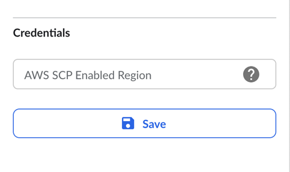
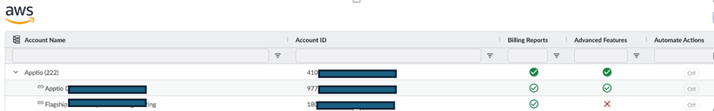
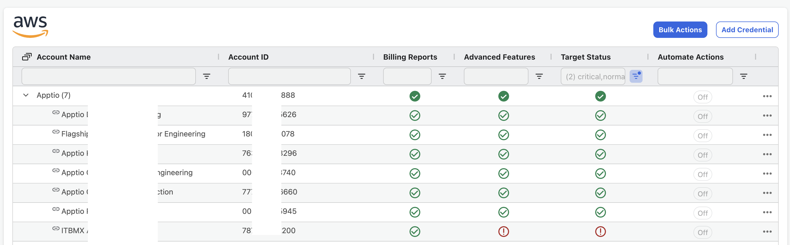

# AWS Credenciamento de contas vinculadas

Observação: Para garantir total compatibilidade e suporte, siga as etapas de conexão conforme descrito. Não são suportadas configurações personalizadas. Se tiver alguma dúvida, entre em contato com **o suporte** do IBM.

Depois de configurar sua conta de gerenciamento para ingestão de dados, o site Cloudability exibirá as contas vinculadas na conta de gerenciamento em algumas horas, mas elas não contêm dados da API AWS.

AWS Os dados da API são necessários para obter dados de utilização e compromissos que permitem o conjunto de recursos de otimização (por exemplo, Rightsizing) em Cloudability.

Para habilitar o acesso aos endpoints da API AWS para cada conta vinculada, Cloudability gera modelos CloudFormation para você carregar em AWS. Isso pode ser feito por meio de automação (recomendado) ou manualmente para cada conta vinculada.

Credenciamento automatizado de contas vinculadas

Recomendamos o uso da automação, pois esse processo simplifica o processo de credenciamento, especialmente quando você tem um número significativo de contas vinculadas.

Antes de começar:

- Familiarize-se com [os conjuntos de pilhas](https://docs.aws.amazon.com/AWSCloudFormation/latest/UserGuide/stacksets-prereqs-self-managed.html#stacksets-prereqs-accountsetup "(Abre em uma nova guia ou janela)") do AWS.
- Certifique-se de que você tenha a função IAM em seu site AWS - AWSCloudFormationStackSetAdministrationRole - isso garante que as contas vinculadas possam ter as permissões enviadas a elas.
- Verifique se você marcou a opção "Automated credentialing of Linked Accounts" (Credenciamento automatizado de contas vinculadas) durante o processo de credenciamento de conta consolidada anteriormente.
- Familiarize-se com o [AWS Credentialing usando Bulk Actions](aws-credentialing-bulk-actions.html)

Em Cloudability - Navegue até a conta vinculada

- Navegue até **Configurações > Credenciais do fornecedor > AWS**.
- Clique com o cursor do mouse sobre a... de uma conta vinculada **(não da conta de gerenciamento)**.
- Selecione o ícone de lápis para abrir o painel Editar uma credencial.
- Adicionar AWS Região habilitada para SCP (opcional):
  - Caso você tenha aplicado AWS Service Control Policy/policies (SCP) que restringem o acesso em algumas regiões AWS, indique a região permitida; por exemplo, us-east-2. Caso contrário, isso pode ser deixado em branco. Isso ajuda o site Cloudability a fazer chamadas de verificação para a região permitida especificada.
  - Atualmente, a capacidade do Cloud suporta a adição de uma única região SCP.
- **Escolha entre as opções avançadas de redimensionamento como “Somente leitura” ou **“Automatizar ações”****
  - A seleção **"Somente leitura"** significa que você está concedendo permissões de monitoramento para Cloudability cost, Turbonomic cost e Turbonomic para que elas possam ler seu ambiente, mas não realizar ações.
  - A seleção ****da opção “Automatizar ações”**** implica que você está concedendo todas as permissões de Cloudability e Turbonomic, incluindo aquelas relacionadas às ações automatizadas, ou seja, a execução de Turbonomic e a execução de cobrança em Turbonomic.

  Se a opção “Credenciamento automático de contas vinculadas do AWS ” estiver selecionada, a escolha entre **“Somente leitura”** e ****“Automatizar ações”**** na conta vinculada seguirá a seleção feita no nível superior.

  - Selecione **Salvar.**
  - Selecione **Download.**

Em AWS - Faça upload do modelo CloudFormation para o console de gerenciamento AWS

1. No **Console de gerenciamento AWS**, trabalhando na conta vinculada que você está credenciando, na barra de pesquisa, digite 'CloudFormation' e selecione-a.
2. Na página **AWS CloudFormation**, selecione **Criar StackSet**
3. Em **Specify template (Especificar modelo** ), faça o seguinte:
   - Deixar os parâmetros padrão para permissões e pré-requisitos
   - Selecione Carregar um arquivo de modelo.
   - Selecione Choose file (Escolher arquivo) e carregue o modelo que você baixou de Cloudability.
   - Selecione **Next**.
4. Na página de **detalhes Specify StackSet**, faça o seguinte:
   - Digite um **nome StackSet** (por exemplo, ' Cloudability ').
   - Verifique os **parâmetros** preenchidos.
   - Selecione **Next**.
5. Percorra a página **Configure StackSet options** e marque a opção "I acknowledge that AWS Cloudformation might create IAM resources with customized names" (Eu reconheço que o Cloudformation pode criar recursos IAM com nomes personalizados) e clique em Next.
6. Na página **Review (Revisão** ), selecione **Submit (Enviar** ).

Sua nova pilha inicialmente tem o status de **CREATE\_IN\_PROGRESS.** Quando o status muda para **CREATE\_COMPLETE,** você pode verificar sua credencial em Cloudability. Talvez seja necessário atualizar a página CloudFormation na interface do usuário para confirmar isso.

Em Cloudability - Verificar a credencial da conta consolidada

Isso pode ser feito por meio de ações em massa ou manualmente.

Verificação em massa via UI: [AWS Credenciamento usando ações em massa](aws-credentialing-bulk-actions.html)

Verificação manual via UI:

1. Navegue até **Configurações** > **Credenciais do fornecedor** > **AWS**.
2. Clique em... ao lado da conta que está sendo credenciada e selecione Re-Verificar.
   - Uma marca verde () indica sucesso, enquanto uma exclamação vermelha () indica erros.

Observação: esse processo criará uma nova função chamada CloudabilityRole\_OU, que será usada por Cloudability para verificar as permissões. Recomendamos o uso de código/automação e do endpoint da API Cloudability quando você tiver um número significativo de contas vinculadas.

Credenciamento manual AWS Contas vinculadas

Isso só se aplica se a opção anterior "Automated credentialing of Linked accounts" (Credenciamento automatizado de contas vinculadas) **tiver sido deixada desmarcada** durante o processo de credenciamento de contas consolidadas

Em Cloudability - Navegue até a conta vinculada

- Navegue até **Configurações > Credenciais do fornecedor > AWS**
- Clique com o cursor do mouse no... de uma conta vinculada **(não da conta de gerenciamento)**
- Selecione o ícone de lápis para abrir o painel Editar uma credencial.
- Adicionar AWS Região habilitada para SCP (opcional):
- Caso você tenha aplicado a AWS Service Control Policy / policies (SCP) que restringe o acesso em algumas regiões AWS, indique a região permitida; exemplo: us-east-2. Caso contrário, isso pode ser deixado em branco. Isso ajuda o site Cloudability a fazer chamadas de verificação para a região permitida especificada.
- **Escolha entre o redimensionamento avançado em modo somente leitura e **a automatização de ações****
  - **A** seleção “Somente leitura” implica que você está concedendo permissões de monitoramento para Cloudability cost, Turbonomic cost e Turbonomic para ler seu ambiente, sem a possibilidade de realizar ações.
  - A seleção ****da opção “Automatizar ações”**** implica que você está concedendo todas as permissões de Cloudability e Turbonomic, incluindo aquelas relacionadas às ações automatizadas, ou seja, a execução de Turbonomic e a execução de cobrança em Turbonomic.

Se a opção “Credenciamento automático de contas vinculadas do AWS ” estiver selecionada, a escolha entre **“Somente leitura”** e ****“Automatizar ações”**** na conta vinculada seguirá a seleção feita no nível superior.

- Selecione **Salvar**.
- Selecione **Download**.

Em AWS - Faça upload do modelo CloudFormation para o console de gerenciamento AWS

Conclua as etapas a seguir para fazer upload do modelo CloudFormation para o console de gerenciamento AWS como uma pilha. Isso terá de ser feito em todas as contas vinculadas.

1. No **Console de gerenciamento AWS**, trabalhando na conta vinculada que você está credenciando, na barra de pesquisa, digite 'CloudFormation'
2. Selecione-o.
3. Na página **AWS CloudFormation** página, selecione **Criar pilha (com novos recursos (padrão)**
4. Em **Specify template (Especificar modelo** ), faça o seguinte:
   - Selecione **Carregar um arquivo de modelo**
   - Selecione **Choose file (Escolher arquivo** ) e carregue o modelo que você baixou de Cloudability.
   - Selecione **Next.**
5. Na página **Especificar detalhes da pilha**, faça o seguinte:
   - Digite um **nome de pilha** (por exemplo, ' Cloudability ')
   - Verifique os **parâmetros** preenchidos.
   - Selecione **Next**.
6. Role pela página **Configure stack options (Configurar opções de pilha** ) e marque a opção "I acknowledge that AWS Cloudformation might create IAM resources with customized names" (Eu reconheço que o Cloudformation pode criar recursos IAM com nomes personalizados) e clique em Next (Avançar)
7. Na página **Review (Revisão** ), selecione **Submit (Enviar** ).

Em Cloudability - Verificar a credencial da conta vinculada

Isso pode ser feito por meio de ações em massa ou manualmente.

Verificação em massa via UI: [AWS Credenciamento usando ações em massa](aws-credentialing-bulk-actions.html)

Verificação manual via UI:

1. Navegue até Configurações > Credenciais do fornecedor e clique no ícone... e selecione Re-Verificar.

- Uma marca de seleção verde () indica sucesso, enquanto um ponto de exclamação vermelho () indica erros que precisam ser verificados.
- Esse processo precisará ser repetido para cada conta vinculada, uma a uma.

**Status de credenciais**

Cloudability A tela de credenciais do fornecedor exibe o status da conta a partir de:

- Cloudability
- Turbonomic

Depois que os modelos mais recentes forem executados, o status da conta deverá estar sincronizado entre Cloudability e Turbonomic. Para obter detalhes sobre o status da conta, verifique a seção de detalhes da conta.

**Tópico principal:** [Conexão com AWS - Guia de integração do cliente](../admin/aws-credentialing-premium-home.html)
