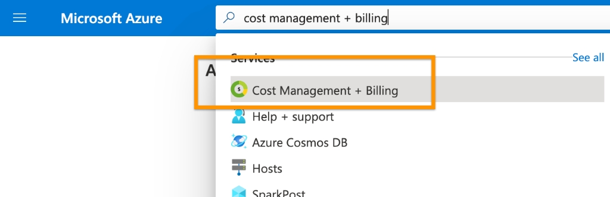
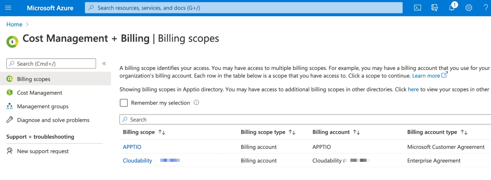
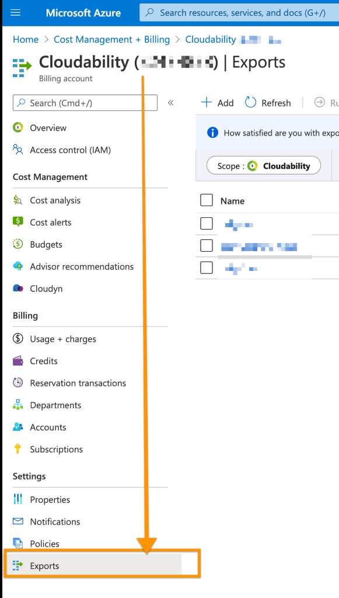
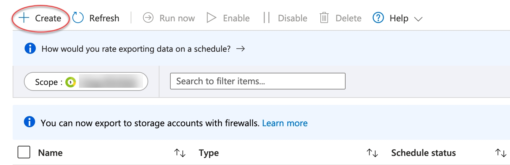
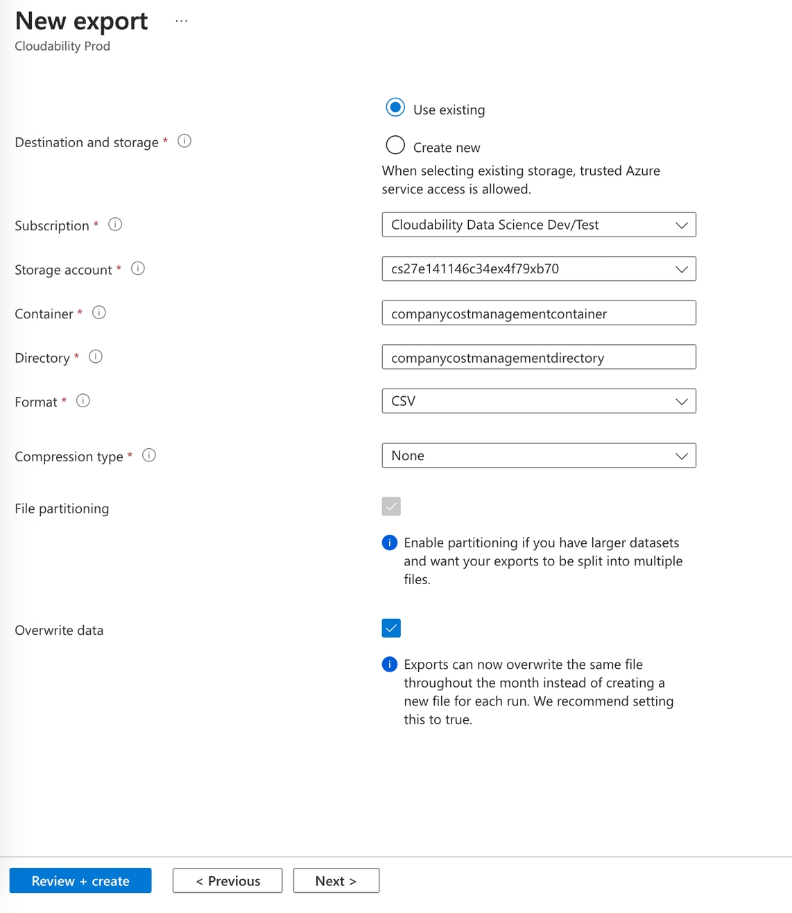
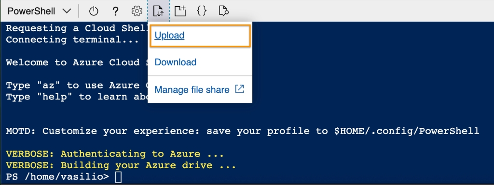

# Conectando-se com Azure MCA - Exportações de gerenciamento de custos

**Visão geral**

Este guia orienta você no processo de conexão do seu ****Contrato de Cliente** **Microsoft** (MCA)** ao IBM Cloudability por meio das Exportações de Gerenciamento de Custos Azure.

Azure As exportações de gerenciamento de custos fornecem detalhes minuciosos contendo todos os dados brutos de faturamento e uso por trás dos seus custos e tags de recursos do Azure. Cloudability É necessário ter alguns arquivos para essa integração:

- Detalhes de custo e uso (reais)

- Detalhes de custo e uso (amortizados)

Assim que estiver conectado, você terá acesso aos recursos do FinOps no site Cloudability.

Observação: Para garantir total compatibilidade e suporte, siga as etapas de conexão conforme descrito. Não são suportadas configurações personalizadas. Se tiver dúvidas, entre em contato com o **Suporte IBM**.

**Pré-requisitos**

Antes de começar,

Certifique-se de que você possui uma das seguintes funções na sua organização: Azure Active Directory :

- Administrador global ou administrador corporativo.
- Titular da conta de cobrança ou função equivalente para atribuir a função de leitor da conta de cobrança

Para o portal Azure, você precisa ter permissões fornecidas por um destes [escopos Azure](https://docs.microsoft.com/en-us/azure/cost-management-billing/costs/understand-work-scopes "(Abre em uma nova guia ou janela)") para criar a exportação de dados de faturamento.

- Proprietário (pode visualizar/gerenciar tudo, incluindo a configuração de custos)

- Colaborador (pode visualizar/gerenciar tudo, incluindo a configuração de custos, exceto o controle de acesso)

- Colaborador de gerenciamento de custos (pode visualizar/gerenciar a configuração de custos)

- Acesso de administrador às credenciais de fornecedores do Cloudability

**Introdução:**

O processo de credenciamento do programa “ Azure ” da Cloudability requer duas etapas principais:

- Azure Credenciamento de contas de cobrança

- Azure Credenciamento de contas de assinatura

Azure O processo de credenciamento da conta de cobrança envolve algumas etapas que exigirão que você realize ações tanto no portal Azure quanto no site Cloudability em diversas fases.

Durante esse processo, o site Cloudability irá

- Adicione o Service Principal “ Cloudability ” ( “CloudabilityUtilizationDataCollector” ) e atribua a ele a função “ “CloudabilityCostDataReader” ”.

- CloudabilityCostDataReader Essa função é utilizada para obter os dados de custo e uso por meio [da função](https://learn.microsoft.com/en-us/azure/role-based-access-control/built-in-roles/storage#storage-blob-data-reader) "(Abre em uma nova guia ou janela)") integrada “Storage Blob Data Reader” do Azure.

- Utiliza a função “Leitor de conta de cobrança”, que fornece acesso somente para leitura aos dados de cobrança

Observação: a função de “Leitor de conta de cobrança” só pode ser atribuída a um SPN por um usuário que seja **“Titular da conta de cobrança”**, por exemplo, um Administrador Corporativo, um Administrador Global ou equivalente.

Isso precisa ser feito **manualmente**.

**Etapa 1 – Portal do Azure – Criar uma exportação dos detalhes de custos do Azure**

Observação: O site Cloudability recomenda o uso das exportações do Azure para o credenciamento no Microsoft Azure.

Microsoft Azure também recomenda o uso de  [exportações](https://learn.microsoft.com/en-us/azure/cost-management-billing/automate/usage-details-best-practices "(Abre em uma nova guia ou janela)")  como prática recomendada para grandes conjuntos de dados (mais de 2 GB mês a mês).

1. No Portal do Azure, pesquise Gerenciamento deCustos + Faturamento e selecione essa opção na lista para abrir a página Âmbitos de Faturamento. Por exemplo:

   
2. Na página Gerenciamento de Custos + Faturamento, certifique-se de ter selecionado o escopo de faturamento correto. Se você tiver vários, selecione o escopo que concentra a maior parte dos seus gastos com nuvem.

   
3. No console Gerenciamento de Custos + Faturamento, selecione Exportações no painel de navegação para abrir o utilitário de exportação Azure.

   
4. Selecione “Criar” para abrir a página de exportação e criar uma nova exportação do CSV.

   
5. Criar uma nova exportação para
   1. **Custo e uso (real)** :
      1. Tipo de dados: Custo e uso (real)
      2. Crie um prefixo de exportação, por exemplo, g.: Cloudability, e clique em “cldy-actual-cost” para exibir:
         1. Nome de exportação: Nome de arquivo exclusivo definido pelo cliente
         2. Versão do conjunto de dados: 01/10/2021
         3. Frequência: exportação diária dos custos acumulados no mês
         4. Descrição da exportação: Opcional
      3. Clique em Salvar
      4. Clique em “Avançar” para abrir a guia “Destino”
         1. Tipo de armazenamento: armazenamento de blobs do Azure
         2. Destino e armazenamento: selecione para usar uma assinatura e um grupo de recursos existentes ou criar novos
         3. Assinatura: Selecione a assinatura de destino
         4. Conta de armazenamento: Selecione a conta de armazenamento
         5. Contêiner: Digite um nome válido para o contêiner que atenda às suas normas de nomenclatura
         6. Diretório: Insira um nome de diretório válido que atenda às suas normas de nomenclatura
         7. Formato: CSV
         8. Tipo de compactação: Nenhuma ou Gzip
         9. Particionamento de arquivos: Manter a seleção padrão
         10. Substituir dados: Manter a seleção padrão
      5. Clique em “Próximo”
      6. Na guia “Revisar e Criar”, clique em “Criar”

         
   2. **Custo e uso (amortizados)** :

      1. Siga os mesmos passos descritos acima
      2. Certifique-se de que sejam utilizados a mesma assinatura, o mesmo contêiner da conta de armazenamento e o mesmo diretório utilizados na criação da exportação anterior
      3. Clique em “Revisar e criar”

         Observação: Os dois arquivos no formato CSV são exigidos pelo Cloudability e devem estar presentes na conta de armazenamento utilizada para coletar dados de gerenciamento de custos.

         Não recomendamos a ingestão de dados do FOCUS para o “ Azure ”, pois as exportações nativas do “ Azure Cost Management” fornecem informações muito mais detalhadas.
6. Certifique-se de que as configurações abaixo estejam aplicadas à conta de armazenamento configurada para exportações:
   1. Acesse “Contas de armazenamento” e selecione a conta de armazenamento utilizada para o Cloudability
   2. Selecione “Segurança + Rede”
   3. Selecionar Rede
   4. Clique em Gerenciar
      1. Em “Acesso à rede pública”, selecione “Ativar”
      2. Na seção “Escopo de acesso à rede pública”, selecione uma das opções a seguir
         1. Ativar em todas as redes, ou
         2. Ativar a partir das redes selecionadas
            1. Nesse caso, entre em contato com o suporte do Cloudability para obter um intervalo de endereços IP que possam ser incluídos na lista de permissões
   5. Clique em Salvar
   6. Selecione “Segurança + Rede”
   7. Selecionar criptografia
   8. Clique em “Escopos de criptografia”
   9. Forneça um nome para o escopo de criptografia
   10. Tipo de criptografia
       1. Chaves gerenciadas pela Microsoft (MMK)
   11. Criptografia de infraestrutura
       1. Ativado ou Desativado
   12. Clique em Criar.
7. **Reúna as informações de cobrança para a configuração de suas credenciais do Cloudability**

   Depois de criar suas exportações de dados de faturamento, o Cloudability precisa de informações adicionais do seu Portal Azure para a configuração das credenciais do Cloudability, conforme indicado a seguir:

   Você pode encontrar a lista de todas as propriedades necessárias para o ` Cloudability ` no console de gerenciamento de custos do Portal Azure :

| Nome de Propriedade | Como encontrá-lo |
| --- | --- |
| ID da conta de cobrança | - Pesquise por “**Gerenciamento de** Custos + Faturamento” e selecione essa opção na lista para abrir a página “Visão geral do Gerenciamento de Custos + Faturamento”. - Selecione “Âmbitos de faturamento” e clique no âmbito de faturamento - **Acesse “Configurações”, clique em “Propriedades”,** copie e salve **o ID da sua conta de** cobrança |
| ID do locatário | - Pesquise por **“Microsoft Entra ID”** e selecione-o para carregar a página de visão geral do Active Directory.  - Copie e salve **o ID do** locatário |
| ID da assinatura | - Procure por **“Assinaturas” e** selecione essa opção para abrir a página de assinaturas - Na lista de assinaturas da mesma conta de cobrança, selecione a assinatura - Copie o ID **da assinatura** em que as exportações foram criadas e salve-o. |
| Nome do grupo de recursos | Na página Visão geral da conta de armazenamento, clique no link da conta de armazenamento para visualizar o nome do grupo de recursos, conforme mostrado neste exemplo: |
| Nome da conta de armazenamento  Nome do contêiner  Nome do diretório  Nome da exportação de custos  Nome da exportação amortizada | - Pesquise “**Gerenciamento** de Custos + Faturamento” e selecione essa opção - Acesse a seção “Exportações” em “Configurações” para exibir uma tabela com os dados da sua conta de armazenamento de faturamento. - Role para a direita e selecione a conta de armazenamento dos seus dados de cobrança para abrir a página Visão geral, onde você pode visualizar o   - Nome da conta de armazenamento,   - Nome do contêiner de armazenamento,   - Nome do diretório de armazenamento,   - nomes dos arquivos de exportação tanto do custo real quanto do custo amortizado: |

**Etapa 2 - Cloudability - Autenticação usando os dados de cobrança**

Depois de reunir as informações listadas na tabela, você poderá inseri-las no site Cloudability para atualizar sua credencial da MCA.

Cloudability usará essas informações para gerar um script PowerShell. Quando o script for executado a partir do seu Cloud Shell no Portal Azure ou a partir do PowerShell local, restrito ao seu locatário, ele criará e concederá direitos para Cloudability por meio da função CloudabilityCostDataReader, a fim de fornecer acesso à conta de armazenamento.

1. No site Cloudability, acesse
   1. **Configurações** > **Credenciais do fornecedor** > **Adicionar fonte de dados** > **AZURE**.
   2. Clique em “Próximo”
   3. Selecione “Contrato de Cliente da Microsoft (MCA)” — o painel **“Adicionar conta do Azure”** será exibido.Ou
   4. **Configurações** > **Credenciais do fornecedor** > **Ingress** > **AZURE**.
   5. Clique em “Próximo”
   6. Selecione “Contrato de Cliente da Microsoft (MCA) **” —** o painel “Adicionar credencial” é exibido.
2. Insira as informações coletadas no seu Portal Azure nos campos correspondentes
   1. Insira o ID da conta de cobrança do Azure
   2. ID do locatário
   3. ID da assinatura
   4. Nome do grupo de recursos
   5. Nome da conta de armazenamento
   6. Nome do contêiner
   7. Nome de diretório
   8. Custo Nome de exportação
   9. Nome da exportação do custo amortizado
3. Selecione **“Gerar script de configuração”** para baixar o novo arquivo de script.
4. Selecione “**Fechar** ”.

Você voltará mais tarde para verificar as alterações.

**PASSO 3 - Portal Azure -** **Conceda acesso ao Cloudability a partir do Portal Azure**

O próximo passo é conceder ao Cloudability acesso para ler os dados de custo e uso do seu armazenamento Azure, executando o script de configuração no seu Portal Azure Cloud Shell.

Para executar o script:

1. Faça login no Portal Azure e selecione o tenant desejado (o diretório de nível mais alto em Azure para a inscrição em questão e onde suas exportações de gerenciamento de custos são gravadas).
2. No Portal do Azure, abra o Cloud Shell e selecione “ PowerShell ” como linguagem de script.
3. Após a inicialização do Cloud Shell, selecione **“Upload”** no menu do terminal Cloud Shell.
4. Faça o upload do arquivo do script de configuração fornecido por Cloudability.



1. Execute o script digitando:

   ./<YOUR\_SCRIPT\_NAME\_HERE>.ps1

   Observação: Isso deve adicionar a função “Billing Account Reader” ao entidade de serviço “ Cloudability ”

**Etapa 4 - Cloudability - Verificar as credenciais da conta**

A etapa final é verificar sua credencial MCA atualizada no site Cloudability.

1. Volte à página de credenciais do Cloudability Azure em **Configurações > Credenciais de fornecedor > AZURE**.
2. Selecione os três pontos à direita e escolha “Editar” ao lado da sua credencial **MCA**.
3. Selecione **“Verificar credencial”** no painel que se abrir.
4. Clique no ```…``` ao lado da conta que está sendo autenticada e selecione “Verificar novamente”.

Uma marca de seleção verde () indica sucesso, enquanto um ponto de exclamação vermelho () indica erros.

Após a conclusão desse processo, em poucas horas,

- Cloudability passará a exibir seus dados de cobrança e as tags “ Azure ” no site Cloudability.
- Os dados de preços também seriam importados.
- Cloudability também exibirá as assinaturas

Como próximo passo, você precisará configurar as credenciais das assinaturas.

Clique aqui para [configurar o planejamento de ajuste de capacidade e de instâncias reservadas d Azure,](azure-advanced-rightsizing.html) a fim de credenciar as assinaturas do Azure

**Perguntas Frequentes** 

1. **Recentemente, ativei as exportações de gerenciamento de custos do Azure e fiz o login no Cloudability. Quanto tempo leva para os dados aparecerem no Cloudability?**Consulte a [documentação sobre a disponibilidade dos dados de custo e uso](https://www.ibm.com/docs/en/cloudability-commercial/cloudability-premium/saas?topic=ts-cloudability-cloudability-cost-usage-data-availability-in-reporting "(Abre em uma nova guia ou janela)")
2. **Azure API de detalhes de custos “Exports vs Azure ”: qual delas deve ser usada para integrar o Azure no Cloudability?**O uso das exportações do ` Azure ` é a forma recomendada pela Microsoft. Essa é uma abordagem escalável, pois, à medida que seu conjunto de dados cresce, as exportações são capazes de lidar com conjuntos de dados maiores. Azure A API de detalhes de custos pode ser usada para conjuntos de dados menores.
3. **É possível importar dados históricos de custos no Cloudability? Se sim, até que ponto os dados podem ser importados retroativamente?** Sim, podemos fazer isso por meio de exportações únicas. Por favor, entre em contato com as equipes de suporte do IBM e do Cloudability para saber como importar dados históricos.
4. **É possível usar o formato FOCUS em vez das exportações do tipo “ Azure ” para integração?**Nº Para uma integração correta com o Cloudability e para importar dados como Rightsizing, Instâncias Reservadas e Plano de Economia Azure, recomendamos o uso de exportações, pois elas fornecem informações muito mais detalhadas.
5. **Onde posso encontrar as APIs de credenciais de fornecedores d Cloudability para o Azure**Consulte: [Pontos finais de credenciais de fornecedores Azure](https://www.ibm.com/docs/en/cloudability-commercial/cloudability-standard/saas?topic=api-vendor-credentials-end-points-azure "(Abre em uma nova guia ou janela)")

**Tópico principal:** [Conectar-se Microsoft Azure](../admin/azure-cm-setup-premium.html)
