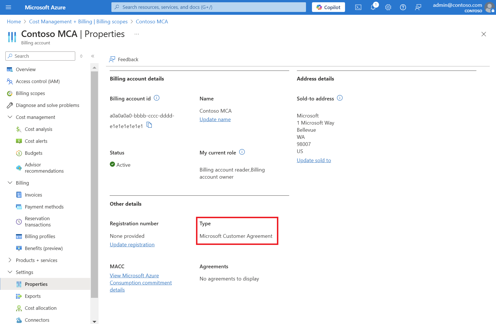
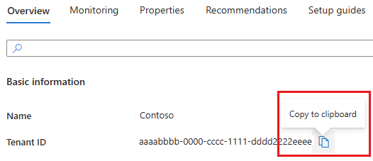
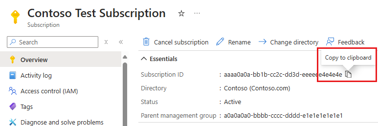
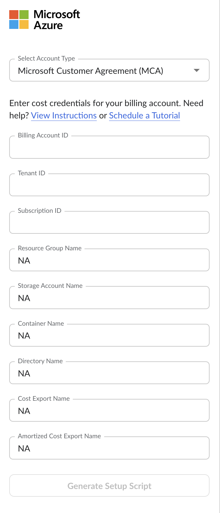
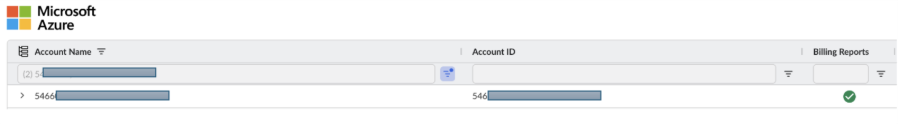

# Conectando-se com Azure MCA - Detalhes de custo API

**Visão geral**

Este guia orienta você passo a passo pelo processo de conexão segura do seu ambiente MCA do Azure ao IBM Cloudability por meio das APIs de detalhes de custo do Azure.

A API de Detalhes de Custos é um mecanismo alternativo de autenticação para clientes do Azure. Assim que estiver conectado, você terá acesso à experiência “ FinOps ” em Cloudability. Nesse processo, criaremos um Princípio de Serviço na sua conta do Azure, o que ajudará o Cloudability a obter os dados de cobrança.

Observação: O site Cloudability recomenda o uso das exportações do Azure para o credenciamento no Microsoft Azure. Clique [aqui](azure-cm-ea.html) para configurar as exportações d Azure. Microsoft Azure também recomenda o uso de [exportações](https://learn.microsoft.com/en-us/azure/cost-management-billing/automate/usage-details-best-practices "(Abre em uma nova guia ou janela)") como prática recomendada para grandes conjuntos de dados. (Mais de 2 GB por mês)

Para garantir total compatibilidade e suporte, siga as etapas de conexão conforme descrito. Não são suportadas configurações personalizadas. Se tiver dúvidas, entre em contato com o **Suporte IBM**.

**Pré-requisitos**

Antes de começar, certifique-se de ter acesso a:

- Azure Portal da MCA

- Função de Administrador Corporativo (ou, no mínimo, Redator de Matrículas, ou o equivalente em sua organização) no Azure

- Acesso de administrador à página “Credenciais de fornecedores” do site Cloudability

O processo de credenciamento para a API de Detalhes de Custos do “ Azure ” da Cloudability envolve duas etapas principais:

- Credenciamento de contas de cobrança

- Credenciamento de assinaturas

**Credenciamento de contas de cobrança**

Cloudability utiliza as credenciais da conta de cobrança para importar os dados de custo e uso do Azure, no nível do recurso, e as tags do grupo de recursos para as contas de cobrança credenciadas.

O processo de credenciamento envolve algumas etapas que exigirão que você realize ações tanto no portal Azure quanto no site Cloudability em diferentes fases.

Vamos começar com o processo de credenciamento:

1. **No portal “ Azure ”:**

   1. Localize **o ID da** sua conta de cobrança (ID de inscrição).
      1. Pesquise “**Gerenciamento** de Custos + Faturamento” e selecione essa opção na lista para abrir a página “Visão geral do Gerenciamento de Custos + Faturamento”.
      2. Selecione o escopo de faturamento
      3. **Acesse “Configurações”, clique em “Propriedades”,** copie e salve **o ID** da sua conta de cobrança (ID de cadastro).

         
   2. Encontre seu **ID de locatário**
      1. Pesquise por **“Microsoft Entra ID”** e selecione-o para carregar a página de visão geral do “ Active Directory ”.
      2. Copie e salve o **ID do locatário**

         
   3. Obtenha seu **ID de assinatura**
      1. Da lista de assinaturas associadas à mesma conta de cobrança.
      2. Copie um dos **IDs** de assinatura e salve-o.

         
2. **Em Cloudability - Configurar credenciais para a conta de cobranç Azure**

   Você precisa ter direitos de administrador d Cloudability para concluir este procedimento.

   Caso você não tenha direitos de administrador, entre em contato com o administrador principal do Cloudability da sua organização para obter ajuda.

   1. No site Cloudability, acesse **Configurações** > **Credenciais do fornecedor** > **Adicionar fonte de dados e selecione Azure - EA**
   2. Insira o **ID de inscrição do** Azure (ID da conta de cobrança), o ID do locatário e o ID da assinatura
   3. Insira “**NA** ” em todos os demais campos.
   4. Clique em **“Gerar script de configuração”.**
   5. Um script do PowerShell será baixado.
3. **No Portal Azure - Carregue o script PowerShell**

   O próximo passo é conceder ao Cloudability acesso para ler os dados de custo e uso do seu armazenamento Azure, executando o script de configuração no seu Portal Azure Cloud Shell.

   1. Execute o script ` PowerShell ` no console do ` PowerShell ` (ou diretamente)
   2. Para executar o script:
      1. Faça login no portal Azure e selecione o tenant desejado
      2. No Portal do Azure, abra o Cloud Shell e selecione “ PowerShell ” como linguagem de script.
      3. Após a inicialização do Cloud Shell, selecione **“Upload”** no menu do terminal Cloud Shell.

         
      4. Faça o upload do arquivo do script de configuração fornecido por Cloudability.
      5. Execute o script digitando:

         Nota:

         >: ./<YOUR\_SCRIPT\_NAME\_HERE>.ps1
   3. Este script do PowerShell criará um princípio de serviço chamado “**CloudabilityUtilizationDataCollector** ”.

      Observação: Isso deve adicionar a função “Billing Account Reader” ao entidade de serviço “ Cloudability ”
4. **Em Cloudability - Verifique as credenciais da conta de cobrança**
   1. No Cloudability, navegue até **Configurações > Credenciais do fornecedor > Azure.**
   2. Clique no ```…``` ao lado da conta que está sendo autenticada e selecione “Verificar novamente”.
      1. Um visto verde () indica sucesso, enquanto um ponto de exclamação vermelho () indica erros

Caso a verificação não seja bem-sucedida, tente novamente após 15 minutos.

Após a conclusão desse processo, em poucas horas,

- Cloudability passará a exibir seus dados de cobrança e as tags “ Azure ” no site Cloudability.
- Os dados de preços também seriam importados.
- Cloudability também exibirá as assinaturas

Como próximo passo, você precisará configurar as credenciais das assinaturas.



**Credenciamento de contas de assinatura**

Como próximo passo, siga as instruções sobre **“Configuração de credenciais avançadas”, “ Azure ” e “Dimensionamento adequado e planejamento de instâncias reservadas** ”. A configuração dessas permissões ajudará a importar as tags de assinatura do Azure e os dados de utilização, o que facilita o uso dos recursos do Optimize do Cloudability.

**Perguntas Frequentes**

1. **Não consigo ver nenhum dado sobre custos após concluir as etapas de credenciamento da conta. O que devo fazer?**

   Verifique se a conta foi verificada com sucesso (aparece uma marca de seleção verde). Se isso ocorrer, aguarde 24 horas para receber os dados; caso contrário, entre em contato com a equipe de suporte da Cloudability.

   Se a conta não estiver verificada (aparece em vermelho!), Por favor, verifique as configurações novamente e confirme se todos os detalhes estão corretos E se o script foi executado no seu ambiente.
2. **Recentemente, ativei o Azure e configurei as credenciais das contas em Cloudability. Quanto tempo vai demorar para que os dados de custo e uso fiquem disponíveis?**

   Pode levar até 24 horas para que seus primeiros dados de custos sejam exibidos no site Cloudability.
3. **Como faço para atualizar para o modelo mais recente do PowerShell para permissões?**

   Isso pode ser feito por meio do site Cloudability, na seção “Gerenciar credenciais” ( Azure ).

   1. Para regenerar o modelo PowerShell e reconfigurar seu acesso ao Azure, faça o seguinte:

      1. No Cloudability, navegue até **Configurações > Credenciais do fornecedor > Azure**.
      2. Salve e baixe o modelo atual do “ **PowerShell** ”.
      3. No Portal d Azure, instale o modelo.
      4. Após a atualização bem-sucedida, verifique novamente a conta.
4. **É possível importar dados históricos de custos no Cldy? Se sim, até que data os dados podem ser importados?**

   Sim, nós podemos. As APIs de detalhes de custos permitem a obtenção de dados referentes a 13 meses anteriores.

   Para questões relacionadas a dados históricos, por favor, abra um ticket de suporte.
5. **Quando devo usar a API de detalhes de custos para o Azure?**

   Recomenda-se o uso da API de detalhes de custos para Azure em conjuntos de dados menores, de preferência com menos de 2GB.
6. **Para começar, qual será a quantidade de dados históricos que o site Cloudability irá disponibilizar?**

   Cloudability apresentará os dados de custos do mês atual e dos meses anteriores.
7. **Como faço para migrar da API de Detalhes de Custos do Azure para as exportações de detalhes do Azure?**

   Isso exigiria a recertificação das contas. Siga as etapas de credenciamento para exportações d Azure.
8. **É recomendável alterar o conteúdo do script PowerShell gerado por Cloudability?**

   Essa abordagem não é recomendada, pois, para que o ` Cloudability ` funcione corretamente, é necessário o princípio de serviço e as funções atribuídas no script ` PowerShell `. Quaisquer alterações no script não são suportadas.

**Tópico principal:** [Conectar-se Microsoft Azure](../admin/azure-cm-setup-premium.html)
