# Mapeamento de negócios

## O que são mapeamentos de negócios?

Os mapeamentos de negócios são usados para criar dimensões de negócios que categorizam os gastos com nuvem de acordo com a taxonomia da sua organização.

Ao contrário das dimensões fornecidas pelos fornecedores ou baseadas em faturamento, as Dimensões de Negócios oferecem maior flexibilidade e controle. Eles utilizam regras de avaliação — chamadas de declarações de mapeamento de negócios — para traduzir metadados específicos de fornecedores e faturamento em conceitos de negócios significativos. Os conceitos de negócios são as categorias e estruturas que uma organização utiliza para interpretar dados brutos e transformá-los em informações adequadas para a elaboração de relatórios e a tomada de decisões.

O mecanismo de regras do Business Mapping suporta lógicas complexas e é capaz de avaliar uma ampla gama de atributos, tanto de dados de faturamento quanto de uso. Entre eles estão campos fornecidos pelo fornecedor, como tags, nomes de contas, regiões e nomes de serviços. Cloudability amplia ainda mais essa funcionalidade ao oferecer atributos aprimorados, como família de uso e tipo de contrato de locação, permitindo uma categorização mais detalhada e perspicaz.

Nota:

O número máximo de registros para uma dimensão de negócios é de 300.000.

O número máximo de transações em todas as dimensões de negócios é de 500.000.

## Como funcionam os mapeamentos de negócios?

Avaliado na ingestão

Quando os dados de faturamento são importados, o Cloudability avalia cada item de custo de acordo com suas regras de mapeamento de negócios. Você pode considerar essas regras semelhantes a uma instrução `case` — quando é encontrada uma correspondência, o nome da instrução associada é usado como valor para a Dimensão de Negócios.

Esse valor pode ser:

- Um rótulo estático definido por você (por exemplo, Marketing, Não conforme), ou
- Um atributo dinâmico (por exemplo, o valor de uma tag do próprio item).

Assim que uma regra for atendida, o processamento é interrompido e nenhuma outra regra é avaliada. Se nenhuma regra corresponder, o valor padrão será atribuído.

Atualizações automáticas

Sempre que seu provedor de nuvem fornecer um novo conjunto de dados de faturamento, o Cloudability reaplica o conjunto atual de instruções de mapeamento de negócios.

Dicas para criar dimensões de negócios

Escolha um nome claro

Cada dimensão de negócios precisa ter um nome. Escolha um nome que transmita claramente sua finalidade, pois ele aparecerá nos relatórios e em todo o site Cloudability.

Definir um valor padrão

Forneça um valor alternativo, que será atribuído quando nenhuma regra corresponder. Os valores padrão mais comuns incluem “Não alocado”, “Desconhecido”, “Não em conformidade” ou “Não definido ”.

Compreender a estrutura das regras

Cada declaração de mapeamento de negócios consiste em:

1. Nome – O valor atribuído à dimensão de negócios quando ocorre uma correspondência. Esse valor pode ser estático ou preenchido dinamicamente a partir de um atributo do item de custo (por exemplo, uma tag).
2. Expressão de correspondência – Uma condição que avalia os atributos de um item de custo. Essas expressões podem utilizar lógica booleana complexa, um conjunto abrangente de operadores e quaisquer atributos relevantes dos itens de custo.

Observação: As alterações nas declarações do Business Mapping são aplicadas automaticamente aos dados de faturamento do mês atual. Para aplicar atualizações a dados históricos, envie uma solicitação de reprocessamento ou entre em contato com o suporte Cloudability ou com seu TAM para obter assistência.

O diagrama pode ajudar a compreender os conceitos que estão por trás da estrutura do Business Mapping:

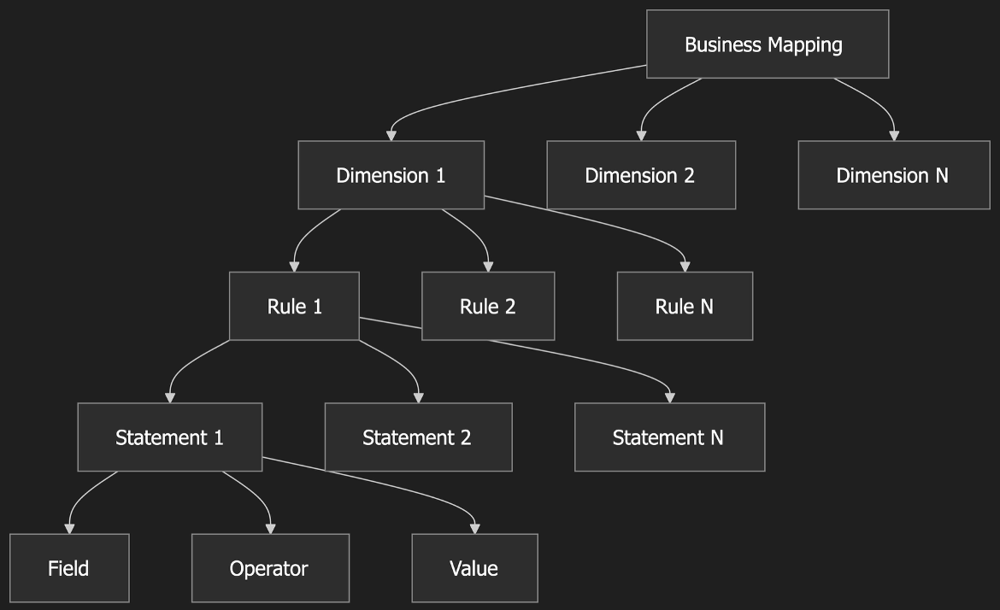

**1. Mapeamento de negócios** (nível superior)

- A estrutura geral de alocação de custos
- Contém várias dimensões

**2. Dimensões** (Categorias)

- Unidades organizacionais da empresa
- Exemplos: Departamento, Centro de Custos, Projeto, Ambiente
- Cada dimensão contém várias regras

**3. Regras** (Lógica de mapeamento)

- Definir como os recursos são atribuídos às categorias
- Cada regra contém uma ou mais instruções
- As regras têm uma ordem de prioridade

**4. Declarações** (Condições)

- Condições lógicas individuais
- Verificar metadados específicos da nuvem
- Várias expressões combinadas com a lógica AND/OR

```
Business Mapping: "Cost Allocation Framework"
│
├── Dimension: "Department"
│   │
│   ├── Rule 1 (Priority 1): "Engineering Resources"
│   │   ├── Statement 1: tag:Department EQUALS "Engineering"
│   │   └── Statement 2: tag:Environment EQUALS "Production"
│   │   → Result: Assign to "Engineering"
│   │
│   ├── Rule 2 (Priority 2): "Marketing Resources"
│   │   └── Statement 1: account_id EQUALS "123456789"
│   │   → Result: Assign to "Marketing"
│   │
│   └── Rule 3 (Priority 3): "Default"
│       └── Statement 1: tag:Department IS EMPTY
│       → Result: Assign to "Unallocated"
│
└── Dimension: "Environment"
    │
    ├── Rule 1: "Production"
    │   └── Statement 1: tag:Environment EQUALS "Production"
    │   → Result: Assign to "Production"
    │
    └── Rule 2: "Non-Production"
        ├── Statement 1: tag:Environment EQUALS "Development"
        └── Statement 2: tag:Environment EQUALS "Testing"
        → Result: Assign to "Non-Production"
```

## Trabalhando com mapeamentos de negócios

Enumeração e análise das dimensões do negócio

Na página inicial do Business Mappings, você pode ver uma lista de todas as dimensões de negócios que configurou e há diversas ações que você pode realizar. É possível configurar no máximo 10 dimensões de negócios.

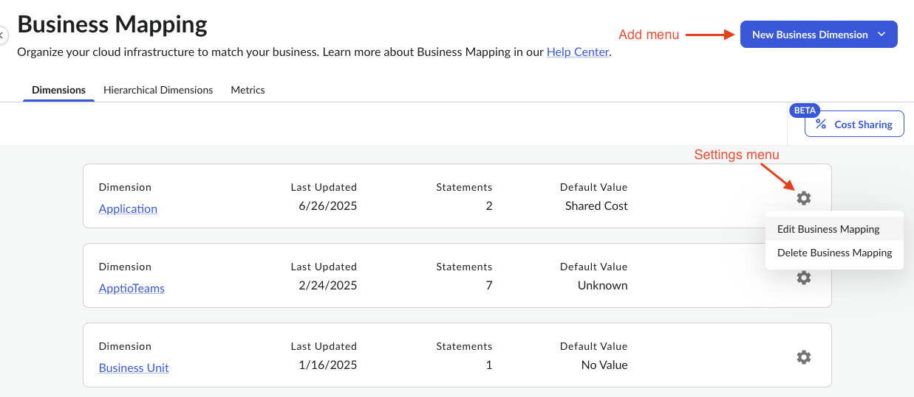

Criando novas dimensões de negócios

Para criar uma nova dimensão de negócios:

1. Na página “Mapeamento de Negócios”, selecione “Nova Dimensão de Negócios” no menu “Adicionar”.
2. Na janela “Adicionar um mapeamento de negócios ”, insira o nome da dimensão e o valor padrão > Selecione “Adicionar um mapeamento de negócios ”.

   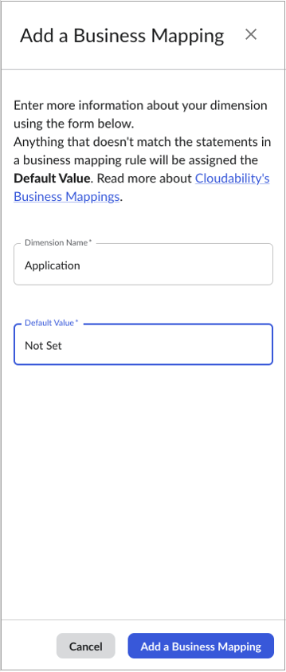
3. Na página “Mapeamento de negócios”, selecione o ícone de configurações (engrenagem) ao lado da dimensão recém-criada > Selecione “Editar mapeamento de negócios”.
4. Clique em Adicionar uma declaração.
5. Dê um nome à expressão > Selecione “ID da conta” como dimensão e “igual a” como operador. Escolha um valor no menu suspenso “Selecionar valor” > Clique em “Salvar ”.

   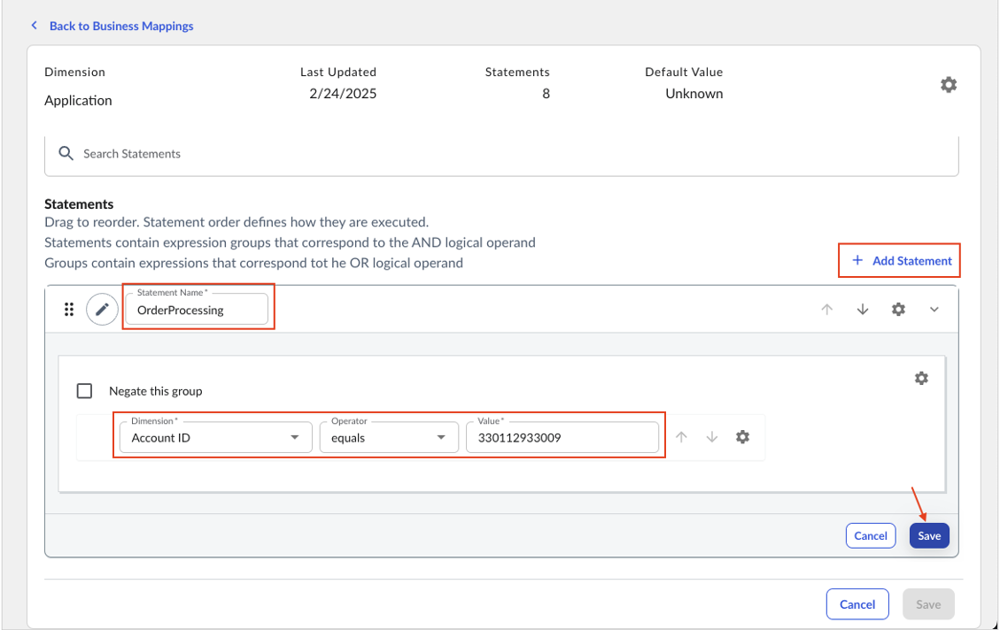
6. Você também pode preencher a Dimensão de Negócios usando a funcionalidade de importação/exportação. Basta anexar o arquivo JSON com a estrutura definida do objeto “Business Dimension”, conforme descrito aqui [: Endpoint de mapeamentos de negócios](../api-v3/business_mappings_endpoint.html)

   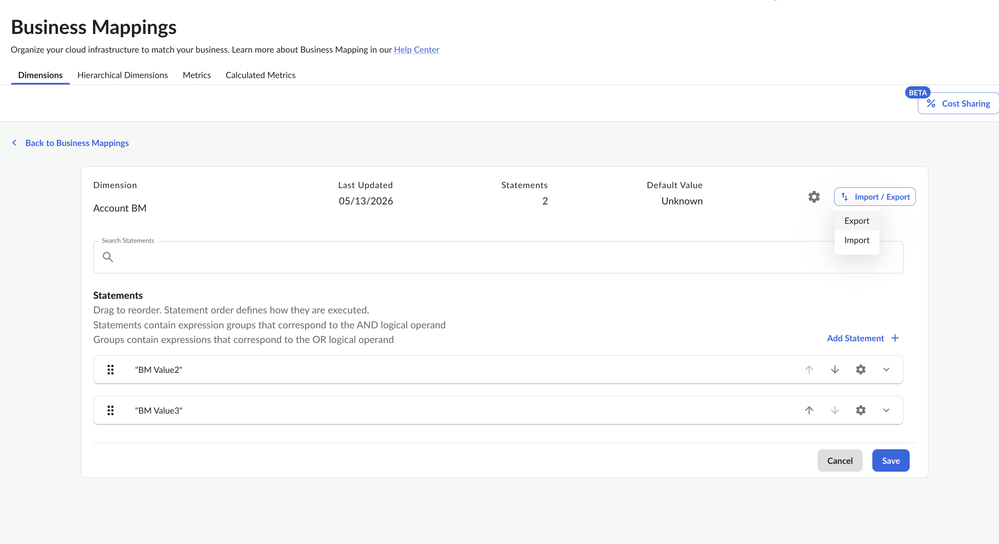

Editar ou criar uma dimensão de negócios

A maior parte das suas interações nesta página será relacionada ao gerenciamento de declarações de métricas de negócios para as dimensões da sua empresa. Isso significa adicionar, editar ou excluir instruções que constituem a espinha dorsal de qualquer mapeamento. Abordaremos os principais elementos de qualquer declaração nas seções a seguir.

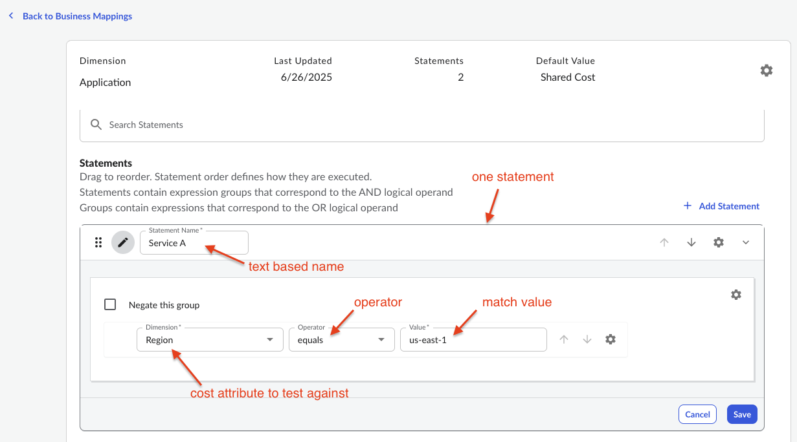

Nota:

Quando um mapeamento de negócios faz referência a outro mapeamento, a atualização da dimensão referenciada também atualizará o campo “Última atualização” da dimensão dependente. Por exemplo, se o Mapeamento de Negócios B fizer referência ao Mapeamento de Negócios A, qualquer atualização feita no Mapeamento A atualizará automaticamente o carimbo de data e hora da “Última atualização” tanto para o Mapeamento de Negócios A quanto para o Mapeamento de Negócios B.

Opções para o nome

Conforme mencionado anteriormente, o nome que você fornecer ao criar qualquer expressão se tornará o valor da Dimensão de Negócios caso o componente de correspondência retorne “true”. Você tem duas opções para o próprio nome. Você poderia simplesmente inserir uma string estática.

Você também pode criar um Nome de dimensão dinâmica selecionando o ícone do lápis ao lado do nome.

Em seguida, você receberá uma lista de dimensões para escolher, que inclui tags e muitos outros itens conhecidos. O objetivo dessa funcionalidade é que, em uma correspondência, a Dimensão de Negócios possa assumir o valor de qualquer atributo do próprio item de custo. Um bom exemplo de como usar esse aspecto dinâmico seria algo como : “Se a Tag A existir, então a Dimensão de Negócios deve assumir o valor da Tag A ”. A próxima instrução provavelmente trataria do que fazer caso a Tag A não exista.

O que isso significa

Em vez de atribuir um valor fixo a uma dimensão de negócios, é possível atribuir o valor real de uma tag ou atributo do próprio recurso. Isso torna os mapeamentos flexíveis e escaláveis.

**Atribuição estática (valor fixo):**

```
IF tag:Department EQUALS "Engineering"
THEN Department = "Engineering"  ← Fixed value
```

**Atribuição dinâmica (usar o valor da tag):**

```
IF tag:Department IS NOT EMPTY
THEN Department = [value of tag:Department]  ← Dynamic value
```

**Exemplo completo: Mapeamento de departamentos**

Digamos que você tenha recursos com tags de departamentos diferentes:

- Recurso 1: tag:Departamento = "Engenharia"
- Recurso 2: tag:Departamento = "Marketing"
- Recurso 3: tag:Departamento = "Vendas"
- Recurso 4: Sem tag de departamento

**Abordagem tradicional (várias regras estáticas):**

```
Rule 1:
  IF tag:Department EQUALS "Engineering"
  THEN Department = "Engineering"

Rule 2:
  IF tag:Department EQUALS "Marketing"
  THEN Department = "Marketing"

Rule 3:
  IF tag:Department EQUALS "Sales"
  THEN Department = "Sales"

Rule 4:
  IF tag:Department IS EMPTY
  THEN Department = "Unallocated"
```

**Abordagem dinâmica (regra única):**

```
Rule 1 (Priority 1):
  IF tag:Department IS NOT EMPTY
  THEN Department = [value of tag:Department]
  
Rule 2 (Priority 2):
  IF tag:Department IS EMPTY
  THEN Department = "Unallocated"
```

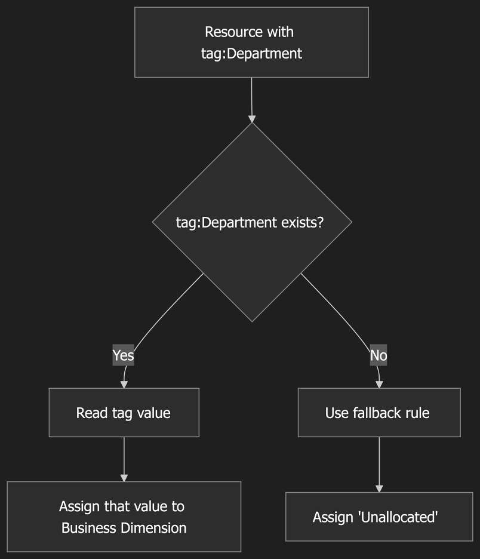

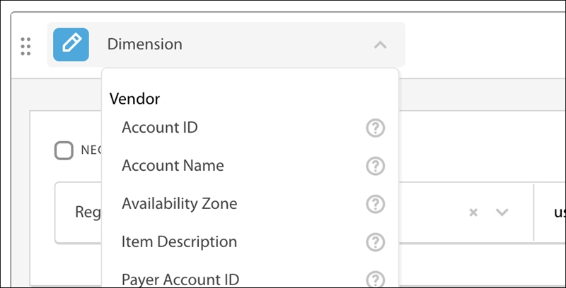

Operadores

Ao usar a interface de usuário do Business Mapping, você terá à disposição uma ampla variedade de operadores para testar a lógica da sua instrução. A seguir, apresentamos alguns exemplos que incluem operadores como “maior que ”, que podem ser úteis para comparar elementos como datas. Escolha um operador que torne sua expressão o mais direta possível. Ao usar nossa API, você terá algumas opções adicionais, incluindo expressões regulares.

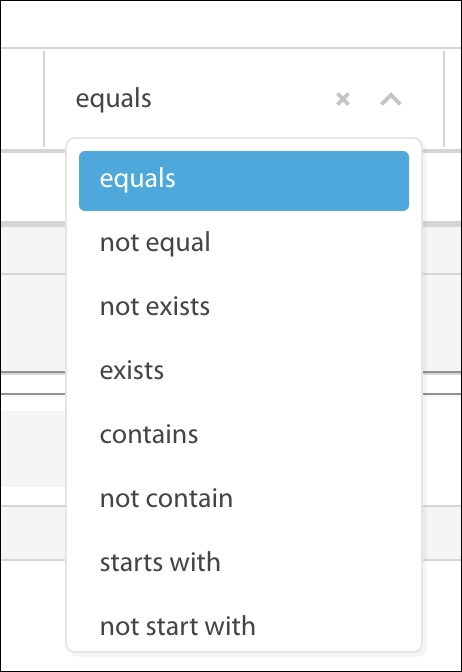

Lógica booleana

Dentro de uma instrução, é possível agrupar expressões usando operadores OR e combiná-las com operadores AND para obter o resultado lógico exato que atenda às suas regras de negócios. Segue abaixo um exemplo bem básico:

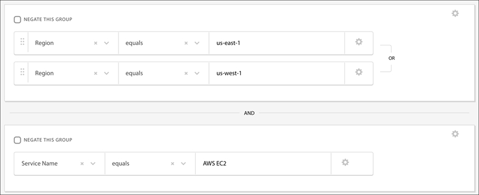

**Operadores booleanos**

Os mapeamentos de negócios utilizam dois operadores booleanos principais:

- **E** : Todas as afirmações devem ser VERDADEIRAS
- **OU** : Pelo menos uma das afirmações deve ser VERDADEIRA

**Fluxo de execução**

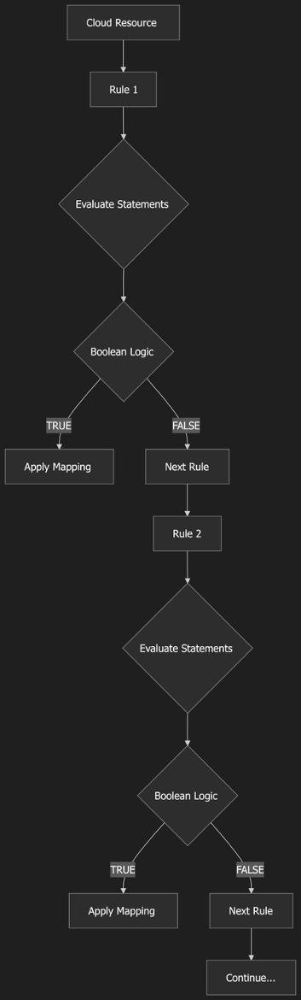

**Execução da lógica AND**

Todas as expressões devem resultar em VERDADEIRO:

```
Rule: "Production Engineering Resources"

Statement 1: tag:Department EQUALS "Engineering"
AND
Statement 2: tag:Environment EQUALS "Production"
AND
Statement 3: region STARTS WITH "us-"

Execution:
┌─────────────────────────────────────────────┐
│ Resource: EC2 Instance                      │
│ - tag:Department = "Engineering"  → TRUE    │
│ - tag:Environment = "Production"  → TRUE    │
│ - region = "us-east-1"            → TRUE    │
│                                             │
│ Result: TRUE AND TRUE AND TRUE = TRUE       │
│ Action: Apply mapping                       │
└─────────────────────────────────────────────┘

┌─────────────────────────────────────────────┐
│ Resource: RDS Instance                      │
│ - tag:Department = "Engineering"  → TRUE    │
│ - tag:Environment = "Development" → FALSE   │
│ - region = "us-west-2"            → TRUE    │
│                                             │
│ Result: TRUE AND FALSE AND TRUE = FALSE     │
│ Action: Skip to next rule                   │
└─────────────────────────────────────────────┘
```

**Execução da lógica OR**

Pelo menos uma expressão deve resultar em TRUE

```
Rule: "Engineering or DevOps Resources"

Statement 1: tag:Department EQUALS "Engineering"
OR
Statement 2: tag:Department EQUALS "DevOps"
OR
Statement 3: tag:Team EQUALS "Platform"

Execution:
┌─────────────────────────────────────────────┐
│ Resource: Lambda Function                   │
│ - tag:Department = "Marketing"    → FALSE   │
│ - tag:Department = "DevOps"       → TRUE    │
│ - tag:Team = "Sales"              → FALSE   │
│                                             │
│ Result: FALSE OR TRUE OR FALSE = TRUE       │
│ Action: Apply mapping                       │
└─────────────────────────────────────────────┘

┌─────────────────────────────────────────────┐
│ Resource: S3 Bucket                         │
│ - tag:Department = "Marketing"    → FALSE   │
│ - tag:Department = "Sales"        → FALSE   │
│ - tag:Team = "Support"            → FALSE   │
│                                             │
│ Result: FALSE OR FALSE OR FALSE = FALSE     │
│ Action: Skip to next rule                   │
└─────────────────────────────────────────────┘
```

**Lógica booleana mista (AND + OR)**

Regra: “Recursos de produção para engenharia ou DevOps" ”

```
(Statement 1: tag:Department EQUALS "Engineering"
 OR
 Statement 2: tag:Department EQUALS "DevOps")
AND
Statement 3: tag:Environment EQUALS "Production"
```

Ordem de execução:

1. Avalie primeiro o grupo “OU”: (Afirmação 1 OU Afirmação 2)

2. Em seguida, avalie a operação “E” com a Afirmação 3

Exemplo 1:

```
┌─────────────────────────────────────────────┐
│ Resource: EC2 Instance                      │
│ Step 1: Evaluate OR group                   │
│   - tag:Department = "Engineering" → TRUE   │
│   - tag:Department = "DevOps"      → FALSE  │
│   - Result: TRUE OR FALSE = TRUE            │
│                                             │
│ Step 2: Evaluate AND                        │
│   - OR Result = TRUE                        │
│   - tag:Environment = "Production" → TRUE   │
│   - Result: TRUE AND TRUE = TRUE            │
│                                             │
│ Final Result: TRUE                          │
│ Action: Apply mapping                       │
└─────────────────────────────────────────────┘
```

Exemplo 2:

```
┌─────────────────────────────────────────────┐
│ Resource: RDS Instance                      │
│ Step 1: Evaluate OR group                   │
│   - tag:Department = "Marketing"   → FALSE  │
│   - tag:Department = "DevOps"      → FALSE  │
│   - Result: FALSE OR FALSE = FALSE          │
│                                             │
│ Step 2: Evaluate AND                        │
│   - OR Result = FALSE                       │
│   - tag:Environment = "Production" → TRUE   │
│   - Result: FALSE AND TRUE = FALSE          │
│                                             │
│ Final Result: FALSE                         │
│ Action: Skip to next rule                   │
└─────────────────────────────────────────────┘
```

## **Ordem de execução e avaliação em curto-circuito**

**Lógica AND - Curto-circuito:**

Afirmação 1 E Afirmação 2 E Afirmação 3

Se a afirmação 1 for FALSA

→ Interromper a avaliação (o resultado já é FALSE)

→ Não avalie a Afirmação 2 nem a 3

→ Passar para a próxima regra

**Lógica OR - Curto-circuito:**

Afirmação 1 OU Afirmação 2 OU Afirmação 3

Se a expressão 1 for VERDADEIRA

→ Interromper a avaliação (o resultado já é TRUE)

→ Não avalie a Afirmação 2 nem a 3

→ Aplicar mapeamento

Como posso usar a API para extrair dados/atualizar BMs?

Você pode usar as APIs d Cloudability para extrair e atualizar mapeamentos de negócios (BMs). A documentação da API para extrair ou atualizar os Mapeamentos de Negócios está disponível no tópico [Endpoint de Mapeamentos de Negócios](../api-v3/business_mappings_endpoint.html).

Como posso criar uma regra de mapeamento de negócios com várias instruções e expressões?

Cloudability permite que você crie suas próprias dimensões personalizadas usando o Business Mappings, que é um mecanismo baseado em regras, no qual uma regra pode conter mais de uma instrução. Dentro de uma instrução, é possível agrupar expressões usando operadores OR e combiná-las com operadores AND para obter o resultado lógico exato que atenda às suas regras de negócios.

Os valores de mais de uma expressão na instrução podem retornar True; o valor final avaliado dependerá do operador AND/OR. Por exemplo: há duas expressões: Exp1 e Exp2

Se Exp1 = True e Exp2 = True, então Exp1 E Exp2 retornariam True, e Exp1 OU Exp2 retornariam True

Se Exp1 = True e Exp2 = False, ou vice-versa, então Exp1 E Exp2 retornariam False, e Exp1 OU Exp2 retornariam True

Se Exp1 = False e Exp2 = False, então Exp1 E Exp2 retornariam False, e Exp1 OU Exp2 retornariam False

Como posso ler/acessar a lógica dos BMs?

Acesse Organizar > Mapeamentos de negócios. A lista de mapeamentos de negócios será exibida. Clique no ícone de engrenagem para editar os mapeamentos de negócios. Isso exibe as instruções utilizadas na lógica dos Mapeamentos de Negócios. Além disso, você pode usar o ícone da seta para baixo para visualizar a expressão da regra de instrução.

Perguntas frequentes sobre dimensões e métricas

Como as diversas métricas de custo se alinham aos diferentes casos de uso?

Cloudability suporta as seguintes cinco métricas de custo comuns:

Custo (de tabela), Custo (total), Custo (ajustado), Custo (amortizado) e Custo (ajustado e amortizado).

O caso de uso mais adequado para cada métrica de custo depende dos requisitos específicos da empresa. É importante analisar cuidadosamente as necessidades e os objetivos da empresa ao selecionar a métrica adequada.

É possível impedir que os usuários vejam determinadas dimensões ou métricas no “ Cloudability ”?

Atualmente, não é possível impedir que os usuários vejam determinadas dimensões ou métricas no Cloudability. Por padrão, todos os usuários poderiam visualizar todas as dimensões ou métricas no Cloudability.

- **[Organize os dados utilizando mapeamentos hierárquicos de negócios](../admin/hierarchical-business-mapping.html)**
- **[Métricas de negócios no Cloudability](../admin/business-metrics.html)**

**Tópico principal:** [Organize seus gastos com nuvem](../admin/tag-data.html)
