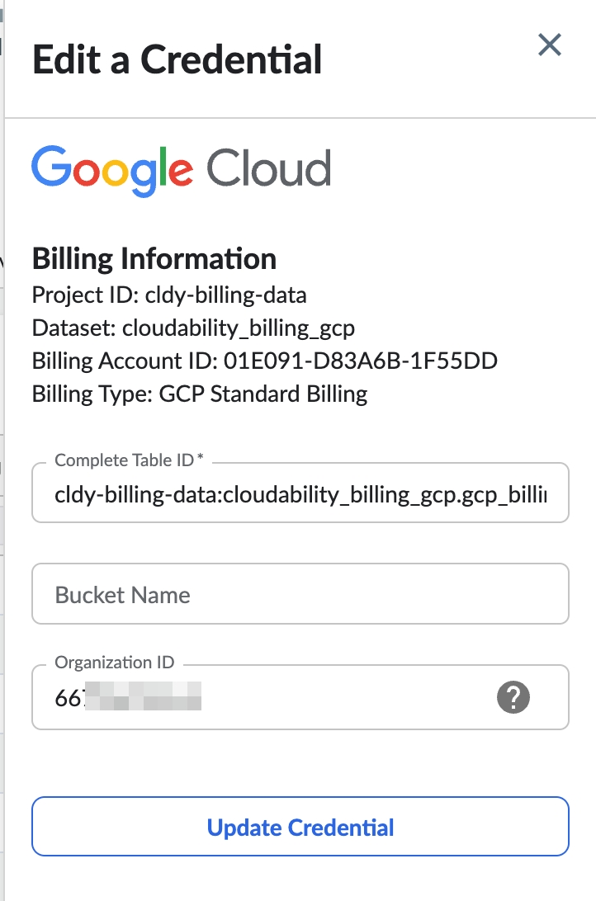
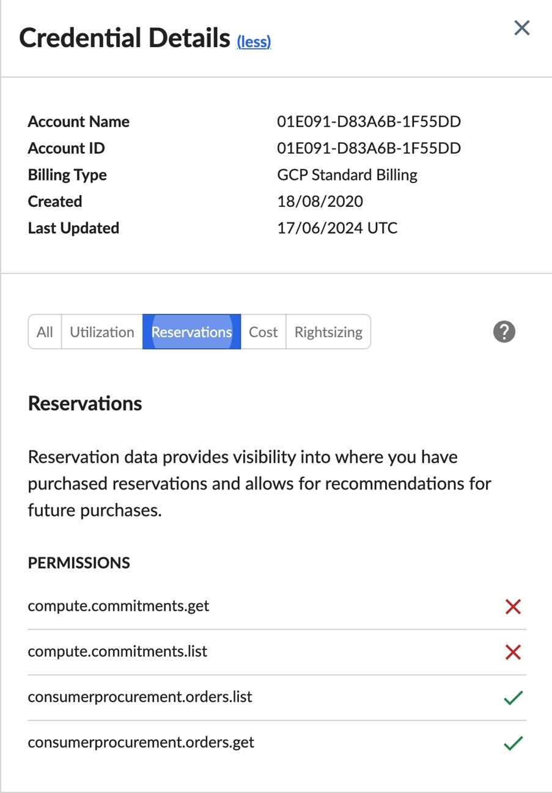

# Configurando a carteira de compromissos para GCP

A carteira de compromissos para compromissos baseados em gastos do GCP requer duas permissões adicionais para ser preenchida, além das credenciais básicas.

Antes de começar

Você precisa credenciar sua conta antes de seguir as etapas para configurar o Commitment Portfolio. Consulte [Connect Google Cloud](connect-google-cloud.html) para credenciar sua conta.

Permissões adicionais para o portfólio de compromissos

Siga as etapas abaixo para configurar credenciais para permissões adicionais, conforme mencionado acima.

1. Faça login em Cloudability e, em seguida, acesse Configurações > Credenciais de fornecedor > GCP.
2. Encontre uma conta de cobrança que tenha adquirido CUDs baseados em gasto d GCP.
3. Passe o mouse sobre o ícone do menu de reticências e clique em  para selecionar Edit a Credential.

   
4. Adicione o ID de sua organização.
5. Clique em Update Credential (Atualizar credencial ).

Para obter mais informações sobre recursos organizacionais, consulte [Criação e gerenciamento de recursos organizacionais](https://cloud.google.com/resource-manager/docs/creating-managing-organization "(Abre em uma nova guia ou janela)").

Quando o ajuste no credenciamento estiver concluído, as novas permissões a seguir serão exibidas na seção Reserva da conta de faturamento do Master-Payer:

- consumerprocurement.orders.list

- consumerprocurement.orders.get

Como parte do processo de credenciamento, a próxima etapa é criar uma nova função no âmbito de uma organizaçã GCP. Aplique isso no escopo da conta de faturamento junto com a função existente no escopo do projeto com as permissões da tabela BQ para um credenciamento bem-sucedido.

**Tópico principal:** [Conectar Google Cloud](../admin/connect-google-cloud-premium.html)
