# Conectar Google Cloud

**Visão geral**

Este guia orienta você pelo processo de conexão do seu Google Cloud Platform a IBM Cloudability. Cloudability suportes

- GCP Faturamento padrão

- GCP Faturamento detalhado.

Depois de conectado, você terá acesso aos recursos do FinOps dentro do Cloudability.

Observação: Para garantir total compatibilidade e suporte, siga as etapas de conexão conforme descrito. Não são suportadas configurações personalizadas. Se tiver alguma dúvida, entre em contato com **o suporte** do IBM.

**Pré-requisitos**

- Cloudability usa o IAM para criar e gerenciar funções personalizadas

- É necessário ter permissões de IAM no [GCP para criar uma função personalizada](https://docs.cloud.google.com/iam/docs/creating-custom-roles "(Abre em uma nova guia ou janela)")

- Cloudability utiliza essas funções personalizadas com permissões específicas para consultar dados de faturamento, compromissos e preços.

  - CloudabilityRole\_Billing – para conta de cobrança
  - CloudabilityRole\_Buckets - para acesso ao bucket do GCS
  - CloudabilityRole\_AdvancedFeatures – para projetos

- Deve ter permissões para criar um bucket GCS dentro de GCP.

- As seguintes permissões são necessárias:

  - bigquery.tables.export (exportar dados da tabela para fora do site BigQuery )
  - storage.buckets.getIamPolicy
  - storage.buckets.get
  - storage.multipartUploads.abortar
  - storage.multipartUploads.criar
  - storage.multipartUploads.lista
  - storage.multipartUploads.listParts
  - storage.objects.create
  - storage.objects.delete
  - storage.objects.get
  - storage.objects.list
  - storage.objects.update

- Deve ser possível executar o script de shell GCP no console GCP, o que vinculará a função à conta de serviço de Cloudability ( [billing-data-service-acct@cloudability-credentials.iam.gserviceaccount.com](mailto:billing-data-service-acct@cloudability-credentials.iam.gserviceaccount.com "(Abre em uma nova guia ou janela)") ) como membro com a função personalizada no nível do projeto de faturamento

- Para poder executar com êxito nosso script no console de nuvem, o usuário do gcloud precisa ter as seguintes permissões de IAM no nível do projeto:

  - iam.roles.create
  - resourcemanager.projects.setIamPolicy
  - resourcemanager.projects.getIamPolicy

- Isso dá aos clientes controle total e visibilidade sobre todas as ações realizadas por qualquer entidade que assuma essa função em seus projetos de GCP.

- Acesso administrativo às credenciais de fornecedor do Cloudability

- Conhecimento das [organizações do programa “ GCP ”](https://docs.cloud.google.com/resource-manager/docs/creating-managing-organization "(Abre em uma nova guia ou janela)")

- Familiaridade com [o credenciamento GCP usando ações em massa.](gcp-credentialing-bulk-actions.html)

- Acesso e capacidade para habilitar a API Google Cloud Resource Manager

**Introdução:**

O processo de credenciamento da Cloudability ( GCP ) requer duas etapas principais:

- GCP Credenciamento de conta de faturamento

- GCP Credenciamento de projetos (para recursos avançados)

O processo de credenciamento da conta de cobrança da GCP envolve algumas etapas que exigirão que você execute ações nos portais GCP e Cloudability em várias fases.

Durante esse processo, o Cloudability utilizará seu ID de tabela de faturamento e gerará um script que contém comandos gcloud IAM, que deverão ser executados no console GCP.

- Verifique a seção IAM do projeto apropriado para determinar se você tem essas permissões.
- Habilite a API Google Cloud Resource Manager
- Cloudability usa a API Cloud Resource Manager d Google para testar se as permissões necessárias foram concedidas para suportar os recursos disponíveis.
- A API Cloud Resource Manager da Google oferece muitas vantagens sem nenhum custo para você. Você pode ler mais sobre o assunto em [Resource Manager](https://www.ibm.com/links?url=https%3A%2F%2Fcloud.google.com%2Fresource-manager%2F "(Abre em uma nova guia ou janela)").
- Uma lista das APIs disponibilizadas através do Resource Manager pode ser encontrada em [API do Cloud Resource Manager](https://docs.cloud.google.com/resource-manager/reference/rest "(Abre em uma nova guia ou janela)").

Observação: Cloudability depende da API projects.testIamPermissions para testar se permissões específicas foram concedidas para oferecer suporte a faturamento e recursos avançados. Para obter mais informações, consulte [o método: projects.testIamPermissions](https://www.ibm.com/links?url=https%3A%2F%2Fcloud.google.com%2Fresource-manager%2Freference%2Frest%2Fv1%2Fprojects%2Ftestiampermissions "(Abre em uma nova guia ou janela)").

**Credenciamento** **da conta de faturamento do GCP**

**Etapa 1 - Portal GCP – Habilite a exportação BigQuery e o ID da tabela**

- No Console do GCP, **em** APIs e serviços > Biblioteca, procure por **“API do Cloud Resource Manager ”**.
- Na página API do Cloud Resource Manager, **selecione** ATIVAR.
- Certifique-se de que a opção API ativada esteja marcada.

Trabalhando no Console Google, digite Billing (Faturamento) na barra de pesquisa e, quando os resultados forem exibidos, selecione Billing accounts (Contas de faturamento).

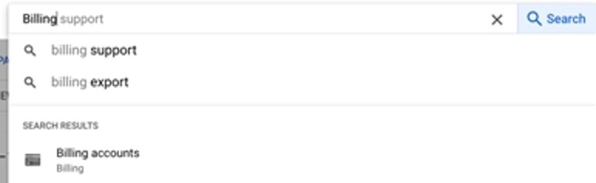

Selecione Exportação de faturamento.

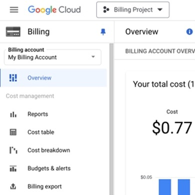

Selecione Edit Settings (com base no tipo de exportação que você está implementando).

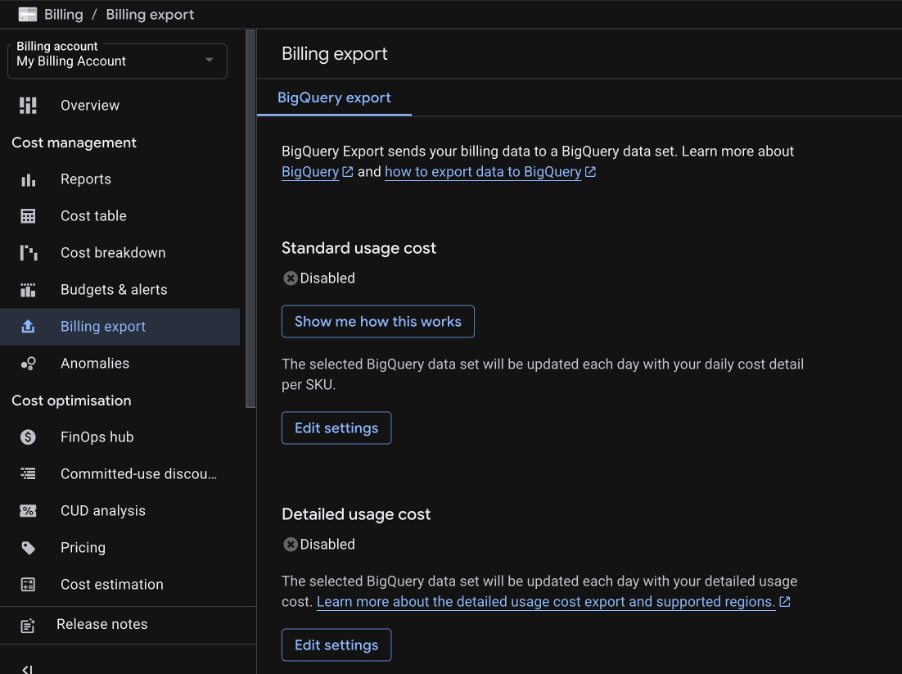

Selecione o tipo de exportação que deseja implementar – Faturamento padrão ou detalhado – clicando em Editar configurações.

Observação: recomendamos o faturamento detalhado, pois os dados são enriquecidos com detalhes adicionais e fornecem relatórios muito mais granulares.

Selecione o projeto onde seus dados de cobrança (provavelmente seu projeto de cobrança) serão mantidos e, em seguida, clique em Conjunto de dados e selecione Criar um novo conjunto de dados.

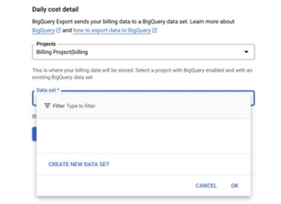

Adicione um ID de conjunto de dados e clique em Create Data Set.

Observação: Recomendamos selecionar uma localização multirregional (UE ou EUA) para o seu conjunto de dados, para que os dados de cobrança sejam adicionados retroativamente para o mês atual e o mês anterior no GCP. Consulte [“Exportar dados de faturamento para o BigQuery ”](https://docs.cloud.google.com/billing/docs/how-to/export-data-bigquery#dataset_locations_supported_for_use_with_data "(Abre em uma nova guia ou janela)") para obter detalhes e conhecer as limitações

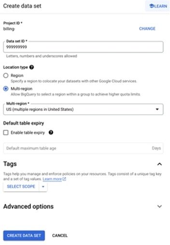

Selecione Salvar para concluir o processo.

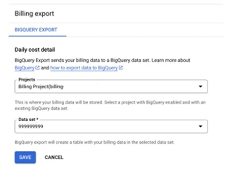

Observação: ao ativar a **BigQuery** exportação para **uma** conta de cobrança. Uma tabela é criada automaticamente para você no conjunto de dados especificado. Esta tabela é conhecida como tabela de faturamento

- GCP O nome da tabela de custos de uso padrão deve estar neste formato: **gcp\_billing\_export\_v1\_<BILLING\_ACCOUNT\_ID>**.

- GCP O nome da tabela detalhada de custos de uso deve estar neste formato **gcp\_billing\_export\_resource\_v1\_<BILLING\_ACCOUNT\_ID>**.

O uso padrão/tabela detalhada de custos de uso deve ter os detalhes de partição abaixo, conforme mencionado na imagem abaixo.

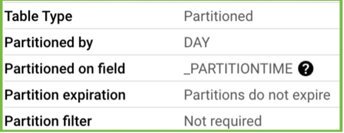

Observação: Tutorial do Google : [Exportar dados de faturamento para o BigQuery](https://www.ibm.com/links?url=https%3A%2F%2Fcloud.google.com%2Fbilling%2Fdocs%2Fhow-to%2Fexport-data-bigquery "(Abre em uma nova guia ou janela)").

Depois de habilitar a exportação BigQuery, levará algumas horas para que a tabela de faturamento seja criada. Em seguida, você poderá localizar o ID da tabela.

Você pode encontrar o ID da tabela de faturamento navegando até o projeto que contém a exportação BigQuery dos seus dados de faturamento, **em Informações da tabela > ID da tabela**.

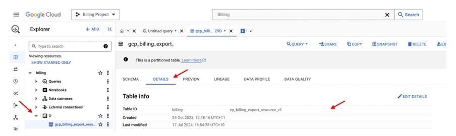

Você deve especificar um projeto e um conjunto de dados para os quais os dados de faturamento serão exportados ao habilitar a exportação do **BigQuery** para **uma conta de** faturamento. Uma tabela é criada automaticamente para você no conjunto de dados especificado. Esta tabela é conhecida como tabela de faturamento e **a conta** de serviço d Cloudability deve ser capaz de ler os dados desta tabela.

**Crie um bucket de armazenamento**

É necessário um bucket de armazenamento para copiar os dados da exportação da tabela BQ, para que o site Cloudability recupere esses dados.

Trabalhando no Console Google; digite Cloud Storage na barra de pesquisa e selecione-o quando ele for exibido.

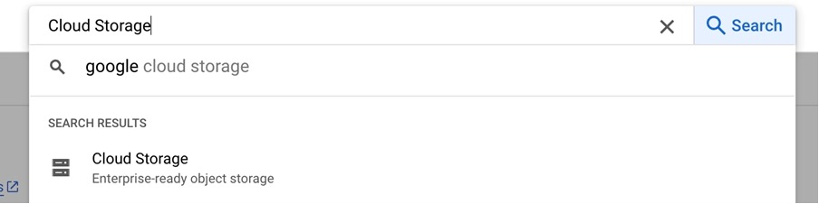

Clique em Create (Criar) para criar um Bucket.

Digite um nome para seu bucket de armazenamento (por exemplo: cloudability-export e clique em Create).

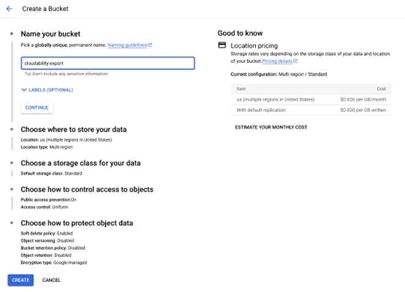

Quando solicitado, mantenha os padrões e clique em Confirm (Confirmar).

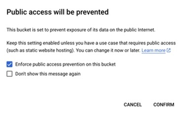

O compartimento será criado.

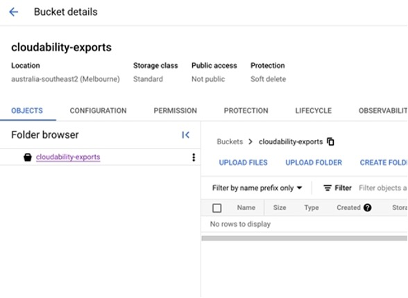

**Etapa 2 - Cloudability –** **Adicione os detalhes das credenciais em Cloudability**

**Faturamento padrão com GCS**

Observação: para o faturamento padrão, recomendamos o uso de um bucket de armazenamento e não o streaming via API

Depois de reunir as informações listadas acima, você pode inseri-las em Cloudability para atualizar sua credencial GCP.

Cloudability usará essas informações para gerar um script Shell. Quando o script é executado a partir do seu Cloud Shell no Portal GCP, ele cria e concede direitos para Cloudability por meio da função personalizada, a fim de fornecer acesso à conta de armazenamento.

- Em Cloudability, navegue até
- **Configurações** > **Credenciais do fornecedor** > **Adicionar fonte de dados** > **GCP**.
- Clique em Avançar
- Selecione “ GCP ” ( **Adicionar** conta de e-mail) — o painel “Add GCP Account” (Adicionar conta de e-mail) será aberto.

Ou

- **Configurações** > **Credenciais do fornecedor** > **Ingress** > **GCP**.
- Clique em Avançar
- Selecione Faturamento padrão **do** GCP – o painel Adicionar credencial será aberto.
- Insira o ID completo da tabela, que é uma combinação do projeto, conjunto de dados e tabela, por exemplo, project:dataset.gcp\_billing\_export\_v1\_<BILLING\_ACCOUNT\_ID>
- Insira o nome do bucket GCS
- Insira o ID da organização (recomendado, ajuda na integração rápida)

  - *GCP Os clientes podem credenciar rapidamente os projetos de forma automatizada, utilizando*[*GCP organização*](https://www.ibm.com/links?url=https%3A%2F%2Fcloud.google.com%2Fresource-manager%2Fdocs%2Fcreating-managing-organization "(Abre em uma nova guia ou janela)")*. Você precisará mover todos os projetos criados em “Sem organização” para o recurso da sua nova organização.*
  - *Para obter instruções sobre como transferir seus projetos,* [*consulte “Migração de projetos para um recurso organizacional*](https://www.ibm.com/links?url=https%3A%2F%2Fcloud.google.com%2Fresource-manager%2Fdocs%2Fproject-migration "(Abre em uma nova guia ou janela)") *”.*
- Escolha entre o redimensionamento avançado como **“Somente leitura”** ou “Automatizar ações”:
  - **Somente leitura** implica que os clientes estão permitindo permissões de custo Cloudability, custo Turbonomic e monitoramento Turbonomic.
  - A opção **“Automatizar ações”** implica que os clientes estão concedendo todas as permissões de Cloudability e Turbonomic, incluindo aquelas relacionadas a ações automatizadas, ou seja, a execução de Turbonomic e a execução de faturamento em Turbonomic.
- Clique em gerar script de configuração
- Clique em Baixar Script
- Um modelo de script shell GCP será baixado localmente – salve-o em um local seguro para a próxima etapa, pois ele precisará ser carregado no console GCP

**Faturamento padrão com BQ Streaming**

- **Configurações** > **Credenciais do fornecedor** > **Adicionar fonte de dados** > **GCP**.
- Clique em Avançar
- Selecione “ GCP ” ( **Adicionar** conta de e-mail) — o painel “Add GCP Account” (Adicionar conta de e-mail) será aberto.

Ou

- **Configurações** > **Credenciais do fornecedor** > **Ingress** > **GCP**.
- Clique em Avançar
- Selecione Faturamento padrão **do** GCP – o painel Adicionar credencial será aberto.
- Insira o ID completo da tabela, que é uma combinação do projeto, conjunto de dados e tabela, por exemplo, project:dataset.gcp\_billing\_export\_v1\_<BILLING\_ACCOUNT\_ID
- Nome do bucket (opcional - pode ser deixado em branco)
- ID da organização (recomendado, ajuda na integração rápida)

  - *GCP Os clientes podem credenciar rapidamente os projetos de forma automatizada, utilizando*[*GCP organização*](https://www.ibm.com/links?url=https%3A%2F%2Fcloud.google.com%2Fresource-manager%2Fdocs%2Fcreating-managing-organization "(Abre em uma nova guia ou janela)")*. Você precisará mover todos os projetos criados em “Sem organização” para o recurso da sua nova organização.*
  - *Para obter instruções sobre como transferir seus projetos,* [*consulte “Migração de projetos para um recurso organizacional*](https://www.ibm.com/links?url=https%3A%2F%2Fcloud.google.com%2Fresource-manager%2Fdocs%2Fproject-migration "(Abre em uma nova guia ou janela)") *”.*

- Escolha as opções avançadas de redimensionamento entre **“Somente leitura”** e “**Automatizar ações** ”:
  - **Somente leitura** implica que os clientes estão permitindo permissões de custo Cloudability, custo Turbonomic e monitoramento Turbonomic.
  - A opção **“Automatizar ações”** implica que os clientes estão concedendo todas as permissões de Cloudability e Turbonomic, incluindo aquelas relacionadas a ações automatizadas, ou seja, a execução de Turbonomic e a execução de faturamento em Turbonomic.
- Clique em gerar script de configuração
- Clique em Baixar Script
- Um modelo de script shell GCP será baixado localmente – salve-o em um local seguro para a próxima etapa, pois ele precisará ser carregado no console GCP

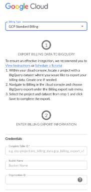

**Faturamento detalhado com GCS (recomendado)**

- **Configurações** > **Credenciais do fornecedor** > **Adicionar fonte de dados** > **GCP**.
- Clique em Avançar
- Selecione “ GCP ” ( **Adicionar** conta de e-mail) — o painel “Add GCP Account” (Adicionar conta de e-mail) será aberto.

Ou

- **Configurações** > **Credenciais do fornecedor** > **Ingress** > **GCP**.
- Clique em Avançar
- Selecione **F** aturamento detalhado do GCP – o painel Adicionar credencial será aberto.
- Insira **o ID completo da tabela,** que é uma combinação do projeto, conjunto de dados e tabela, por exemplo, project:dataset.gcp\_billing\_export\_resource\_v1\_<BILLING\_ACCOUNT\_ID
- Insira **o nome do bucket GCS**.
- Insira **a Data de Faturamento Detalhada**.

  Observação: esta data indica o mês e o ano a partir dos quais você ativou as exportações detalhadas de faturamento. Se estiver fazendo isso pela primeira vez, será o mês atual como AAAA-MM.

- **ID da organização** (recomendado, ajuda na integração rápida)

  - *GCP Os clientes podem credenciar rapidamente os projetos de forma automatizada, utilizando*[*GCP organização*](https://www.ibm.com/links?url=https%3A%2F%2Fcloud.google.com%2Fresource-manager%2Fdocs%2Fcreating-managing-organization "(Abre em uma nova guia ou janela)")*. Você precisará mover todos os projetos criados em “Sem organização” para o recurso da sua nova organização.*
  - *Para obter instruções sobre como transferir seus projetos,* [*consulte “Migração de projetos para um recurso organizacional*](https://www.ibm.com/links?url=https%3A%2F%2Fcloud.google.com%2Fresource-manager%2Fdocs%2Fproject-migration "(Abre em uma nova guia ou janela)") *”.*
- Escolha as opções avançadas de redimensionamento entre **“Somente leitura”** e “**Automatizar ações** ”:
  - **Somente leitura** implica que os clientes estão permitindo permissões de custo Cloudability, custo Turbonomic e monitoramento Turbonomic.
  - A opção **“Automatizar ações”** implica que os clientes estão concedendo todas as permissões de Cloudability e Turbonomic, incluindo aquelas relacionadas a ações automatizadas, ou seja, a execução de Turbonomic e a execução de faturamento em Turbonomic.
- Clique em gerar script de configuração
- Clique em Baixar Script
- Um modelo de script shell GCP será baixado localmente – salve-o em um local seguro para a próxima etapa, pois ele precisará ser carregado no console GCP

**Etapa 3 – Carregue e execute o script shell GCP**

O script executa duas etapas: primeiro, configura uma função personalizada no projeto de faturamento e, em seguida, adiciona a conta de serviço d Cloudability como membro do projeto, vinculando a função personalizada. Isso garante que nossa Conta de Serviço possa ler dados apenas das tabelas BigQuery dentro de um projeto de faturamento. Não acessamos dados BigQuery em projetos que não envolvem faturamento.

No caso do bucket GCS, seguimos o processo acima, exportamos os dados BigQuery para o GCS por meio de uma tarefa de exportação BigQuery e transferimos esses dados para Cloudability.

**1. Configuração de funções personalizadas**

O script começa criando funções personalizadas dentro do projeto de faturamento. O script atribui as permissões necessárias para ler os dados de faturamento à função personalizada

# Exemplo: criar função personalizada de faturamento para my-billing-project-123 # O ID do projeto de faturamento é my-billing-project-123 gcloud iam roles create CloudabilityRole\_Billing \ --project \ my-billing-project-123 \ --title \ " Cloudability Função de faturamento" \ --description \ "Permite que Cloudability acesse os dados da conta de faturamento" \ --permissions \ bigquery.jobs.create,bigquery.tables.getData \ --stage =GA

**2. Adicione a conta de serviço como membro e vincule a função personalizada**

Depois que a função personalizada é criada, o script adiciona **a conta** de serviço Cloudability como membro do projeto de faturamento e vincula a função personalizada a ela.

# Exemplo: Adicionar a conta de serviço Cloudability como membro do my-billing- project-123 # O ID do projeto de faturamento é my-billing-project-123 gcloud projects add-iam-policy-binding my-billing-project-123 \ --member serviceAccount:billing-data-service-acct@cloudability- credentials.iam.gserviceaccount.com \ --role 'projects/my-billing-project- 123/roles/CloudabilityRole\_Billing '

**3. Balde GCS**

Se você optar por um faturamento padrão d GCP com bucket GCS ou um faturamento detalhado d GCP, um bucket GCS GCP deve ser configurado. Cloudability exportará os dados temporariamente para este bucket GCS a partir da tabela configurada GCP BigQuery para importar esses dados para Cloudability. Assim que a ingestão de dados estiver concluída, o Cloudability excluirá os dados do bucket.

**Observação:** os mesmos IDs de conta de pagador GCP não podem ser usados tanto na faturação padrão quanto na detalhada na mesma instância.

**Execute o script**

Siga as etapas abaixo para executar o script pelo site Cloud Shell no console de nuvem. Não importa em que parte do site Cloud Shell você executa o script.

- Ative o Cloud Shell, selecione o ícone e **selec** ione Upload file. Selecione o script baixado no explorador de arquivos e confirme.
- chmod +x <nome do script> para tornar o script executável
- Em seguida, execute o script em seu site Cloud Shell :

`./ script-name`

Observação: nos comandos abaixo, substitua script-name pelo nome completo e extensão do script real.

- Verifique se há algum erro. Por exemplo,

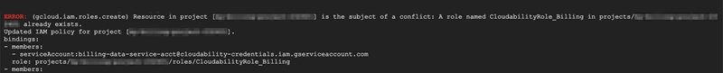

- Se o script for bem-sucedido, você verá uma saída semelhante à seguinte em seu site Cloud Shell :

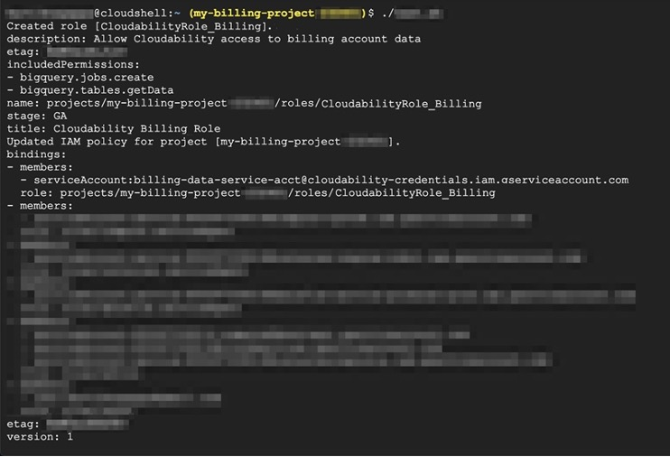

**Etapa 4 – Cloudability Verificar credenciais**

- Selecione Verificar credenciais.
- Selecione o ícone de atualização para atualizar o status.

A marca de seleção verde indica que essa conta de cobrança foi credenciada com sucesso.

Observação: seus projetos não serão visíveis imediatamente – isso levará até 24 horas até que todos apareçam em Cloudability.

Você adicionou com sucesso sua conta de cobrança ao Cloudability. Nós ingerimos dados em intervalos regulares e seus dados de faturamento estarão disponíveis a partir do próximo ciclo de ingestão. Na próxima ingestão, também enumeraremos os projetos associados a essa conta de faturamento.

Por fim, se sua organização tiver contas de cobrança adicionais do GCP que você gostaria de adicionar, repita esse processo para cada uma dessas contas de cobrança.

Observação: ao configurar suas contas do GCP, desative todas as restrições de domínio aplicadas. Você pode ativá-lo assim que o processo de credenciamento for concluído.

Após a conclusão desse processo, em poucas horas,

- Cloudability passará a exibir seus dados de cobrança e as etiquetas “ GCP ” no site Cloudability.
- Os dados de preços de varejo também serão importados. Para habilitar a precificação personalizada, consulte [**Configurando o suporte a preços personalizados para GCP**](https://www.ibm.com/docs/en/SSSVH06/cloudability/product/gcp-rightsizing-custom-pricing-support.html "(Abre em uma nova guia ou janela)")
- Cloudability também exibirá os projetos.

Como próximo passo, você precisará configurar as credenciais dos projetos do GCP.

**GCP Credenciamento de projetos (recursos avançados)**

O objetivo desta seção é ajudá-lo a percorrer o processo de credenciamento dos seus projetos para ativar os recursos avançados do Cloudability. Se sua organização tiver vários projetos do GCP, esse processo deverá ser repetido para cada projeto para o qual você deseja habilitar os Recursos Avançados.

Antes de começar, certifique-se de que cumpriu todos os pré-requisitos

Para credenciar seu projeto:

- Adicione uma nova credencial de projeto, conforme descrito em Configurar credenciais em nível de projeto.
- Execute o script, conforme descrito [na seção “Executar o script](https://www.ibm.com/docs/en/cloudability-commercial/cloudability-premium/saas?topic=cloudability-connect-google-cloud#/Run "(Abre em uma nova guia ou janela)") ”.
- Familiarize-se com [o credenciamento GCP usando ações em massa.](gcp-credentialing-bulk-actions.html)

**Adicionar uma nova credencial de projeto**

Para habilitar os Recursos Avançados para um projeto do GCP :

- Navegue **até Credenciais do** fornecedor e selecione a guia **GCP**
- Selecione **o** ícone Editar para abrir o painel Editar uma credencial.
- - Se um ID de organizaçã GCP e tiver sido adicionado no nível da conta de cobrança, a escolha entre **“Somente leitura”** e “**Ações automatizadas** ” no nível do projeto seguirá a seleção feita no nível superior
  - Se um ID de organizaçã GCP e não tiver sido adicionado no nível da conta de cobrança, a opção de **escolher** entre “Somente leitura” e **“Ações automatizadas”** no nível do projeto estará disponível nos projetos individuais.

  Selecione Atualizar credencial.
- **Sel** ecione Baixar Script.
- Se o seu navegador exibir um aviso, **selec** ione Manter.

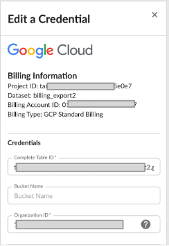

Execute o script

Para obter mais informações, consulte a seção Executar o script

**Como confirmar o sucesso**

Isso pode ser feito por meio de ações em massa ou manualmente.

- Verificação em massa pela interface do usuário: [GCP Credenciamento por meio de ações em massa](gcp-credentialing-bulk-actions.html)

- Verificação manual via UI:

- **Sel** ecione Verificar credenciais em cada projeto.

- **Sel** ecione Detalhes para verificar se o projeto tem as permissões necessárias para os Recursos Avançados.

**Atualização dos clientes existentes do Cloudability para o Cloudability Premium**

Após a atualização para Cloudability Premium, as credenciais existentes em Cloudability continuarão a funcionar em Cloudability, mas não em Turbonomic. Para que Cloudability e Turbonomic funcionem em conjunto, os clientes precisariam revalidar suas contas. Isso ocorre porque são necessárias mais permissões para que eles funcionem sem problemas

1. Em Cloudability, navegue até **Configurações > Credenciais do fornecedor > GCP.**
2. Selecione uma conta existente e clique nas elipses.
3. Selecione o ícone de lápis para abrir Editar uma credencial.
4. Insira **a ID da organização** (opcional): Isso ajuda a automatizar as credenciais no nível da conta de faturamento.
5. Escolha as opções avançadas de redimensionamento entre **“Somente leitura”** e “**Automatizar ações** ”:
   - **Somente leitura** implica que os clientes estão permitindo permissões de custo Cloudability, custo Turbonomic e monitoramento Turbonomic.
   - A opção “Automatizar ações” implica que os clientes estão concedendo todas as permissões de Cloudability e Turbonomic, incluindo aquelas relacionadas a ações automatizadas, ou seja, a execução de Turbonomic e a execução de faturamento em Turbonomic.
6. Faça o download do modelo.
7. Atualize as permissões executando o script em um consol GCP.
8. Verifique novamente a conta em Cloudability UI.
9. A verificação bem-sucedida será indicada com um tique verde.

O status de Automate Actions (Automatizar ações) é exibido como abaixo:

- Seria exibido como **DESLIGADO** se **a** opção “Ajuste avançado” estivesse selecionada **como “Somente leitura** ”.
- Isso seria exibido como **"Ativado"** se **a** opção "Ajuste avançado" estivesse selecionada como " **Automatizar ações** ".

**Observação:** a função “Automatizar ações” apenas exibe o status do modelo selecionado para download e ainda não exibe o status “ Turbonomic ”.

- Se a credenciação automatizada for selecionada usando um ID de organização d GCP

  - Automatizar ações: **ON/OFF** seguirá a seleção com base na conta de faturamento GCP.
    - Se a conta de cobrança do GCP estiver configurada para **“Automatizar ações” (ativada)**, todos os projetos do GCP ficarão **ativados** para as contas da organização GCP selecionada.
    - Se uma conta de faturamento GCP estiver definida como **Somente leitura (DESATIVADA)**, todos os projetos GCP estarão **DESATIVADOS** para as contas na organização GCP selecionada.
  - GCP O status dos projetos não pode ser alterado em contas vinculadas individuais quando se opta pela Credenciação Automatizada por meio do ID da Organização.
- Se a opção Credenciamento automatizado não for selecionada usando a ID da organização.

  - Tanto as contas de faturamento do GCP quanto os projetos podem ter status **ON/OFF** diferentes em Ações automatizadas.
  - O status **ON/OFF** pode ser alterado individualmente, sem qualquer dependência entre contas de cobranç GCP es e projetos.

Ao mudar do modo “Advanced Rightsizing” para o modo “Somente leitura”, é exibida uma notificação pop-up solicitando confirmação.

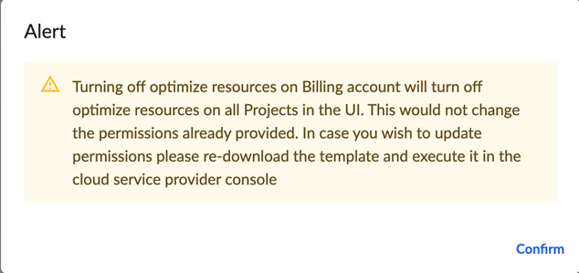

**Exibição das permissões d Turbonomic**

Existem permissões adicionais Turbonomic que são adicionadas às permissões básicas (Dados de cobrança), avançadas (Dados de utilização) e Otimizar recursos (executar ações), que estão documentadas nos documentos da Central de Ajuda. Depois que sua conta for verificada, a lista de permissões poderá ser visualizada selecionando a opção **Detalhes** em cada conta GCP listada em Cloudability.

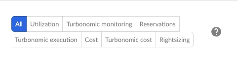

Se os clientes existentes não credenciarem novamente suas contas, então:

- Em Cloudability, a ingestão de dados de faturamento GCP continuará.
- As ações automatizadas serão marcadas como **DESLIGADAS**.
- Na guia " **Detalhes** ", todas **as permissões do " Turbonomic "** aparecem com uma marca "x" VERMELHA.

Se os clientes existentes credenciarem novamente suas contas em Cloudability usando o script powershell com permissões **de somente leitura** e as contas forem verificadas:

- As ações automatizadas serão exibidas como **DESLIGADAS.**
- Na guia Detalhes, as permissões relacionadas ao Turbonomic aparecerão com uma marca de seleção verde.
- Turbonomic começaria a funcionar com base em permissões **somente leitura**.

Depois que as novas permissões forem ativadas com **o Automate Actions** no console do GCP e a(s) conta(s) for(em) verificada(s):

- As ações automatizadas serão marcadas como **ATIVADAS**.
- Na guia Details (Detalhes), todas as permissões aparecem com uma marca de seleção verde.
- Turbonomic começaria a funcionar com as permissões do Automate Actions.

Observação: A opção **Ativar/Desativar** ações automáticas é exibida na interface do usuário Credenciais do fornecedor com base na seleção feita em Alternar e baixar o modelo.

**Status de credenciais**

Cloudability A tela de credenciais do fornecedor exibe o status da conta a partir de:

- Cloudability
- Turbonomic

Depois que os modelos mais recentes forem executados, o status da conta deverá estar sincronizado entre Cloudability e Turbonomic. Para obter detalhes sobre o status da conta, consulte a seção de detalhes da conta para obter mais informações.

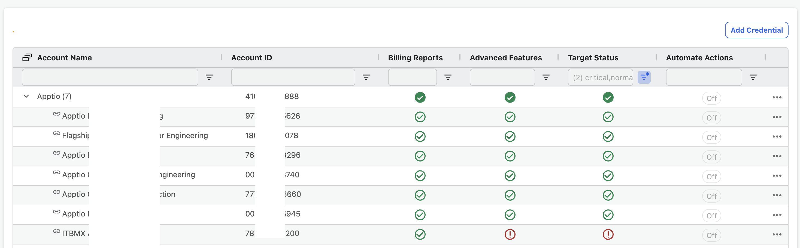

**Perguntas Frequentes**

**Os detalhes fornecidos na página Exportação de faturamento diferem daqueles na página BigQuery para sua tabela de faturamento.**

Especificamente, a ID da tabela na página BigQuery é construída usando a ID do projeto de faturamento, enquanto a página de exportação de faturamento lista o nome do projeto de faturamento. As IDs são exclusivas, enquanto os nomes não são.

Solução: Revise os pré-requisitos.

**O que fazer se o ID do projeto, o conjunto de dados ou o ID da tabela estiverem sendo truncados?**

Contexto: Você insere o ID completo da tabela de faturamento GCP e percebe que há erros. Além disso, quando você edita a credencial, percebe que a ID do projeto, o conjunto de dados ou a ID da tabela estão truncados. Você pode ter recuperado ou criado seu ID da tabela de faturamento GCP na página Exportação de faturamento.

Solução: Você deve copiar o ID completo da tabela da página BigQuery para sua tabela de faturamento.

**Como devo baixar o modelo atualizado com as permissões mais recentes, caso tenha havido uma atualização nas permissões?**

É possível baixar o modelo atualizado editando a conta de cobrança existente e baixando o modelo mais recente correspondente a ela. Após o download, siga as etapas de credenciamento indicadas após o download do modelo.

**[Script] Erro: ( gcloud.iam.roles.create ) Um recurso no projeto está em conflito.**

Contexto: Isso pode ocorrer quando você tem uma função existente em seu projeto de faturamento com role\_id CloudabilityRole\_Billing. O erro indica que o script não pode criar uma nova função com role\_id CloudabilityRole\_Billing porque já existe uma.

Solução: Ignore esse erro.

**[Script] Erro: ( gcloud.iam.roles.create ) FAILED\_PRECONDITION: Não é possível criar uma função com role\_id ( CloudabilityRole\_Billing ) quando existe uma função com esse role\_id em estado excluído.**

Contexto: Isso pode ocorrer quando você executa o script depois de excluir uma função existente do seu projeto de faturamento com role\_id CloudabilityRole\_Billing. A função pode estar em um estado excluído e o script não pode criar uma nova função com esse role\_id. Você pode visualizar o status da função (Ativado, Desativado, Excluído) no console da nuvem.

Solução: Exclua a função existente com role\_id CloudabilityRole\_Billing de seu projeto de faturamento e execute o script novamente.

**Como lidar com as restrições de domínio d GCP?**

Se você tiver restrições de domínio, poderá observar mensagens de erro. Para resolver isso, coloque Cloudability na lista de permissões para consultar os dados, adicionando o ID do cliente do espaço de trabalho GCP de Cloudability na política da organização.

O domínio é cloudability.com e o ID é C03n3dgoi

**Controles do serviço VPC**

[Obter recomendações com base em dados da GPU](https://www.ibm.com/docs/en/cloudability-commercial/cloudability-premium/saas?topic=cloudability-connect-google-cloud "(Abre em uma nova guia ou janela)")

**Pré-requisitos:**

1. Cada VM deve ter [GPUs conectadas](https://www.ibm.com/links?url=https%3A%2F%2Fcloud.google.com%2Fcompute%2Fdocs%2Fgpus%2Fcreate-vm-with-gpus "(Abre em uma nova guia ou janela)").

1. Cada VM deve ter [um driver de](https://www.ibm.com/links?url=https%3A%2F%2Fcloud.google.com%2Fcompute%2Fdocs%2Fgpus%2Finstall-drivers-gpu%23verify-driver-install "(Abre em uma nova guia ou janela)") GPU instalado.

1. Cada servidor VM deve ter o Python 3.6 ou uma versão mais recente instalada.

1. Cada usuário do ` VM ` deve ter instalados os pacotes necessários para a criação de ambientes virtuais do ` Python `.

Veja também [Configurar o agente de monitoramento GCP para dimensionamento adequado](gcp-memory-metrics.html).

- **O status da conta Cloudability e o status do destino Turbonomic não correspondem nas telas de credenciais do fornecedor? Quais poderiam ser as razões?**

  Os clientes existentes do Cloudability que estiverem atualizando para Cloudability Premium precisam revalidar suas contas para obter as permissões mais recentes do Turbonomic.

  A incompatibilidade no status da conta pode ser causada por alguns motivos:
  - A recertificação não foi feita com base nos modelos/permissões mais recentes.
  - Se a recertificação foi feita, então provavelmente foi feita usando uma versão anterior do modelo e, desde então, algumas novas permissões foram adicionadas para Cloudability Premium.
  - Se a recertificação não ajudar, entre em contato com as IBM equipes de suporte.

  **Onde posso encontrar ícones diferentes nas descrições do status das contas?**

  [Indicadores de status das credenciais de fornecedores](vendor-credentials.html)

  **Para visualizar as melhorias completas do SCUD na interface de usuário de relatórios do Cloudability para uma conta de pagador GCP, qual exportação de faturamento deve ser usada para a configuração de credenciais?**

  Recomenda-se **a exportação detalhada de faturamento** do GCP, pois ela fornece visibilidade total dos cenários de uso excessivo e uso insuficiente nos relatórios d Cloudability

- [GCP Credenciamento por meio de ações em massa](gcp-credentialing-bulk-actions.html)
- [Referência de permissões - GCP](permissions-reference-gcp.html)
- [Configurar o Agente de Monitoramento d GCP para o ajuste de recursos](gcp-memory-metrics.html)
- [Suporte para tags do tipo “ GCP ”](gcp-tags.html)
- [Configurando o suporte a preços personalizados para o GCP](../product/gcp-rightsizing-custom-pricing-support.html)
- [Configuração da carteira de compromissos para o GCP](commitment-portfolio-gcp.html)

- **[GCP Credenciamento usando ações em massa](../admin/gcp-credentialing-bulk-actions.html)**
- **[Referência de permissões - GCP](../admin/permissions-reference-gcp.html)**
- **[Configurar um agente de monitoramento d GCP s para o dimensionamento adequado](../admin/gcp-memory-metrics.html)**
- **[GCP Etiquetas e rótulos](../admin/gcp-tags.html)**
- **[Configurando o suporte a preços personalizados para GCP](../product/gcp-rightsizing-custom-pricing-support.html)**
- **[Configurando a carteira de compromissos para GCP](../admin/commitment-portfolio-gcp.html)**
