# Conecte-se ao ServiceNow CMDB

## Visão geral

A ServiceNow integração CMDB para Cloudability permite a sincronização perfeita entre o seu Banco de Dados de ServiceNow Gerenciamento de Configuração (CMDB) e IBMCloudability. Essa integração permite criar mapeamentos comerciais automatizados com Cloudability base em itens de configuração e dados organizacionais armazenados em seu ServiceNow CMDB, proporcionando recursos aprimorados de alocação de custos e governança na nuvem.

## Principais benefícios

- **Mapeamento automatizado de negócios** : crie e mantenha automaticamente mapeamentos de negócios usando Cloudability seus dados CMDB ServiceNow existentes, reduzindo o esforço de configuração manual e melhorando a precisão.
- **Centralizado Data Management** : utilize seu ServiceNow CMDB como fonte única de informações sobre a estrutura organizacional, aplicativos e centros de custo que orientam a alocação de custos da nuvem.
- **Sincronização em tempo real** : mantenha seus mapeamentos Cloudability de negócios atualizados com as alterações em seu ServiceNow CMDB por meio de processos de sincronização automatizados.
- **Governança de custos aprimorada** : melhore a visibilidade e a responsabilidade pelos custos da nuvem, alinhando os recursos da nuvem com a estrutura da sua organização, conforme definido em ServiceNow

## Pré-requisitos

Antes de instalar e configurar a ServiceNow integração CMDB, certifique-se de que cumpre os seguintes requisitos:

**ServiceNow Requisitos**

- ServiceNow instância (recomenda-se a versão Paris ou posterior)
- Privilégios de administrador ou equivalentes para instalar aplicativos da ServiceNow Loja
- Plugin CMDB ativado em sua ServiceNow instância
- CMDB devidamente configurado com itens de configuração relevantes (aplicações, serviços empresariais, centros de custos, etc.)

**Cloudability Requisitos**

- Conta IBMCloudability ativa com privilégios administrativos
- Acesso à API habilitado em sua Cloudability instância
- Credenciais válidas Cloudability da API

## Instalação

**Passo 1: Baixe na ServiceNow Loja**

1. Faça login na sua ServiceNow instância como administrador
2. Navegue até **Aplicativos do sistema** > **Todos os aplicativos disponíveis** > **Todos**
3. Pesquise por " Cloudability " na Loja ServiceNow
4. Clique em **Instalar** e siga as instruções de instalação
5. Aguarde até que a instalação seja concluída e reinicie todos os serviços necessários

**Etapa 2: Configuração pós-instalação**

1. **Configure a chave Cloudability de acesso**
   - Navegue até IntegrationHub > Conexões e credenciais > Conexões e aliases de credenciais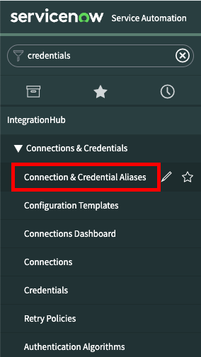
   - Pesquise por " KeyAccess""Cloudability e abra-o
   - Clique em “Novo” para adicionar novas credenciais
   - Quando for solicitado "Que tipo de credenciais você gostaria de criar?", selecione "Credenciais da chave API"
   - Insira "KeyAccess" o nome e cole a chave API de Cloudability

     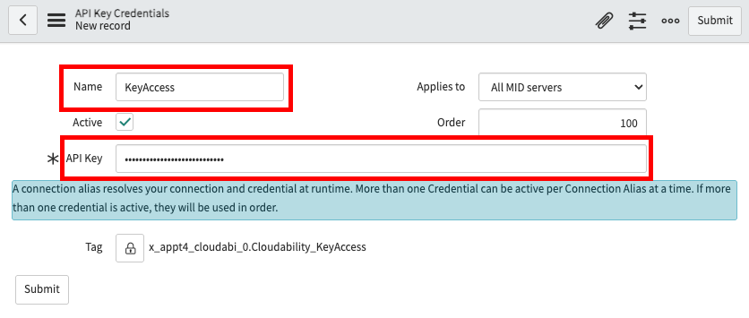
2. **Configure o segredo Cloudability da chave**
   - Em “Aliases de conexão e credenciais”, procure por “ KeySecret"Cloudability e abra-o
   - Clique em “Criar nova conexão e credencial”

     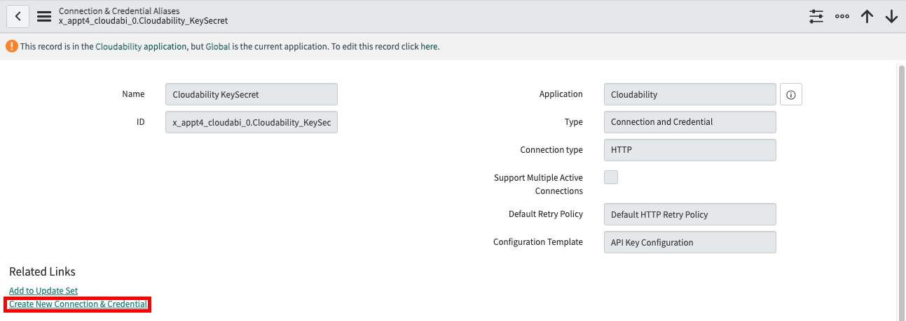
   - Adicione Cloudability “Conexão de raios” como o “Nome da conexão”
   - Adicione “<Domínio específico da região>/service/apikeylogin” como “Conexão URL ”. Substitua “<Domínio Frontdoor específico da região>” pelo domínio Frontdoor Cloudability apropriado, por exemplo, “ https://frontdoor.apptio.com/service/apikeylogin ”
   - Adicione o segredo da API da página de perfil do usuário do Frontdoor

     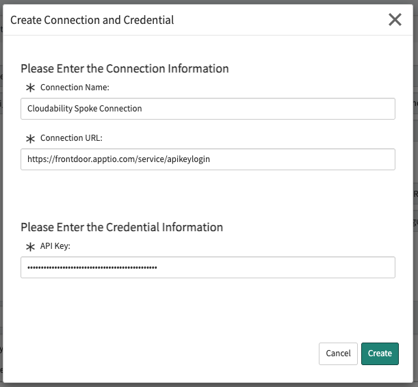

**Etapa 3: Testando a configuração**

- Navegue até o Workflow Studio

  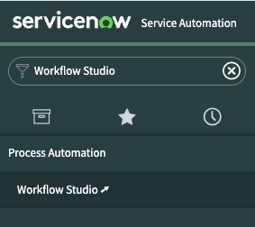
- Navegue até a seção “Ações”, localize “Integração - Obter Cloudability token Frontdoor” e abra-a
- Clique em “Testar” e, em seguida, em “Executar teste”
- Quando o teste terminar, clique em “Ver os detalhes da execução da ação”
- Se a variável "Status" retornar "Sucesso", significa que as credenciais foram configuradas corretamente

**Etapa 4: Configuração de privilégios entre escopos**

- Forneça privilégios de escopo cruzado para que o Cloudability aplicativo leia os dados das tabelas/visualizações especificadas nas propriedades de integração. Essas tabelas/visualizações são utilizadas na página de criação da Dimensão de Negócios. Consulte o ServiceNow [documento](https://www.servicenow.com/docs/bundle/xanadu-application-development/page/build/applications/reference/c_CrossScopePrivilegeRecord.html "(Abre em uma nova guia ou janela)"). O exemplo abaixo mostra a configuração necessária. A permissão de leitura é suficiente para o aplicativo.

  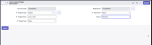

## Navegação

Você pode acessar o aplicativo Cloudability Mapeamento de Negócios através de uma área de trabalho ou da lista Todos os menus.

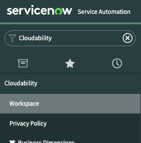

Todas as funções do usuário estão disponíveis na área de trabalho, e esse é o método recomendado para acessar o aplicativo.

As funções de administrador não estão disponíveis na área de trabalho. Eles devem ser acessados através da lista “Todos os menus”.

O usuário precisa de acesso de administrador para executar funções de administrador. Mas para todas as outras operações do usuário, o acesso de administrador não é necessário.

A página inicial exibe uma lista de dimensões de negócios publicadas ServiceNow e pendentes.

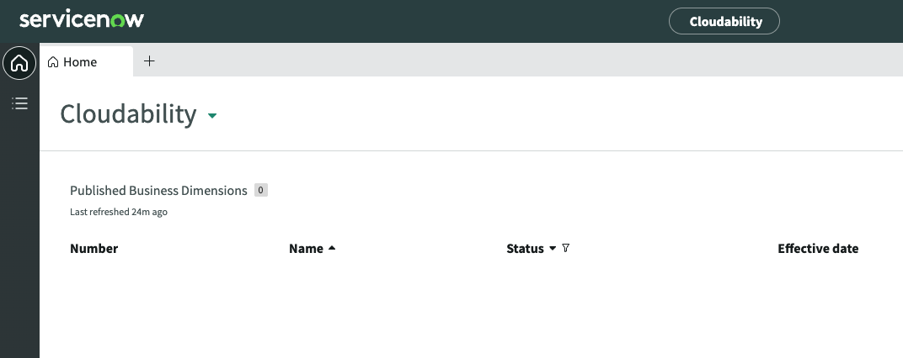

A página Lista permite que você veja listas de ServiceNow dimensões de negócios agrupadas por status. Clique em uma lista para exibir as dimensões de negócios com esse valor de status.

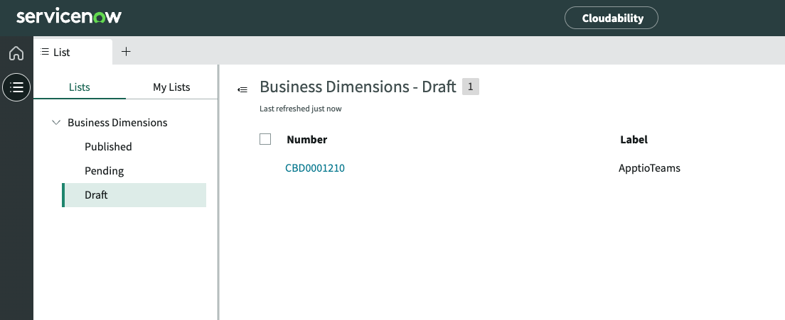

## Casos de uso

**1. Criar/Atualizar dimensões de negócios**

ServiceNow As dimensões de negócios permitem definir e modificar Cloudability dimensões de negócios a partir do ServiceNowServiceNow CMDB, utilizando dados do CMDB. Você pode criar novas ServiceNow dimensões comerciais ou atualizar rascunhos de dimensões comerciais existentes. Para criar uma nova ServiceNow dimensão de negócio, clique em [+] e selecione Nova dimensão de negócio.

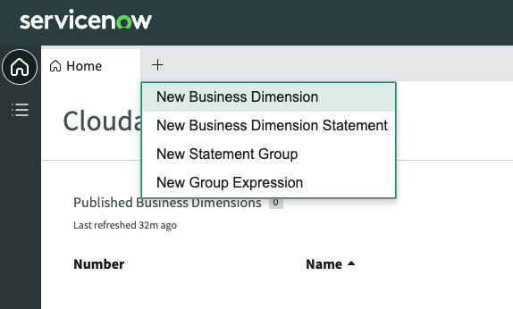

Preencha os campos do formulário conforme descrito na tabela abaixo:

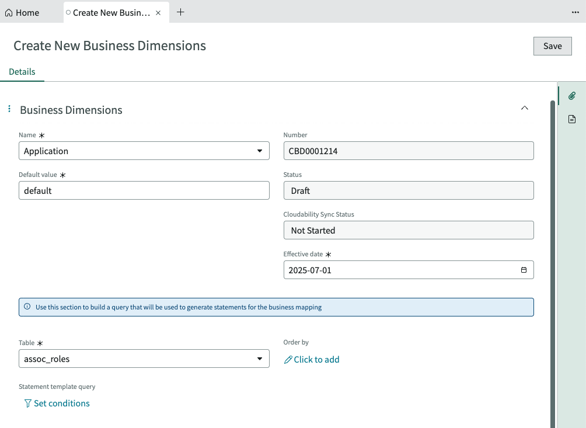

|  |  |
| --- | --- |
| **Campo** | **Descrição** |
| Nome | Selecione uma Cloudability dimensão de negócios. |
| Data efetiva | Defina a data em que esta ServiceNow dimensão de negócio deve ser atualizada Cloudability.  Este campo é inicialmente definido para a data atual. |
| Tabela | Selecione uma ServiceNow tabela. Os dados da tabela serão utilizados para elaborar as demonstrações da dimensão empresarial. |
| Consulta de modelo de declaração | Defina uma consulta que será usada para filtrar os dados utilizados para construir as declarações da dimensão de negócios. |

Clique no botão Salvar para salvar suas alterações.

**2. Criar/atualizar modelos de extrato**

Os modelos de declaração permitem definir declarações dinâmicas para sua Cloudability Dimensão de Negócios. Eles são dinâmicos no sentido de que os valores de campo das linhas ServiceNow da tabela podem ser substituídos na expressão de valor da instrução ou na expressão de correspondência.

Você pode criar novos modelos de extrato ou atualizar os existentes a partir de uma dimensão de negócios preliminar. Abra uma dimensão de negócios preliminar. Clique na guia “Modelos de extrato”.

Para criar um novo modelo de extrato, navegue até “Modelos de extrato” a partir de um determinado contexto de dimensão de negócios e clique no botão “Novo”. Para atualizar um modelo de extrato existente, clique no valor “Número”.

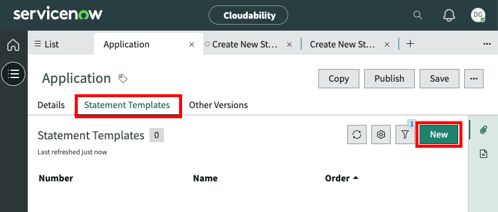

Preencha os campos do formulário conforme descrito na tabela abaixo:

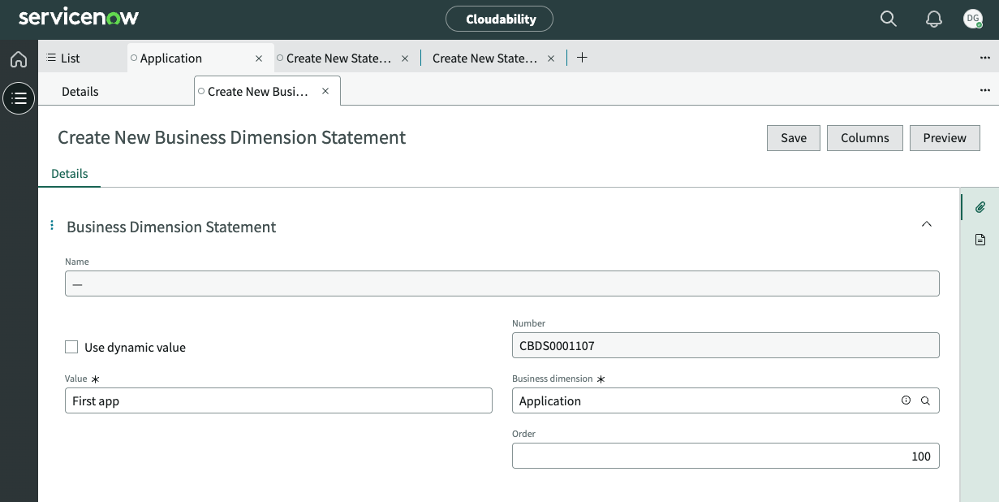

|  |  |
| --- | --- |
| **Campo** | **Descrição** |
| Use valor dinâmico | Marque este campo se desejar usar uma Cloudability dimensão de negócios, grupo de contas, tag ou medida interna como o valor para esta declaração |
| Valor dinâmico | Selecione uma Cloudability dimensão de negócios, grupo de contas, tag ou medida interna |
| Valor | Insira um valor de texto. O texto pode incluir variáveis da lista Colunas. |

**Variáveis como valores**

Você pode adicionar valores variáveis (colunas) ao campo Valor clicando no botão Colunas. Selecione uma ou mais colunas e feche a caixa de diálogo. Os nomes das colunas são copiados automaticamente para a sua área de transferência. Você pode colar o conteúdo da área de transferência no campo Valor.

As variáveis no campo Valor devem estar no seguinte formato:

${<column name>}

Se você usar o botão Colunas para selecionar nomes de colunas, eles serão formatados corretamente quando você os colar no campo Valor.

**3. Criar/Atualizar Grupos de Declarações**

Cada modelo de instrução é composto por um ou mais grupos de instruções que são usados para formar a expressão de correspondência de instruções. Cada grupo será combinado logicamente com AND quando a expressão de correspondência for determinada. Você pode criar novos grupos de extratos ou atualizar os existentes a partir de um modelo de extrato em uma dimensão de negócios preliminar. Abra um modelo de declaração. Clique na guia “Grupos de extratos”. Para criar um novo grupo de extratos, clique no botão “Novo”. Para atualizar um grupo de extratos existente, clique no valor do Número.

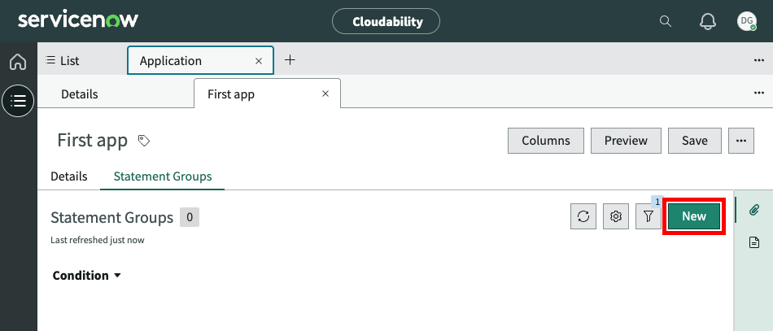

Clique em “Definir condições” e configure as condições de correspondência aplicadas a um determinado grupo de extratos.

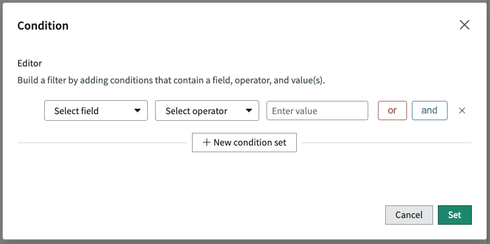

|  |  |
| --- | --- |
| **Campo** | **Descrição** |
| Dimension | Selecione uma Cloudability dimensão de negócios, grupo de contas, tag ou medida interna |
| Operador | Selecione o operador que será usado para comparar a dimensão com o valor |
| Valor | Insira um valor de texto. O texto pode incluir variáveis da lista Colunas. |

**4. Publicar uma ServiceNow Dimensão de Negócios**

Para atualizar uma Cloudability dimensão de negócios a partir de ServiceNow, você deve primeiro publicar a ServiceNow dimensão de negócios. Apenas dimensões de negócios com o status “Rascunho” podem ser publicadas.

Abra uma dimensão de negócios preliminar. Clique no botão Publicar.

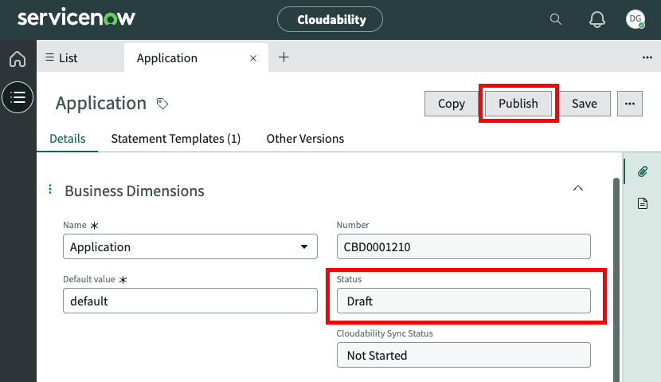

O status da dimensão do negócio será alterado para um dos dois valores:

**Publicado**

Se a data de vigência na dimensão empresarial for atual ou anterior, o status será alterado para “Publicado” e Cloudability será atualizado imediatamente.

**Pendente**

Se a data de vigência na dimensão comercial for futura, o status será alterado para “Pendente”. Cloudability não é atualizado imediatamente.

Quando a data de vigência se tornar atual, o status mudará para “Publicado”, Cloudability será atualizado e qualquer versão publicada anteriormente será retirada.
