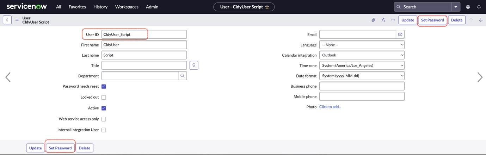
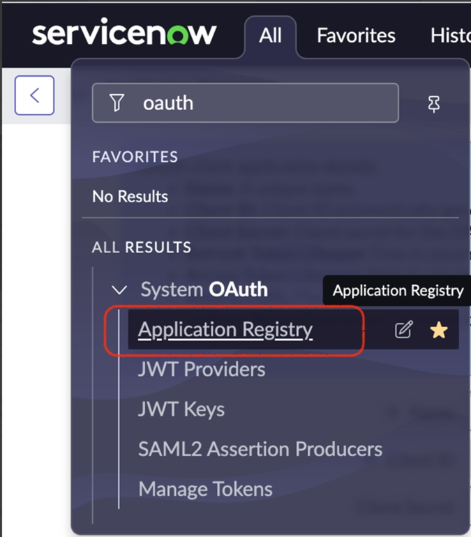
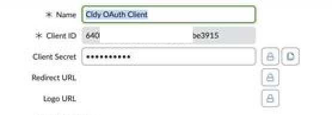
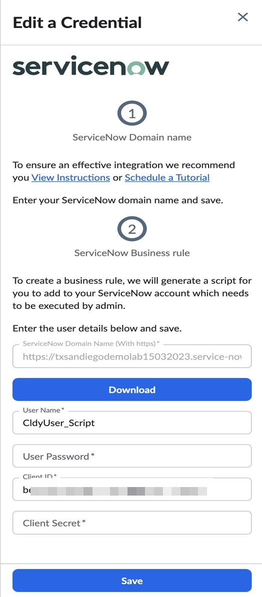

# Conectar-se a ServiceNow

**Visão geral**

Este guia orienta você pelo processo de conexão da sua **ServiceNow** conta ao IBMCloudability. Depois de conectado, você terá acesso ao uso do ServiceNow dentro do Cloudability.

**Pré-requisitos**

Antes de começar, verifique o seguinte:

- Você é um administrador do Cloudability.
- Sua organização usa o ServiceNow Cloud.
- O administrador de sua instância ServiceNow está disponível durante o processo de configuração.
- Você tem o nome de domínio para sua instância ServiceNow.

**ServiceNow** O processo de credenciamento de conta envolve algumas etapas que exigirão que você execute ações tanto no ServiceNow console quanto Cloudability em várias fases.

Durante esse processo, Cloudability usaremos seu ServiceNow domínio para conectar-se à sua conta.

**Passo 1 - ServiceNow Console**

- Anote o nome de domínio da sua ServiceNow nuvem. por exemplo https://xxxyyy.service-now.com

**Passo 2 - Cloudability**

No console Cloudability :

1. Em Cloudability, navegue até **Configurações** > **Credenciais do fornecedor** > **Adicionar fonte de dados** > **ServiceNow**. O painel **Adicionar conta ServiceNow** é aberto.
2. Digite o nome de domínio de sua **ServiceNow** instância.

   Selecione **Salvar**.
3. Clique em **Generate Script e faça o download do script**.

**Etapa 3 - ServiceNow** **Console**

1. Em sua instância ServiceNow, navegue até **System Definitions (Definições do sistema** ) > **Fix Scripts (Corrigir scripts** ).
2. Clique em **New**.
3. Forneça o nome como Cldy Script.
4. Cole o script gerado na etapa anterior na seção **Script**.
5. Certifique-se de que **o aplicativo** esteja definido como **Global**.
6. Clique em **Submit**.
7. Acesse o **Cldy Script** criado.
8. Clique em **Run Fix Script e prossiga**.
9. Navegue até **System Security** > **Users**.
10. Pesquisar o nome **CldyUser\_Script**. Observe a **ID do usuário.**
11. Clique em **Set Password** e, em seguida, digite e salve a senha. Anote a senha, se necessário.

    
12. Acesse **Sistema OAuth** > **Registro de aplicativos**.

    
13. Pesquise o nome **Cldy OAuth Client**. Observe o **ID do cliente**.
14. Clique no botão de bloqueio do **segredo do cliente**. Copiar o **segredo do cliente**.

**Passo 4 - Cloudability**

Navegue até o Cloudability console e insira os seguintes detalhes que foram capturados na etapa anterior:

1. Digite o **ID do usuário**.
2. Digite a **senha**.
3. Digite a **ID do cliente**.
4. Digite o **segredo do cliente**.
5. Clique em **Save**.

   

**Como confirmar o sucesso**

Verifique o status em **Configurações > Credenciais do fornecedor > ServiceNow**. Uma marca de seleção verde indica que a integração foi bem-sucedida.

**Perguntas Frequentes**

**Segui os passos acima, mas o status da minha conta continua vermelho. O que devo fazer?**

Verifique se você inseriu os detalhes corretamente, por exemplo, nome de domínio, ID de usuário, senha e ClientId segredo do cliente.

**Como posso editar os detalhes da ServiceNow integração?**

Clique nos três pontos ao lado da conta e clique em editar. Adicione os detalhes e salve a credencial.

Caso o domínio tenha mudado, adicione uma nova credencial seguindo todas as etapas mencionadas nesta integração. Por favor, exclua a conta antiga antes de fazer isso.
