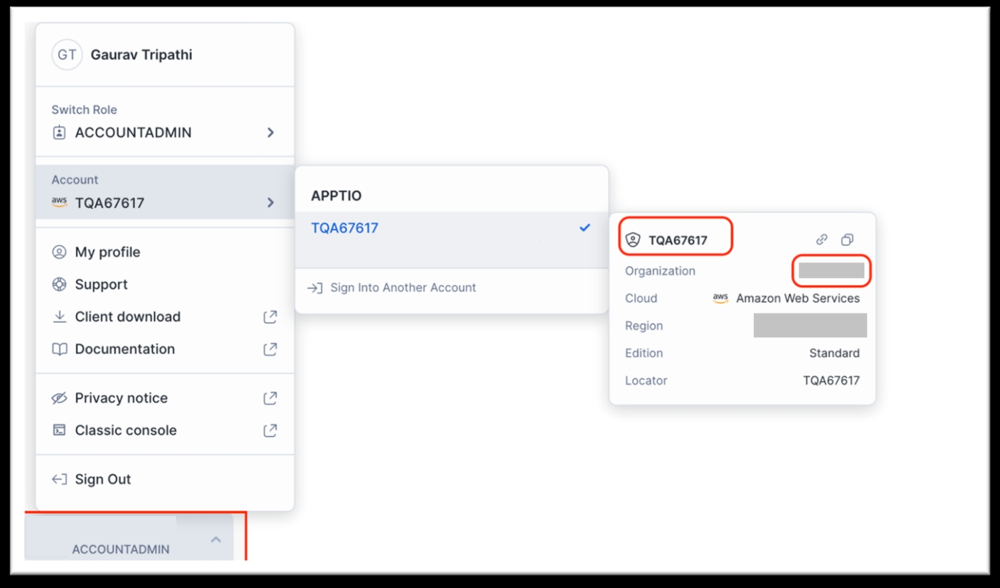

# Conectar Snowflake

Você pode conectar sua conta do Snowflake ao Cloudability para habilitar a importação de dados de custo granulares do Snowflake para os armazéns, juntamente com as tags do Snowflake nos níveis de armazém e de conta.

Observação: leva de 4 a 24 horas para que seus dados iniciais de custo e uso apareçam no site Cloudability.

Se você estiver adquirindo o Snowflake por meio do marketplace de um provedor de nuvem e adicionando dados de custo e uso do Snowflake com essa integração, os custos serão exibidos duas vezes nos relatórios do Cloudability. Por exemplo, se você comprou o jogo “ Snowflake ” na loja do AWS, você teria:

- A rubrica de alto nível para “ AWS ”.
- Os itens de linha com custos detalhados Snowflake e **AWS Marketplace** listado como **vendedor.**

Você precisará configurar filtros ou visualizações para ocultar os custos do Marketplace. Os custos do Marketplace não são incluídos na cobrança.

**Pré-requisitos**

- Acesso de administrador ao site Cloudability para credenciais de fornecedores.
- Acesse Snowflake Org, 1.0 ou 2.0 (recomenda-se 2.0 ) para obter dados detalhados sobre custos.
- Account Admin permissões no Snowflake 1.0.
- Permissões de administrador global da organização para Snowflake 2.0.
- Para ativar as tags d Snowflake

  - Conta de faturamento da Org 2.0 com o plano “ Enterprise Edition ” ou superior
  - Visualização do SNOWFLAKE.ORGANIZATION\_USAGE. [TAG\_REFERENCESe](https://docs.snowflake.com/en/sql-reference/organization-usage/tag_references "(Abre em uma nova guia ou janela)") ativada. Esta é uma visualização premium e pode acarretar custos adicionais do Snowflake. Para reduzir custos, você pode solicitar à Snowflake que desative todas as visualizações premium, exceto aquela de que precisamos (a menos que você precise de alguma dessas visualizações premium)

Observação: você pode executar a consulta abaixo no console do Snowflake para verificar se os valores das tags estão visíveis: *SELECT \* FROM SNOWFLAKE.ORGANIZATION\_USAGE.TAG\_REFERENCES;*

Se a visualização “Referências de tags” não estiver ativada, os custos detalhados no nível do depósito continuarão disponíveis, mas sem as informações das tags.

**Etapas para a integração**

**Snowflake**

Acesse sua conta no Snowflake usando as credenciais adequadas para visualizar os detalhes da conta.

**Encontrar o nome da organização e da conta**

1. Acesse o **Snowsight** — o editor SQL baseado na web para o Snowflake.
2. Abra o seletor de contas na barra de menu no canto inferior esquerdo. Isso exibe uma lista das contas acessadas anteriormente.
3. Identifique o nome da conta e, em seguida, selecione-a.
4. Passe o mouse sobre a conta selecionada para visualizar detalhes adicionais.
5. Copie os detalhes **do Nome da organização** e do **Nome da conta**.

   

**Cloudability** 

1. Acesse o aplicativo “ Cloudability ” e clique em **“Credenciais do fornecedor”**, **na** seção “Configurações”, no menu à esquerda.
2. Forneça as seguintes informações:
   - **Nome da organização** : Cole o nome da organização copiado anteriormente em Snowflake.
   - **Snowflake Nome da conta** : Cole o nome da conta copiado anteriormente em Snowflake.
   - **Nome do armazém** : Indique o nome de um armazém existente no Snowflake.
   - **Nome do banco de dados** (para o ` Cloudability `): Especifique um nome para o banco de dados a ser criado pelo ` Cloudability `.
   - **Nome de usuário** (para Cloudability ): Especifique um nome para o usuário a ser criado pelo Cloudability. Também será criada uma função com o mesmo nome, seguida do sufixo **\_role**.

**Cloudability - Gerar modelo**

Depois de preencher todos os campos, clique em **Credenciais do fornecedor** > **Gerar modelo**.

Isso irá gerar o modelo como um arquivo de texto contendo detalhes de configuração com base nas variáveis de entrada fornecidas anteriormente.

**Snowflake - Modelo de entrada**

1. Copie o conteúdo do arquivo de texto gerado.
2. Cole o conteúdo na planilha ou no arquivo de configuração apropriado na conta do Snowflake. Certifique-se de que você possui a função **Account Admin** no Snowflake.
3. Execute a consulta SQL fornecida e aguarde até que todas as instruções sejam executadas com sucesso.

**Cloudability - Verificar credenciais.**

1. Volte ao site Cloudability e acesse a tela **Credenciais do fornecedor**.
2. Clique em **“Verificar credenciais”** para confirmar o status da integração.

   Se a caixa de seleção estiver verde, significa que você integrou o Snowflake com sucesso.

   Observação: os links privados ainda não são compatíveis com o Snowflake.

**Perguntas Frequentes**

**Sou um cliente do Snowflake já cadastrado, mas sem acesso a dados detalhados. Preciso fazer alguma alteração para visualizar os custos detalhados do “ Snowflake ”?**

Os clientes atuais continuarão a ver os custos dos níveis de serviço sem que seja necessário fazer nenhuma alteração.

Para habilitar os dados granulares, é necessário atualizar as credenciais das mesmas contas do Snowflake.

- No site Snowflake Org 1.0:, você receberá os custos detalhados do armazém, mas não as etiquetas.

- Para acessar tanto os custos detalhados quanto as tags, atualize para uma organização do Snowflake 2.0 e, em seguida, atualize suas credenciais.

**Há alguma etapa que eu deva levar em consideração antes de mudar para os custos detalhados do Snowflake**?

Se você já estiver no **Snowflake** **Org 2.0**, não são necessárias etapas adicionais além **da atualização das credenciais**, pois o Cloudability requer permissões adicionais para importar custos e tags granulares no nível do warehouse.

**Quais tags do ` Snowflake ` são compatíveis?**

Aceitamos tags de nível de armazém e de conta do Snowflake no formato abaixo:

- cldy:floco de neve:conta:<tagkey>
- cldy:floco de neve:armazém:<tagkey>

Esses elementos precisariam ser mapeados na página “Tags e Etiquetas” após a primeira importação bem-sucedida dos dados.

**Onde posso obter o endereço IP para incluir na lista de permissões?**

Entre em contato com a equipe de suporte do IBM.

**Quantos dados históricos podem ser recuperados?**

Os dados detalhados de custos começam a partir do mês em que você ativar a integração.

Para meses anteriores, é necessário realizar uma nova busca. Cloudability suporta a recuperação de dados históricos **de 12 meses** (incluindo o mês atual).

Entre em contato com a equipe de suporte do IBM para solicitar uma nova obtenção de dados.

**Por que não consigo visualizar as tags no site Snowflake org 1.0?**

A visibilidade das tags requer:

- Uma **conta de faturamento Snowflake Org 2.0** com Enterprise Edition ou superior.
- A visualização premium do SNOWFLAKE.ORGANIZATION\_USAGE. [TAG\_REFERENCES](https://docs.snowflake.com/en/sql-reference/organization-usage/tag_references "(Abre em uma nova guia ou janela)") está ativada

Sem esses dados, não é possível importar os dados das tags.
