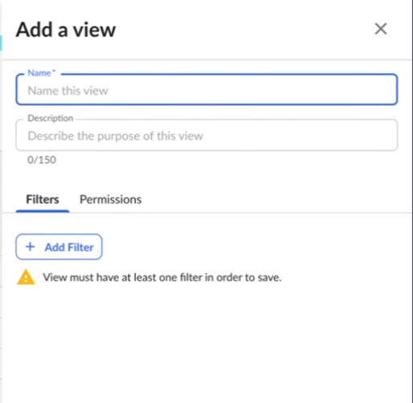
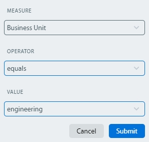
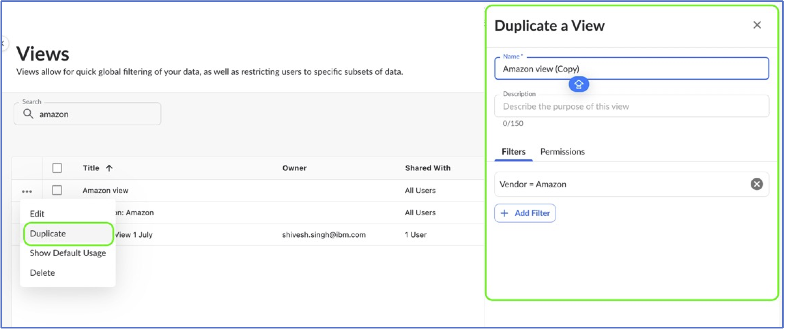
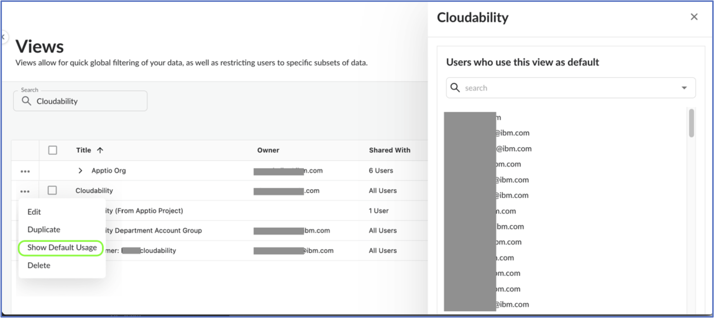
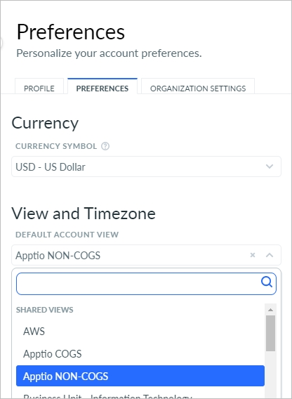
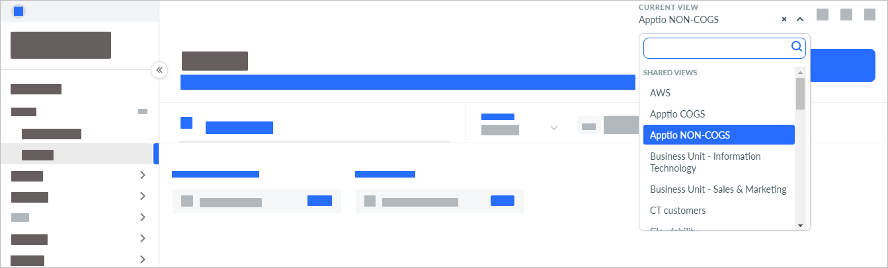

# Criar e gerenciar visualizações

## Visão geral

O View in Cloudability é uma poderosa ferramenta de filtragem de dados para organizar e controlar como os dados de custo e uso da nuvem são apresentados e compartilhados entre os usuários do Cloudability em sua organização. Eles atuam como filtros em todo o aplicativo que ajudam você a se concentrar nos dados mais importantes.

Com o Views, você pode:

- Filtrar e segmentar dados por contas, fornecedores, tags, grupos de contas ou mapeamentos de negócios.
- Controle a visibilidade compartilhando alguns dados de forma ampla e restringindo informações confidenciais a usuários ou grupos específicos.
- Possibilite a flexibilidade, permitindo que os administradores criem várias exibições, como dados de custo por unidade de negócios ou ambiente.

Os administradores podem configurar as visualizações com diferentes definições de compartilhamento - Privado, Toda a Organização ou Usuários/Grupos Específicos - para garantir o nível certo de acesso aos dados para o conjunto certo de usuários. Cada visualização oferece uma perspectiva personalizada dos seus recursos de nuvem, capacitando as equipes a analisar custos, otimizar o uso e tomar decisões informadas.

**Exemplos de casos de uso:**

- Uma equipe financeira precisa de uma View para monitorar **as despesas mensais por fornecedor** em todas as contas.
- Um líder de unidade de negócios precisa de uma visualização para rastrear a **alocação de custos por departamento**.
- Uma equipe do DevOps precisa ter uma visualização para analisar **os custos de computação em ambientes de produção e de preparação**.

## Como

## Criar uma visualização

1. Navegue até Organize > Views.
2. Selecione New View. O painel Adicionar uma visualização é aberto.

   
3. No campo Nome, digite um nome para sua visualização.
4. No campo Descrição, descreva a finalidade de sua visualização.
5. Na seção Privacy (Privacidade ), indique suas configurações de privacidade.

   - Selecione Privado para impedir que outras pessoas acessem sua visualização.
   - Selecione Entire Organization (Toda a organização ) para tornar a visualização acessível a todos os usuários e administradores não restritos da organização.
   - Selecione Individuals para compartilhar sua visualização com usuários específicos. Use o menu suspenso Compartilhado com para selecionar usuários específicos com os quais compartilhar a visualização.

   Nota:

   Quando uma visualização é atribuída aos usuários, eles não podem ver nenhum dado até que tenham a ViewsFeatureFullAccess permissão. Para obter mais informações, visite [Gerenciar permissões e funções de usuários](https://www.ibm.com/docs/en/apptio-platform/access-administration/saas?topic=management-manage-user-permissions-roles "(Abre em uma nova guia ou janela)")
6. Na seção Filtros, selecione o botão Adicionar filtro para restringir o escopo da sua visualização.

   1. No campo Medida, selecione a dimensão que deseja incluir em seu argumento de filtro.
   2. No campo Operator (Operador ), selecione o operador para o filtro, por exemplo, igual a.
   3. No campo Value (Valor ), digite uma cadeia de texto para usar como o valor a ser filtrado.
   4. Selecione Submit.
   5. Por exemplo, esse filtro limita o escopo da exibição à unidade de negócios chamada engenharia.

   
7. (Opcional) Se quiser incluir outro filtro em sua visualização, selecione Add Filter novamente. Ao inserir vários argumentos de filtro em uma única exibição, o sistema inferirá um OR implícito entre a mesma dimensão e um AND implícito entre duas dimensões diferentes.

## Duplicar uma visualização

Como **administrador de visualização**, muitas vezes você precisa criar várias visualizações que compartilham filtros e permissões semelhantes. Recriar manualmente cada exibição aplicando os mesmos filtros e configurações pode ser demorado e repetitivo. Com o recurso **Duplicate View**,

- Você pode clonar ou duplicar uma visualização com apenas um clique.
- Todos os filtros, permissões e configurações serão copiados.
- Basta renomear a visualização e fazer os ajustes necessários.

Esse recurso ajuda a economizar tempo, reduzir erros e facilitar a personalização e a organização de visualizações para suas equipes.

1. Para duplicar, navegue até Organize > Views.
2. Clique nas reticências (...) na linha da visualização que você deseja clonar/duplicar e selecione Duplicar.
3. Isso abrirá um painel lateral com todos os dados preenchidos previamente com as informações. Basta renomear a visualização e fazer os ajustes necessários nas condições e permissões do filtro.

## Gerenciar uma visualização existente

Você pode editar, compartilhar e excluir exibições existentes em Cloudability.

Editar uma visualização

1. Navegue até Organize > Views.
2. Clique nas reticências (...) na linha da visualização que você deseja editar e selecione Editar.
3. Se quiser editar várias visualizações de uma vez, marque as caixas de seleção à esquerda das visualizações e, em seguida, selecione o ícone EDIT MULTIPLE (EDITAR MÚLTIPLAS ). O painel Editar uma visualização será aberto.

## Excluir uma visualização

Quando uma visualização é excluída, o seguinte comportamento se aplica aos usuários que a têm definida como visualização padrão:

- Se uma visualização padrão (incluindo um HV) for excluída, a visualização padrão do usuário será automaticamente revertida para a **visualização padrão no nível da organização**.
- Se não existir um padrão no nível da organização, a visualização padrão será definida como **em branco**.
- Agora, ao excluir uma visualização, é exibido **um** aviso para informar aos administradores que isso pode afetar as configurações padrão do usuário.

Antes de excluir, os administradores podem ver quem está usando uma visualização específica como padrão em: **Visualizar → Mostrar uso padrão**. Além disso, os usuários podem atualizar sua visualização padrão a qualquer momento através de: **Gerenciar perfil → Preferências**.

**Para excluir uma visualização:**

1. Navegue até Organize > Views.
2. Clique nas reticências (...) na linha da visualização que você deseja excluir e selecione Excluir.
3. Se quiser excluir várias visualizações de uma vez, marque as caixas de seleção à esquerda das visualizações e, em seguida, selecione o ícone Excluir visualizações.

## Alterar as permissões de privacidade de uma exibição compartilhada existente

Os autores de visualizações podem alterar as permissões (aumentar ou diminuir) de uma Visualização Compartilhada existente. No entanto, quando as permissões são reduzidas ou removidas, o seguinte comportamento se aplica:

- Se o acesso a uma visualização padrão (incluindo uma HV) for removido do usuário, a visualização padrão do usuário será automaticamente revertida para **a visualização padrão no nível da organização**.
- Se não existir um padrão no nível da organização, a visualização padrão será definida como **em branco**.
- Agora, ao modificar suas permissões, é exibido **um** aviso para informar aos administradores que isso pode afetar as configurações padrão do usuário.

Antes de modificar as permissões, os administradores podem ver quem está usando uma visualização específica como padrão em: **Visualizar → Mostrar uso padrão**. Além disso, os usuários podem atualizar sua visualização padrão a qualquer momento através de: **Gerenciar perfil → Preferências**.

Para alterar a permissão:

1. Navegue até Organizar > Visualizações.
2. Clique nas reticências (...) na linha da visualização que você deseja editar.
3. Altere a permissão entre "Private" (Privado), "Entire Organization" (Toda a organização) e "Individuals" (Indivíduos).

## Identificar usuários usando a visualização como padrão

Antes de excluir ou restringir o acesso a uma visualização, os administradores agora podem ver quem a está usando ativamente como visualização padrão, o que os ajuda a tomar decisões informadas ao restringir as permissões de visualização ou excluí-la. O recurso mostra exatamente quais usuários dependem de uma visualização específica como padrão - se ela foi compartilhada diretamente, por meio de grupos de usuários, grupos de ID da Entra ou com toda a organização.

1. Usando a opção "Show Default Usage" (Mostrar uso padrão):
   1. Navegue até Organizar > Visualizações.
   2. Clique nas reticências (...) na linha da visualização e selecione "Show Default Usage" (Mostrar uso padrão).
   3. No painel lateral, você verá a lista de usuários que estão usando essa visualização como visualização padrão.
2. Usando a exportação d CSV :
   1. Navegue até Organizar > Visualizações.
   2. Use o botão "Exportar" para fazer o download da lista de todas as visualizações.
   3. No ` CSV `, a coluna **`View Default Users`** lista todos os usuários que definiram essa visualização como padrão.

## Definir uma visualização padrão

A visualização padrão é aquela que você vê quando faz o login inicial e também se aplica aos e-mails diários do Cloudability. Para definir sua visualização padrão:

1. Clique no ícone do seu perfil no canto superior direito e, em seguida, clique em Manage Profile (Gerenciar perfil ).
2. Na página do seu perfil, clique na guia Preferences (Preferências ).
3. Em Exibição padrão da conta, selecione uma exibição.

   Observação: você também pode selecionar a Visualização Hierárquica (HV) como sua visualização padrão. Apenas os HVs aos quais o usuário tem acesso aparecerão na lista suspensa e apenas o nó de nível mais alto pode ser definido como padrão.

   Observação: Cloudability lembra a última visualização que você acessou e a salva no cache do seu navegador. No seu próximo login, ele restaura essa mesma visualização em vez da sua visualização padrão. Se você limpar o cache do navegador e fazer login novamente, Cloudability carregará sua visualização padrão.

   
4. Clique em Salvar configurações.

## Selecione uma visualização

A seleção de uma visualização restringe o escopo dos dados que você vê em Cloudability de acordo com as condições de filtro da sua visualização. Para selecionar uma visualização existente:

1. Clique no menu suspenso Visualização atual na navegação superior.
2. Escolha uma visualização na lista.

Cloudability agora exibirá os dados com base nos filtros configurados na visualização selecionada.

Nota:

A opção **“Mostrar todos os dados”** está disponível apenas para usuários com a função **de administrador**. Os usuários sem privilégios de administrador só podem acessar as visualizações que lhes foram atribuídas.

## Perguntas Frequentes

**Q1: Por que os novos usuários veem várias visualizações, mesmo que nenhum acesso específico tenha sido concedido?**

Se um administrador de visualização tiver compartilhado visualizações com a permissão "Entire Organization" (Toda a organização), essas visualizações se tornarão acessíveis a todos os usuários por padrão, incluindo os usuários recém-adicionados.

**Q2: Como a edição em massa (Edit Multiple) funciona para as visualizações? (com exemplos)**

Você pode selecionar várias visualizações e usar Edit Multiple para atualizar suas permissões em massa. Os filtros não podem ser editados em massa porque cada visualização tem seus próprios filtros exclusivos. Na edição em massa, são exibidas as permissões combinadas de todas as visualizações selecionadas.

Exemplos:

- *Exemplo 1:* se a visualização A for privada e a visualização B for compartilhada com toda a organização, a tela de edição em massa mostrará toda a organização como selecionada. Todas as alterações que você fizer serão aplicadas a ambas as visualizações.
- *Exemplo 2:* Se a Visualização A for compartilhada com os usuários *u1, u2* e o grupo *g1*, e a Visualização B com *u2, u3*, a tela de edição em massa mostrará *u1, u2, u3* e *g1* selecionados. O salvamento aplicará essas permissões combinadas a ambas as visualizações.

Importante: se você quiser adicionar apenas um novo usuário a várias visualizações, a edição em massa pode não ser ideal. Por exemplo, adicionar *u4* a ambas as Exibições usando edição em massa também mesclará todas as permissões existentes, resultando em ambas as Exibições tendo *u1, u2, u3, u4* e *g1*.

**Dica de práticas recomendadas: Quando usar a edição em massa em vez de edições individuais**

Use **Edit Multiple** somente quando quiser padronizar as permissões em várias visualizações. Se o seu objetivo for fazer alterações pequenas e específicas (como adicionar um único usuário), edite cada visualização individualmente para evitar mesclar permissões de forma não intencional.

**Q3: Por que não vejo a opção de exibição duplicada para exibições hierárquicas?**

O recurso de duplicação ou fechamento não está disponível para visualizações hierárquicas. Isso ocorre porque cada visualização hierárquica é criada a partir de um mapeamento hierárquico de negócios. Para criar um novo grupo de visualização hierárquica, primeiro é necessário adicionar um novo mapeamento hierárquico de negócios. Isso nos impede de duplicar a visualização hierárquica.

**Q4: Por que minha visualização padrão não está selecionada quando eu faço login em Cloudability?**

Cloudability lembra a última visualização que você acessou e a salva no cache do seu navegador. No seu próximo login, ele restaura essa mesma visualização em vez da sua visualização padrão. Se você limpar o cache do navegador e fazer login novamente, Cloudability carregará sua visualização padrão.

**Q5: O que acontece quando o administrador exclui uma visualização ou remove uma permissão de visualização de um usuário?**

Um usuário pode esperar o seguinte comportamento quando o administrador exclui uma visualização ou remove as permissões de uma visualização de um usuário:

1. A configuração padrão do usuário será automaticamente revertida para a visualização padrão no nível da organização.
2. Se não existir um padrão no nível da organização, a visualização padrão será definida como em branco.
3. Os usuários podem atualizar sua visualização padrão a qualquer momento em: Gerenciar perfil → Preferências.

## Resolução de problemas

- Não é possível ver nenhum dado em uma visualização? Certifique-se de que você tenha a permissão ViewsFeatureFullAccess.

## Boas Práticas

- Use convenções de nomenclatura consistentes para as visualizações (por exemplo, BU\_Prod\_Cost) para facilitar a identificação.
- Forneça uma descrição clara de cada View para explicar sua finalidade e uso pretendido.
- Limite o compartilhamento de "Toda a organização" apenas às visualizações essenciais. O uso excessivo dessa opção pode reduzir a eficácia das visualizações ao tornar muitas delas acessíveis a todos.
- Revisar e limpar regularmente as visualizações não utilizadas para manter um ambiente organizado e eficiente.

- **[Organizar visualizações usando visualizações hierárquicas](../admin/hierarchical-views.html)**
- **[Compatibilidade do recurso de visualizações](../admin/views-feature-compatibility.html)**
