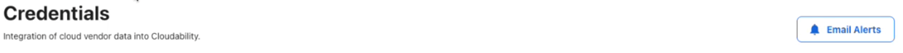
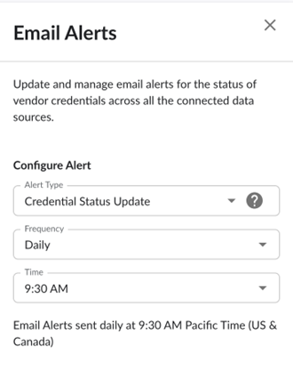
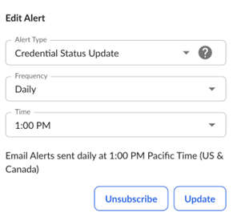
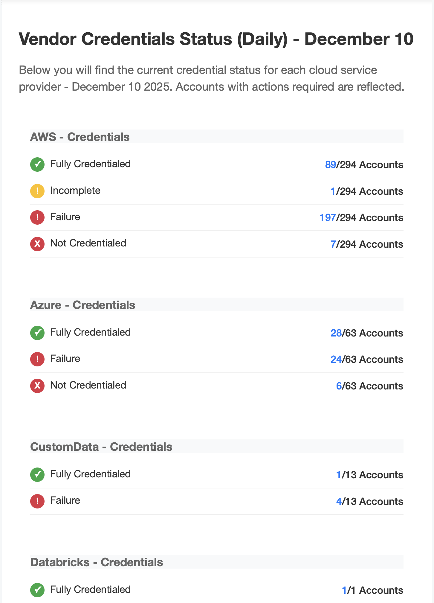
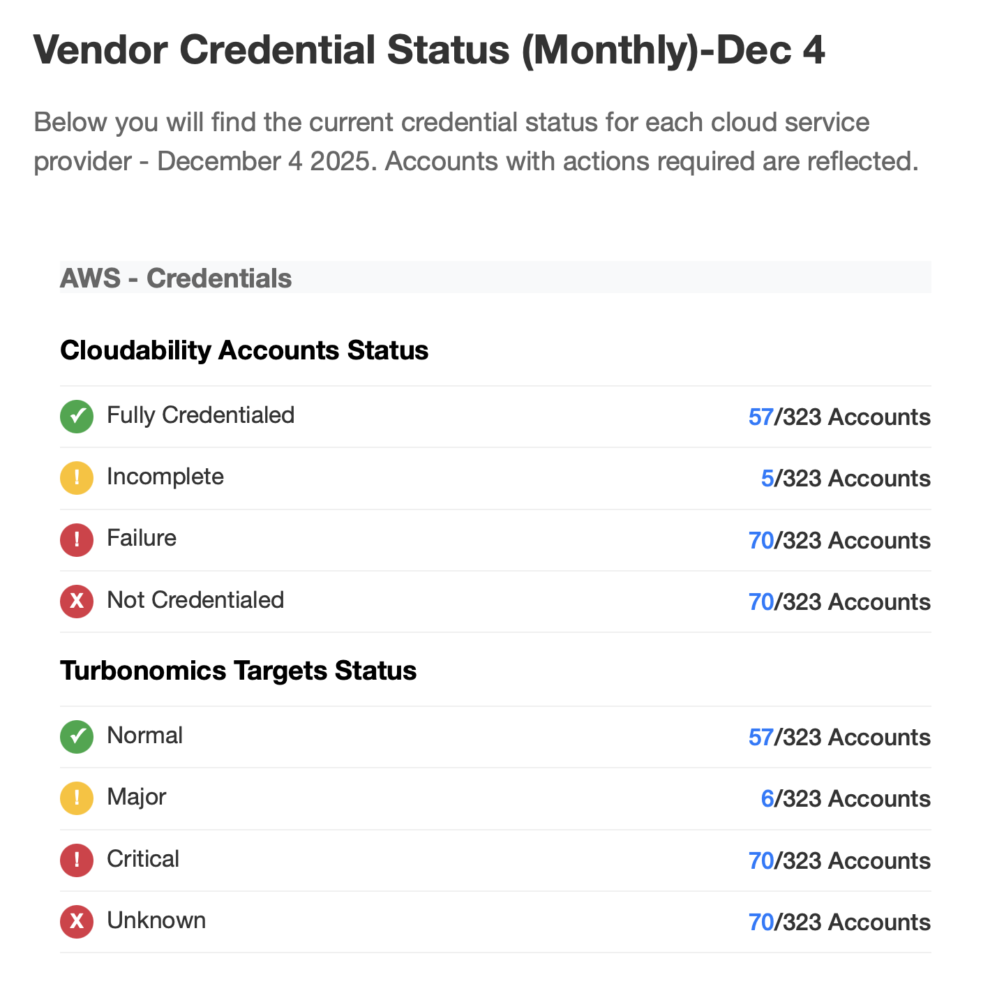
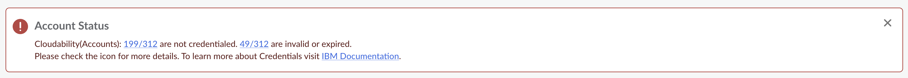
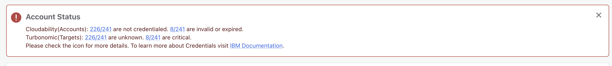
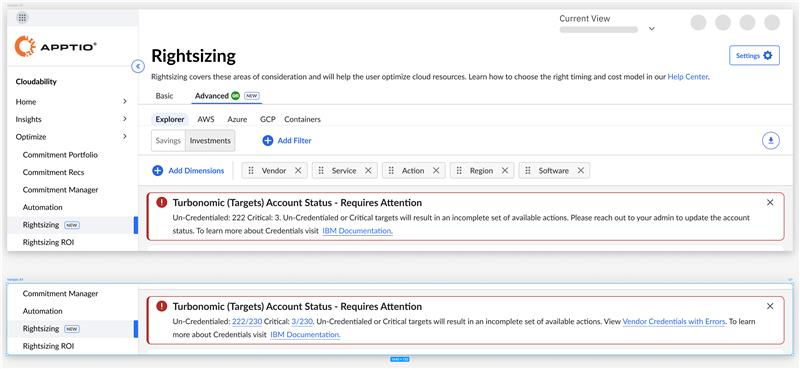

# Alertas por e-mail e banners de credenciais de fornecedores

Cloudability permite ativar alertas por e-mail na página “Credenciais do fornecedor”. Esses alertas por e-mail enviarão uma mensagem com o resumo do status da conta.

Os administradores podem ativar esses alertas usando o botão “**Alertas por e-mail** ”.

Clique em **“Alertas por e-mail”** para abrir a janela “Alertas por e-mail”. Defina esses alertas de acordo com a frequência que preferir.

Esses alertas por e-mail são acionados de acordo com a sua preferência de fuso horário. Para saber mais, consulte “[Configurando as preferências de fuso horário](../product/manage-profile.html) ”.

Você pode cancelar a inscrição desses alertas usando a janela “**Editar alerta** ”.

**Modelo de e-mail para clientes do Cloudability (exceto Premium)**

**Modelo de e-mail para clientes d Cloudability Premium**

Esses alertas por e-mail exibirão o status da conta nos sites Cloudability e Turbonomic (para clientes do Cloudability Premium )

Banners nas credenciais dos fornecedores

Os banners serão exibidos nas fontes de dados credenciadas no Cloudability.

Esses banners, que funcionam como filtros rápidos, destacam o número de contas inválidas e incompletas que exigem alguma ação.

**Banners para clientes do Cloudability (exceto Premium)**

**Banners para clientes do Cloudability Premium**

Observação: Para desativar os banners ou o botão de alertas por e-mail da organização, entre em contato com a equipe de suporte.

**Banners para Cloudability Premium - Redimensionamento**

Observação: O banner exibe o número de contas CSP que ainda não passaram pela recertificação, bem como aquelas que apresentam erros; sem essas informações, o mecanismo de otimização do Turbonomic não poderá recomendar ações de otimização. A solicitação é para garantir que as contas específicas indicadas sejam novamente credenciadas e verificadas, a fim de assegurar que o conjunto completo de ações de otimização seja apresentado em Cloudability.

Observação: caso encontre algum problema, entre em contato com o administrador do Cloudability da sua organização. Se você for um administrador, entre em contato com seu CSM/TAM da IBM, que poderá ajudá-lo a atualizar as credenciais de suas contas para garantir que Cloudability tenha as permissões necessárias.

**Tópico principal:** [Credenciais de fornecedores](../admin/vendor-credentials.html)
