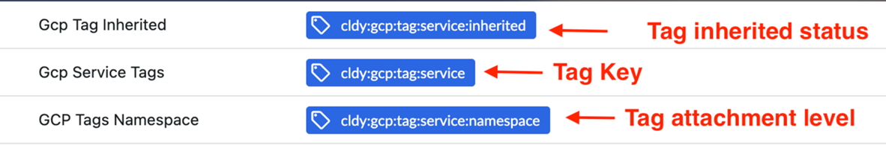

# GCP Etiquetas e rótulos

Cloudability suporta os tipos de tags e rótulos mencionados a seguir para o GCP

- **GCP Etiquetas**
  - Esses dados fazem parte da extração de dados de faturamento do GCP e não são necessárias permissões adicionais no Cloudability para ativá-los. O Cloudability oferece suporte aos rótulos abaixo
    - Etiquetas de recursos
    - Etiquetas do projeto
    - Rótulos do sistema

Observação: Se a mesma chave estiver configurada para rótulos de projeto, sistema e recurso, a ordem de prioridade para exibir o rótulo na interface do usuário d Cloudability é a seguinte:

- Recurso

- Projeto
- Sistema

- **GCP Tags**
  - Esses dados fazem parte da extração de dados de faturamento do GCP e não são necessárias permissões adicionais no Cloudability para ativá-los

GCP As tags estão se tornando um mecanismo de marcação cada vez mais popular entre um grande número de clientes do GCP para alocação de custos e marcação baseada em políticas. Cloudability agora oferece suporte a tags do GCP, além de rótulos do GCP. Agora, os usuários podem utilizar ambas as opções em diversos cenários de uso.

Para obter mais informações sobre as tags “ GCP ”, clique em [https://cloud.google.com/resource-manager/docs/tags/tags-overview#inheritance](https://cloud.google.com/resource-manager/docs/tags/tags-overview#inheritance "(Abre em uma nova guia ou janela)")

## Principais alterações nos mapeamentos de tags do GCP :

- Opções aprimoradas de mapeamento: Agora é possível mapear custos utilizando tanto as tags do GCP (nível de organização/pasta) quanto os rótulos do GCP (nível de recurso) para uma alocação de custos mais abrangente.
- Alocação hierárquica de custos: mapeie as tags herdadas para unidades de negócios ou departamentos, utilizando rótulos para alocações específicas de projetos.
- Configuração de prioridade: Defina a prioridade entre as tags e os rótulos do GCP nos casos em que ambos existam para a mesma dimensão de custo.

Para utilizar as tags do GCP, os clientes precisam habilitar as tags do GCP no console do GCP. Uma vez ativado, o recurso “ Cloudability ” (Incluir tags de faturamento) durante a importação dos dados de faturamento também importará as tags “ GCP ”.

Após a importação, as tags do GCP aparecerão como novas dimensões de tag na sua configuração de mapeamento de tags, na página “Tags e rótulos”, ao lado dos rótulos existentes do GCP. Você os verá da seguinte forma:

- **cldy:gcp:tag:<tagkey>** para atribuições diretas de tags
- **cldy:gcp:tag:<chave da tag>:inherited** para tags herdadas
- **cldy:gcp:tag:<tagKey>:namespace** para o nível de anexação da tag

GCP As tags podem, então, ser utilizadas em outros recursos, como Mapeamentos de Negócios, Visualizações, Explorador de Tags, Painéis e relatórios, para aprofundar ainda mais a análise de diversos cenários de alocação de custos.

## Resolução de problemas

**Como faço para definir prioridades entre a seleção de rótulos “ GCP ” e as tags “ GCP ”?**

GCP Tanto as tags quanto os rótulos serão exibidos na página “Tags e Rótulos” do site Cloudability, na seção “Organizar”. Atualmente, a página segue uma ordem de prioridade com base nas tags mencionadas. Se você já possui rótulos GCP e deseja dar prioridade às tags GCP, será necessário remover os rótulos antigos GCP e adicionar as tags GCP como primeira opção, seguidas pelos rótulos. Depois de fazer isso, é necessário clicar em “Reprocessar” para que essa alteração seja refletida nos relatórios d Cloudability e em todos os outros lugares.

**Adicionei uma nova tag “ GCP ”, mas não consigo visualizar o valor associado a ela em Cloudability. Qual poderia ser o motivo?**

Verifique a ordem das tags “ GCP ”, conforme explicado acima. Certifique-se de que as tags GCP tenham prioridade na ordem de TAGS na página de tags e rótulos. Em caso de conflitos entre os rótulos GCP e as tags GCP, verificaremos a ordem de prioridade das tags configuradas.

**No momento do lançamento, quantos meses de tags “ GCP ” estariam disponíveis?**

No momento do lançamento, começaremos a extrair os dados das tags “ GCP ” do mês atual.

**Como as tags “ GCP ” podem ser preenchidas retroativamente?**

Os clientes precisariam abrir um ticket de preenchimento de lacunas no GCP para solicitar o preenchimento de lacunas nas tags GCP. A equipe interna de Suporte ou Engenharia precisará, então, iniciar uma nova recuperação para carregar os dados dos meses especificados.

**Como o Tag Explorer mudará com o suporte às tags d GCP?**

O Tag Explorer passará a oferecer visibilidade tanto das tags quanto dos rótulos do GCP, proporcionando:

**Análise de cobertura aprimorada:**

- **Visibilidade em duas camadas** : visualize tanto as tags herdadas GCP quanto as etiquetas aplicadas diretamente GCP
- **Acompanhamento de herança** : Identifique quais custos são alocados por meio de tags herdadas e quais por meio da atribuição direta de rótulos aos recursos
- **Lacunas na cobertura** : Identificar recursos que não possuem tags ou rótulos para uma alocação completa de custos

**Novas opções de filtro e análise:**

- **Filtragem de origem de tags** : Filtrar por tags diretas versus tags herdadas
- **Análise hierárquica** : Entenda os padrões de alocação de custos em toda a estrutura organizacional do GCP

**Tópico principal:** [Conectar-se Google Cloud](../admin/connect-google-cloud-premium.html)
