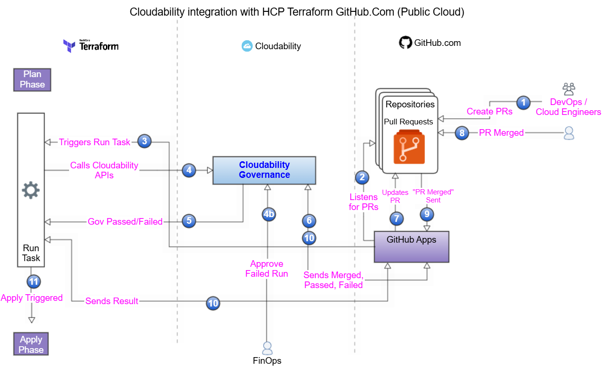
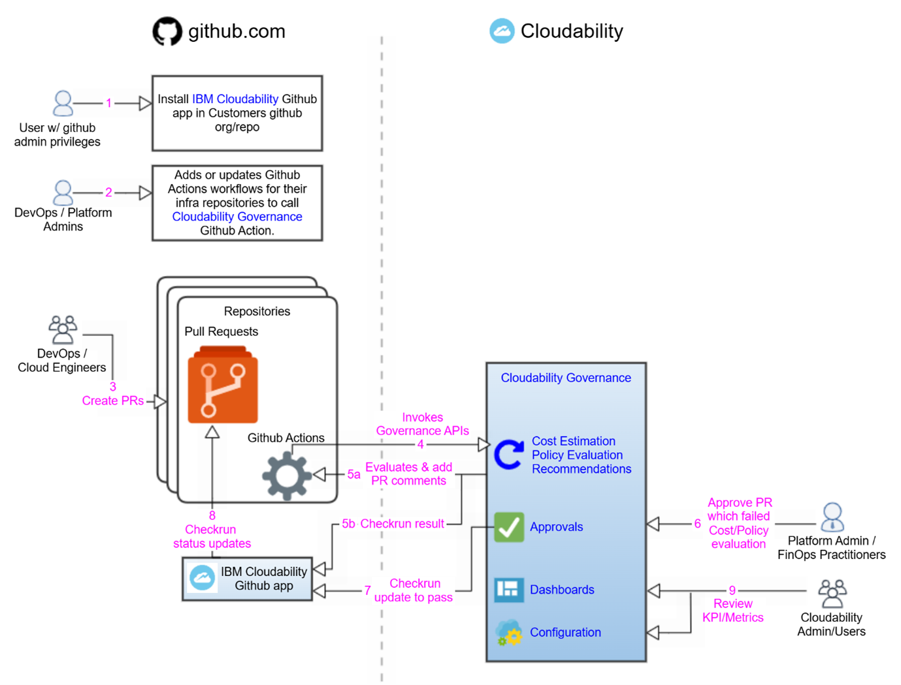

# Governança - Primeiros passos

## O que você pode fazer com a Cloudability Governance

Defina o nosso roteiro de governança: [Pesquisa " 2‑Minute " (O que é importante para você)](https://forms.office.com/r/qs2wL1U2xt "(Abre em uma nova guia ou janela)")

Cloudability A governança permite que as equipes gerenciem proativamente os custos da nuvem e apliquem as políticas do FinOps diretamente nos fluxos de trabalho dos desenvolvedores. Com esse recurso, você pode:

- **Calcule os custos antes da implantação:** obtenha estimativas de custos em tempo real para recursos em nuvem, incluindo preços personalizados e descontos do EA, diretamente no GitHub e no HCP Terraform
- **Otimize a seleção de recursos:** receba recomendações para alternativas mais econômicas de AWS EC2 e RDS com configurações semelhantes
- **Aplique políticas no nível IaC :** garanta a conformidade impondo chaves/valores de tag obrigatórios, bloqueando o provisionamento de recursos legados e definindo limites de orçamento para equipes e aplicativos.
- **Monitore a conformidade:** use um painel de controle centralizado para monitorar a adesão às políticas do FinOps em toda a organização.
- **Gerencie PRs fora de conformidade:** identifique e revise as solicitações pull que violam as regras de custo ou de política, com fluxos de trabalho de aprovação incorporados

Esse recurso muda o gerenciamento de custos da nuvem de reativo para proativo, ajudando a evitar gastos excessivos e violações de políticas antes que a infraestrutura seja implantada.

## Integrações suportadas

- **IaC ferramentas** : HCP Terraform, Terraform Enterprise, [Terraform Editions](https://developer.hashicorp.com/terraform/intro/terraform-editions "(Abre em uma nova guia ou janela)") (versão 1.10.5 ); Terragrunt (versão 0.72.6 )
- **VCS:** GitHub.com, Servidor GitHub Enterprise
- **Provedor de nuvem:** AWS, Azure

## Fluxo de trabalho - HCP Terraform/Terraform Enterprise

Os recursos representados no diagrama estão disponíveis para fluxos de trabalho orientados por VCS e para clientes que utilizam o GitHub.

Para clientes que utilizam outros VCS ou fluxos de trabalho orientados por CLI/API, certos recursos de governança não são suportados:

- Os gatilhos de fluxo de trabalho acionados por CLI ou API não aparecem na página Governança → Solicitação de pull do Cloudability.
- As atualizações de status e as verificações de validação não são enviadas de volta para o ambiente inicial (página PR do Github, se criada)
- Ações de governança, como validação de políticas, bloqueio de execução ou aprovação manual, não estão disponíveis na interface de governança d Cloudability.

## Fluxo de trabalho - Comunidade Terraform

## Visão geral das permissões

Cloudability O acesso à governança é controlado por meio de quatro permissões específicas. Certifique-se de que você tenha as funções/permissões corretas atribuídas.

- **GovernanceFeatureViewOnly** - Essa permissão permite que os usuários visualizem todas as páginas do item de menu do recurso Cloudability "Governance" (Governança). Essa permissão está incluída na função **" Cloudability User" (Usuário** ).
- **GovernanceFeatureConfigurationFullAccess** - Essa permissão permite que os usuários acessem a funcionalidade de configuração (visualizar, criar, atualizar detalhes de configuração). Essa permissão está incluída nas funções **" Cloudability Admin"** e **" Cloudability Governance Automation User"**.
- **GovernanceFeaturePolicyFullAccess** - Essa permissão permite que o usuário acesse a funcionalidade de configuração da política (visualizar, criar, atualizar políticas) no item de menu do recurso "Governance" (Governança) do site Cloudability. Essa permissão está incluída na função **" Cloudability Governance Policy Admin"**.
- **GovernanceFeaturePRApproval** - Essa permissão permite que os usuários aprovem Pull Requests que são bloqueados quando não estão em conformidade com as políticas. Essa permissão está incluída na função **" Cloudability Governance PR Approver"**.

## Segurança - Como seu código e a infraestrutura do CSP são protegidos

Cloudability A governança foi projetada tendo em mente a segurança e a privacidade, garantindo que seu código e a infraestrutura do provedor de serviços em nuvem (CSP) permaneçam protegidos durante todo o processo de verificação de custos e políticas.

1. GitHub Segurança da integração:
   - O **aplicativo IBM Cloudability GitHub** é usado somente para ler metadados de pull request (PR), postar comentários em pull request e definir status de verificação de PR.
   - Requer **permissões mínimas** :
     - Acesso **somente de leitura** a metadados e solicitações pull.
     - Acesso **de leitura/gravação** a solicitações pull. O acesso de gravação às solicitações pull é necessário para que seja possível publicar comentários nas solicitações pull.
     - Acesso **de leitura/gravação** às verificações (necessário para adicionar verificações relacionadas à governança nos PRs do site GitHub e atualizar seu status como falho, neutro ou bem-sucedido).
   - Para os usuários do Terraform Community, a ação GitHub que invoca o Cloudability Governance é executada **inteiramente no seu ambiente**, garantindo que não haja acesso externo à sua base de código.
2. **AWS / Proteção da infraestrutura da Azure** :
   - Cloudability **O** Governance não acessa seu ambiente AWS / Azure.
   - Em vez disso, ele analisa **as saídas estáticas do plano do Terraform** transmitidas pelo GitHub Action ou pelo HCP Terraform. Os resultados do plano Terraform não permanecem no lado Cloudability e quaisquer segredos/informações confidenciais no plano Terraform podem ser editados antes de serem fornecidos como entrada para a Governança Cloudability.
   - AWS / Azure Os IDs das contas são **utilizados** apenas para a determinação do nível de preços — não são necessárias credenciais **e** não são realizadas chamadas diretas à API AWS / Azure nas contas dos clientes.
   - Todos os dados de preços são obtidos do **serviço interno de preços da Cloudability**, e não de sua infraestrutura.

Essa arquitetura garante que seu código IaC e sua infraestrutura de nuvem permaneçam seguros, sem exposição de dados confidenciais ou requisitos de acesso elevados.

[Configuração Cloudability Governança](governance-setup-cldy-governance.html)

[Criar e gerenciar políticas](governance-create-and-manage-policies.html)

[Pull Requests - Fluxo de trabalho de aprovação](governance-pull-requests-and-approval-workflow.html)

[Recomendações de recursos](governance-resource-recommendations.html)

[Estimativa de custos baseada em uso e configuração](governance-usage-and-configuration-based-cost-estimation.html)

[Solução de problemas](governance-troubleshooting.html)
