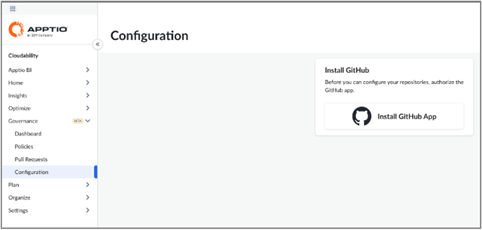
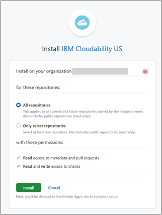

# Instalação do aplicativo GitHub.com (na nuvem)

Um aplicativo GitHub é usado para definir/atualizar o status de execução da verificação na solicitação pull. Os clientes precisam instalar o aplicativo IBM Cloudability GitHub em suas organizações GitHub acessando o link de instalação na página de configuração de governança. Para instalar o aplicativo, o usuário que executa essas operações precisa ter permissões de administrador para a organização GitHub ou para os repositórios na organização.

Abaixo está a primeira página de destino da Governança. A primeira ação que precisa ser tomada é instalar o aplicativo IBM Cloudability GitHub na organização GitHub do cliente.

1. Clique no link "Install GitHub App" *(presente na frente e no centro da guia Settings (Configurações) se estiver configurando pela primeira vez)* para acessar o link de instalação na página Governance (Governança).
2. Você será redirecionado para [GitHub - Build and ship software on a single, collaborative platform](http://github.com/ "(Abre em uma nova guia ou janela)") para a instalação.
3. Escolha a organização GitHub e, em seguida, você pode instalar o aplicativo para todos os repositórios ou apenas para os repositórios selecionados nessa organização GitHub.

   

   Depois que a organização GitHub for selecionada, será oferecida uma opção para:

   - instale o aplicativo para acessar todos os repositórios na organização GitHub
   - somente repositórios selecionados no site GitHub org
4. Ao instalar o aplicativo, as seguintes permissões são necessárias:

   - Acesso somente leitura aos metadados (para poder identificar os metadados das solicitações pull)
   - Acesso de leitura/gravação a solicitações pull (o acesso de gravação a solicitações pull é necessário para poder publicar comentários nas solicitações pull)
   - Acesso de leitura e gravação às verificações (necessário para definir e atualizar os resultados do estado de execução da verificação)

Quando o acesso é concedido, a página é redirecionada para a página de governança Cloudability.

**Tópico principal:** [Configurar Cloudability Governança](../admin/governance-setup-cldy-governance.html)
