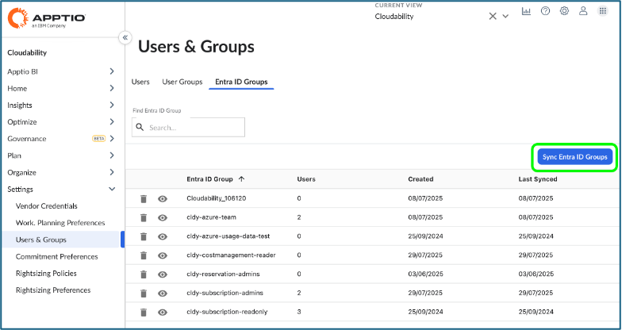
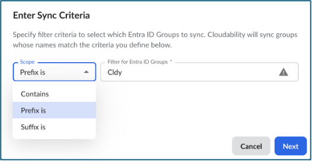
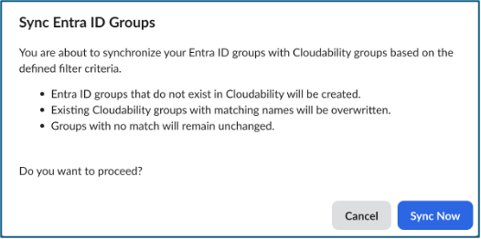
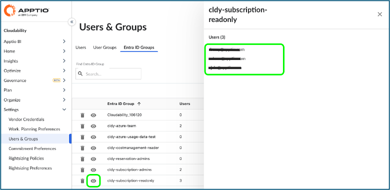
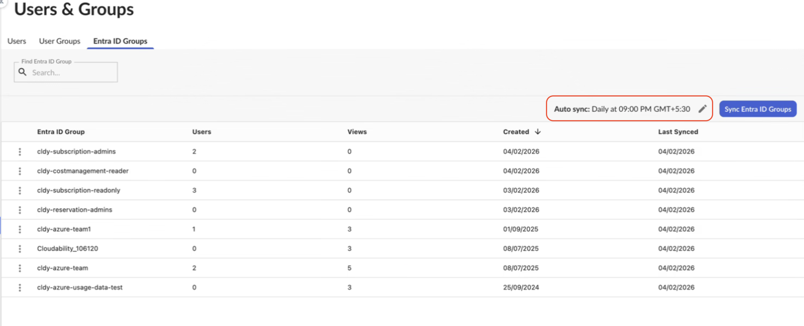
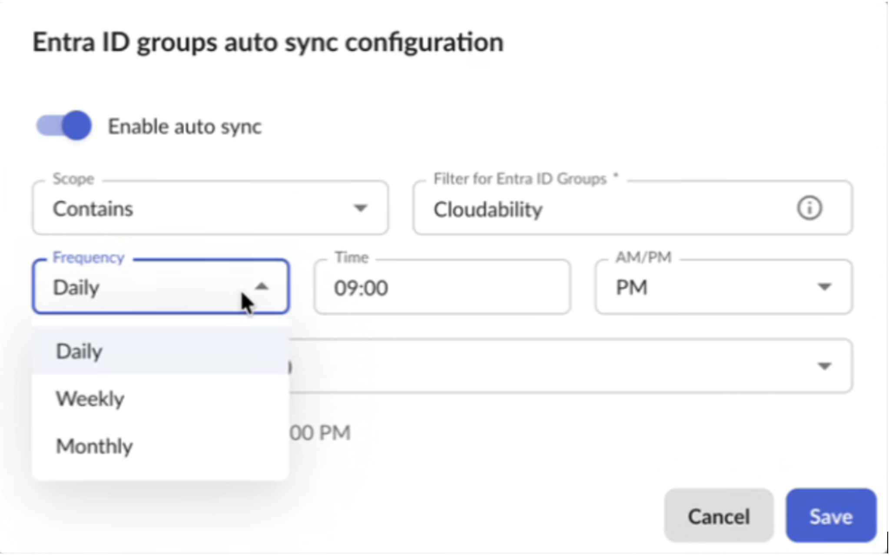
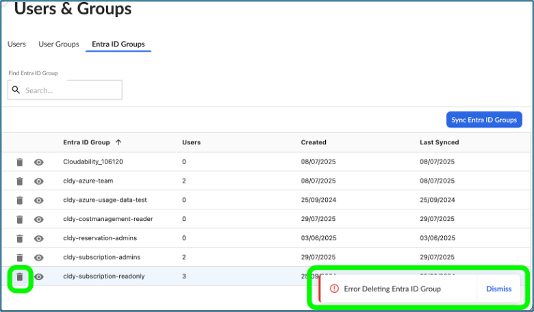
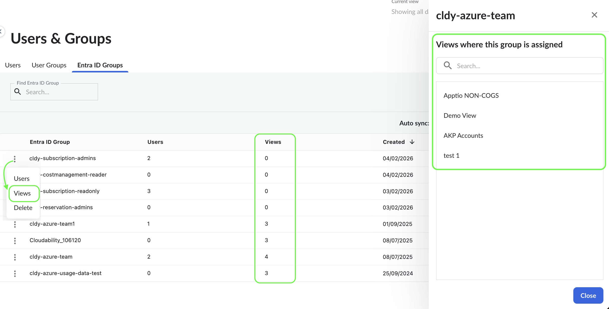
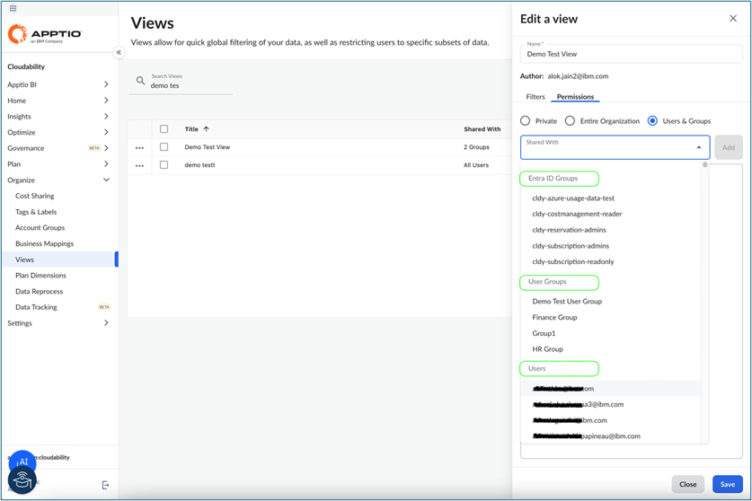
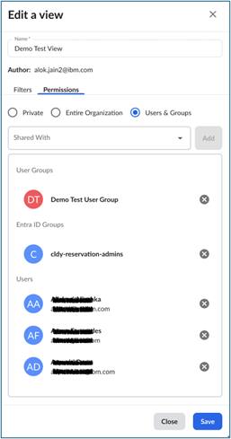

# Gerenciar grupos de IDs Entra

## Visão geral

A **integração Entra ID Groups** permite que os administradores do Cloudability gerenciem o acesso de usuários sincronizando as informações do grupo de usuários diretamente do Microsoft Entra ID (anteriormente Azure Active Directory ). Em vez de criar e manter manualmente os grupos de usuários no site Cloudability, é possível importar grupos Entra ID existentes e atribuí-los às visualizações para obter acesso controlado.

Esse recurso simplifica o gerenciamento de permissões ao alinhar os controles de acesso do site Cloudability com os Entra ID Groups da sua organização. Todas as atualizações de associação a grupos no Entra ID (por exemplo, quando os usuários entram ou saem de equipes) são refletidas automaticamente no site Cloudability durante a sincronização, garantindo acesso consistente e atualizado sem intervenção manual.

Observação: O Entra ID não tem nada a ver com SSO.

## Como

**Pré-requisitos**

Antes de começar, certifique-se de que:

- Você é um administrador do Cloudability.
- Você concluiu o credenciamento do locatário do Microsoft Entra ID. Para saber mais, acesse [Connect Microsoft Entra ID](connect-microsoft-entra-ID.html)

## Importar grupos de IDs Entra para Cloudability

Os grupos de ID da Entra não podem ser criados manualmente em Cloudability e devem ser importados ou sincronizados a partir do seu locatário de ID da Entra. Para importar:

1. Navegue até Configurações > Usuários e grupos > aba Grupos de ID de entrada.
2. Clique no botão Sincronizar grupos de IDs Entra.

   
3. Na caixa de diálogo exibida, insira os critérios (Escopo e a base do filtro de texto com a qual o site Cloudability importará os grupos de IDs do Entra) e clique em **Next (Avançar** ).

   
4. Clique em **Sync Now (Sincronizar agora** ) para iniciar a importação.

   

   Essa ação extrai todos os Entra ID Groups do locatário credenciado que correspondem aos critérios especificados.

   Nota:
   - Os grupos Entra ID são somente leitura : Esses grupos ou seus usuários não podem ser modificados no site Cloudability.
   - Embora seja possível excluir um grupo Entra ID importado do site Cloudability, não é possível modificar o nome do grupo ou seus usuários.
   - Critérios de importação : Você pode usar diferentes critérios de sincronização para importar grupos de IDs Entra para Cloudability
   - Duração da sincronização : A sincronização pode levar de alguns segundos a alguns minutos, dependendo do número de grupos e usuários que estão sendo importados.
   - Comportamento de sincronização :
     - Um grupo existente será sobrescrito durante a sincronização. Qualquer adição ou remoção de usuários do Entra ID será sincronizada.
     - Se um grupo tiver sido excluído no Entra ID, ele não será removido automaticamente do site Cloudability. Você deve excluí-lo manualmente.
     - Somente um grupo pode ser excluído por vez.
   - Justificativa para o comportamento de sincronização :
     - Cloudability não consegue distinguir se um grupo está faltando devido à exclusão no Entra ID ou devido a uma alteração nos critérios de sincronização.
     - Um grupo ainda pode estar associado a atribuições de visualização ativas. A exclusão automática desse grupo pode revogar involuntariamente o acesso de vários usuários.
5. Clique em um ícone de olho de grupo para verificar a lista de usuários pertencentes ao grupo.

   

## Configurar a sincronização automática para grupos de identificação Entra

As alterações nos grupos Entra ID ocorrem continuamente, o que pode dificultar a atualização completa dos grupos Entra ID no Cloudability por meio da sincronização manual. Para eliminar esse esforço manual, o Cloudability permite que você configure uma programação de sincronização automática.

Você pode configurar uma **sincronização automática diária, semanal ou mensal** usando critérios de filtro específicos. Os grupos Entra ID serão então sincronizados automaticamente com base na programação configurada.

Para configurar a sincronização automática para grupos Entra ID:

1. Navegue até Configurações > Usuários e grupos > guia Grupos do Entra ID.
2. Clique no ícone **do lápis (Editar)** ao lado de Sincronização automática.

   
3. Para ativar a sincronização automática, ative a opção **Ativar sincronização automática**.
4. No modal **Configuração** da sincronização automática:
   1. Revise ou atualize os critérios do filtro.
   2. Selecione a frequência de sincronização ( **diária**, **semanal** ou **mensal** ).
   3. Escolha a hora de sincronização e **o fuso horário**.
5. Clique em **Salvar** para ativar a programação de sincronização automática.
6. Para desativar a sincronização automática a qualquer momento, desative a opção **Ativar sincronização automática** e salve.

## Excluir grupos de ID Entra em Cloudability

Se um grupo tiver sido excluído no lado do Entra ID, ele **não** será excluído automaticamente no site Cloudability - você deverá excluí-lo manualmente.

Para excluir um Entra ID Group:

1. Navegue até Configurações > Usuários e grupos > guia Grupos do Entra ID.
2. Localize o grupo que deseja excluir.
3. Clique nos pontos de suspensão (...) ícone e selecione a opção do menu “Excluir”.

Observação: A exclusão de um grupo será impedida se ele estiver atribuído a alguma visualização. O seguinte erro é exibido:

## Exibir visibilidade de atribuições para grupos Entra ID

Se um Grupo de IDs Entra foi usado na atribuição de Visualização, o sistema bloqueou sua exclusão. Os administradores podem ver uma **lista somente leitura de todas as Visualizações** às quais um grupo está atribuído. A lista exibe os nomes das exibições e indica claramente quando um grupo não é usado em nenhuma exibição, ajudando a otimizar a limpeza do grupo e reduzir o esforço manual.

Para identificar quais visualizações estão usando o Entra ID Group.:

1. Navegue até Configurações > Usuários e grupos > guia Grupos do Entra ID.
2. A coluna Visualizações mostra o número de visualizações em que este Grupo de IDs Entra está atribuído.
3. Encontre o grupo que deseja validar.
4. Clique nos pontos de suspensão (...) ícone e selecione “Visualizações” no menu.
5. No painel lateral, você verá a lista de visualizações às quais este Grupo de IDs Entra está atribuído.

## Atribuir acesso de visualização a grupos Entra ID

Para atribuir acesso de visualização a um Entra ID Group ou a vários Entra ID Groups:

1. Navegue até Organize > Views e crie ou edite uma View. Clique em Permissões > Selecione " Usuários e Grupos " e o menu suspenso Compartilhado com. Atribua View aos grupos Entra ID importados no menu suspenso.

   

   Salve isso para atribuir a visualização a todos os usuários do(s) grupo(s) de ID Entra.
2. Opcionalmente, adicione uma combinação de grupos de usuários, grupos de ID Entra e usuários individuais à visualização.

   
3. Se uma visualização tiver sido criada originalmente como **privada** ou em nível de **organização**, o administrador da visualização poderá alterá-la para compartilhada com usuários e grupos, selecionando a opção de visualização **"Usuários e grupos"** e atribuindo os usuários, grupos de usuários e/ou grupos de IDs Entra.

**Tópico pai:** [Gerenciar usuários e grupos de usuários](../admin/manage-users-and-user-groups.html)
