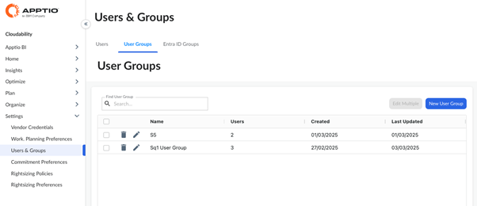
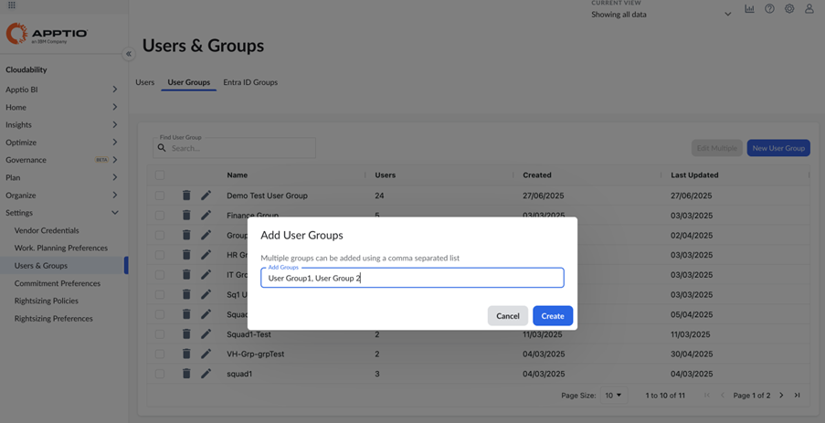
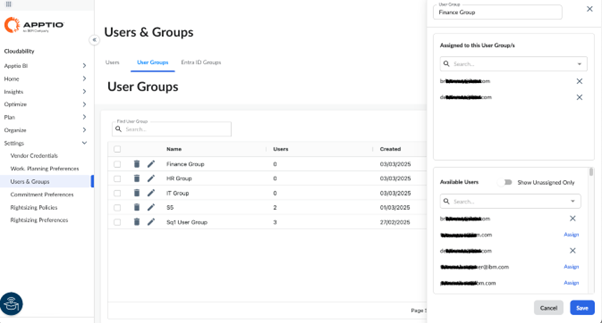
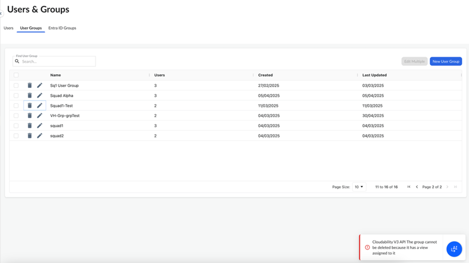
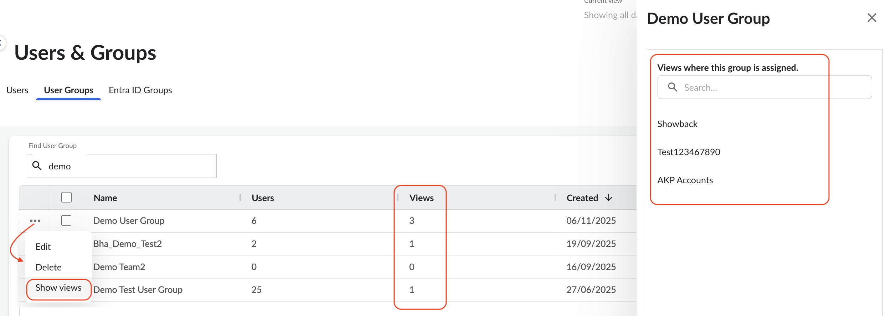
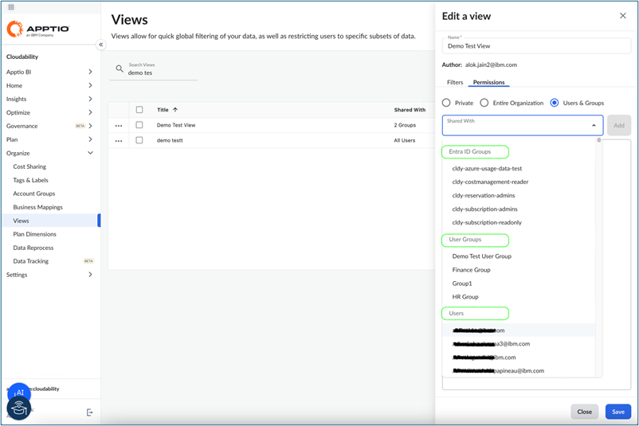

# Gerenciar grupos de usuários

## Visão geral

Um **Grupo de Usuários** no Cloudability é um conjunto lógico de usuários criado para simplificar o gerenciamento de acesso e agilizar a atribuição de Visualizações.

Ao organizar os usuários em grupos, os administradores podem aplicar configurações consistentes com mais facilidade, controlar o acesso às visualizações e manter a governança em toda a sua prática de FinOps.

## Como

**Pré-requisitos**

Antes de começar, certifique-se de que:

- Você é um administrador do Cloudability.

## Criar um grupo de usuários no Cloudability

Para criar um grupo de usuários:

1. Acesse Configurações > Usuários e Grupos > guia Grupos de usuários.

   
2. Para criar um novo grupo de usuários, clique em “Novo grupo de usuários ”. Você pode criar vários grupos de usuários de uma só vez, separando os nomes por vírgulas.

   
3. Clique em “Editar usuários” e adicione usuários ao grupo de usuários a partir da lista de usuários.

   
4. Clique em Salvar.

## Excluir um grupo de usuários no Cloudability

Para excluir um grupo de usuários:

1. Acesse Configurações > Usuários e Grupos > guia Grupos de usuários.
2. Encontre o grupo que você deseja excluir.
3. Clique nas reticências (…) ícone e selecione a opção de menu “Excluir”.

Observação: não é possível excluir um grupo se ele estiver atribuído a alguma visualização no momento. Aparece o seguinte erro:

## Visualizar a visibilidade das atribuições para grupos de usuários

Se um Grupo de Usuários tiver sido utilizado na atribuição de visualização, o sistema bloqueou sua exclusão. Os administradores podem visualizar uma **lista somente para leitura de todas as Visualizações** às quais um grupo está atribuído. A lista exibe os nomes das visualizações e indica claramente quando um grupo não é utilizado em nenhuma visualização, o que ajuda a otimizar a limpeza dos grupos e a reduzir o trabalho manual.

Para identificar quais Views estão utilizando o User Group.:

1. Acesse Configurações > Usuários e Grupos > guia Grupos de usuários.
2. A coluna “Visualizações” mostra o número de visualizações às quais este grupo de usuários está atribuído.
3. Encontre o grupo que você deseja validar.
4. Clique nas reticências (…) ícone e selecione “Mostrar visualizações” no menu.
5. No painel lateral, você verá a lista de visualizações às quais este Grupo de Usuários está atribuído.

## Atribuir acesso à visualização a grupos de usuários

Para atribuir o acesso à visualização a um grupo de usuários ou a vários grupos de usuários:

1. Acesse Organizar > Visualizações e crie ou edite uma visualização. Selecione a opção “Usuários e grupos” e um valor no menu suspenso “Compartilhado com ”.

   Atribua a visualização a um ou mais grupos a partir do menu suspenso (na categoria “Grupos de usuários”).

   

   Clique em “Salvar” para atribuir a visualização a todos os usuários do(s) grupo(s) de usuários.
2. Opcionalmente, adicione uma combinação de grupos de usuários, grupos do Entra ID e usuários individuais à visualização.

   
3. Se uma visualização tiver sido criada originalmente como **“Privada”** ou no nível **da organização**, o administrador da visualização pode alterá-la para uma visualização compartilhada com “Usuários e **Grup** os”, selecionando a opção “Usuários e Grupos” e atribuindo os usuários, grupos de usuários e/ou grupos de Entra ID.

**Tópico principal:** [Gerenciar usuários e grupos de usuários](../admin/manage-users-and-user-groups.html)
