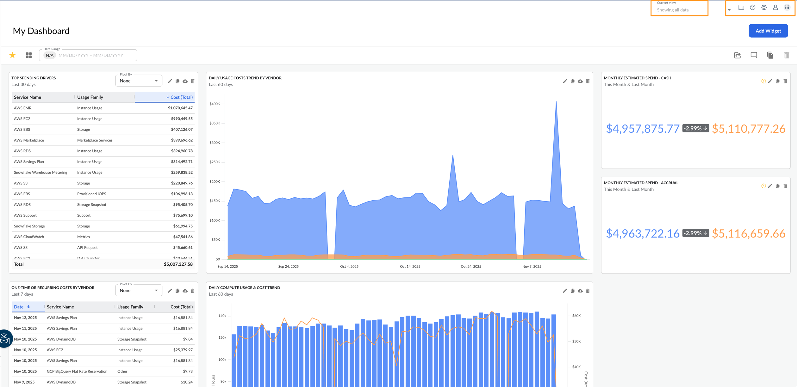
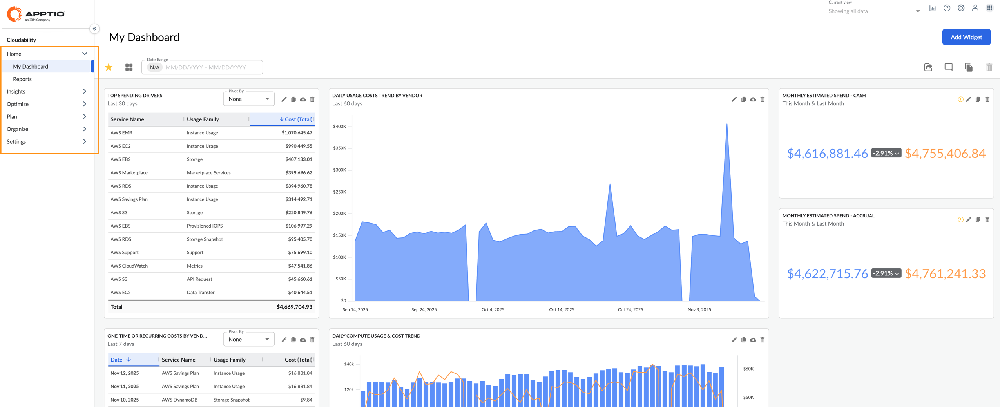

# Encontre seu caminho Cloudability

## Cloudability Barra de ferramentas

Permite acesso rápido para gerenciar o perfil, o acesso, as preferências e muito mais.

## Visualização atual

Permite que você selecione filtros em todo o aplicativo para diferentes usuários na sua conta Cloudability, para restringir os dados do Cloudability.

## Barra de ferramentas

Permite o acesso a várias páginas de ajuda e acesso ao suporte, rastreamento do status de relatórios exportados, várias configurações no nível do aplicativo e gerenciamento do seu perfil e acesso. Essas opções são apresentadas com base em sua função

| Ícone | Descrição | Utilitários |
| --- | --- | --- |
| ícone de ajuda | Ajuda | Será possível:  Pesquisar na central de ajuda  Enviar comentários  Enviar um tíquete de suporte  Acesse a documentação da API Cloudability  Acesse a central de suporte  Veja o que há de novo em Cloudability |
| ícone de download | Exportações de relatórios | Será possível:  Visualizar o status dos relatórios que você exportou  Fazer o download novamente de um relatório que você exportou anteriormente |
| ícone de configurações | Configurações | Será possível:  Gerencie tarefas automatizadas de gerenciamento de dados e acompanhe o status  Configurar calendários fiscais  Mudar para vários ambientes ou Apptio produtos  Gerenciar a administração de acesso  Configurar várias moedas  Exibir anomalias, configurar alertas de anomalias  Configurar o host do agente de métricas  Exibir relatórios assinados  Gerenciar as preferências do usuário  Gerenciar permissões e configurações de fontes de dados  Gerencie seu perfil, preferências como preferências de e-mail diário, configurações de organização, moeda e chave de API  Gerenciar preferências de notificação orçamentária |
| ícone da conta de usuário | Configurações de perfil | Será possível:  Gerenciar seu perfil  Fazer-se passar por outro usuário  Gerenciar contas de usuário e administração de acesso  Os administradores podem querer fazer isso para verificar as permissões do usuário ou para solucionar problemas de acesso.  Sair |
| ícone do menu do aplicativo | Todos os produtos | Navegar para outro produto Apptio / IBM ou outro ambiente |

## Cloudability Navegação

O menu ou navegação à esquerda em Cloudability permite acessar vários recursos oferecidos pelo produto. O menu apresentado é baseado em sua função.

| Ícone | Descrição | Utilitários |
| --- | --- | --- |
| ícone máximo ícone mínimo | Maximizar / Minimizar | Maximizar / minimizar a navegação |
| Página inicial |  | Ferramentas para visualizar/gerenciar seu painel de controle e relatórios Meu painel  Relatórios |
| Insights |  | Ferramentas para explorar seus dados visualmente, como: TrueCost Explorer  Etiqueta Explorer  Contêineres  Inventário de recurso  Detecção de anomalias  Marcadores de desempenho e mais. [Saiba mais sobre o Insights](../product/aws-resource-inventory.html) |
| Otimizar |  | Ferramentas para otimizar seus recursos de nuvem e fornecer visibilidade de suas oportunidades e economias. Dentre eles: Portfólio de compromissos  Registros de compromisso  Gerenciador de compromisso  Dimensionamento correto  Dimensionamento correto do ROI  Turbonomic [Saiba mais sobre o Optimize](../product/optimization_dashboard.html) |
| Planejar |  | Ferramentas para orçamentos e previsões. Veja a tendência das despesas e defina orçamentos para receber alertas por e-mail. Mês atual  Previsão  Orçamentos  Planejamento da carga de trabalho  Planos [Saiba mais sobre o Plano](../product/plan-and-manage-your-budgets-and-forecasts.html) |
| Organizar |  | Ferramentas para organizar tags, contas em grupos, infraestrutura de nuvem, além de filtrar seus dados. Compartilhamento de custos  Etiquetas e rótulos  Grupos de contas  Mapeamentos de negócios  Visualizações  Dimensões do plano  Reprocessamento de dados [Saiba mais sobre o Organize](../product/cost-sharing.html) |
| Configurações |  | Ferramentas para gerenciar a integração dos dados do fornecedor de nuvem em Cloudability, gerenciamento de usuários e gerenciamento de várias preferências. Credenciais do fornecedor  Preferências de planejamento de carga de trabalho  Datalink  Usuários e grupos  Preferências de compromisso  Políticas de dimensionamento correto  Preferências de dimensionamento correto [Saiba mais sobre as configurações](../admin/vendor-credentials.html) |
| ícone de logout | Sair | Fazer logout do aplicativo |
