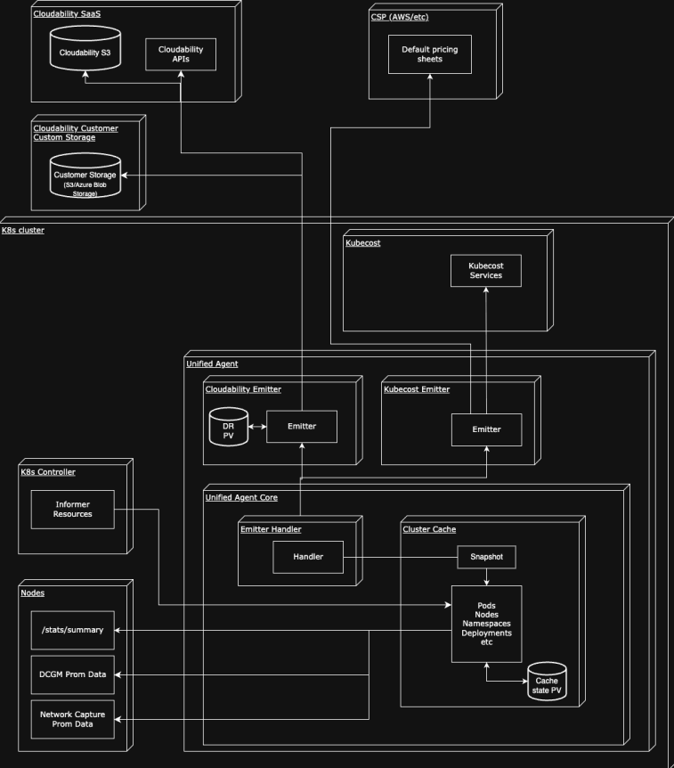
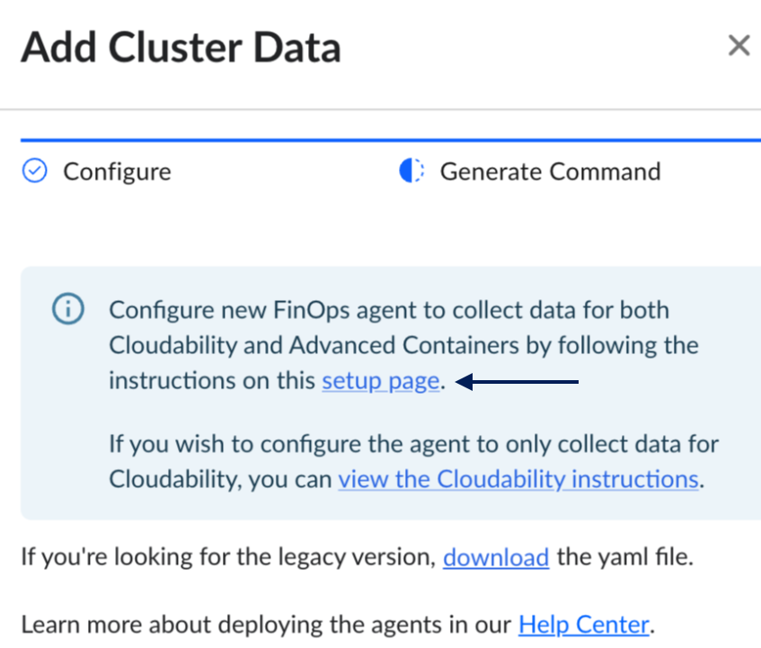
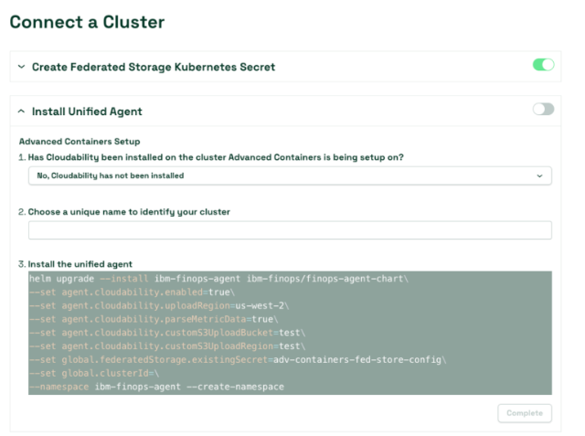
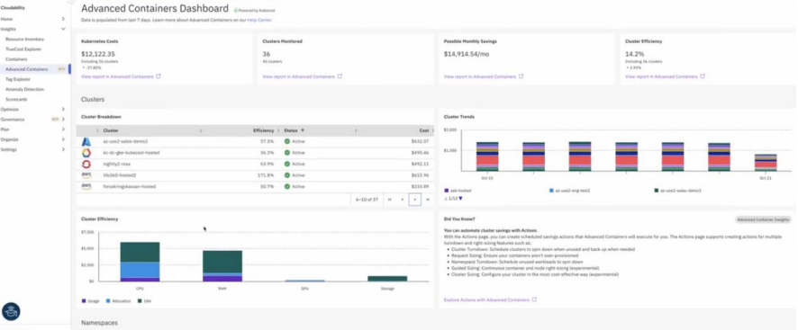
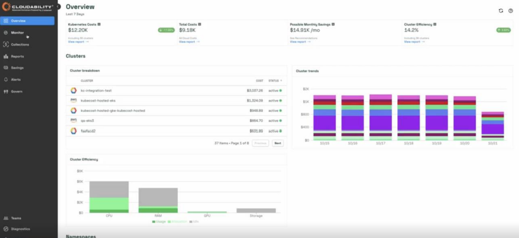

# Cloudability Contêineres avançados

**Visão geral**

O novo módulo Advanced Containers do Cloudability traz a visibilidade em tempo real dos custos de contêineres do Kubecost e outros recursos para a estrutura do Cloudability SaaS, fornecendo uma visão unificada dos gastos com nuvem e Kubernetes para as equipes de engenharia de plataforma ( FinOps, ) e de operações de nuvem ( DevOps ). *Esse recurso está disponível hoje como um complemento opcional pago para todos os clientes do Cloudability Essential, Standard e Premium*. Com essa oferta, você pode alocar custos em um nível ainda mais granular (namespace, rótulo, anotação, controlador, serviço etc.), obter recomendações imediatas de economia para cargas de trabalho d Kubernetes s e aplicar governança de custos — tudo isso na interface do Frontdoor. Ele oferece suporte a **ambientes multicloud ( AWS, Azure, GCP, Oracle )** e **híbridos/locais** Kubernetes ( OpenShift e outros), para que você possa gerenciar custos em clusters executados em qualquer lugar.

**Principais recursos disponíveis no módulo Containers Avançados**

- **Visibilidade dos custos em tempo real do Kubernetes**

  Fornece monitoramento contínuo e em tempo real do consumo de recursos do Kubernetes e dos custos associados em todos os clusters, permitindo uma visão imediata das tendências e anomalias de gastos.

- **Alocação granular de custos e showback**

  Oferece alocação precisa de custos em todas as estruturas nativas do Kubernetes — incluindo clusters, nós, namespaces, implantações, serviços, rótulos e anotações — totalmente reconciliadas com os dados reais de faturamento da nuvem para showback e chargeback precisos.

- **Informações e recomendações sobre otimização**

  Oferece orientação de otimização integrada e recomendações de economia acionáveis para reduzir os gastos com o Kubernetes, mantendo o desempenho e a confiabilidade da carga de trabalho.

- **Orçamentos, alertas e governança**

  Permite a governança financeira proativa para ambientes Kubernetes com orçamentos em tempo real, alertas e controles de gastos no nível de cluster, equipe ou namespace, alinhados aos orçamentos de nuvem existentes.

**Arquitetura de integração**

Nos bastidores, a integração é alimentada pelo **IBM FinOps Agent**, um coletor de dados unificado em cluster de código aberto ( [GitHub](https://github.com/kubecost/ibm-finops-agent "(Abre em uma nova guia ou janela)") ) que substitui o antigo agente de métricas Cloudability e o coletor autônomo Prometheus da Kubecost. O agente FinOps é executado em cada cluster Kubernetes e coleta o uso de recursos e metadados diretamente da API Kubernetes, do nó, do kernel e de outras fontes. Em seguida, ele **emite** esses dados para o backend do Cloudability e Kubecost.

Em intervalos regulares (por padrão, o agente faz a coleta a cada 30 segundos e emite a cada 10 minutos), o exportador do agente captura um instantâneo do estado do cluster — incluindo pods, nós e métricas de uso — e o entrega a cada emissor habilitado. Essa arquitetura modular garante que os dados sejam coletados uma única vez e enviados de forma eficiente tanto para o núcleo Cloudability quanto para o módulo Advanced Containers.

Essa arquitetura permite que o Cloudability e o Kubecost trabalhem em conjunto: o Cloudability fornece relatórios de custos de alto nível, tendências e contexto multicloud (com todos os serviços em nuvem), enquanto o Kubecost fornece insights específicos e aprofundados sobre o Kubernetes e exploração em tempo real. A implantação de um único agente simplifica a sobrecarga, eliminando a necessidade de uma instância completa do Prometheus em cada cluster (economizando memória/CPU). O agente é leve e funciona como um único pod de contêiner para facilitar o dimensionamento e a resiliência. Toda a coleta de dados utiliza APIs ou métricas nativas d Kubernetes, e nenhuma carga sensível (como dados de aplicativos) é enviada – apenas metadados de recursos e faturamento necessários para cálculos de custos.

 (Diagrama de arquitetura para um agente IBM FinOps )

**Como obter acesso**

O módulo Advanced Containers do Cloudability é um recurso adicional opcional pago disponível para clientes do Cloudability. Para obter acesso, entre em contato com seu representante ou suporte da IBM / Apptio para solicitar acesso a esses novos recursos. Eles confirmarão quaisquer requisitos de licenciamento e ativarão o sinalizador de recurso em seu ambiente Cloudability (se aplicável). Se você ainda não é cliente da IBM / Apptio, entre em contato conosco [aqui.](https://www.ibm.com/ca-en/contact?contactmodule "(Abre em uma nova guia ou janela)")

Configuração e instalação

A configuração da integração do Cloudability com o Kubecost envolve a implantação do **agente** IBM FinOps em cada cluster Kubernetes que você deseja monitorar. Depois de implantado, o agente coletará e enviará dados automaticamente para sua instância do Cloudability e Kubecost.

**Visão geral do processo de instalação:**

**1. Obtenha a chave API e os segredos:** Cloudability usa seu sistema de autenticação centralizado “Frontdoor” Apptio para APIs. Você pode obter essas chaves seguindo as etapas na seção “**Autenticação** ” desta [documentação.](https://www.ibm.com/docs/en/cloudability-commercial/cloudability-essentials/saas?topic=cloudability-kubernetes-cluster-provisioning "(Abre em uma nova guia ou janela)")

**2. Definir o ID do cluster:** Decida um identificador exclusivo para o seu cluster (por exemplo, “prod-cluster-1” ). Se estiver usando o assistente da interface do usuário Cloudability, você deverá inserir o nome do cluster e a versão Kubernetes, e ele irá incorporar isso na configuração. O ID do cluster é usado para marcar os dados enviados para Cloudability e deve permanecer consistente para esse cluster. (Para clusters do GKE, adicione também um rótulo de cluster no lado do GCP : marque seu cluster com a chave gke-cluster e o valor correspondente ao ID do cluster. Isso ajuda a Cloudability mapear GKE os dados de faturamento para o cluster correto.)

*Dica:* recomenda-se usar uma convenção de nomenclatura para IDs de cluster que seja única globalmente em todos os seus clusters (por exemplo, inclua um código de ambiente ou região). Depois de escolhido, você não deve alterar o ID de um cluster, ou o Cloudability irá tratá-lo como um cluster diferente.

**3. Implante o agente IBM FinOps no seu cluster** – O agente FinOps é fornecido como um gráfico Helm para facilitar a instalação. Você pode usar o comando Helm gerado por Cloudability (através da caixa de diálogo Provision) ou instalar manualmente usando o repositório Helm publicado. Para instalar manualmente usando o Helm 3 no seu cluster:

O agente IBM FinOps inclui **dois emissores** : um para Kubecost e outro para Cloudability. Para enviar dados para ambas as plataformas, você deve habilitar **ambos os emissores** durante a instalação. Na seção *Gerar comando* (em **Provisionar cluster** ), clique no link mostrado na captura de tela abaixo e siga as instruções para habilitar os dois emissores.

**Observação:** *o comando exibido em Cloudability Container Insights habilita* ***apenas o emissor Cloudability****. Você ainda precisará configurar o emissor Kubecost separadamente, seguindo as instruções do link.*



Isso abrirá a seguinte interface do usuário, que o guiará pelo processo de instalação



- Instale ou atualize o agente no seu cluster:

```
helm upgrade --install ibm-finops-agent \
--repo https://kubecost.github.io/finops-agent-chart finops-agent \
--namespace ibm-finops-agent \
--set agent.cloudability.uploadRegion=us-west-2 \
--set agent.cloudability.parseMetricData=false \
--set agent.cloudability.secret.cloudabilityEnvId=<yourenvironmentid> \
--set clusterId=test \
--set agent.cloudability.secret.create=true \
--set agent.cloudability.secret.cloudabilityAccessKey=<AccessKey> \
--set agent.cloudability.secret.cloudabilitySecretKey=<SecretKey> \
--set agent.cloudability.enabled=true \
--set global.federatedStorage.existingSecret=adv-containers-fed-store-config
```

- No comando acima, substitua <YOUR\_CLUSTER\_ID> pelo ID exclusivo do cluster escolhido e forneça a chave da API Cloudability e o ID do ambiente obtidos na etapa 1. Esses valores garantem que o agente saiba para onde enviar os dados. O gráfico criará uma implantação de agente de controle de acesso ( Kubernetes Deployment) ou uma implantação de agente de controle de acesso de serviço ( DaemonSet ) para o agente, juntamente com as funções RBAC necessárias.

- **Permissões:** Certifique-se de ter privilégios de administrador de cluster ao instalar. O gráfico “ Helm ” configurará uma conta de serviço e funções de cluster que permitem ao agente ler as métricas necessárias (pods, nós, namespaces, etc.). Se estiver usando políticas RBAC restritivas, talvez seja necessário conceder manualmente as permissões ao agente, conforme a documentação.

- **Rede e armazenamento:** O agente requer acesso de saída HTTPS a partir do cluster. Especificamente, ele deve acessar frontdoor.apptio.com (para autenticação) e api.cloudability.com (ou equivalentes regionais) na porta 443. Ele também carrega dados para um bucket S3 de propriedade da Apptio, portanto, é necessário acessar \*.s3.amazonaws.com (com o nome do bucket prefixado com apptio). Se o seu cluster estiver atrás de um proxy ou firewall, configure regras de saída para permitir esses pontos de extremidade. Além disso, o gráfico “ Helm **” (Gerenciador de volume persistente)** cria, por padrão, uma solicitação de volume persistente (PVC) ( 8Gi por padrão) para o agente. Este armazenamento é usado para armazenar dados de métricas em caso de problemas de conectividade ou reinicialização do agente, evitando a perda de dados. Certifique-se de que seu cluster pode provisionar este PVC (os valores podem ser ajustados, se necessário).

- **Fonte da imagem:** Observe que a imagem do contêiner do agente FinOps está hospedada no IBM Container Registry ( icr.io ), e não no Docker Hub. Certifique-se de que as políticas de extração de imagens ou o firewall do seu cluster permitam icr.io/ibm-finops/ \*. Se você usar um espelho de registro privado, talvez seja necessário extrair e enviar a imagem de icr.io manualmente (a documentação fornece um exemplo de extração Podman ).

Quando a instalação do Helm for concluída, verifique se o pod do agente está em execução:

```
kubectl get pods -n kubecost
```

Você deverá ver um pod chamado kubecost-finops-agent-... no estado Running (Em execução).

**3. Ingestão e verificação de dados** – Após a implantação do agente, ele começará a coletar dados imediatamente. No entanto, o processamento SaaS da Cloudability normalmente refletirá os novos dados **em até uma hora**. Na interface do usuário do Cloudability, acesse **Advanced Containers** (Contêineres avançados) e verifique se o seu cluster aparece na lista de clusters provisionados. Inicialmente, pode aparecer como aguardando dados. Em 24 horas, você deverá começar a ver as informações de alocação de custos para esse cluster nos painéis de custos de contêineres d Cloudability. Você também pode verificar os registros do agente para ver se ele está enviando dados com sucesso (procure por linhas de registro que indiquem dados carregados).

Assim que os dados começarem a fluir, Cloudability exibirá os custos alocados para os namespaces, rótulos etc. do seu cluster juntamente com seus outros custos de nuvem. O Kubecost (se instalado) também começará a exibir dados de custo em sua interface do usuário em tempo real (geralmente alguns minutos após a implantação). Lembre-se de que o Cloudability depende das exportações de faturamento da nuvem para o custo *total* do cluster (por exemplo, o custo das VMs do nó). Se essas exportações de faturamento ainda não estiverem configuradas ou atualizadas, você poderá ver dados parciais. Certifique-se de que a integração de faturamento na nuvem no Cloudability esteja configurada (consulte **os pré-requisitos** abaixo).

**4. Habilite SSO/Acesso (se aplicável)** – Se sua organização usa SSO para produtos Apptio, você pode integrar o acesso do Kubecost com o login do Cloudability. O módulo Kubecost pode utilizar o mesmo SSO através de um Frontdoor d Apptio, para que os usuários que estão conectados ao Cloudability possam acessar o Kubecost sem precisar fazer login separadamente. Trabalhe com o suporte da IBM para configurar essa autenticação compartilhada se você planeja usar a interface de usuário autônoma do Kubecost. Isso normalmente envolve configurar o Kubecost com OIDC apontando para o Frontdoor Apptio IdP e conceder aos usuários as funções apropriadas no Kubecost (que podem espelhar as funções Cloudability ).

**Uso do produto**

Cloudability O Advanced Containers consiste em **dois componentes integrados** :

**1. Contêiner avançado (página de visão geral dentro da interface do usuário Cloudability )**

Isso proporciona uma experiência simplificada e nativa do Cloudability, adaptada aos fluxos de trabalho do FinOps, destacando os custos do cluster, a eficiência, as tendências do namespace, os gastos com a nuvem e o uso da rede. Foi projetado para fornecer insights rápidos, relatórios executivos e visibilidade dos custos diários.

**2. Aplicativo avançado independente para contêineres (experiência Kubecost 3.0 dentro do Frontdoor)**

Esta é a interface completa do Kubecost, que oferece análises técnicas detalhadas de custos, alocações granulares, fluxos de rede, ferramentas de diagnóstico e opções avançadas de configuração. Ele foi desenvolvido para equipes de engenharia, SREs e proprietários de plataformas que precisam de informações detalhadas sobre custos por hora e controles operacionais.

Juntas, essas duas peças oferecem **resumos** e FinOps-ready es e **profundidade de nível de engenharia**, criando uma experiência unificada de Contêineres Avançados em Cloudability e Kubecost.

**1. Usando a análise de custos do Kubernetes em Cloudability**

**1.a. Container avançado (página de visão geral dentro da interface do usuário do Cloudability )**

Em Cloudability SaaS, navegue até **Insights > Contêineres avançados**. Isso abrirá a **página de visão geral do Advanced Container**.



- **Resumo dos custos gerais**

Mostra os custos totais de e Kubernetes, os custos totais de nuvem e as economias mensais potenciais em um único lugar.

Apresenta as alterações semanais para que os usuários possam identificar instantaneamente picos de custos ou anomalias.

Destaca a eficiência geral do cluster, ajudando as equipes a comparar o desperdício e as necessidades de otimização.

- **Discriminação por nível de cluster**

Lista todos os clusters com seus gastos individuais e status de integridade (ativo/não monitorado).

Ajuda os usuários a identificar rapidamente os clusters mais caros e validar a conectividade/monitoramento.

Fornece tendências ao longo do tempo para que as equipes possam ver como os custos do cluster evoluem diariamente.

- **Visão geral da eficiência de recursos**

Exibe a alocação de CPU, RAM, GPU e armazenamento em comparação com o uso real.

Torna visível o custo de inatividade versus uso, ajudando a quantificar o desperdício em todos os recursos.

Apoia decisões imediatas de dimensionamento e planejamento de capacidade.

- **Informações sobre custos no nível do namespace**

Lista os principais namespaces que impulsionam os gastos nos clusters.

Inclui gráficos de tendências para mostrar quando e onde os custos do namespace estão aumentando.

Ajuda a identificar antecipadamente cargas de trabalho ruidosas ou em crescimento.

- **Discriminação dos custos de rede:**

  Destaca namespaces e serviços com grande volume de saída ou tráfego. Superfícies de destinos de tráfego inter-regionais ou interzonais dispendiosos. Ajuda as equipes a controlar os custos ocultos de saída, frequentemente ignorados nas análises de FinOps.

**Observação:** *Os dados de custos do Advanced Containers são gerados em tempo real a partir do uso, enquanto Cloudabilityos dados oficiais de faturamento da nuvem são normalmente atualizados diariamente. Podem existir discrepâncias entre as estimativas de custos imediatas da Kubecost e os custos finais faturados que aparecem em Cloudability devido a questões de tempo, reembolsos ou descontos. Ao longo de um mês completo, os números devem coincidir (especialmente se utilizar o custo ajustado/amortizado em Cloudability para incluir descontos). Mas não se preocupe se, em um determinado dia, a interface do usuário do Kubecost mostrar $X para um namespace e Cloudability mostrar $X ± alguns por cento – isso é esperado devido às diferentes metodologias utilizadas. A integração tem como objetivo fornecer informações oportunas, e não um livro contábil exato a cada momento.*

**1.b. Utilizando o Módulo Autônomo Avançado para Contêineres**

Para usuários que precisam de análises mais interativas específicas do Kubernetes ou controle em tempo real, a **interface do usuário Advanced Containers** pode ser usada junto com o Cloudability :



- **Acessando a interface do usuário do Advanced Containers:** Se o Advanced Containers estiver implantado, ele poderá ser acessado diretamente no seu navegador através do Frontdoor. Cloudability também exibe um link direto dedicado na página Visão geral avançada de contêineres, permitindo que os usuários abram o contêiner avançado independente (interface do usuário do Kubecost 3.0 ) em uma nova guia. Com o SSO compartilhado, os usuários podem navegar facilmente sem precisar fazer login separadamente.

- **A interface do usuário do Kubecost** oferece uma experiência mais rica e interativa do que a visão geral do Cloudability. Por exemplo, a visualização de alocação de custos suporta agrupamento multidimensional, filtragem avançada AND/OR (introduzida no Kubecost 3.0 ) e visualização imediata dos impactos nos custos. O Kubecost também mantém dados históricos detalhados, incluindo resolução por hora, com configurações de retenção configuráveis para permitir análises aprofundadas.

- **Kubernetes Otimização e ações:** Na interface do usuário do Kubecost, você pode explorar insights de otimização específicos em profundidade. Por exemplo:

- **Recomendações de economia (Insights de economia):** uma lista de oportunidades como “remover volumes persistentes não utilizados” ou “reduzir o tamanho dos nós ociosos”, juntamente com a economia estimada. Elas são baseadas em políticas (por exemplo, detectar se a utilização de um nó é inferior a 5% durante 7 dias).

- **Insights sobre dimensionamento adequado:** a Kubecost fornece recomendações **sobre o dimensionamento adequado de contêineres**. Você pode visualizar recomendações para as solicitações de CPU/memória de cada implantação com base no uso real. O Kubecost 3.0 adiciona uma nova interface de usuário para gerenciar solicitações de contêineres entre clusters com apenas alguns cliques. Você pode usar isso para reduzir os recursos solicitados e cortar custos imediatamente (especialmente em ambientes de autoescalonamento).

- **Otimização do grupo de nós (cluster):** o Kubecost pode sugerir como ajustar os tipos de instância de nó ou as configurações de autoescalonamento. Em v3.0, as recomendações de dimensionamento de nós consideram o uso da GPU e mostram visualizações da capacidade em comparação com o uso. Essas recomendações também levam em consideração os preços reais da nuvem (incluindo descontos corporativos ou instâncias reservadas) para estimativas realistas de economia.

- **Monitoramento de rede:** fornece um mapa visual dos fluxos de tráfego de rede entre cargas de trabalho, namespaces e serviços, ajudando as equipes a identificar caminhos de saída de alto custo, padrões de comunicação inesperados e possíveis gargalos de desempenho.

- **Automação:** Embora o Kubecost se concentre em recomendações (e possa executar algumas ações, como aplicar novas solicitações se tiver permissões), combiná-lo com o Turbonomic pode permitir o redimensionamento ou o agendamento automatizados com base nessas informações. Essa integração faz parte da estratégia mais ampla da IBM, FinOps, que combina a transparência de custos da Cloudability, os insights sobre contêineres da Kubecost e a automação de ações da Turbonomic.

- **Orçamentos e alertas no Adv Containers:** Além do orçamento do Cloudability, o Advanced Containers permite configurar **alertas** para várias condições no nível do Kubernetes. Por exemplo, você pode definir um orçamento mensal para um namespace ou equipe, e o Advanced Containers pode enviar um alerta (e-mail, Slack, etc.) se o custo projetado exceder esse orçamento, o Advanced Containers oferece suporte a tipos de alertas como limites orçamentários, alterações percentuais nos gastos e alertas de eficiência para recursos. Isso pode ser gerenciado na interface do usuário do Advanced Containers (seção Alertas). A integração do Cloudability ainda não permite a criação de orçamentos específicos para o Kubernetes na interface do usuário do Cloudability, portanto, usar o Advanced Containers para esse alerta de orçamento granular pode ser útil. (O recurso de orçamento do Cloudability poderia ser usado no nível do cluster agregado, mas não por namespace – o Advanced Containers preenche essa lacuna.)

**Acesso à API:**

- Tanto o Cloudability quanto o Advanced Containers oferecem APIs para recuperar dados de custos. A API do Cloudability pode ser usada para extrair dados de custos combinados (incluindo alocações de contêineres) para integração com sistemas externos (como CMDBs ou sistemas de cobrança). A Advanced Containers fornece uma API (a API Kubecost) para consultar métricas de custo em tempo real por agregação (por exemplo, custo por rótulo nos últimos 7 dias). Em uma configuração integrada, você pode usar a API do Advanced Containers para consultas sob demanda (já que é em tempo real e residente no cluster) e a API do Cloudability para relatórios oficiais de custos mensais.

Por exemplo, um engenheiro de plataforma poderia consultar a API Advanced Containers no final do dia para ver o custo de uma implantação específica naquele dia (para feedback rápido aos desenvolvedores), em vez de esperar pela atualização do Cloudability do dia seguinte. Por outro lado, um analista financeiro pode usar [a API d Cloudability](https://www.ibm.com/docs/en/cloudability-commercial/cloudability-essentials/saas?topic=api-containers-end-points "(Abre em uma nova guia ou janela)") no final do mês para extrair os custos totalmente reconciliados dos contêineres (com descontos aplicados) para alimentar as faturas de estorno.

Para acessar os pontos finais da API Advanced Containers, você precisará de uma chave API Cloudability ou um apptio-opentoken para autenticação. Visite [Introdução à API do Cloudability V3](https://www.ibm.com/docs/en/cloudability-commercial/cloudability-premium/saas?topic=api-getting-started-cloudability-v3 "(Abre em uma nova guia ou janela)") para saber mais sobre como criar sua chave API do Cloudability e gerar apptio-opentokens.

Depois de obter uma chave API Cloudability ou apptio-opentoken, você poderá usá-la para acessar qualquer uma das APIs documentadas no [Diretório de APIs do Kubecost](https://www.ibm.com/docs/en/kubecost/self-hosted/3.x?topic=kubecost-api-directory "(Abre em uma nova guia ou janela)").

Esteja ciente de **que <kubecost-address>** mencionado nestes pontos finais será substituído por < **api.cloudability.com/v3/kubecost** >.

Exemplo de comando usando a chave API:

```
curl 'https://api.cloudability.com/v3/kubecost/model/allocation?window=3d&offset=20&limit=10&accumulate=true' -u '<your_api_key>:'
```

O mesmo exemplo usando apptio-opentoken:

```
curl 'https://api.cloudability.com/v3/kubecost/model/allocation?window=3d&offset=20&limit=10&accumulate=true' -H ”apptio-opentoken: <your_apptio-opentoken>” -H “apptio-environmentid: <your_frontdoor_enviornmentId>”
```

**Pré-requisitos e compatibilidade**

Antes de habilitar a integração do Advanced Containers, certifique-se de que seu ambiente atenda aos seguintes pré-requisitos e requisitos de compatibilidade:

- **Cloudability Dados da conta e de faturamento:** você deve ter uma conta ativa IBM Cloudability ( SaaS ) com acesso para configurar o recurso Containers. Normalmente, Cloudability já deve estar configurado com suas **exportações de faturamento** na nuvem:

- **AWS (** Relatório de uso e custo do Google Cloud): Um Relatório de Custo e Uso ( AWS ) (CUR) configurado e vinculado a Cloudability (geralmente por meio de um bucket S3 ). Isso é necessário para que Cloudability saiba os custos do seu EC2/EKS, incluindo os custos dos nós.

- **Azure :** uma exportação do Enterprise ou Cost Management do Azure, ou uma conexão API autorizada, para que o Cloudability possa importar os detalhes de uso do Azure. Isso fornece um nó do AKS, os custos do VM, etc.

- **GCP :** uma exportação de faturamento BigQuery para GCP vinculada a Cloudability, de modo que os custos de GKE e GCE estejam disponíveis. Além disso, para GKE, certifique-se de que cada cluster tenha a etiqueta gke-cluster, conforme descrito anteriormente para mapeamento de custos.

- **Local ou outro:** se você tiver o Kubernetes local, precisará definir manualmente os custos no Advanced Containers (por meio de preços personalizados), pois o Cloudability não terá uma fonte de cobrança nativa. Cloudability ainda pode exibir esses custos se o agente os carregar, mas observe que recursos como amortização ou custo ajustado não se aplicam (uma vez que são específicos da nuvem). É principalmente para visibilidade.

*Por que isso é importante:* o Cloudability usa dados de faturamento em nuvem como fonte confiável de informações sobre custos. O agente FinOps vinculará as métricas Kubernetes a esses itens de faturamento. Se Cloudability não tiver os dados de faturamento, você receberá informações incompletas sobre os custos. Certifique-se de que suas integrações em nuvem no Cloudability estejam atualizadas e incluam tags/rótulos de recursos quando necessário (especialmente para AWS e GCP, pois eles dependem de tags/rótulos para identificar clusters).

- *IBM FinOps Agente:* é necessária a versão 1.0.0 ou posterior do agente (ela vem incluída no Kubecost 3.0 + ou como um gráfico separado).

- *Cloudability SaaS :* Certifique-se de que está utilizando a versão mais recente do Cloudability (o serviço é atualizado continuamente por IBM ). As melhorias do Container Insights 2.0 (que esta integração utiliza) foram introduzidas em 2024, portanto, qualquer ambiente Cloudability após essa data é compatível. Não há um “número de versão” em SaaS,, mas seu representante pode confirmar se o recurso **Containers 2.0** está habilitado.

**Kubernetes Versão do cluster:** Recomenda-se o uso do Kubernetes**v1.29 ou superior**. O Kubecost 3.0 oferece suporte oficial ao K8s 1.29 através do 1.34. Clusters executando versões mais antigas (por exemplo, 1.21, 1.22, etc.) ainda podem funcionar com o agente, mas não foram testados exaustivamente com o novo agente. Se você tiver clusters muito antigos, atualize-os, se possível, ou consulte IBM – o Kubecost de código aberto tinha matrizes de suporte e talvez seja necessário usar uma versão mais antiga do Kubecost com integração limitada. Certifique-se também de que seus clusters tenham o *servidor de métricas* Kubernetes instalado (a maioria dos K8s gerenciados o tem); ele é necessário para métricas de uso, caso não esteja usando Prometheus.

- **Helm e ferramentas CLI:** você precisará do Helm 3.x para instalar o agente em cada cluster. Você também deve ter acesso kubectl aos seus clusters (com privilégios de administrador) para realizar a instalação. Se você usar ArgoCD ou GitOps,, poderá incluir a versão Helm do agente FinOps em sua configuração – apenas certifique-se de que os segredos (chaves API) sejam gerenciados adequadamente.

- **Requisitos de recursos:** O agente FinOps é leve, mas planeje o uso de recursos em cada cluster:

- **CPU/Memória:**

- **Armazenamento persistente:** ~8Gi espaço em disco (padrão) para cache local. Se o seu cluster gerar um volume muito alto de métricas (muitos pods oscilando), monitore esse uso – você pode aumentar o tamanho do PVC, se necessário.

- **Rede:** O agente transmitirá dados para a nuvem (o tamanho dos dados não é grande – normalmente dezenas de MB por dia por cluster, dependendo da atividade). Certifique-se de que esse tráfego de saída seja permitido e contabilizado nas políticas de saída da sua rede. Se estiver usando um proxy, defina as variáveis de ambiente HTTPS\_PROXY para o pod do agente, para que ele possa rotear o tráfego corretamente.

- **Segurança e acesso:** a integração envolve dados confidenciais sobre custos, portanto, considere o seguinte:

- **RBAC:** O RBAC do agente ( Kubernetes ) é somente leitura (além da capacidade de criar seus próprios recursos). Ele **não** tem direitos para modificar configurações de carga de trabalho (a menos que você habilite especificamente os recursos do Kubecost para agir no cluster). Se estiver preocupado, analise as funções que isso cria. É necessário ter acesso a recursos como Pods, Nodes, Namespaces, PVs, etc e métricas da API de métricas. Ele também pode usar métricas em nível de cluster (estatísticas cAdvisor ) – nesse caso, ele as acessa por meio da API K8s ou do kubelet. Garanta as políticas de segurança do seu cluster (PSPs, etc.) permitir que o agente funcione. O contêiner do agente é executado como não root.

- **Chaves API:** Trate a chave API Frontdoor como uma senha. Atribua apenas as funções mínimas (a função CloudabilityContainerUploader, conforme descrito). Nas configurações de acesso do Cloudability, você pode criar um *ambiente* separado para esses uploads de contêineres. Se a chave for comprometida, um invasor poderá potencialmente enviar dados inválidos ou acessar determinadas APIs, portanto, proteja-a e alterne-a se necessário. Cloudability registra a origem dos uploads; usar uma conta de serviço distinta ajuda a rastrear a atividade.

- **Data Privacy :** O design do Kubecost consiste em calcular os dados de custo localmente – o agente FinOps exporta metadados e uso de recursos. Nenhuma carga útil do aplicativo ou dados do cliente são transmitidos, apenas informações relacionadas a custos. A aquisição da Kubecost pela IBM significa que o produto está em conformidade com os padrões de tratamento de dados empresariais. Se necessário, você pode obter uma lista exata dos pontos de dados enviados (geralmente: IDs de cluster, IDs de recurso, quantidades de uso, valores de custo etc.). Todas as transmissões são criptografadas ( HTTPS ). Nenhum dado é enviado para a nuvem do Kubecost (a menos que você use o SaaS ) – por padrão, ele vai apenas para o armazenamento da sua instância Cloudability e (se for um Kubecost auto-hospedado) para o armazenamento configurado.

- **Requisitos de rede:** Conforme mencionado, o cluster deve permitir a saída para pontos finais específicos:

- **Apptio Frontdoor** ( [https://frontdoor.apptio.com](https://frontdoor.apptio.com/ "(Abre em uma nova guia ou janela)") ou variantes regionais como frontdoor-eu.apptio.com para a UE) – usado para autenticação de agentes e validação de chaves API.

- **Cloudability API** ( [https://api.cloudability.com](https://api.cloudability.com/ "(Abre em uma nova guia ou janela)") ou domínio regional) – usada para carregar dados e quaisquer interações com a API.

- **Apptio Armazenamento ( S3 )** – o agente fará o upload dos arquivos para um bucket S3 gerenciado por Apptio. O nome do bucket varia de acordo com o ambiente (começa com apptio); você pode vê-lo nos registros do agente. Você deve permitir \*.s3.amazonaws.com ou, especificamente, o endpoint do bucket apptio-<algo> para operações PUT HTTPS. Se sua organização restringe o acesso S3 por bucket, solicite ao suporte Apptio o nome exato do bucket para sua região.

- Se o seu ambiente utiliza um proxy da web para o tráfego de saída, configure as variáveis de ambiente do agente de acordo (o gráfico Helm pode passar as configurações do proxy). Se estiver usando uma VPC privada sem internet, talvez seja necessário rotear o tráfego por meio de um gateway NAT ou VPN para os pontos de extremidade d Apptio.

- **Container Registry :** Permita o acesso a icr.io ( IBM Cloud Container Registry ) para que a imagem do agente possa ser obtida. Se você usar um espelho de registro interno, poderá pré-baixar a imagem icr.io/ibm-finops/agent: <versão> e hospedá-la internamente.

Ao verificar todos os pré-requisitos acima, você estará pronto para uma integração tranquila. É uma boa prática realizar um pequeno piloto (integrar primeiro um cluster não produtivo, verificar os dados) antes de implementar em todos os clusters.

Resolução de problemas

Está tendo dificuldades com a integração? Aqui estão alguns problemas comuns e etapas para solucioná-los:

- **Nenhum dado aparecendo em Cloudability :** Se após mais de 24 horas você não vir nenhum dado de custo de contêiner:

- Verifique se o **pod do agente está em execução** no cluster (kubectl get pods -n kubecost). Se for CrashLooping ou não estiver presente, descreva o pod para ver as mensagens de erro. As causas comuns são permissões insuficientes ou incapacidade de acessar os pontos finais Cloudability.

- Verifique se há erros nos **registros** do agente (kubectl logs -n kubecost deploy/kubecost-finops-agent). Procure mensagens sobre falhas no upload ou na autenticação. Por exemplo, um erro 403 HTTP pode indicar uma chave API inválida ou uma função inadequada (verifique se a chave tem a função CloudabilityContainerUploader e não foi copiada incorretamente). Um tempo limite de rede pode indicar que não é possível acessar os pontos finais da API (verifique seu firewall de saída/DNS).

- Certifique-se de que sua **chave API** Cloudability e ID de ambiente estejam corretas. Se você gerou uma chave no Apptio Frontdoor, certifique-se de ter usado o ambiente correto (alguns clientes têm vários ambientes Apptio – certifique-se de ter usado aquele correspondente à sua instância Cloudability ).

- Para clusters GCP GKE, certifique-se de ter concluído a etapa **de rotulagem do cluster e mapeamento de tags**. Caso tenha esquecido, Cloudability pode não vincular o uso a nenhum cluster (especialmente se você vir dados nos logs do agente, mas a interface do usuário Cloudability ainda estiver vazia, esse mapeamento pode ser o problema). Adicione a etiqueta e permita que uma nova exportação de faturamento seja processada (pode levar de 1 a 2 dias para GCP ).

- Verifique se **os** seus dados de faturamento da nuvem estão atualizados em Cloudability. Se o CUR ou a exportação não estiverem sendo atualizados (ou não tiverem sido configurados antes da implantação do agente), o Cloudability poderá descartar os dados. Para um CUR ( AWS ), certifique-se de que ele esteja sendo entregue diariamente e que Cloudability tenha recebido os arquivos mais recentes.

- Se o cluster usar um **proxy**, certifique-se de que o agente esteja realmente usando-o. Você pode executar o pod e tentar um curl para api.cloudability.com para ver se ele se conecta. Defina as variáveis de ambiente HTTP\_PROXY/HTTPS\_PROXY adequadamente na implantação, caso ainda não tenha feito isso.

- Por último, tente reimplantar o agente com a depuração ativada (se disponível nos valores) ou entre em contato com o suporte Apptio / IBM. A equipe de suporte da Cloudability pode verificar se algum dado foi recebido ou se houve problemas de formato.

- **Incompatibilidade ou incompletude dos dados:** se você visualizar dados, mas eles parecerem incorretos (por exemplo, o custo de um namespace conhecido está ausente ou é zero):

- Confirme se o namespace não foi filtrado. Cloudability Por padrão, pode ocultar namespaces do sistema (como kube-system) das visualizações de alocação, a menos que você opte por mostrar custos compartilhados. Verifique as configurações do filtro.

- Se os custos de armazenamento ou rede aparecerem como $0, confirme se você tem esses custos em sua fatura da nuvem (por exemplo, os volumes do EBS estão marcados corretamente para serem atribuídos ao cluster). O Kubecost pode alocar custos de saída de rede, se configurado, mas o Cloudability requer os dados de faturamento da rede (para AWS, certifique-se de que os custos de VPC Flow Logs ou Data Transfer estejam marcados ou, pelo menos, mapeados).

- Para clusters locais, se os custos aparecerem como $0, isso significa que você não definiu preços personalizados no Kubecost – atualize a configuração de preços personalizados (por meio da interface do usuário do Kubecost ou ConfigMap ) com seus custos por nó para que o agente possa relatar valores significativos.

- Se o custo de inatividade parecer anormalmente alto, isso significa que a maioria das suas solicitações de recursos é baixa. Isso pode ser preciso (o cluster está praticamente ocioso) ou um sinal de que suas solicitações/limites em Kubernetes não estão configurados corretamente (os pods em execução em BestEffort QoS sempre contarão como uso == solicitação, o que pode distorcer a alocação). Consulte as regras do QoS : Cloudability usa Solicitações para pods garantidos e max(Uso, Solicitação) para pods burstable. Portanto, se as equipes não estiverem solicitando recursos, o uso poderá ser contabilizado, o que, se for baixo, levará a uma classificação mais “inativa”. Isso é mais uma questão de ajuste fino; você pode definir uma política de que todas as cargas de trabalho devem ter solicitações/limites.

- Na interface do usuário do Kubecost, você pode verificar a página **Diagnósticos**. O Kubecost 3.0 introduziu um alerta de integridade que notifica se há dados faltando ou problemas de integração. Se o Kubecost exibir um alerta como “Dados de faturamento da nuvem ausentes” ou “Não é possível reconciliar os custos”, isso pode indicar problemas (como permissões ausentes para obter preços, etc.). Muitas dessas questões também podem afetar a Cloudability. Use o diagnóstico do Kubecost como uma verificação rápida (como ele é executado localmente, pode mostrar dados mesmo que o Cloudability ainda não os mostre).

- Se a interface do usuário do Cloudability estiver exibindo o cluster, mas indicar “Sem dados de custo para o período selecionado”, certifique-se de que o intervalo de tempo esteja correto (por exemplo, após o início da integração) e que tenha ocorrido uso. Confirme também se o agente ainda está em execução – se alguém o removeu ou ele travou há uma semana, você só verá os dados históricos até esse momento.

- **Desempenho do agente ou do pod Kubecost:** Se você perceber que o agente ou os pods Kubecost estão usando muita CPU/memória:

- Verifique se o agente está sobrecarregado por instantâneos muito frequentes. O intervalo padrão é normalmente de alguns minutos – você pode ajustá-lo se necessário (há um valor Helm para o intervalo do instantâneo). Para clusters extremamente grandes, considere aumentar o intervalo para reduzir a carga (com a desvantagem de dados ligeiramente menos granulares).

- Certifique-se de que o agente não esteja competindo com outros agentes de monitoramento (se você ainda tiver um Prometheus coletando dados semelhantes, isso pode sobrecarregar a API). É melhor desativar qualquer coleta de custos legados assim que o Agent d FinOps estiver em execução.

- O front-end e o agregador do Kubecost (se você os implantou) podem precisar de mais recursos para ambientes grandes – monitore o uso de recursos e dimensione a CPU/memória ou habilite o modo de múltiplas réplicas para a API, se necessário. O Kubecost 3.x mudou para ClickHouse para consultas mais rápidas e melhor escalabilidade, mas consultas pesadas de meses de dados ainda podem ser intensivas. Use os recursos Enterprise (se licenciados), como descarregamento ETL federado para um ETL central ( ClickHouse ) para escala multicluster.

- **Atualização de componentes:** Se você atualizar sua versão do Kubernetes ou contas de provedor de nuvem:

- Após uma atualização da versão K8s, o agente deve continuar a funcionar (é bastante independente da versão, desde que as APIs sejam estáveis). Fique atento durante as atualizações do cluster; se você fizer uma atualização no local, o pod do agente será reiniciado na nova versão – verifique se ele volta a funcionar normalmente.

- Se você alterar as configurações do provedor de nuvem (como IDs de conta do AWS ou criar um novo bucket CUR, etc.), Atualize a configuração do Cloudability de acordo. O agente em si não precisa de alterações, mas Cloudability deve ter continuidade dos dados de faturamento para alinhar os custos.

- Quando novas versões do **IBM FinOps Agent** forem lançadas, planeje atualizar a versão Helm. Verifique as notas de lançamento em IBM / Apptio para obter informações sobre melhorias ou correções de bugs (por exemplo, um futuro v1.1 pode reduzir erros de cálculo em modo inativo, etc.). A atualização do agente é normalmente feita executando o helm upgrade com a nova versão do gráfico. Isso deve ocorrer sem interrupções (o pod será reiniciado). Faça isso primeiro em um cluster de teste, se possível.

- Atualização **do Kubecost** : Se você implantou o Kubecost, siga o guia de atualização deles. Passar de 2.x para 3.x é uma grande mudança (com migração para a nova arquitetura). Certifique-se de fazer backup de todos os volumes persistentes (dados ClickHouse es), se aplicável. Após a atualização, verifique se o agente FinOps está ativo (no Kubecost 3.x, ele está habilitado por padrão; você pode desativar Prometheus, pois ele não é mais necessário). A interface do usuário do Kubecost deve mostrar os dados como antes.

- **Obtenha ajuda:** Se os problemas persistirem, utilize os canais de suporte:

- **IBM Suporte:** Como o Cloudability e o Kubecost são produtos da IBM, você pode abrir um caso de suporte. Forneça a eles sua ID do ambiente Cloudability, ID do cluster e o período em que ocorreu o problema. A equipe de suporte pode verificar os registros do backend. Eles podem solicitar registros do agente ou diagnósticos do Kubecost.

- **Comunidade e documentação:** a comunidade Slack ou os fóruns do Kubecost ( OpenCost, código aberto) podem ajudar com perguntas genéricas sobre anomalias de custo. Os documentos oficiais ( IBM Docs para Kubecost, Cloudability Knowledge Center) têm mais dicas – por exemplo, os documentos do Cloudability têm uma página sobre como verificar a conexão do agente do contêiner.

- **Ferramentas de diagnóstico:** O Cloudability não possui uma interface de usuário direta para o status do agente, mas você pode usar o diagnóstico multicluster do Kubecost se tiver vários clusters. A Kubecost Enterprise possui uma página de “Diagnóstico de vários clusters” para visualizar a integridade de todos os clusters. Isso pode indicar se o agente de um cluster está com falha no envio de dados.

Em resumo, a maioria dos problemas pode ser atribuída a erros de configuração (chaves API, permissões ou dados de faturamento ausentes) ou restrições ambientais (rede, versões mais antigas do cluster). Uma vez configurada corretamente, a integração tende a exigir pouca manutenção. O agente foi projetado para se recuperar de falhas (usando o PVC para armazenar dados em buffer até que a conectividade seja restaurada), portanto, interrupções curtas não devem resultar em perda de dados. Manter o software atualizado e monitorar a integridade por meio de alertas garantirá uma operação tranquila.

Desempenho e escala

Esta integração foi criada para se adaptar a ambientes de grandes empresas. Tanto o Kubecost quanto o Cloudability fizeram melhorias para lidar com grandes volumes de dados:

- **Agente leve e escalável:** O agente IBM FinOps tem uma pegada simplificada. Ao remover a dependência do Prometheus no cluster e executar como um pod de contêiner único, reduz significativamente a sobrecarga. O uso da memória é reduzido e o desempenho é melhorado. Cada módulo se concentra na coleta de dados e nas exportações periódicas em lote, o que é eficiente. O design modular da arquitetura (com emissores independentes) permite ativar/desativar saídas conforme necessário, sem afetar a coleta de dados principais. Se você tiver centenas de clusters, basta executar um agente por cluster. Os agentes trabalham em paralelo, escalando horizontalmente. Os dados são agregados no lado d Cloudability, que é construído em um backend de big data capaz de ingestão de milhões de pontos de dados de custos.

- **Cloudability Escala de back-end:** IBM O Cloudability ( Apptio ) é comprovadamente capaz de lidar com ambientes de nuvem muito grandes (é usado por muitas empresas da Fortune 500 para gastos com nuvem na casa das dezenas de milhões). Os dados sobre custos de contêineres são apenas mais um fluxo de dados. O back-end do Container Insights armazena amostras de uso dos seus clusters e as mescla com os dados de faturamento. Existem limites – por exemplo, dados de frequência extremamente alta serão agrupados por hora nos relatórios –, mas o uso típico do Kubernetes (mesmo com milhares de pods) é tratado pelo processamento diário. Se você integrar, digamos, 50 clusters, o Cloudability processará diariamente os arquivos enviados por cada cluster. O tempo de processamento pode aumentar ligeiramente, mas está dentro do normal. A Gartner reconheceu o Cloudability como líder em ferramentas de gerenciamento de código aberto ( FinOps ), em parte devido à sua escalabilidade em cenários com várias nuvens e várias equipes.

- **Desempenho do Kubecost:** O Kubecost 3.0 introduziu um mecanismo de consulta mais rápido usando ClickHouse,, que melhora drasticamente a velocidade de obtenção de dados de alocação e ativos. Os testes mostraram melhorias significativas na velocidade das consultas de custos em ambientes de grande porte. Portanto, se você tiver a interface do usuário do Kubecost implantada analisando meses de dados, ela deverá ser capaz de lidar com isso melhor do que as versões anteriores. A arquitetura do Kubecost oferece suporte **à federação** para escalabilidade – você pode designar um cluster como o agregador principal que armazena os dados de todos os outros. Nessas configurações, cada agente envia dados para um armazenamento central de objetos ( S3, etc.) e o agregador Kubecost lê a partir daí. Isso permite um dimensionamento praticamente ilimitado do número de clusters, já que a carga de cada agente é apenas o seu próprio cluster e o agregador faz o trabalho pesado das consultas. Empresas com mais de 100 clusters utilizam este modelo.

- **Resiliência:** O novo design do agente (um único contêiner por pod) melhora a resiliência e a capacidade de depuração. É mais fácil reiniciar ou dimensionar componentes, se necessário. O agente usa um PVC para se recuperar de interrupções, conforme mencionado, o que melhora a confiabilidade em condições de rede instáveis. O mecanismo de upload do Cloudability é idempotente – se um upload falhar, o agente tentará novamente e o Cloudability não contará os dados duas vezes, pois eles são indexados por carimbo de data/hora e cluster.

- **Intervalo de otimização:** Por padrão, o agente pode coletar dados a cada 1 minuto (configurável). Na maioria dos casos, isso é adequado – os dados serão agregados por hora/dia em Cloudability de qualquer maneira. Se você perceber que o agente está usando muita CPU em grandes clusters, pode diminuir a frequência de coleta para, digamos, a cada 5 minutos. Isso ainda irá capturar dados granulares, mas com menos sobrecarga. Por outro lado, se você precisar de mais dados em tempo real no Kubecost, pode mantê-lo em 1 minuto ou até 30 segundos, mas observe que Cloudability ainda usará principalmente os dados acumulados diariamente (a interface do Kubecost se beneficiaria mais com um intervalo mais curto).

- **Considerações sobre grandes clusters:** para clusters com milhares de nós ou dezenas de milhares de pods:

- Certifique-se de que etcd e o servidor API possam lidar com as chamadas de lista/observação do agente. O agente é eficiente na extração de dados (semelhante ao que um servidor de métricas ou agente de métricas faz). Se o seu cluster estiver nos limites de etcd, considere segmentar a carga de trabalho ou usar vários agentes (atualmente não é necessário para um cluster – um agente deve ser suficiente, mas você pode implantar vários no modo somente leitura para dividir o trabalho, em teoria).

- O volume de métricas pode ser elevado. O Agente do FinOps concentra-se nas métricas principais (CPU, memória, armazenamento, uso da rede) relevantes para o custo. Não está puxando todas as métricas Prometheus. Portanto, mesmo grandes clusters devem ter tamanhos de dados gerenciáveis. Para contextualizar, o código aberto do Kubecost era capaz de lidar com pods de ~10k por cluster com Prometheus – o novo agente é mais otimizado, portanto, espera-se uma escala semelhante ou melhor. IBM Provavelmente testado com grandes clusters RedHat OpenShift como parte da expansão do monitoramento OpenShift.

- **Escala multicluster:** à medida que você adiciona mais clusters, monitore **o desempenho da análise de** custos d Cloudability. Na interface do usuário do Cloudability, se você executar um relatório em 50 clusters e 2 anos de dados com muitas dimensões, ele poderá ficar pesado – use filtros e intervalos de tempo adequados para manter as consultas razoáveis. A API e a interface do usuário do Cloudability permitem até certos limites em uma única chamada (por exemplo, recuperar dados para 500.000 linhas de alocação pode exceder o tempo limite). Normalmente, é melhor dividir por mês ou por ambiente. Estas são as melhores práticas gerais para Cloudability, não específicas para a integração do Kubecost.

- **Alta disponibilidade:** O Cloudability é SaaS e altamente disponível por padrão. Para o Kubecost, se você precisar de HA, pode executar várias réplicas de sua API e usar um armazenamento persistente ou um banco de dados externo ( ClickHouse ) para garantir o failover. O próprio agente FinOps é stateless, exceto pelo cache PVC; geralmente, você pode executar um por cluster (não é recomendável executar vários simultaneamente em um cluster, pois eles duplicariam os dados, a menos que um fosse desativado para um emissor Cloudability ). Se o tempo de atividade for crítico, certifique-se de monitorar o pod do agente por meio de um daemon como Prometheus ou Kubernetes liveness probes (o gráfico tem sondas de atividade configuradas).

Em resumo, a integração foi **projetada para escala empresarial**. Ele aproveita as melhorias arquitetônicas do Kubecost 3.0 para minimizar o espaço ocupado e usa o processamento maduro de big data do Cloudability para lidar com grandes conjuntos de dados de custos. Quer você tenha um grande cluster ou centenas de clusters, a solução pode ser configurada para atender às suas necessidades. Basta seguir as melhores práticas (IDs exclusivos, recursos adequados, monitoramento apropriado) e ele deverá escalar linearmente.

Limitações

Embora a integração entre o Cloudability e o Kubecost seja poderosa, é importante estar ciente de suas limitações e nuances atuais:

- **Sincronização de tempo e dados:** Conforme observado, os dados em tempo real do Kubecost em comparação com os dados de faturamento d Cloudability podem levar a **diferenças de tempo**. A integração ainda não transmite dados continuamente para Cloudability em tempo real – os dados são carregados periodicamente e processados em lotes diários. Isso significa que os relatórios de contêineres d Cloudability são atualizados aproximadamente uma vez por dia. Se você precisar de dados atualizados a cada hora, use a interface do usuário ou a API do Kubecost. Cloudability está trabalhando para oferecer atualizações mais frequentes, mas, por enquanto, considere-as **quase em tempo real** (Kubecost) em comparação com **as reconciliadas financeiramente** ( Cloudability ). Eles têm finalidades ligeiramente diferentes.

- **Discrepâncias de custo:** Devido ao acima exposto, não é possível garantir **um alinhamento perfeito** em todos os momentos. Pequenas discrepâncias (algumas porcentagens) podem existir entre os valores do Kubecost e do Cloudability para o mesmo período devido a fatores como:

- Cloudability incluindo **custos amortizados** (RIs/SPs) que o Kubecost pode não incluir, a menos que seja configurado.

- O Kubecost utiliza **preços estimados** para alguns recursos em tempo real, que posteriormente são corrigidos pelos dados reais de faturamento. Por exemplo, se um provedor de nuvem aplicar preços diferenciados ou descontos por uso contínuo, o cálculo inicial do Kubecost poderá diferir até que a fatura seja reconciliada.

- Prazo para conversão de moeda (se houver) e taxas fiscais ou de suporte – Cloudability pode incluir cobranças no nível da conta no custo total que a Kubecost não distribui.

**Importante:** O objetivo da integração é obter um alinhamento próximo. Ao longo de um mês completo, você deve reconciliar os custos alocados pelo Kubecost com 100% da sua conta de nuvem (o Kubecost Enterprise oferece suporte à reconciliação com exportações de faturamento para que isso seja possível). No entanto, no dia a dia, trate o Kubecost como uma visão operacional e o Cloudability como a visão contábil. Não espere que eles correspondam ao centavo todos os dias.

- **Suporte a custos locais:** o Cloudability não oferece suporte nativo a custos locais. A integração carregará todos os dados de custos que o Kubecost calcular para clusters locais, mas o Cloudability poderá categorizá-los de forma diferente ou não incluí-los em determinadas visualizações agregadas (uma vez que não estão vinculados a uma conta de fornecedor de nuvem). Você pode ver esses clusters em Contêineres com custos, mas eles não aparecerão nos relatórios do provedor de nuvem. Além disso, a amortização ou outros cálculos específicos da nuvem não serão aplicáveis. Essencialmente, trata-se como um custo personalizado. Isso é adequado para demonstração, mas não para contabilidade oficial. Tenha cuidado ao usar dados locais no Cloudability – eles são tão precisos quanto você os insere, mas não há validação externa.

- Cloudability **:** Se você implantar o Kubecost em vários clusters com um agregador central, observe que o ainda trata cada cluster individualmente. Cloudability não sabe quais clusters pertencem a um grupo ou qual é o primário/secundário. Qualquer federação Kubecost é transparente para Cloudability. Uma limitação é que a interface do usuário do Cloudability não agrupa clusters por federação. Se você tiver dezenas de clusters, o comando ` Cloudability ` listará dezenas de entradas de cluster. Cabe a você agrupá-los ou filtrá-los (por exemplo, por convenção de nomenclatura). Não existe o conceito de uma “visualização combinada” de vários clusters no Cloudability, exceto através da seleção de vários em um filtro. Isso difere da interface do usuário do Kubecost, na qual um agregador pode mostrar uma única visualização combinada. Esteja ciente dessa distinção.

- **Lacunas de recursos na interface do usuário do Cloudability :** Nem todos os recursos do Kubecost são exibidos na interface do usuário do Cloudability. Por exemplo, **Alertas e Governança do Kubecost** (alertas de orçamento, etc.) não são configuráveis a partir de Cloudability; você deve usar a interface do Kubecost para isso. Cloudability concentra-se nos relatórios de custos e possui seu próprio sistema de alerta em um nível superior (como detecção de anomalias nos gastos gerais). Da mesma forma, **as recomendações de economia** em Cloudability podem não ser tão detalhadas quanto as da Kubecost. Cloudability tem recomendações de redimensionamento para EC2 e algumas sugestões de redimensionamento de contêineres, mas as recomendações do Kubecost costumam ser mais detalhadas especificamente para Kubernetes. Com o tempo, IBM poderá integrar esses recursos mais profundamente, mas atualmente espera-se usar a interface do usuário do Kubecost para otimização detalhada e Cloudability principalmente para visibilidade e acompanhamento dos resultados.

- **Limitações de gravação/automação:** Atualmente, a integração é **somente de leitura** em relação aos seus clusters – ela extrai dados, mas não faz alterações. O Kubecost pode ser configurado para realizar ações (como aplicar novas solicitações de recursos ou remover pods ociosos), mas essas ações não são acionadas por meio de um Cloudability. Se você deseja automação, precisará usar as APIs do Kubecost ou Turbonomic. O módulo Savings Automation (Automação de economia) do Cloudability abrange itens como redimensionamento de VMs ou compra de RIs, mas não ações de Kubernetes (ainda). Portanto, qualquer otimização identificada precisará ser implementada por meio de processos DevOps ou Turbonomic. Não existe uma opção de “aplicar este redimensionamento” com um único clique na visualização de contêineres d Cloudability.

- **Ambientes múltiplos do Cloudability :** se você tiver ambientes separados do Cloudability (por exemplo, um para produção, outro para desenvolvimento ou para diferentes unidades de negócios), observe que os dados da integração estão vinculados a um ambiente por meio da chave API e do ID do ambiente. Se você acidentalmente usar o mesmo ID de cluster em dois ambientes diferentes do Cloudability, esses dados não serão mesclados – eles ficarão isolados por ambiente. Além disso, você deve implantar agentes separados (ou configurar chaves API separadas) se desejar enviar intencionalmente alguns dados do cluster para um ambiente e outros para outro. Esse cenário é incomum, mas tenha cuidado ao gerenciar ambientes e chaves de API.

- **Descontinuidade dos agentes legados:** se você estava usando o agente de contêiner Cloudability mais antigo (o “agente de métricas” de código aberto da era 2020), observe que ele está sendo descontinuado. O novo agente FinOps não é compatível com o formato de dados do agente antigo. Você não deve executar ambos no mesmo cluster – isso causará contagem dupla ou conflitos. Remova todos os agentes de métricas antigos DaemonSet/Deployment dos seus clusters ao migrar para a nova integração. Isso também significa que alguns recursos legados do Cloudability (como determinados painéis mais antigos) podem ser substituídos pelo novo Container Insights. Consulte as notas de migração do IBM, se aplicável.

- **OpenCost vs Enterprise:** A integração utiliza o modelo OpenCost (no qual o Kubecost se baseia) para cálculos de custos. O agente FinOps oferece suporte a OpenCost pronto para uso. Uma limitação a ser observada é que o OpenCost (e, portanto, o Kubecost Community) não inclui alguns recursos avançados, como mapeamento de negócios ou fórmulas de estorno, que o Cloudability possui. Cloudability permite mapear custos para dimensões personalizadas (como mapear uma etiqueta Kubernetes para um centro de custos corporativo por meio de sua lógica de marcação). Esses mapeamentos precisam ser configurados separadamente em Cloudability (por exemplo, criando um “Mapeamento de negócios” Cloudability para mapear nomes de namespace para nomes de departamentos). A integração não aplicará automaticamente esses mapeamentos comerciais aos dados d Kubernetes. Você deve configurá-los da mesma forma que faria para as tags na nuvem.

- **Suporte para plataformas de contêineres não Kubernetes :** esta integração tem como alvo específico o Kubernetes. Se você executar contêineres fora do K8s (ECS, etc.), Esses são tratados pelo Cloudability por outros meios (por exemplo, alocação de custos ECS através de um CUR AWS ). O Kubecost não cobre ECS ou outros serviços de contêineres. Portanto, essa integração não é aplicável a ambientes não Kubernetes.

- **Alterações futuras:** Esta é uma **nova integração**, e a IBM está a melhorá-la ativamente. Recursos como atualizações mais em tempo real do Cloudability, integração mais profunda com o Turbonomic ou interfaces de usuário unificadas estão no roteiro. Portanto, considere esta versão inicial como a base – verifique sempre as notas de lançamento para conhecer novos recursos ou a remoção de limitações. Por exemplo, o suporte ao emissor Turbonomic no agente está “planejado” (ainda não está ativo). Quando isso acontecer, talvez seja necessário atualizar as configurações do agente para aproveitar os benefícios.

- **Problemas conhecidos:** No momento da redação deste artigo, verifique a documentação do IBM para quaisquer problemas conhecidos. Por exemplo, pode haver casos extremos conhecidos, como “o custo para encerrar pods pode aparecer como ‘não alocado’ se eles não existirem no final do período” ou “se um ID de cluster for alterado, os dados históricos não serão mesclados”, etc. Sempre consulte os documentos mais recentes para obter essas notas.

Em conclusão, esteja ciente de que, embora a integração melhore significativamente o gerenciamento de custos do Cloudability Kubernetes, ela não é uma solução milagrosa para todos os cenários. Use o Cloudability e o Kubecost em conjunto para obter os melhores resultados e compreender a diferença entre os dois. Desde que você tenha essas limitações em mente, é possível planejar processos (por exemplo, reconciliação no final do mês usando o Cloudability, monitoramento diário usando o Kubecost) que aproveitem ao máximo as duas ferramentas sem confusão.

Seguindo este guia, você poderá implantar e usar com sucesso o módulo Advanced Containers do Cloudability. O resultado é uma solução poderosa e abrangente de gerenciamento de contêineres ( FinOps ) que oferece visibilidade e otimização em toda a sua infraestrutura de nuvem – desde os principais serviços de nuvem até os aplicativos em contêineres executados em um Kubernetes. Essa integração ajuda a preencher a lacuna entre finanças e engenharia, garantindo que todos tenham os dados necessários para gerenciar e otimizar custos nos ambientes de nuvem híbridos e centrados em Kubernetes atuais.

**Tópico principal:** [Alocação de custos de contêineres](../product/k8s-cost-allocation.html)
