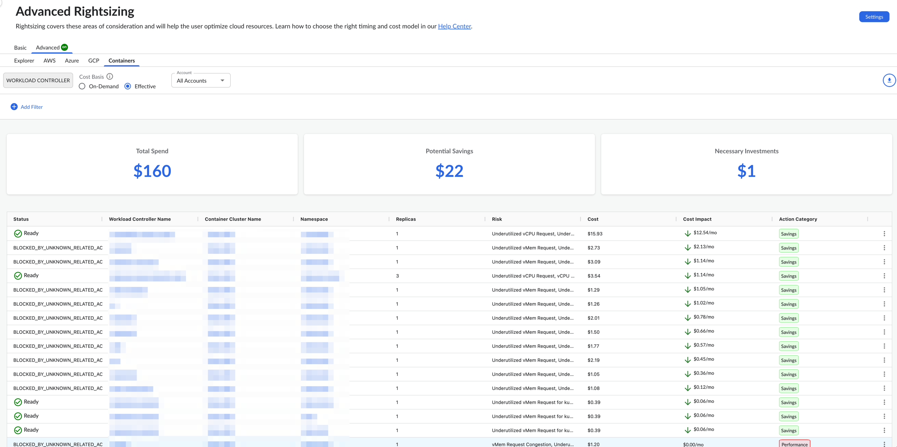
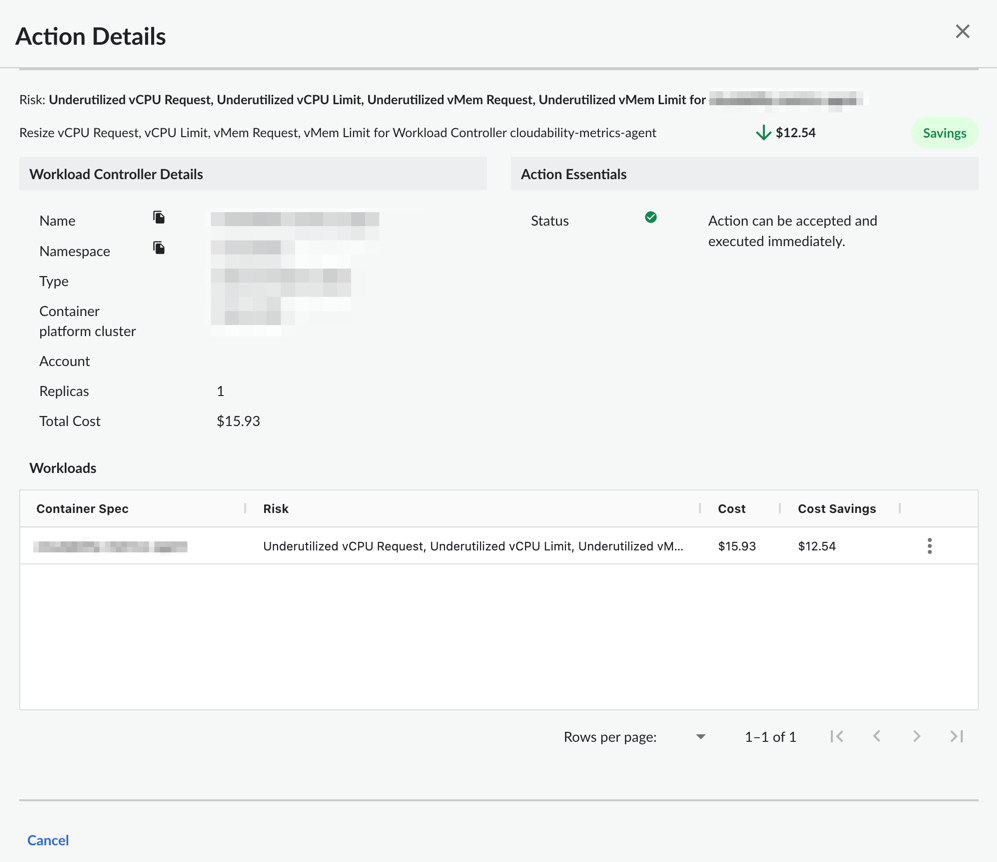
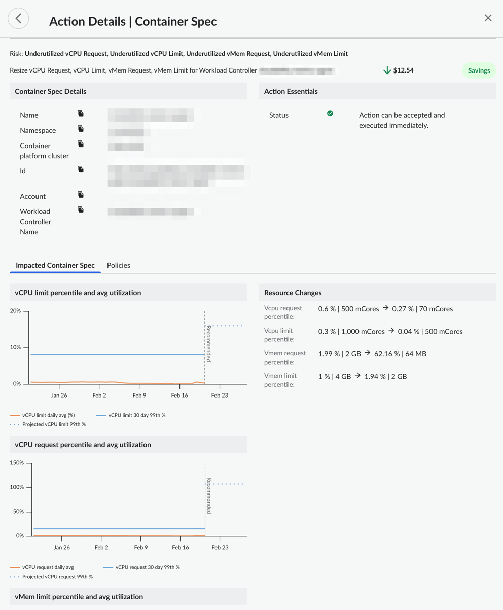

# Redimensionamento avançado para contêineres d Kubernetes

Você pode usar o painel Advanced Rightsizing para visualizar as recomendações de otimização de recursos para suas implantações de contêineres do Kubernetes. O painel mostra recomendações de otimização para poupanças e investimentos, alimentadas por um motor de otimização de poupanças e investimentos ( Turbonomic ).

[Redimensionamento avançado no Cloudability Premium](advanced-rightsizing-powered-by-turbonomic.html)

Antes de começar

Para visualizar o painel Containers, certifique-se de ter instalado os agentes Cloudability e Turbonomic Kubernetes em cada um dos seus clusters

Observação: você precisa garantir que os agentes de métricas Cloudability e os agentes Kubeturbo Turbonomic estejam presentes em cada um dos seus clusters Kubernetes. Siga as instruções de instalação documentadas aqui - [Provisionamento de agentes do Kubernetes](advanced-rightsizing-powered-by-turbonomic.html)

Acesse o painel Contêineres

Para acessar o painel Containers, abra a página inicial do Cloudability e, no menu de navegação à esquerda, selecione Otimizar > Redimensionamento > Avançado. Na página Rightsizing, selecione a guia Containers. Você pode ver todas as ações de otimização **de redimensionamento** do controlador de carga de trabalho alimentadas pelo mecanismo Turbonomic.

Personalizar o painel

Você pode definir as seguintes opções para personalizar seu painel.

Especifique a base de custo

A base de custo determina como as recomendações são calculadas. A base de custo pode ser sob demanda ou efetiva. A base de custo efetivo é selecionada por padrão.

Use a base de custo sob demanda se você deseja remover a natureza imprevisível dos descontos baseados em compromissos da sua análise e maximizar o número de recomendações fornecidas a você. Use a base de custo efetivo se preferir basear suas recomendações no custo real histórico de execução de suas instâncias e adotar uma abordagem conservadora.

Selecione a conta

Por padrão, o painel exibe recomendações para todas as contas. Para visualizar recomendações para uma conta específica, selecione o nome da conta no menu suspenso Conta.

Aplicar filtros

Você pode adicionar filtros para incluir ou excluir dados com base em uma ou mais condições.

Adicionar um filtro

Para adicionar um filtro:

1. Selecione Adicionar filtro na barra de ferramentas.
2. No menu Adicionar filtro, escolha uma dimensão.
3. Selecione um operador para fornecer uma condição lógica.
4. Escolha um valor para refinar seu filtro.
5. Selecione Adicionar filtro para aplicar o novo filtro à página.

Aplicar filtros com links

Você também pode adicionar filtros selecionando os valores em azul com hiperlink na tabela principal. A regra de filtro é aplicada automaticamente ao campo Filtros. Você pode selecionar apenas um valor ou parâmetro de cada coluna por vez.

Remover um filtro

Para remover um filtro:

1. Selecione o ícone do filtro  .
2. Selecione o X ao lado do filtro que deseja remover.

Indicadores-chave de desempenho

Você pode visualizar os seguintes Indicadores-chave de desempenho (KPIs) no seu painel do Advanced Rightsizing:

- Despesa total : mostra o total atual de despesas alocadas
- Economia potencial : mostra a economia potencial total estimada que pode ser alcançada para todas as recomendações de otimização com impacto de custo menor do que o custo atual
- Investimentos necessários : mostra o total estimado de investimentos potenciais em todas as recomendações de otimização com impacto de custo superior ao custo atual

Tabela de recomendações de redimensionamento

O painel contém uma tabela de recomendações de redimensionamento, que fornece uma visão geral dos recursos do controlador de carga de trabalho para os quais foram identificadas recomendações. A tabela inclui as seguintes colunas:

Nota:

Por padrão, os dados são classificados pela coluna Impacto no custo. Para alterar a ordem de classificação, basta selecionar o nome da coluna.

- Status: Status indicando a prontidão para a execução da ação
- Nome do controlador de carga de trabalho : O nome do recurso do controlador de carga de trabalho
- Nome do cluster de contêineres : O nome do cluster
- Espaço de nomes: O espaço de nomes configurado
- Réplicas : O número de réplicas configuradas
- Risco : O risco identificado por um mecanismo de Turbonomic
- **Custo** : O custo atual da instância do controlador de carga de trabalho
- Categoria da ação : A categoria da ação recomendada. Os atualmente suportados são “Desempenho” ou “Economia”
- Ação : A ação recomendada. A tabela abaixo lista várias ações suportadas
- Impacto nos custos : Impacto nos custos da implementação desta ação

| Recomendação | Descrição |
| --- | --- |
| Escala | Ação de redimensionamento recomendada pelo mecanismo de otimização. Isso pode ser uma ação de “aumento” ou “redução” com base nas políticas configuradas |

Recomendações de otimização de exportação para um arquivo Excel

Para exportar as ações recomendadas para um arquivo Excel, selecione Exportar. Observe que o arquivo Excel incluirá várias colunas adicionais, como região, sistema operacional, preço unitário e outras.

Detalhes da recomendação

Para visualizar os detalhes da ação recomendada para um recurso específico, selecione Exibir detalhes no menu Mais opções (três pontos). Isso exibe os detalhes do controlador de carga de trabalho escolhido.

A figura a seguir mostra um painel de detalhes de ação do controlador de carga de trabalho de amostra.

Você verá uma lista de cargas de trabalho na seção “Cargas de trabalho” acima. Para visualizar os detalhes de uma carga de trabalho específica, selecione Exibir detalhes no menu Mais opções (três pontos). Isso exibe os detalhes da carga de trabalho selecionada.

**Tópico principal:** [Redimensionamento avançado](../product/advanced-rightsizing-powered-by-turbonomic.html)
