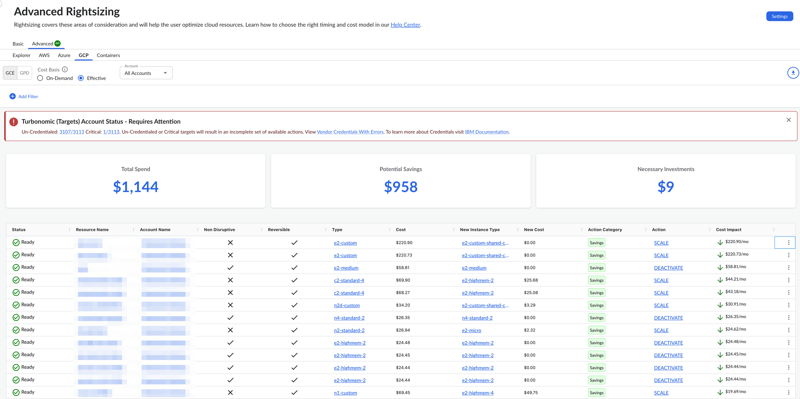
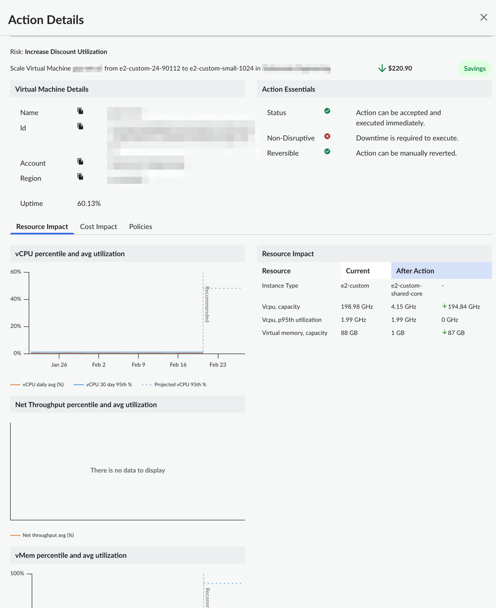

# GCP Google Compute Engine (GCE)

Você pode usar o painel Advanced Rightsizing para visualizar as recomendações de otimização de recursos para recursos de máquinas virtuais do GCE ( Google Compute Engine ). O painel mostra recomendações de otimização para poupanças e investimentos, alimentadas por um motor de otimização de poupanças e investimentos ( Turbonomic ). Você pode visualizar as recomendações em várias contas do Azure a partir de um único painel.

[Redimensionamento avançado no Cloudability Premium](advanced-rightsizing-powered-by-turbonomic.html)

Antes de começar

Para visualizar o painel do GCE, certifique-se de ter conectado o Cloudability às contas corretas do GCP.

Observação: você precisa garantir que todas as credenciais de fornecedores existentes tenham as permissões relevantes exigidas pelo Turbonomic concedidas, sem as quais o mecanismo Turbonomic pode não ser capaz de gerar o conjunto correto de ações. Se você era um cliente Cloudability antes da atualização para Cloudability Premium, ainda precisa renovar todas as credenciais de fornecedor para conceder um conjunto adicional de permissões.

Acesse o painel do Compute do Azure

Para acessar o painel do GCE, abra a página inicial do Cloudability e, no menu de navegação à esquerda, selecione Otimizar > Redimensionamento > Avançado. Na página Rightsizing, selecione a guia " GCP " e, em seguida, selecione a subguia "GCE".

Personalizar o painel

Você pode definir as seguintes opções para personalizar seu painel.

Especifique a base de custo

A base de custo determina como as recomendações são calculadas. A base de custo pode ser sob demanda ou efetiva. A base de custo efetivo é selecionada por padrão.

Nota:

Se sua organização ativou o Preço personalizado em Cloudability, as taxas personalizadas relevantes serão aplicadas aos cálculos da base de custo.

- Sob demanda: A base de custo sob demanda fornece uma comparação direta entre a instância listada na coluna Atual e a instância recomendada na coluna Nova, com base exclusivamente no preço sob demanda. Não inclui nenhum impacto potencial de Instâncias Reservadas (RIs) ou Planos de Economia (SPs). Observe que os preços sob demanda refletirão quaisquer acordos de preços personalizados que você tenha configurado em Cloudability.
- Efetivo: a base de custo efetiva leva em consideração o impacto histórico das instâncias reservadas (RIs) e dos planos de economia (SPs) para calcular o custo do tipo de instância atual durante o período do relatório. Assim como a métrica Custo (amortizado), ela inclui todos os custos iniciais e recorrentes associados.   
   Em outras palavras, a base de custo efetivo mostra o custo efetivo de execução da sua instância atual. Os valores de custo para o novo tipo de instância recomendado são baseados nos preços sob demanda. Isso ocorre porque a nova configuração pode não se beneficiar de RIs ou SPs. Essa comparação é a opção mais conservadora. Mesmo que você inadvertidamente se afaste dos RIs ou SPs, sua nova taxa geral ainda será melhor. Como resultado, a economia total relatada usando essa metodologia às vezes será menor. Preços personalizados serão aplicados a esses valores, se aplicável.

Use a base de custo sob demanda se você deseja remover a natureza imprevisível dos descontos baseados em compromissos da sua análise e maximizar o número de recomendações fornecidas a você. Use a base de custo efetivo se preferir basear suas recomendações no custo real histórico de execução de suas instâncias e adotar uma abordagem conservadora.

Selecione a conta

Por padrão, o painel exibe recomendações para todas as contas. Para visualizar recomendações para uma conta específica, selecione o nome da conta no menu suspenso Conta.

Aplicar filtros

Você pode adicionar filtros para incluir ou excluir dados com base em uma ou mais condições.

Adicionar um filtro

Para adicionar um filtro:

1. Selecione Adicionar filtro na barra de ferramentas.
2. No menu Adicionar filtro, escolha uma dimensão.
3. Selecione um operador para fornecer uma condição lógica.
4. Escolha um valor para refinar seu filtro.
5. Selecione Adicionar filtro para aplicar o novo filtro à página.

Aplicar filtros com links

Você também pode adicionar filtros selecionando os valores em azul com hiperlink na tabela principal. A regra de filtro é aplicada automaticamente ao campo Filtros. Você pode selecionar apenas um valor ou parâmetro de cada coluna por vez.

Remover um filtro

Para remover um filtro:

1. Selecione o ícone do filtro  .
2. Selecione o X ao lado do filtro que deseja remover.

Indicadores-chave de desempenho

Você pode visualizar os seguintes Indicadores-chave de desempenho (KPIs) no seu painel do Advanced Rightsizing:

- Despesa total : mostra o total atual de despesas alocadas
- Economia potencial : mostra a economia potencial total estimada que pode ser alcançada para todas as recomendações de otimização com impacto de custo menor do que o custo atual
- Investimentos necessários : mostra o total estimado de investimentos potenciais em todas as recomendações de otimização com impacto de custo superior ao custo atual

Tabela de recomendações de redimensionamento

O painel contém uma tabela de recomendações de redimensionamento, que fornece uma visão geral dos recursos GCE para os quais foram identificadas recomendações. A tabela inclui as seguintes colunas:

Nota:

Por padrão, os dados são classificados pela coluna Impacto no custo. Para alterar a ordem de classificação, basta selecionar o nome da coluna.

- Status: Status indicando a prontidão para a execução da ação
- Nome do recurso : O nome da máquina virtual
- Nome da conta : O nome da conta Azure
- Não disruptivo: Indicação se a ação apresentada é não disruptiva
- Reversível : Indicação se a ação apresentada é reversível ou não
- Tipo : O tipo atual da instância da máquina virtual
- **Custo** : O custo atual da instância da máquina virtual
- Novo tipo de instância : o tipo de instância de máquina virtual recomendado
- Novo custo : o custo projetado do novo tipo de instância de máquina virtual recomendado
- Categoria da ação : A categoria da ação recomendada. Os atualmente suportados são “Desempenho” ou “Economia”
- Ação : A ação recomendada. A tabela abaixo lista várias ações suportadas
- Impacto nos custos : Impacto nos custos da implementação desta ação

| Recomendação | Descrição |
| --- | --- |
| Escala | Redimensione para o tipo de recurso especificado na coluna Novo tipo de instância. Isso pode ser uma ação de “aumento” ou “redução” com base nas políticas configuradas |
| Desativar | Encerre seu recurso porque ele está predominantemente ocioso |

Recomendações de otimização de exportação para um arquivo Excel

Para exportar as ações recomendadas para um arquivo Excel, selecione Exportar. Observe que o arquivo Excel incluirá várias colunas adicionais, como região, sistema operacional, preço unitário e outras.

Detalhes da recomendação

Para visualizar os detalhes da ação recomendada para um recurso específico, selecione Exibir detalhes no menu Mais opções (três pontos).

A figura a seguir mostra um exemplo de painel de detalhes de ação.

Para visualizar as descrições das dimensões e métricas de custo, consulte o [Glossário de dimensões e métricas de custo.](glossary-of-cost-dimensions-and-metrics.html)

Para visualizar detalhes sobre a dimensão e as métricas de utilização, consulte o [Glossário de dimensões e métricas de utilização.](glossary-of-utilization-dimensions-and-metrics.html)

**Tópico principal:** [Redimensionamento avançado](../product/advanced-rightsizing-powered-by-turbonomic.html)
