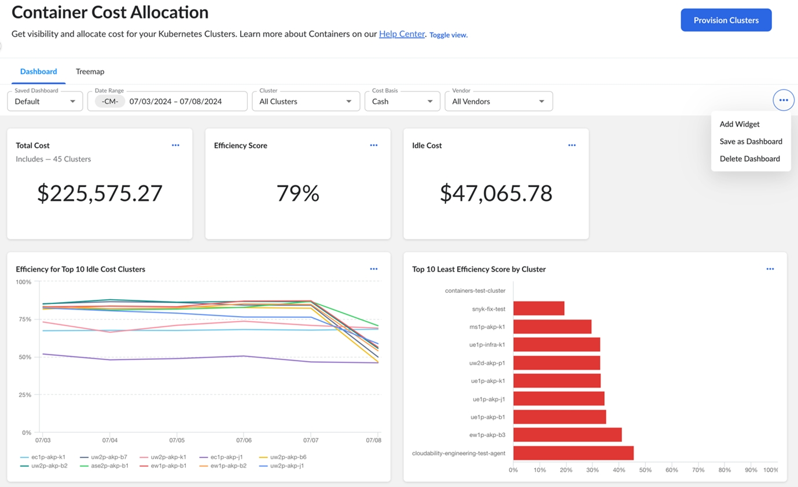
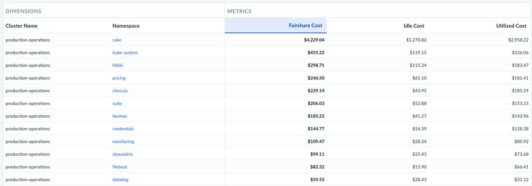

# Analise os dados de seus contêineres Kubernetes

## Alocação de custos de contêineres

O recurso de alocação de custos de contêineres fornece insights mais profundos sobre seus clusters provisionados. Isso o ajuda a alocar custos com precisão por meio de Kubernetes clusters, namespaces, rótulos, cargas de trabalho e outros métodos.

Para obter mais informações, consulte [Alocação de custos de contêineres](k8s-cost-allocation.html).

1. No menu principal, selecione Insights > Contêineres.
2. O menu Container Cost Allocation (Alocação de custos de contêineres ) é exibido para que você provisione seus clusters Kubernetes. 

Observação: O uso do site EFS em vez do site EBS para armazenamento de contêineres não é compatível com o site Cloudability.

Alocação e recursos ociosos

O custo dos recursos ociosos é distribuído em uma determinada dimensão com base na participação percentual do custo total durante esse intervalo.

- Para pods classificados como Qualidade de serviço garantida, o Cloudability utiliza os dados de solicitação para alocação, pois a quantidade de recursos solicitados é reservada,. Para obter mais informações, consulte [Configurar qualidade de serviço para pods](https://kubernetes.io/docs/tasks/configure-pod-container/quality-service-pod/#qos-classes "(Abre em uma nova guia ou janela)").
- Para pods classificados como Burstable, o Cloudability utiliza a solicitação ou as informações de uso, o que for de maior valor para alocação.
- Para pods classificados como Best Effort, o Cloudability aproveita as informações de uso para alocação.

Base de custo

O agente de coleta Cloudability compila métricas de seus clusters Kubernetes e as envia para Cloudability para análise. Usando fontes de métricas nativas, o Cloudability aloca custos e fornece insights sobre recursos ociosos para seus clusters.

Para obter mais informações, consulte [Contêineres](https://app.apptio.com/cloudability#/containers "(Abre em uma nova guia ou janela)").

- Cloudability usa o Custo (Ajustado) como custo padrão do recurso para alocação.
- Se você não usar uma métrica de Custo (Ajustado), o site Cloudability usará o Custo (Total) em seu cálculo.
- Cloudability também suporta a métrica Custo (Amortizado) na alocação de custos de contêineres. Isso o ajuda a entender o custo total do seu cluster Kubernetes, incluindo quaisquer instâncias reservadas (RIs) e planos de economia (SPs) consumidos. Ao analisar clusters, a mudança para Custo (Amortizado) permite que você inclua o custo total dos RIs e SPs consumidos.

Você pode dividir os custos por namespace, serviços e rótulos.

## Distribuição de custos ociosos

Visão geral

Os contêineres têm uma capacidade de sobrecarga sobressalente que não é usada pelas cargas de trabalho subjacentes. Esse uso "ocioso" tem um custo associado (para máquinas virtuais e volumes). Cloudability distribui esses custos de contêineres ociosos em seus relatórios, painéis e alocação de custos de contêineres.

Isso introduz a nova categoria de métricas Contêineres, juntamente com outras seis. Você pode usar essas métricas para visualizar separadamente os custos Utilizados, Ociosos e Fairshare para base de caixa ou amortizada. 

O recurso de alocação de custos de contêineres avalia a utilização de recursos em cada nó e os adiciona aos dados de faturamento para calcular o custo de cada cluster. Isso associa o Custo Utilizado ao espaço de nome Kubernetes e aos valores de rótulo (disponíveis nos relatórios usando o espaço de nome ou uma dimensão de rótulo). Com esse aprimoramento, você também pode informar sobre o custo ocioso por meio da nova métrica, alocada aos valores de namespace e rótulo proporcionalmente com base na contribuição de custo direto de cada nó. O custo do Fairshare é a soma do custo utilizado e do custo ocioso.

Considerações e ideias de relatórios para ter em mente com novas métricas:

- Para custos que não sejam de contêineres, todas as novas métricas exibirão US$ 0. Para filtrar apenas os dados do contêiner, use um filtro como " Cluster Name not equals (not set) "
- Use essas métricas com dimensões diferentes para visualizar facilmente o Custo Utilizado vs. Ocioso. Por exemplo, listar por nome do cluster ou ID do recurso.
- Pela primeira vez, use o regime de caixa e a base de custo amortizado juntos para obter relatórios detalhados de custos de contêineres.

## Exportação de dados de alocação de contêineres

Clique no ícone Exportar  para exportar os dados de alocação de custos no formato.csv.

Você pode exportar dados ao alocar entre clusters ou em um único cluster, por Namespace, Service e Label.

. Definições de dados do CSV

| Nome | Definição |
| --- | --- |
| Tipo | Exibe se a linha é de dados de alocação ou de relatório de uso ou custo não alocado (ocioso). |
| Namespace: | Kubernetes Nome do objeto do namespace. |
| Serviço | Kubernetes Service nome do objeto. |
| Rótulo | Kubernetes Valor do rótulo. |
| cpu/reservado:alocação | Porcentagem de uso da CPU alocada a essa linha durante o período de tempo consultado. |
| cpu/reserved:fairShare | Porcentagem de uso da CPU alocada a essa linha durante o período de tempo consultado ao compartilhar a distribuição entre objetos. |
| cpu/reservado:recurso:média | Utilização média da CPU observada durante o período de tempo consultado. |
| cpu/reservado:recurso:unidade | Unidade de medida para uso da CPU. |
| memória/rss reservado:alocação | Porcentagem de uso do tamanho do conjunto residente de memória alocado a essa linha durante o período consultado. |
| memory/reserved\_rss:fairShare | Porcentagem de uso do tamanho do conjunto residente de memória alocado a essa linha durante o período consultado ao distribuir objetos não alocados (ociosos). |
| memória/rss reservado:recurso:média | Uso médio do Memory Resident Set Size observado durante o período consultado. |
| memória/rss\_reservado:recurso:unidade | Unidade de medida para uso do Memory Resident Set Size. |
| rede/tx:alocação | Porcentagem de uso de TX de rede alocada a essa linha durante o período consultado. |
| network/tx:fairShare | Porcentagem de uso de TX de rede alocada a essa linha durante o período consultado ao distribuir objetos não alocados (ociosos). |
| rede/tx:recurso:média | Uso médio de TX de rede observado durante o período consultado. |
| rede/tx:recurso:unidade | Unidade de medida para uso do TX de rede. |
| rede/rx:alocação | Porcentagem de uso de RX de rede alocada a essa linha durante o período consultado. |
| network/rx:fairShare | Porcentagem do uso de RX de rede alocado a essa linha durante o período consultado ao distribuir não alocado entre objetos. |
| rede/rx:recurso:média | Uso médio de RX de rede observado durante o período consultado. |
| rede/rx:recurso:unidade | Unidade de medida para uso de RX de rede. |
| sistema de arquivos/usage:allocation | Porcentagem de uso do sistema de arquivos do contêiner alocado a essa linha durante o período consultado. |
| filesystem/usage:fairShare | Porcentagem de uso do sistema de arquivos do contêiner alocada a essa linha durante o período consultado ao distribuir objetos não alocados (ociosos). |
| sistema de arquivos/usage:resource:mean | Uso médio do sistema de arquivos do contêiner observado durante o período consultado. |
| sistema de arquivos/usage:resource:unit | Unidade de medida para uso do sistema de arquivos do contêiner. |
| porcentagens:alocação | Porcentagem geral de memória, CPU, RX/TX de rede e sistema de arquivos alocados para essa linha durante o período de tempo consultado. |
| percentages:fairShare | Porcentagem geral de memória, CPU, RX/TX de rede e sistema de arquivos alocados para essa linha durante o período consultado ao distribuir objetos não alocados (ociosos). |
| percentages:fairShareUnallocated | Porcentagem geral de não alocado (ocioso) em memória, CPU, RX/TX de rede e sistema de arquivos que é compartilhado por essa linha ao distribuir não alocado (ocioso) entre objetos. |
| custos: alocação | Custo geral da memória, CPU, rede RX/TX e sistema de arquivos alocados para essa linha durante o período consultado. |
| costs:fairShare | Custo geral de não alocado (ocioso) em memória, CPU, RX/TX de rede e sistema de arquivos que é compartilhado por essa linha ao distribuir não alocado (ocioso) entre objetos. |
| custos: não alocados | Custo geral não alocado (ocioso) em memória, CPU, rede RX/TX e sistema de arquivos durante o período de tempo consultado, quando não distribuído entre objetos. |

## Configurações compatíveis com o site Kubernetes

Há muitas maneiras diferentes de implementar o Kubernetes. Oferecemos suporte a todas as versões certificadas pela CNCF (Cloud Native Computing Foundation):

| Serviço | Fornecedor | Média de memória/CPU/disco | % de alocação | $ Alocação |
| --- | --- | --- | --- | --- |
| Nenhum | AWS | Sim | Sim | Sim |
| Nenhum | Azure | Sim | Sim | Sim |
| Nenhum | GCP | Sim | Sim | Sim |
| GKE | GCP | Sim | Sim | Sim |
| EKS | AWS | Sim | Sim | Sim |
| AKS | Azure | Sim | Sim | Sim |

Para saber mais sobre Kubernetes, consulte os tópicos a seguir:

- [Kubernetes provisionamento de cluster](k8s-cluster-provisioning.html)
- [Agente de métricas do Common Kubernetes – mensagens de erro](k8s-metrics-agent.html)
- [Kubernetes Alocação de custos](k8s-cost-allocation.html)
- [Custos de contêineres alocados por fornecedor](container-costs-by-vendor.html)
- [Ajuste do tamanho para contêineres d Kubernetes](k8s-container-rightsizing.html)

**Tópico pai:** [Alocação de custos de contêineres](../product/k8s-cost-allocation.html)
