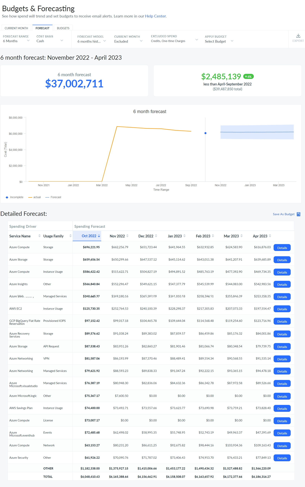
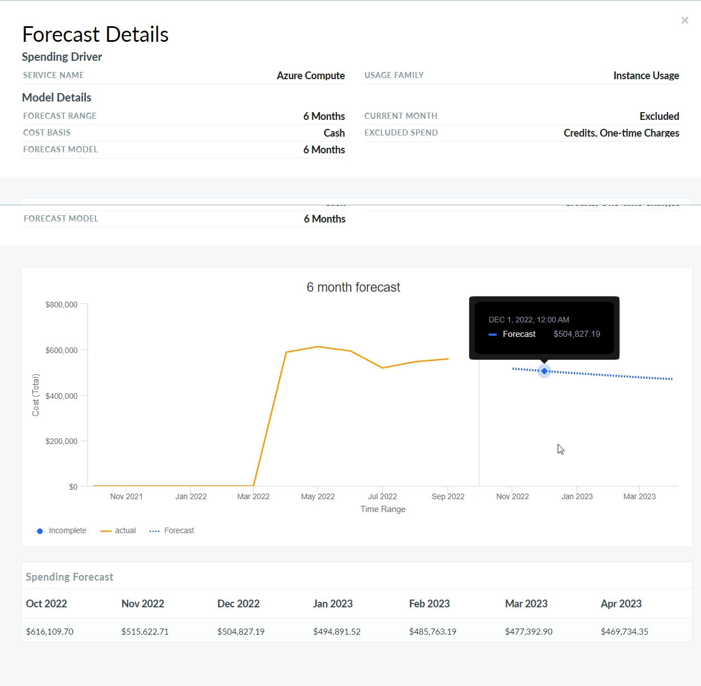

# Previsão

Esse recurso permite que você analise os padrões históricos de gastos e examine as mudanças subjacentes que estão influenciando sua previsão de gastos, para que você possa entender o que se espera que mude. Além disso, ajuda você a criar orçamentos adicionais.

Caso de uso

Você pode usar a tendência dos últimos seis meses para elaborar um orçamento ambicioso, mas razoável, para sua equipe, que seja inferior ao planejado pela equipe financeira. Com o Cloudability, é fácil compartilhar esse orçamento com sua equipe, receber atualizações sobre o andamento do projeto e visualizar relatórios comparativos entre o planejado e o real sobre o andamento até o momento.

Personalizar o painel de previsão

Acesse Plano > Previsão

Clique no botão “Detalhes” para ver os detalhes da previsão.

Você pode realizar as seguintes ações:

- Modifique a visualização selecionando os valores adequados para qualquer um dos parâmetros, como base de custo, modelo de previsão e assim por diante.
- Exporte dados tabulares, seja pela interface do usuário ou pela API, para uma ferramenta de gestão financeira de sua escolha.
- Salve a previsão como um [orçamento.](bf-budgets.html)

Perguntas frequentes

Por que estou vendo uma mensagem sobre “dados de custo ausentes” para este mês?

AWS normalmente envia arquivos de faturamento atualizados a cada quatro horas. Às vezes, principalmente nos primeiros e últimos dias do mês, isso pode demorar um pouco mais. Mostraremos sua estimativa com base nos dados mais recentes, mas, caso não tenhamos recebido um arquivo de faturamento da Amazon referente a um determinado mês, exibiremos um aviso informando que os dados estão incompletos.

**Tópico principal:** [Orçamentos e previsões](../product/plan-and-manage-your-budgets-and-forecasts.html)
