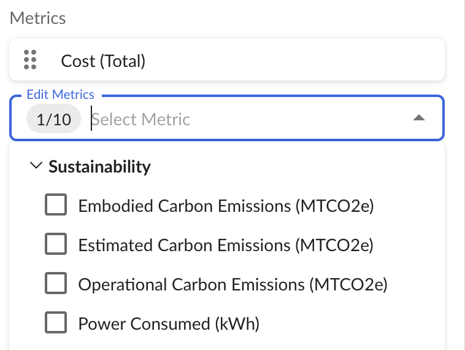

# Relatório de sustentabilidade na nuvem

**Visão geral**

Usando esse recurso, os usuários do Cloudability poderão visualizar a pegada de carbono da nuvem pública (operacional + incorporada) para os serviços suportados.

Pré-requisitos

Para acessar as métricas de sustentabilidade da nuvem, os clientes devem atender aos seguintes pré-requisitos:

- Para acessar as métricas de carbono da nuvem, os clientes devem ter dados de custo por 1 mês.
- Os clientes devem ter credenciais avançadas ativadas para cálculos em níveis de utilização reais, caso contrário, o padrão será 50% de níveis de utilização
- Para clientes d GCP, a faturação detalhada deve estar ativada.
- Válido para clientes de Cloudability Standard e Cloudability Premium.

Introdução

Cloudability os usuários podem visualizar de forma rápida e fácil as métricas de sustentabilidade da nuvem para obter insights sobre suas emissões de carbono na nuvem pública. As métricas de sustentabilidade da nuvem estão disponíveis nos relatórios e painéis do site Cloudability usando as métricas abaixo:

- **Emissão de carbono operacional** **( MTCO2e** ) - Essa métrica representa as emissões de carbono geradas durante a operação diária dos serviços em nuvem. Ele vem principalmente da eletricidade usada para alimentar e resfriar os data centers durante a execução das cargas de trabalho.
- **Emissão de Carbono Incorporada** **( MTCO2e )** - Esta métrica representa a parcela das emissões de carbono associadas à produção e ao ciclo de vida da infraestrutura em nuvem. No contexto da nuvem, ela é estimada pela alocação de uma parte do total de emissões incorporadas de servidores e equipamentos físicos com base em seu uso específico.
- **Emissões estimadas de carbono ( MTCO2e** ) - Essa métrica representa o total estimado de emissões de carbono, soma das emissões de carbono **operacionais** e **incorporadas**. Isso fornece uma visão completa de sua pegada de carbono na nuvem em toneladas métricas de CO₂ equivalente.
- **Energia consumida ( kWh** ) - Energia consumida em quilo watt-hora. Cloudability calcula a pegada de carbono da nuvem para todos os principais provedores de serviços em nuvem ( AWS, Azure, GCP e OCI) e oferece uma metodologia uniforme para comparar as emissões de carbono da nuvem entre diferentes fornecedores.

Essas métricas estão disponíveis em um nível de recurso para os serviços suportados abaixo.

| AWS | Azure | GCP | OCI |
| --- | --- | --- | --- |
| EC2 | Informática | GCE | Informática |
| EBS | Disco gerenciado | Disco persistente |  |
| RDS | Azure Banco de dados   - SQL Server   - PostgresSQL | SQL na nuvem |  |

Onde encontrar as métricas

Cloudability > Novos relatórios ou Adicionar widget > Categoria de sustentabilidade

Há também um **painel de controle de exemplo — Sustentabilidade na Nuvem —** já configurado, que pode ser encontrado em “Todos os painéis de controle” no site Cloudability

**Metodologia**

Para calcular as emissões de carbono, nossa metodologia é uma abordagem de baixo para cima, em que as emissões de recursos individuais são calculadas separadamente. Essas emissões calculadas são então agregadas para representar coletivamente as emissões totais de uma organização resultantes do uso de sua infraestrutura de nuvem.

Para obter mais detalhes, consulte [Metodologia](cloud_sustainability_methodology.html)

**Perguntas Frequentes**

**1. Como posso começar a visualizar as métricas de sustentabilidade?**

Verifique o painel padrão configurado para sustentabilidade em todos os painéis em Cloudability.

**2.What diferencia a solução da Cloudability de qualquer outra solução disponível?**

- A metodologia é independente da nuvem e aplica a mesma lógica em todos os ISPs, tornando as comparações mais fáceis e consistentes.
- A metodologia fornece os resultados em uma **granularidade de cada Id de recurso.**
- As métricas podem ser acumuladas em qualquer dimensão suportada, como Região, Serviço, Fornecedor etc., e também em dimensões de tempo, como Ano, Mês, Semana etc., permitindo também comparações entre YTD, MTD ou YoY e MoM.
- As métricas **usam** **a utilização real.**
- Uma vez disponíveis, os dados honram as visualizações e os mapeamentos de negócios criados, o que permite que os usuários da capacidade de nuvem visualizem as emissões com base em seus direitos de dados.
- As emissões podem ser usadas em conjunto com as métricas de custo e uso para comparar as tendências de custo com as tendências de emissões.
- A solução usa os dados do Grid Emissions dos dados mais recentes disponíveis pelos órgãos governamentais locais, como EEA e EPA, para ter dados autênticos para calcular as emissões de carbono.

**3. O site Cloudability fornece emissões de Escopo 1, Escopo 2 e Escopo 3 como parte desse recurso?**

Cloudability apresenta as emissões de carbono operacionais e incorporadas do Escopo 3.

- A combustão de qualquer combustível para gerar energia no local por uma organização é atribuída ao Escopo 1, o uso da energia gerada em outro lugar para operar o equipamento contribui para o Escopo 2, enquanto a cadeia de suprimentos contribui para as emissões do Escopo 3.
- Como consumidores da nuvem pública, usamos os serviços de nuvem oferecidos pelos CSPs sem ter controle sobre a eletricidade, a manutenção do equipamento de nuvem ou a refrigeração do data center. Portanto, o escopo de emissões é **apenas emissões de Escopo 3** para um cliente.

**4. Com que frequência as métricas de carbono são atualizadas?**

As métricas de carbono serão atualizadas no dia 15 de cada mês para o mês anterior. por exemplo, em 15 de abril, preencheremos as métricas de março

**5.** **É possível obter dados históricos sobre as emissões da nuvem**?

Não há atualizações de dados históricos disponíveis.

**6. Qual é a granularidade das métricas de sustentabilidade?**

A granularidade é em nível de recurso e o site Cloudability fornece dados em uma granularidade diária.

**7. É possível fazer comparações anuais, mensais e semanais?**

Sim, essas comparações são possíveis usando os painéis e relatórios do site Cloudability.

**8. É possível comparar as tendências de custo com as tendências de emissão?**

Sim, é possível comparar as tendências de custo versus emissão em uma dimensão de escolha. Abaixo, compartilhamos algumas dimensões comumente usadas

- No acumulado do ano, no acumulado do mês
- Região
- Fornecedor
- Dia, semana, mês, ano

**9. As emissões de carbono estarão disponíveis na API?**

Sim, todas as quatro métricas estarão disponíveis por meio da API. Consulte os documentos da API Cloudability

**10. Você oferece suporte a visualizações e mapeamentos de negócios com métricas de sustentabilidade?**

Sim, todas as visualizações e mapeamentos de negócios são compatíveis com as métricas de sustentabilidade, de forma semelhante aos relatórios e painéis.

**11. Estou vendo um aumento nas emissões informando os dados de outubro de 2025, por que isso acontece?**

Isso se deve ao fato de que, a partir dos dados de outubro de 2025, o site Cloudability considera tanto as emissões operacionais quanto as incorporadas. Antes dessa data, o site Cloudability considerava apenas as emissões operacionais.

**12. É obrigatório avançar a credencial para obter métricas de sustentabilidade?**

Recomendamos que as credenciais avançadas sejam ativadas para cálculos mais precisos. Se ativadas, o site Cloudability considera os níveis reais de utilização dos serviços compatíveis; caso contrário, consideramos uma utilização padrão de 50% para os cálculos.

**13. Comparei as métricas de emissões de carbono do site Cloudability com as emissões da CSP e os números não coincidem**

Não recomendamos a comparação das emissões, pois as metodologias, a granularidade dos dados e os escopos de emissão podem ser diferentes. Consulte [Cloudability 's Cloud Sustainability Methodology](cloud_sustainability_methodology.html) para obter mais detalhes sobre exclusões e inclusões.

**14. É necessário ter alguma permissão para acessar os relatórios de sustentabilidade?**

Não são necessárias permissões adicionais para utilizar o Relatório de Sustentabilidade. Os relatórios estão disponíveis para todos os usuários e clientes nos planos Cloudability Standard e Premium.

- **[Metodologia de sustentabilidade da nuvem](../product/cloud_sustainability_methodology.html)**
