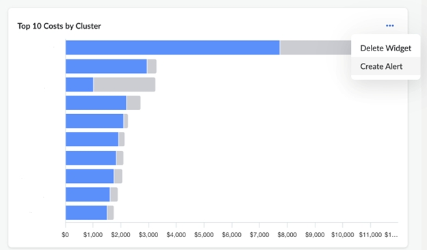
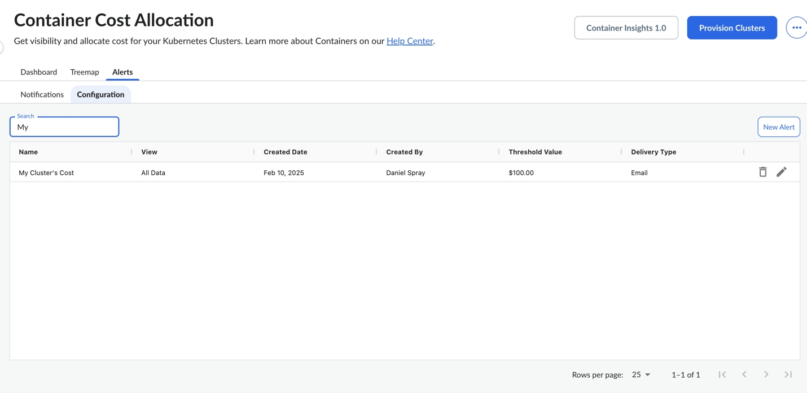
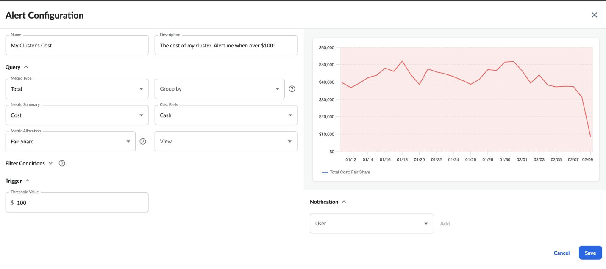
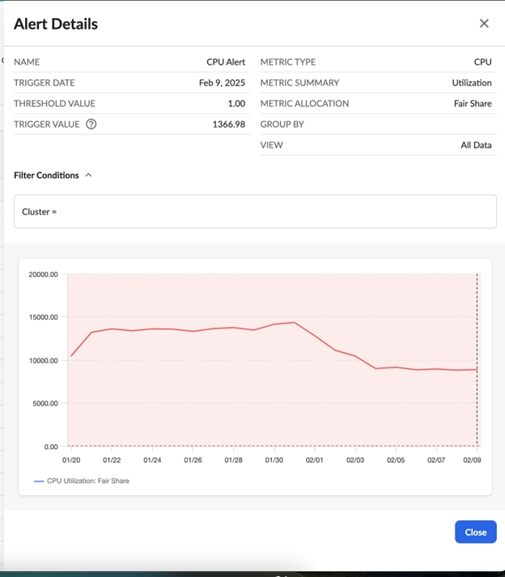

# Container Insights: Guia de configuração de alertas baseados em limites

Visão geral

O Container Insights agora oferece suporte a alertas baseados em limites que podem ser configurados de duas maneiras:

1. Diretamente por meio de widgets do Dashboard

   
2. Por meio da guia Alertas dedicada

   

Métodos de configuração

Método 1: Configurar por meio de widgets do painel

1. Navegue até o painel do Container Insights
2. Clique nas reticências horizontais (⋯) em qualquer widget
3. Selecione Create Alert (Criar alerta ) no menu suspenso
4. No modelo de configuração de alerta:
   - Digite o nome e a descrição do alerta
   - Definir valores de consulta
   - Definir condições de acionamento e filtragem
   - Atribuir usuários para notificações
   - Salve a configuração

     

Método 2: Configurar por meio da página de alertas

1. Navegue até a página Insights do contêiner
2. Clique na guia Alertas (localizada ao lado das exibições "Dashboard" e "Treemap")
3. Selecione a subguia Configuration e, em seguida, New Alert na extremidade direita
4. No modelo de configuração de alerta:
   - Digite o nome e a descrição do alerta
   - Definir valores de consulta
   - Definir condições de acionamento e filtragem
   - Atribuir usuários para notificações
   - Salve a configuração

Gerenciamento de alertas

- Visualizar todos os alertas configurados na guia Alertas
- Acesse a subpágina Alertas configurados para ver a lista completa
- Editar ou excluir alertas existentes, conforme necessário
- Monitorar o status e o histórico do alerta

  

Observações importantes

- O número máximo de alertas por organização é 100
- Atualmente, o e-mail é o único canal de notificação suportado
- Todos os usuários podem criar alertas para si mesmos
- Cloudability Os administradores podem atribuir alertas a outros usuários

Para obter suporte adicional ou fazer perguntas, entre em contato com nossa equipe de suporte.

p

**Tópico pai:** [Alocação de custos de contêineres](../product/k8s-cost-allocation.html)
