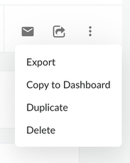

# Copiar um relatório para um painel

Os relatórios existentes também podem ser salvos como novos widgets em painéis existentes clicando no botão “Copiar para o painel” no menu de pontos:

Em seguida, os usuários podem selecionar um painel existente onde o relatório será salvo e escolher que tipo de widget adicionar ao painel. Os usuários podem salvar o KPI, o gráfico ou a tabela em um painel.

**Tópico principal:** [Criar ou editar um relatório](../product/create-or-edit-a-report.html)
