# Compartilhamento de custos para relatórios e painéis

## Visão geral

Uma nova opção de compartilhamento de custos no Cloudability Reports and Dashboard Widget Editor permite que os usuários gerem visualizações de dados a partir de dados de relatórios com custos alocados (compartilhados) aplicados. Quando ativado em um relatório ou widget, os resultados refletem os custos alocados de acordo com as regras configuradas em **Cloudability → Cost Sharing (Compartilhamento de custos** ).

Introdução

1. Abra qualquer editor de relatório ou widget.
2. Procure o botão Compartilhamento de custos na seção do cabeçalho.
3. Alterne o botão para ver seus dados com custos alocados.
4. Explore as novas medidas de Tipo de custo e Fonte de alocação.
5. Salve seu widget e observe o emblema de alocação no título.

Pontos principais:

- Os usuários podem ativar/desativar **o compartilhamento de custos** por relatório ou widget de suporte.
- Visualizar ou salvar um relatório ou widget mostra como os dados mudam com a aplicação do Compartilhamento de Custos.
- Agora estão disponíveis medidas adicionais que só são suportadas quando o Compartilhamento de custos está ativado.

Regras de alocação e escopo

- As regras de alocação são criadas e gerenciadas no recurso **Compartilhamento de custos**.
- As regras se aplicam **somente a Business Dimensions**. (As dimensões não comerciais não são alvos de alocação)

Alternância e marcação em nível de relatório e de widget

- Cada tipo de widget compatível tem uma alternância de **compartilhamento de custos** (Aplicado / Não aplicado) na parte do cabeçalho do relatório Criar/Editar e da gaveta do widget.
- A alternância atualiza os parâmetros de consulta usados para visualizar e salvar o Widget.
- O título do widget exibe um **emblema de alocação** quando o Compartilhamento de custos é aplicado, para que os usuários possam ver rapidamente que as regras de alocação afetaram o conjunto de resultados.
- As dimensões de negócios que têm alocações aplicadas a elas mostram um **ícone de alocação** em todos os componentes de seleção de dimensão.

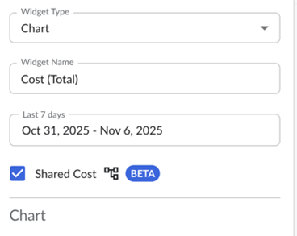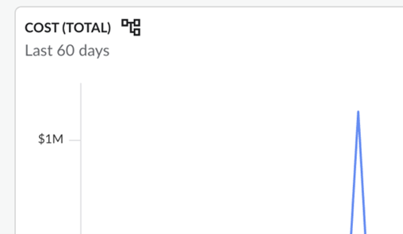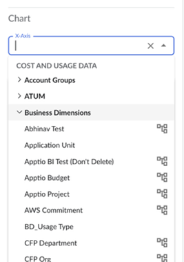

Medidas disponíveis com compartilhamento de custos

Quando o compartilhamento de custos é **aplicado**, as novas medidas a seguir agora são suportadas:

- **Tipo de Custo**

  Indica se um valor de dimensão tem custo **direto** ou **compartilhado**.
- **Fonte de alocação**

  Detalha onde os custos compartilhados são atribuídos nas dimensões do negócio.

Suporte a dimensões e métricas

- Algumas **dimensões/métricas são suportadas somente** quando o Compartilhamento de custos é **aplicado**.
- Por outro lado, outros **não** são suportados nesse estado.

Comportamento no editor:

- **Os itens suportados** permanecem selecionáveis e utilizáveis.
- **Os itens sem suporte** são:
  - Marcado com um **ícone de erro** se tiver sido selecionado anteriormente e o usuário alternar o Compartilhamento de custos para um estado em que ele seja inválido.
  - **Desativado** nos seletores para evitar novas seleções.

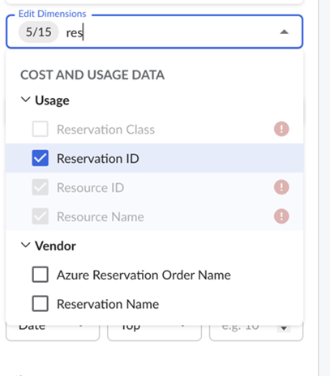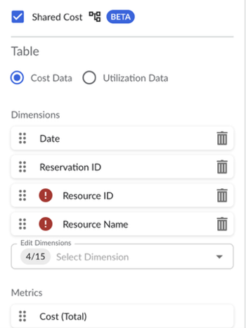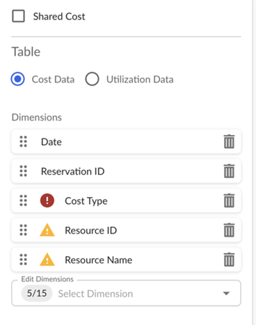

Pré-visualização/Salvar higienização de solicitações

Para evitar erros de back-end quando o compartilhamento de custos é alternado:

- Em **Preview** ou **Save**, todas as **dimensões/métricas/filtros não suportados** (dado o estado de alternância atual) são **removidos da solicitação**.
- Isso evita falhas nas solicitações devido a combinações inválidas e garante que a visualização seja renderizada com êxito com os campos compatíveis.
- Um usuário é notificado, ao criar um relatório ou um widget de painel, sobre as medidas não suportadas que foram removidas no processo de salvamento.

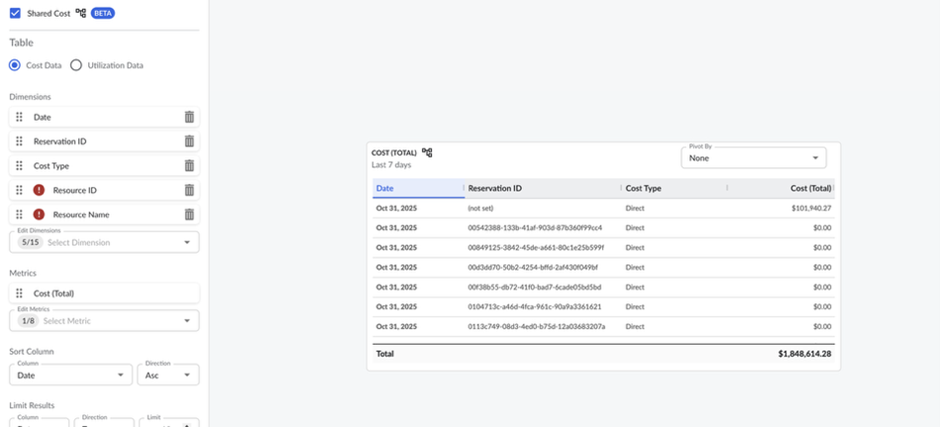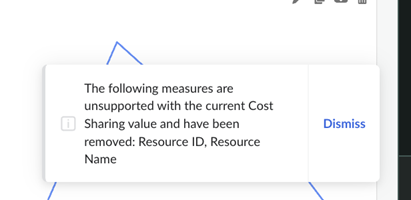

Criação de relatório a partir do widget de gráfico

- Uma dica de ferramenta do Chart Widget pode levar o usuário a um relatório. No Widget Preview, garantimos que somente as medidas compatíveis sejam incluídas no relatório gerado a partir dos dados do Chart Widget.

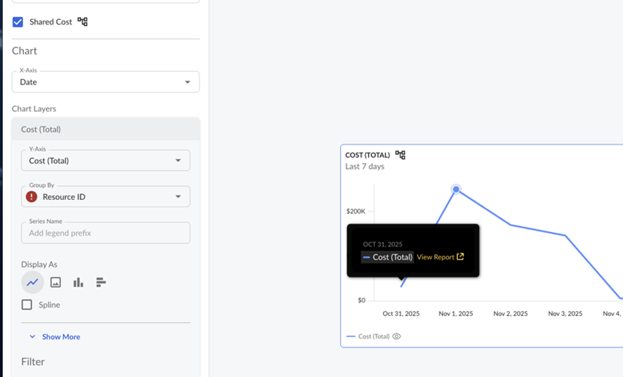

Filtros

- Os filtros **não podem** ter como alvo dimensões não suportadas.
- Se um usuário tiver definido esse filtro anteriormente e depois alternar para um estado não suportado:
  - O filtro mostra um **ícone de erro** no editor.
  - As opções não selecionadas são desativadas.
  - O filtro é **omitido** nas solicitações de Visualizar/Salvar.

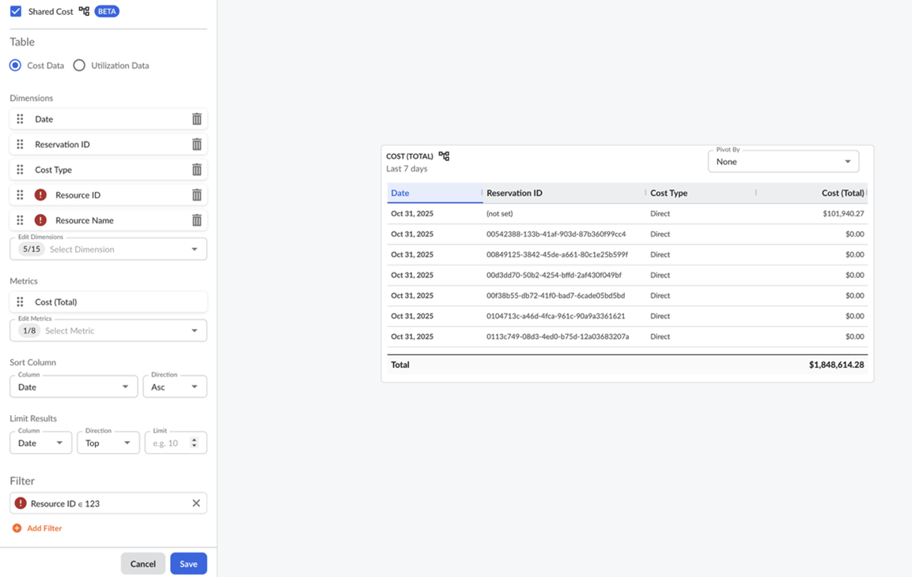

Validação e notificações

- Os relatórios exigem pelo menos **uma dimensão e uma métrica**.
- Se a alternância do Compartilhamento de custos tornar a configuração inválida (por exemplo, a única dimensão se torna incompatível), o usuário não poderá produzir um relatório válido.
  - A interface do usuário mostra uma **notificação de erro de brinde** explicando que a configuração não é compatível com o estado atual do compartilhamento de custos.

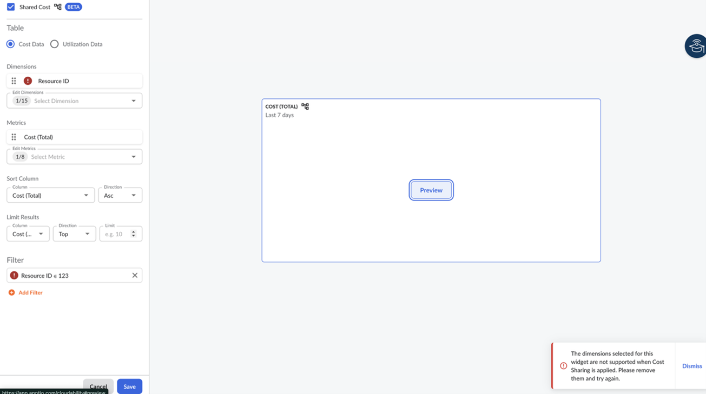

Se um usuário estiver tentando usar a nova medida "Allocation Source", a configuração suportada para essa solicitação é incluir com "Allocation Source" pelo menos uma Business Dimension e uma outra dimensão.

- A interface do usuário mostra uma **notificação de erro de brinde** explicando que a configuração não é compatível se essas condições não forem atendidas.

Regras de persistência de estado

- Durante a edição, a interface do usuário **retém** visualmente as seleções não suportadas (marcadas com erros) para que os usuários possam **ativar/desativar rapidamente** o compartilhamento de custos e comparar os resultados com a **mesma configuração pretendida**.
- Em **Save** :
  - **Os itens sem suporte não são mantidos** na definição do widget (porque essa configuração não pode produzir um relatório válido).
  - Os usuários mantêm a capacidade de alternar e visualizar durante a edição, mas os widgets salvos nunca incluem campos inválidos.

Compartilhamento de custos em relatórios

- Todas as funcionalidades são consistentes nos relatórios e painéis do CLDY. Os widgets podem ser configurados com o compartilhamento de custos aplicado diretamente de um relatório e copiados para um painel de usuário.
- Os relatórios e widgets podem ser exportados e compartilhados usando a funcionalidade existente de exportação de relatórios.
- Um relatório com compartilhamento de custos aplicado também pode ser assinado por meio da gaveta de assinatura de relatórios.
- Um relatório pode ser copiado para o Dashboard, persistindo o valor do custo compartilhado aplicado no widget criado.

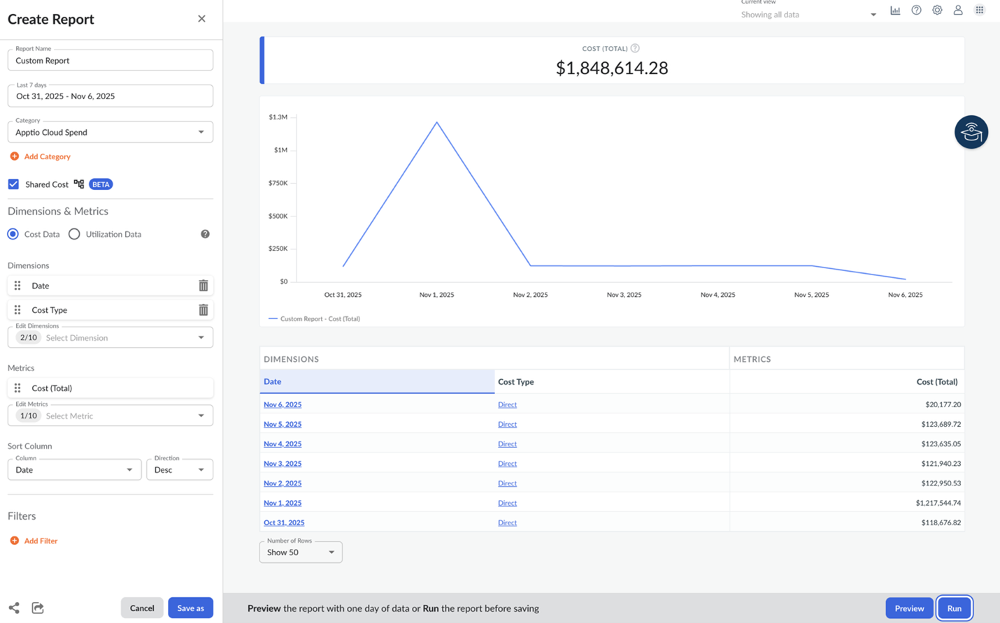

Resumo da experiência esperada do usuário

1. O usuário abre um widget, escolhe dimensões/métricas e, opcionalmente, ativa **o compartilhamento de custos**.
2. O editor mostra:
   - Ícones de alocação nas dimensões de negócios aplicáveis.
   - Ícones de erro em todos os campos que não são suportados ao alternar o estado de Compartilhamento de custos.
3. Em Preview/Save (Visualizar/Salvar):
   - Os campos/filtros não suportados são **automaticamente removidos** da solicitação.
   - Se a remoção tornar a configuração inválida, um **aviso de erro** informará o usuário.
4. Depois de salvar:
   - O título do widget mostra um **emblema de alocação** se o Compartilhamento de custos for aplicado.
   - O widget salvo contém apenas os campos **suportados** para seu estado de Compartilhamento de custos.

Exemplo de widgets:

1. Tabela que mostra a dimensão de negócios com regra alocada aplicada e a categoria de alocação dos valores dessa métrica:

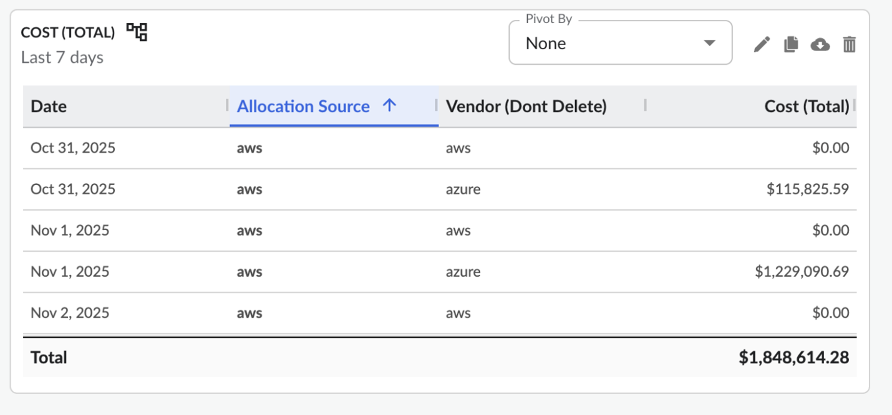

Gráfico de barras empilhadas mostrando o tipo de custo dos valores de uma dimensão de negócios com regra alocada aplicada, empilhado, mostrando as métricas de custo (total) e custo (amortizado):

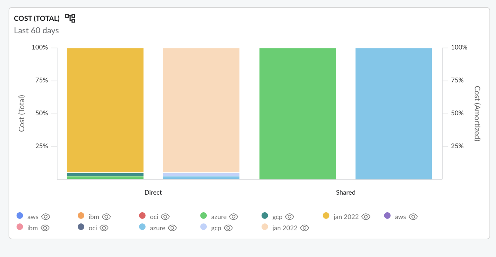

Comparação de dois gráficos de pizza que representam a mesma dimensão de negócios, mostrando como a métrica de custo (total) varia quando o custo compartilhado é aplicado ou não:

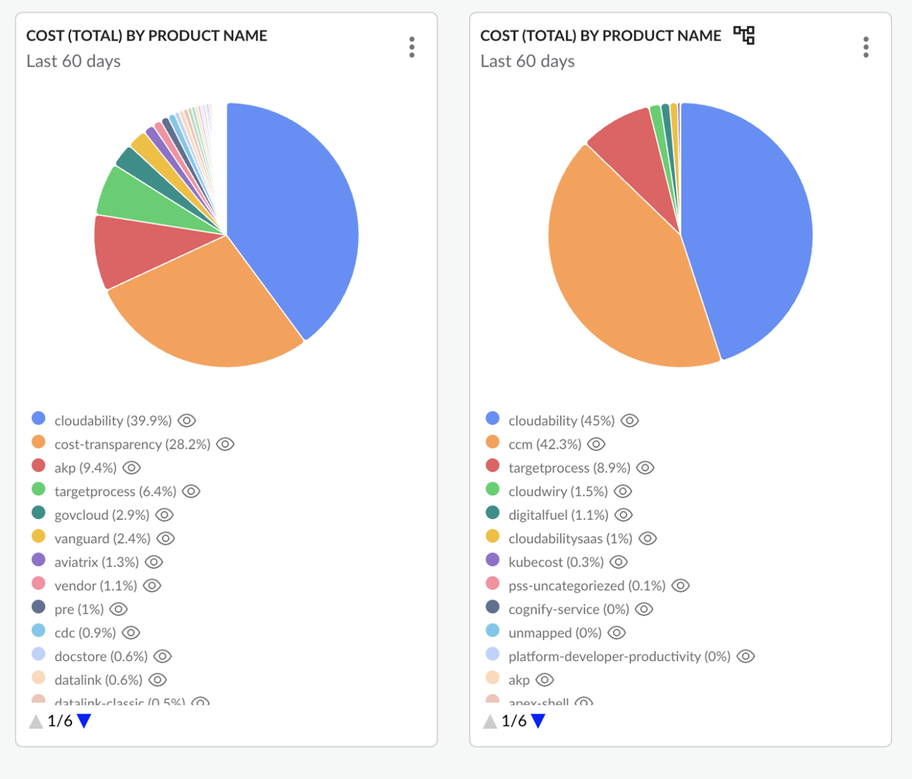

**Tópico dos pais:** [Compartilhamento de custos em Cloudability](../product/cost-sharing.html)
