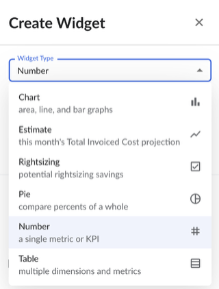
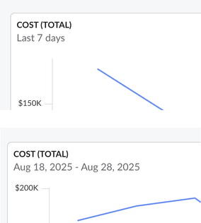
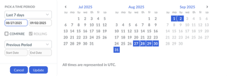
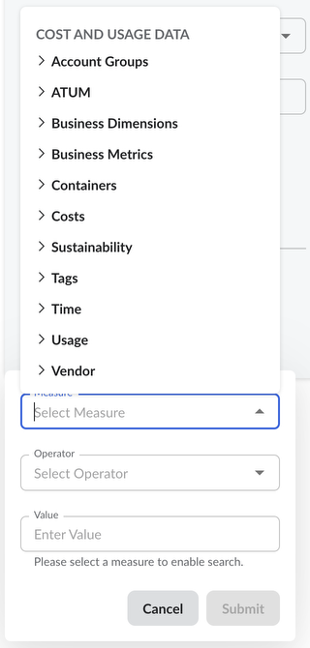
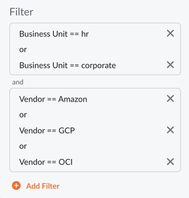

# Criar ou editar um widget em um painel

Os widgets são os blocos de construção dos painéis d Cloudability. Cada widget é configurado separadamente e pode ter uma finalidade diferente. Esta página explica as etapas de configuração e as opções disponíveis para os usuários ao criar ou editar Widgets nos Painéis d Cloudability.

Existem vários tipos diferentes de Widgets que podem ser adicionados a um Painel. Os tipos de widgets disponíveis são:

- Gráfico
- Estimar
- Dimensionamento correto
- Gráfico de pizza
- Número
- Tabela

Existem certas diferenças entre cada tipo de widget, e cada widget é descrito em detalhes em sua própria página na Central de Ajuda. Existem certas opções de configuração comuns que são compartilhadas entre todos os tipos de Widgets, com exceção dos Widgets “Estimativa” e “Dimensionamento”.

**Configuração do intervalo de datas**

[AVISO: A configuração do intervalo de datas não está disponível para os tipos de widget “Estimativa” e “Redimensionamento”.]

Cada widget pode ser configurado para exibir os dados de um determinado intervalo de tempo. O intervalo de datas aplicado a um widget é exibido na parte superior do painel do widget, tanto no modo Editar quanto ao visualizar um painel em que o widget é utilizado. Pode ser um intervalo de datas relativo (como “Últimos 7 dias” ou “Último mês”) ou um intervalo de datas estático e absoluto (por exemplo, “16 de julho de 2025 - 24 de julho de 2025”).

O intervalo de datas pode ser configurado usando o seletor modal de intervalo de datas ao editar um widget:

Existem vários intervalos de datas pré-configurados à sua escolha:

- Ontem
- Hoje (UTC)
- Esta semana
- Última semana
- Este mês
- Último mês
- Este trimestre
- Último trimestre
- Este ano
- Ano passado
- Últimos 7 dias
- Últimos 14 dias
- Últimos 30 dias
- Últimos 60 dias
- Últimos 90 dias

Todos os intervalos pré-configurados são “Relativos”, o que significa que o intervalo de datas será atualizado automaticamente com o passar do tempo. Por exemplo, “Últimos 7 dias” será convertido para “1º de junho de 2025 - 7 de junho de 2025” no dia 7 de junho, mas será atualizado para “2 de junho de 2025 - 8 de junho de 2025” no dia 8 de junho.

Os usuários também podem escolher um intervalo de datas personalizado selecionando “Personalizado” no menu suspenso ou escolhendo o intervalo de datas desejado usando a interface do calendário. Os intervalos de datas “personalizados” podem ser estáticos, o que significa que não mudarão com o passar do tempo, ou podem ser configurados como “contínuos”, o que significa que serão ajustados em um dia, a cada dia.

Outra opção para configurar o intervalo de datas é “Data de início personalizada até a data atual”. Usando essa opção, os usuários podem definir o início do intervalo de datas, e o fim do intervalo de datas será sempre a data atual (de hoje).

Por fim, os Widgets podem ser configurados para incluir um intervalo de datas “Comparar”. Com essas opções, os Widgets exibirão dois valores (ou duas séries de dados): um de cada um dos intervalos de datas selecionados. Isso permite uma comparação fácil entre dois períodos distintos — por exemplo, para entender rapidamente a diferença no custo entre dois meses consecutivos. Ao usar essa opção, os Widgets de Tabela também exibirão a variação “Líquida” entre dois intervalos de datas ou a diferença “Porcentual”. O widget Número exibirá a diferença em “Porcentagem” entre dois intervalos de datas.

**Configuração de filtros em Widgets**

[AVISO: A configuração dos filtros não está disponível para os tipos de widget “Estimativa” e “Dimensionamento correto”.]

Para cada widget, os usuários podem optar por restringir o conjunto de dados para excluir custos que não sejam relevantes para um determinado caso de uso. Por exemplo, os usuários podem optar por excluir ou incluir custos para um determinado provedor de serviços em nuvem.

Os filtros podem ser configurados para corresponder a uma dimensão ou métrica escolhida. Isso inclui métricas de negócios, dimensões de negócios, grupos de contas ou tags.

Para configurar um filtro, os usuários devem selecionar uma medida que será usada para avaliar, usando o menu suspenso “Medida”.

Em seguida, um operador de filtro deve ser selecionado, usando uma das opções disponíveis na lista:

- igual
- diferentes
- menor que
- maior que
- menor ou igual a
- maior ou igual a
- contém
- não contém

Por fim, os usuários precisam selecionar um Valor para a condição do Filtro. Pode ser um número (para filtros baseados em métricas), um valor de texto ou uma data. Para dimensões, a opção “ Cloudability ” permite selecionar valores da lista de valores disponíveis no conjunto de dados do usuário. Além disso, para preencher um grande número de valores em um filtro, os usuários podem copiar e colar uma lista de valores separados por vírgulas no campo de entrada de texto do filtro.

[AVISO]

Ao usar a condição de correspondência “igual” ou “não igual”, as seguintes entradas são tratadas de forma equivalente:

“Única vez”, “cobrança única”, “cobrança única”, “cobrança única”, “cobrança única”

“Cobrança recorrente”, “cobrança-recorrente”, “recorrente”, “cobrança\_recorrente”

É possível criar vários filtros para um único widget.

Os filtros aplicados na mesma medida serão criados usando a condição lógica “OU”, enquanto a condição “E” será usada entre diferentes medidas. Por exemplo:

- **[Widget de gráfico](../product/chart-widget.html)**
- **[Widget de estimativa](../product/estimate-widget.html)**
- **[Widget de redimensionamento](../product/rightsizing-widget.html)**
- **[Widget Pie](../product/pie-widget.html)**
- **[Widget Número](../product/number-widget.html)**
- **[Widget de tabela](../product/table-widget.html)**
- **[Widget de texto](../product/text-widget.html)**

**Tópico principal:** [Visualizar e configurar painéis](../product/view-and-configure-dashboards.html)
