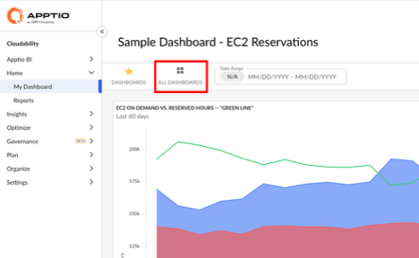
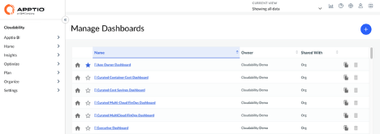
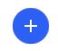

# Lista de painéis

Ao acessar Cloudability, os usuários são direcionados ao Painel Inicial. É possível acessar outros painéis clicando no botão “Todos os painéis” após acessar “Meu painel”, na seção “Página inicial”, na barra de navegação à esquerda.

A página “Gerenciar painéis” permite que os usuários vejam a lista completa dos painéis aos quais têm acesso.

A “Lista de painéis” exibe uma tabela que contém:

- O nome de cada painel.
- O proprietário de cada painel.
- A coluna “Compartilhado com”, que ajuda a entender quais usuários têm acesso a cada painel. Este campo exibirá “Org” quando um painel estiver acessível a todos os usuários da sua organização ou exibirá um número, que indica o número de usuários com os quais um determinado painel foi compartilhado.

Há também vários ícones visíveis ao lado de cada painel que oferecem opções adicionais de configuração.

O ícone “Página inicial” permite que os usuários configurem o painel padrão que será exibido ao fazer login em Cloudability. Este será o painel de controle “Início” deles. O painel “Página inicial”, conforme configurado atualmente, será exibido com um ícone azul de “Página inicial”.

O ícone “Estrela” permite que os usuários adicionem um painel à sua lista de painéis “Favoritos” pessoais, facilitando o acesso aos painéis a partir da lista de painéis favoritos [ADICIONAR UM LINK PARA “CONFIGURAÇÃO DE PAINÉIS → PAINÉIS FAVORITOS”], sem precisar acessar a lista de painéis. Os painéis favoritos são exibidos com um ícone de estrela azul, e todos os demais painéis são exibidos com um ícone de estrela cinza.

O ícone “Copiar” permite que os usuários criem uma cópia exata de um determinado painel. Ao clicar neste ícone, será aberto um novo painel que contém exatamente os mesmos widgets e opções de configuração. As permissões de compartilhamento NÃO são copiadas e, por padrão, o novo Painel não é compartilhado com outros usuários. O novo painel é criado com o sufixo “cópia” anexado ao nome do painel; por exemplo, ao copiar um painel chamado “Resumo de custos executivo”, será criado um painel chamado “Resumo de custos executivo (cópia)”.

O ícone “Excluir” permite que os usuários excluam definitivamente um painel. Os usuários só podem excluir um painel se tiverem permissões de “Edição” para esse painel.

[AVISO] Será solicitada uma confirmação aos usuários antes da exclusão de um painel. A exclusão de um painel não pode ser revertida!

A página “Gerenciar painéis” pode ser usada para criar um novo painel do Cloudability. Ao clicar no ícone azul de “mais”, será criado um novo painel vazio, que poderá ser preenchido com widgets.

**Tópico principal:** [Painéis de Cloudability](../product/cloudability-dashboards.html)
