# Reprocessamento de dados

[Reprocessamento de dados para usuários do Cloudability](data_reprocess.html#data_reprocess__Data)

[Reprocessamento de dados para usuários do módulo “ Cloudability ” – Cálculo de Custos e Planejamento](data_reprocess.html#data_reprocess__Data2)

Reprocessamento de dados para usuários do Cloudability

Normalmente, quando você modifica sua estratégia de negócios, é necessário ajustar os mapeamentos de negócios, os grupos de contas e as tags e etiquetas no Cloudability, com uma atualização retrospectiva dos dados históricos. É aí que entra em cena o reprocessamento de dados. Se você for um cliente do Cloudability, talvez precise apenas do reprocessamento dentro do Cloudability. Você pode realizar um reprocessamento de dados no modo de autoatendimento para reprocessar os dados sem precisar recorrer às equipes de Suporte ou de Sucesso do Cliente.

O recurso está disponível apenas para usuários com permissão de “Admin” no site Cloudability. Acesse Organizar > Reprocessar dados.

Nota:

O recurso não está ativado por padrão, pois se trata de um recurso opcional. Entre em contato com a Equipe de Suporte ou com seu Gerente de Sucesso do Cliente para ativar esse recurso.

Siga as etapas abaixo para iniciar o reprocessamento

1. Acesse Organizar > Reprocessamento de dados; por padrão, a guia Status da tarefa é exibida. Esta aba exibirá uma lista das suas solicitações anteriores.
2. Acesse a guia “Nova solicitação”, insira o nome da tarefa (para sua identificação), a data de início, a data de término e o motivo. Selecione o botão “Iniciar reprocessamento” para enviar a solicitação.

   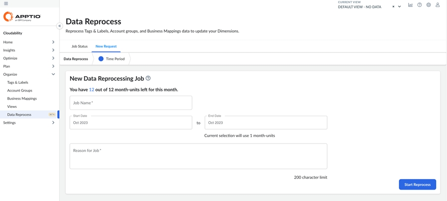

   Nota:
   - Você dispõe de 12 unidades-mês para as quais é possível solicitar o reprocessamento a cada mês. Unidades-mês : Cada mês de reprocessamento de dados é considerado uma unidade-mês. Por exemplo, se você enviar uma solicitação de reprocessamento para um período de 12 meses, consumirá 12 unidades-mês. Se você enviar duas solicitações de reprocessamento de três meses cada, consumirá seis unidades-mês.
   - O total de unidades-mês e as unidades-mês restantes são exibidos na parte superior.
   - O período máximo de análise retrospectiva é de 12 meses, para o qual pode ser solicitado um novo processamento.
   - As unidades-mês utilizadas pela sua seleção atual são exibidas abaixo da Data de Término.
   - Se a seleção exceder as unidades-mês restantes, uma mensagem de erro será exibida no canto inferior direito.
   - Se a tarefa falhar em um mês específico, suas unidades mensais não serão contabilizadas para esse mês, e você poderá reenviar a tarefa para esse mês específico.

     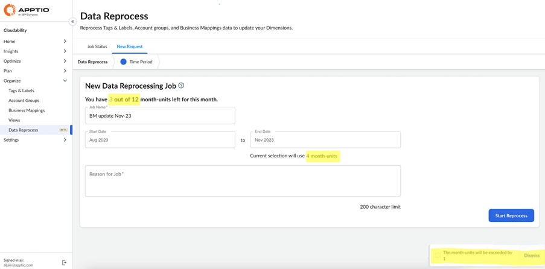
3. Ao enviar a solicitação Iniciar reprocessamento, uma mensagem de confirmação é exibida no canto inferior direito e você será redirecionado para a aba Status da tarefa.

   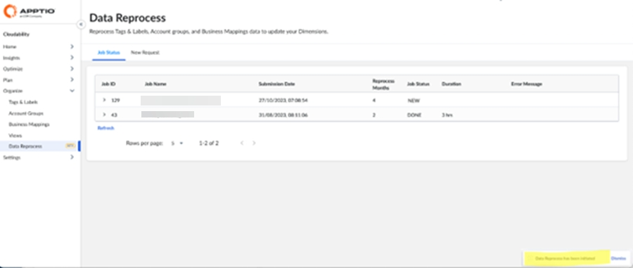
4. A aba “Status do trabalho ” exibe o status dos seus trabalhos atuais e anteriores. Você também pode expandir o ID do trabalho e ver os status de cada mês. Selecione Atualizar para atualizar a página de status.

   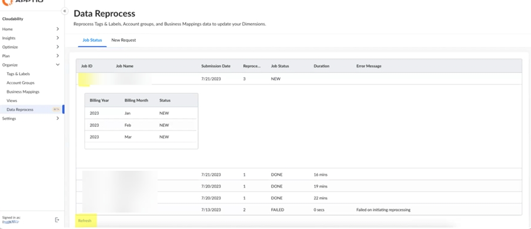

   Nota:
   - Depois que a solicitação de reprocessamento for enviada, ela não poderá ser cancelada.
   - Não é possível ter duas solicitações de reprocessamento em andamento ao mesmo tempo para o mesmo período ou mês. No entanto, você pode enviar duas solicitações de reprocessamento ao mesmo tempo, desde que não haja sobreposição no período ou nos meses selecionados.
   - Se você precisar apenas reprocessar os dados do mês atual, não é necessário enviar uma solicitação. Cloudability já processa os dados do mês atual diariamente, e eles devem estar disponíveis em 24 horas.

Quando entrar em contato com o TAM/CSM/Suporte

Você pode entrar em contato diretamente com seu TAM/CSM ou com a equipe de Suporte se:

- A tarefa falha mais de uma vez.
- Você esgotou seu limite mensal de unidades mensais e há uma necessidade comercial urgente de reprocessar os dados.
- Você tem algum comentário ou alguma outra questão.

Reprocessamento de dados para usuários do módulo “ Cloudability ” – Cálculo de Custos e Planejamento

Se você utiliza o Costing & Planning, talvez queira importar seus dados da nuvem para o Costing & Planning a partir do Cloudability ou usar o Cloud Data Ingestion (CDI). No entanto, pode haver mudanças contínuas nas estratégias de negócios da sua organização; novas contas e aplicativos podem ser adicionados, ou a estratégia de marcação pode mudar. Devido a essas alterações, talvez seja necessário reprocessar os dados para que as novas adições ou alterações sejam aplicadas retroativamente e, em seguida, enviar esses dados para o módulo de Cálculo de Custos e Planejamento.

Esse recurso permite que os usuários “Admin” do Cloudability ou os usuários do CDI iniciem o reprocessamento de dados e monitorem o status do processo.

Nota:

Essa funcionalidade está SUSPENSA para clientes que possuem o pacote Apptio Costing & Planning juntamente com Cloudability ou CDI. Estamos trabalhando ativamente para aprimorar a experiência e esperamos lançar o recurso aprimorado no início do próximo ano. Cloudability Os clientes do módulo de Cálculo de Custos e Planejamento que já tinham acesso continuarão a mantê-lo.

Siga as etapas abaixo para iniciar o reprocessamento

1. Acesse Organizar > Reprocessamento de dados; por padrão, a aba Status da tarefa é exibida. Esta aba exibirá uma lista das suas solicitações anteriores.
2. Acesse a guia Nova solicitação e a etapa padrão Tags e rótulos será exibida. Você pode selecionar ou desmarcar tags e rótulos específicos que deseja exportar ou transferir para o Cálculo de Custos e Planejamento.

   Nota:

   As alterações nesta seleção se aplicam apenas aos dados que estão sendo exportados para o Módulo de Cálculo de Custos e Planejamento ou TBM Studio. Todas as dimensões de negócios (Tags e Etiquetas, Grupos de Contas e Mapeamentos de Negócios) são reprocessadas para o “ Cloudability ”. TBM
   StudioNo entanto, se você pretende apenas solicitar um reprocessamento sem alterar a exportação de dados para o Módulo de Cálculo de Custos e Planejamento, prossiga para a última etapa para enviar sua solicitação.

   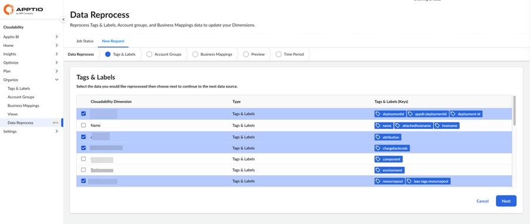
3. Selecione Próximo para selecionar/desmarcar os Grupos de contas.

   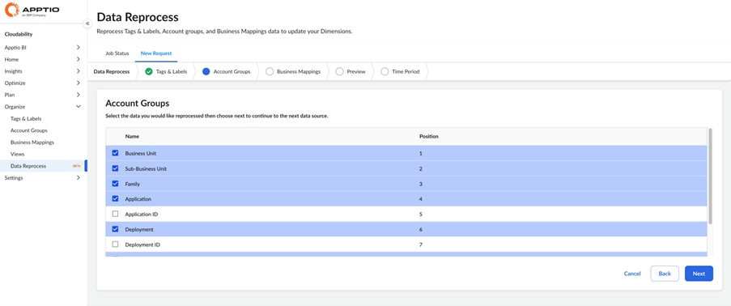
4. Selecione Próximo para selecionar Mapeamentos de negócios.

   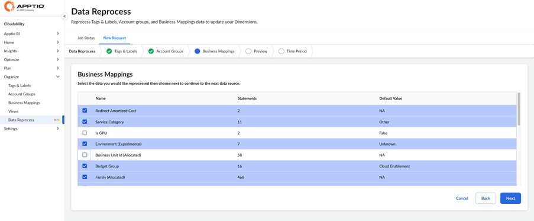
5. Selecione “Próximo” e verifique a seleção que você fez.

   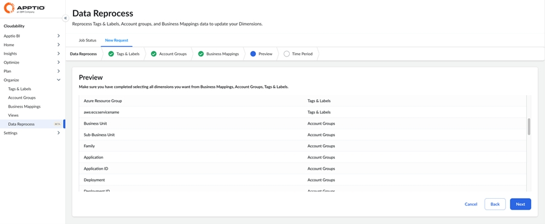
6. Selecione “Próximo” e a página de envio do trabalho será exibida. Insira o nome do trabalho (para sua identificação), a data de início e a data de término, além do motivo. Selecione o botão “Iniciar reprocessamento” para enviar a solicitação.

   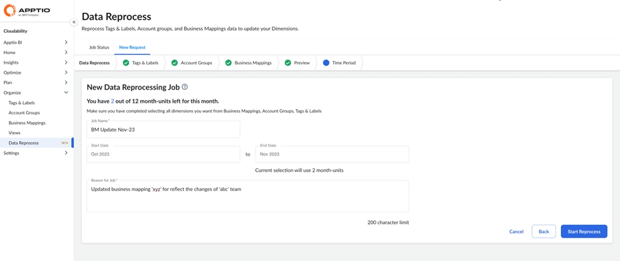

   Nota:
   - Você dispõe de 12 unidades-mês para as quais é possível solicitar o reprocessamento a cada mês.
   - Unidades mensais: Cada mês de reprocessamento de dados é considerado uma unidade mensal. Por exemplo, se você enviar 1 solicitação de reprocessamento para um período de 12 meses, consumirá 12 unidades-mês. Se você enviar duas solicitações de reprocessamento, cada uma com duração de três meses, consumirá seis unidades-mês.
   - O total de unidades-mês e as unidades-mês restantes são exibidos na parte superior.
   - O período máximo de análise retrospectiva é de 12 meses, para o qual pode ser solicitado um novo processamento.
   - Não é possível ter duas solicitações de reprocessamento em andamento ao mesmo tempo para o mesmo período ou mês. No entanto, você pode enviar duas solicitações de reprocessamento ao mesmo tempo, desde que não haja sobreposição no período ou nos meses selecionados.
   - As unidades-mês utilizadas pela sua seleção atual são exibidas abaixo da Data de Término.
   - Se a seleção exceder o número de unidades-mês restantes, a mensagem será exibida no canto inferior direito.
   - Se o trabalho falhar (o status geral do trabalho for “FAILED”), você precisará executar o reprocessamento novamente para o mesmo período.

     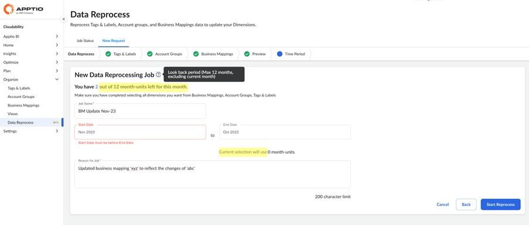
7. Ao clicar no botão Iniciar reprocessamento, uma mensagem de confirmação é exibida no canto inferior direito e você será redirecionado para a aba Status da tarefa.

   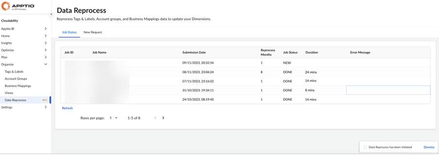
8. A aba “Status ” exibe o status dos seus trabalhos atuais e anteriores. Você também pode expandir o ID do trabalho e ver os status de cada mês. Selecione Atualizar para atualizar a página de status.

   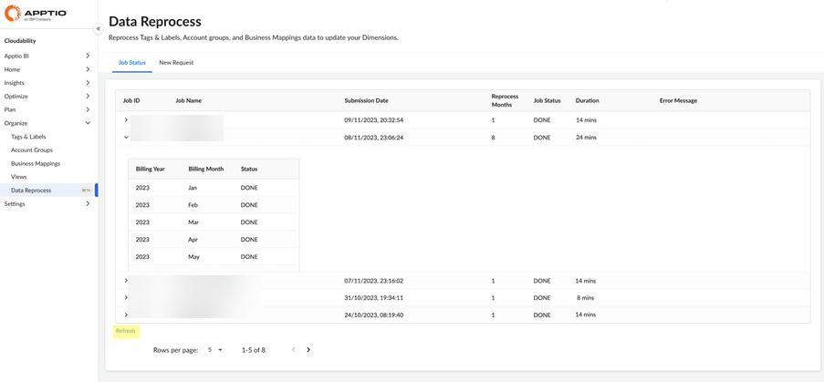

   Nota:
   - Somente tags e rótulos, grupos de contas e mapeamentos comerciais podem ser selecionados.

     Mapeamentos de negócios que contenham colunas de ID de recurso e/ou data em sua definição não serão compatíveis com o Costing & Planning nem com TBM Studio.
   - Todas as métricas de negócios configuradas serão automaticamente transferidas para o módulo de Cálculo de Custos e Planejamento.
   - Todos os campos padrão continuarão a ser transferidos para o Cálculo de Custos e Planejamento, como antes.
   - Depois que a solicitação de reprocessamento for enviada, ela não poderá ser cancelada.
   - Quando a solicitação for concluída (Status = Concluída), você poderá executar o DLC (conector de enlace de dados) para importar os dados para o Cálculo de Custos e Planejamento.
   - Se você precisar apenas reprocessar os dados do mês atual, não é necessário enviar uma solicitação. Cloudability já processa os dados do mês atual diariamente, e eles devem estar disponíveis em 24 horas.

Quando entrar em contato com o TAM/CSM/Suporte

Você pode entrar em contato diretamente com seu TAM/CSM ou com a equipe de Suporte se:

- A tarefa falha mais de uma vez.
- Você esgotou seu limite mensal de unidades mensais e há uma necessidade comercial urgente de reprocessar os dados.
- Você tem algum comentário ou alguma outra questão.
