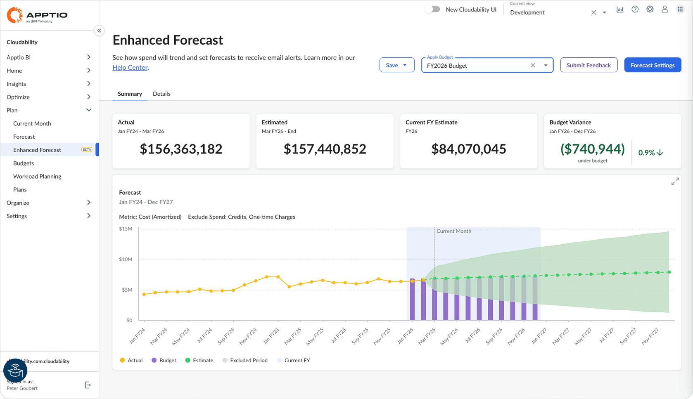
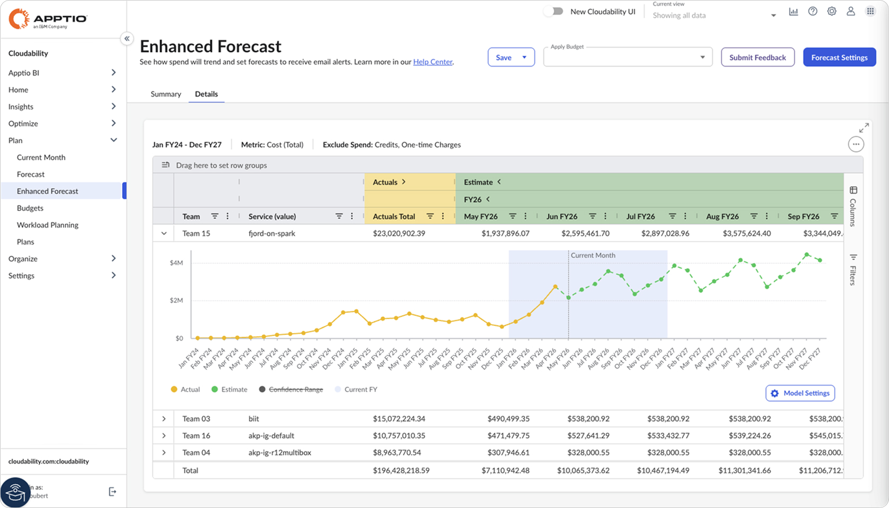
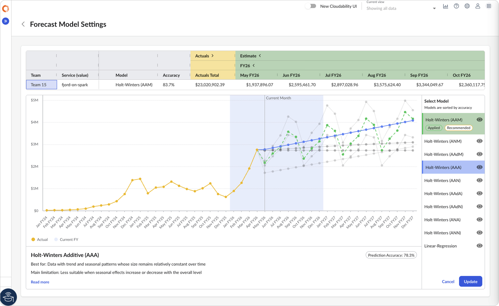
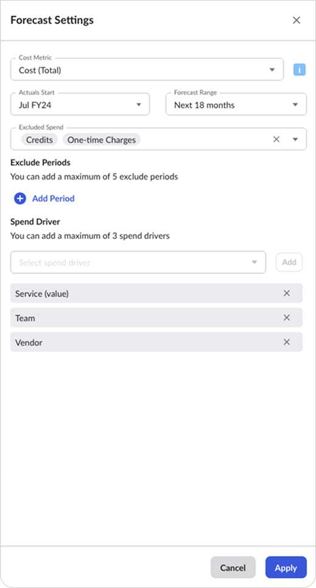
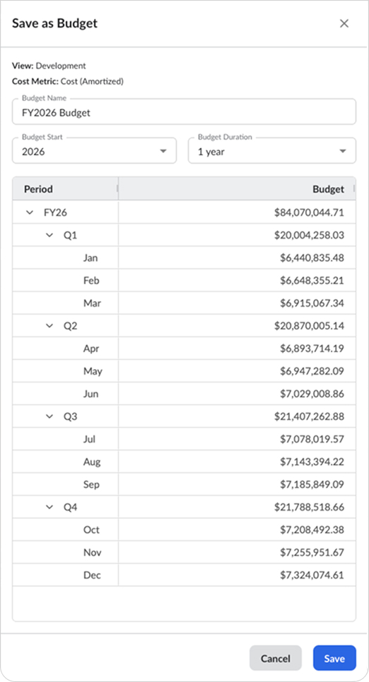

# Previsão aprimorada

Use a página “Previsão Aprimorada” para gerar e analisar previsões de gastos com nuvem. O sistema utiliza a Previsão Inteligente para gerar previsões com base em dados históricos reais e oferece controles flexíveis para analisar os resultados por fator de despesa. Você pode comparar modelos de previsão, analisar a precisão dos modelos e ajustar a seleção de modelos para itens individuais da previsão. Isso ajuda a melhorar a precisão da previsão, torna a previsão mais fácil de entender e oferece mais controle quando necessário.

Para saber mais sobre como funciona a Previsão Inteligente, consulte [Previsão Inteligente](intelligent-forecasting.html)

A página “Previsão Aprimorada” possui os seguintes componentes:

- **Resumo** – apresenta os KPIs e um gráfico resumido dos gastos reais e previstos, com comparação opcional com o orçamento
- **Detalhes** – exibe os detalhes das rubricas da previsão em uma tabela para análise por fator de despesa
- **Controles de previsão** – utilizados para gerar previsões, salvar resultados em um orçamento e aplicar um orçamento para comparação

Esse componente é descrito com mais detalhes a seguir.

## Resumo

Selecione a guia **“Resumo”** para analisar os resultados gerais da previsão.

KPIs

Os cartões de KPI mostram os totais dos valores reais e das estimativas exibidos no gráfico de resumo, juntamente com um total separado para o ano fiscal atual. Se for aplicado um orçamento, também é exibido um KPI de variação orçamentária.

Tabela resumida

O gráfico resumido exibe:

- Valores reais para períodos históricos
- Estimativas para os períodos previstos
- Valores orçamentários, caso seja aplicado um orçamento

Nessa perspectiva, **os valores reais** são os valores históricos registrados de gastos, enquanto **as estimativas** são os valores futuros projetados de gastos, gerados a partir desses valores reais pelo mecanismo de previsão inteligente. Juntos, eles compõem a **previsão** geral.

As estimativas são apresentadas com um **intervalo de confiança** que reflete os valores máximo e mínimo para um determinado período. **O intervalo de confiança** baseia-se em um intervalo estatístico e pode se ampliar com o tempo, à medida que a incerteza aumenta à medida que nos aproximamos do horizonte de previsão.

O ano fiscal atual aparece destacado no gráfico para que você possa ver claramente como os gastos reais e previstos contribuem para o total do ano fiscal atual.

Você pode interagir com o gráfico de várias maneiras:

- Passe o mouse sobre um ponto de dados para visualizar os valores detalhados.
- Clique em um item da legenda para ocultar ou exibir o elemento do gráfico associado a ele.
- Clique no ícone de expansão, representado por uma seta dupla, para ampliar o gráfico para o tamanho de página inteira.

## Detalhes

Selecione a guia **“Detalhes”** para revisar e analisar os detalhes das linhas de itens da previsão.

Os detalhes das rubricas da previsão são apresentados em uma tabela, na qual cada linha representa os gastos históricos e os gastos futuros estimados para uma combinação única de valores dos fatores determinantes de gastos selecionados. Para cada item, a tabela também mostra o modelo de previsão selecionado e sua pontuação de precisão. Você pode ordenar, filtrar e agrupar a tabela por fator de gastos e outros valores da tabela para comparar resultados, concentrar-se em padrões específicos de gastos e analisar a previsão sob diferentes perspectivas. Você também pode exibir ou ocultar colunas da tabela usando o Seletor de colunas na barra lateral da tabela ou pelo menu do cabeçalho da coluna.

Os valores estimados para períodos futuros são gerados a partir de valores históricos reais, utilizando o mecanismo Intelligent Forecast, que avalia diversos modelos estatísticos de previsão e seleciona automaticamente o modelo que melhor se ajusta à série de dados de entrada.

Para saber mais sobre os modelos compatíveis e a seleção de modelos, consulte [“Previsão Inteligente”](intelligent-forecasting.html)

Minigráfico da linha de previsão

Para examinar mais detalhadamente um item específico da previsão, clique no ícone de expansão ao lado da linha para abrir seu minigráfico.

Você pode interagir com o minigráfico de maneiras semelhantes às do gráfico de resumo:

- Passe o mouse sobre os pontos de dados para ver os detalhes.
- Oculte ou exiba elementos do gráfico clicando nas entradas da legenda; por exemplo, para ocultar a exibição **do Intervalo de Confiança**.

Você também pode visualizar detalhes sobre o modelo de previsão utilizado para gerar os valores previstos, comparar resultados de modelos alternativos e alterar o modelo selecionado.

Configurações do modelo

Clique em **“Configurações do modelo”** no minigráfico para abrir as configurações do modelo de previsão da linha de previsão selecionada.

A página “**Configurações do** modelo” exibe gráficos de linhas com todos os resultados do modelo de previsão. Os modelos são listados no painel de seleção em ordem decrescente de precisão. O modelo aplicado no momento está destacado tanto no gráfico quanto na lista de modelos.

Use a lista **“Selecionar modelo”** para visualizar e escolher um modelo de previsão diferente. Quando você seleciona um modelo da lista, a linha correspondente no gráfico é destacada e o painel de informações é atualizado para mostrar detalhes sobre esse modelo.

Selecione **“Atualizar”** para aplicar o modelo selecionado. Quando você fizer isso, os valores das partidas individuais da previsão serão atualizados com base nos resultados desse modelo.

Selecione o modelo **recomendado** para voltar ao modelo recomendado pelo mecanismo de previsão inteligente.

Para fechar a página **“Configurações do modelo”** e retornar aos detalhes das partidas individuais da previsão, selecione **“Cancelar”** ou pressione **a tecla Esc**.

Exportar

Para exportar os detalhes das linhas de previsão, abra o menu de opções (três pontos) da tabela e selecione “**Exportar** ”. O arquivo de exportação é gerado no formato “ CSV ”.

## Controles de previsão

O cabeçalho da página inclui controles de previsão compartilhados pelas guias “**Resumo** ” e “**Detalhes** ”. Use esses controles para gerar uma previsão, salvar os resultados em um orçamento e aplicar um orçamento existente para fins de comparação.

Configurações de previsão

Selecione **“Configurações de previsão”** para gerar uma nova previsão. Isso abre um painel onde você pode selecionar os parâmetros da previsão. Ao selecionar **“Aplicar”**, a previsão é gerada com base nos parâmetros selecionados. Uma barra de progresso é exibida enquanto a previsão está sendo gerada. Após a conclusão da geração, os resultados ficam disponíveis nas guias **“Resumo”** e “**Detalhes** ”.

As configurações de previsão incluem o seguinte:

| Configuração | Descrição |
| --- | --- |
| Métrica de custo | Métrica de custo para a previsão. As opções disponíveis incluem métricas de custo padrão do Cloudability e quaisquer métricas de custo personalizadas. |
| Início dos resultados reais | Selecione o primeiro mês dos dados históricos reais a serem incluídos na série de dados de entrada da previsão. Isso define o período de análise retrospectiva utilizado pelo mecanismo de previsão. Você pode escolher qualquer mês de início, mas ele deve ser, no mínimo, 12 meses antes do mês atual.  O período inicial selecionado pode afetar a detecção da sazonalidade. Embora não seja obrigatório, utilizar o início de um ano fiscal ou trimestre fiscal pode ajudar a alinhar os padrões de gastos recorrentes ao seu calendário fiscal. Em geral, quanto mais dados históricos houver, maior será a precisão da previsão. |
| Duração | Selecione até quando no futuro deseja fazer a previsão. As opções incluem previsões até o final do exercício fiscal atual, até o final do próximo exercício fiscal ou para períodos fixos, como 12, 18 ou 24 meses. |
| Despesas excluídas | Opcionalmente, exclua **créditos**, **cobranças únicas** ou ambos do cálculo da previsão. |
| Fatores que influenciam os gastos | Selecione as dimensões utilizadas para detalhar a previsão por item. As opções disponíveis incluem dimensões d Cloudability, como Dimensões de Negócios, Tags, Grupos de Contas e Fornecedores. Cada combinação única de valores de dimensão selecionados passa a ser um item da tabela de detalhes da previsão. |

Observação: A tabela de detalhes da previsão suporta até 1.000 itens. Se a previsão gerar mais de 1.000 linhas de detalhes, a tabela exibirá os 1.000 primeiros itens, além de uma linha **“Outros”** que contém a soma dos itens restantes.

Salvar a previsão como Orçamento

Use **“Salvar”** para criar um orçamento a partir da previsão atual. Isso abre o painel **“Salvar Orçamento”**, que já vem preenchido com valores previstos que podem ser editados antes de salvar.

O painel “Salvar Orçamento” exibe a visualização e a métrica de custo utilizadas para o novo orçamento, juntamente com os valores padrão para os campos obrigatórios: nome do orçamento, período de início do orçamento e duração.

Ao criar um orçamento a partir da previsão atual:

- a métrica de custo do orçamento corresponde à previsão e não pode ser alterada
- os períodos históricos são preenchidos com dados reais
- os períodos futuros são preenchidos com estimativas
- os períodos fora do intervalo da previsão atual são definidos como zero

Os orçamentos criados na página “Previsão Aprimorada” estão alinhados aos limites do exercício fiscal. O início do orçamento pode ser no ano atual, no ano anterior ou no próximo ano, e a duração pode variar de 1 a 3 anos.

Você pode editar os valores preenchidos automaticamente antes de salvar. Clique duas vezes em uma célula para inserir um novo valor. Os valores inseridos em períodos de resumo, como totais trimestrais ou anuais, são automaticamente distribuídos pelos períodos incluídos.

Após salvar, o orçamento pode ser gerenciado na página “Orçamentos”. Consulte [a seção “Orçamentos”](bf-budgets.html) para saber mais.

Definir um orçamento

Use o seletor **de orçamento** para aplicar um orçamento existente ao resumo da previsão. Quando um orçamento é aplicado, os valores orçados são exibidos como um gráfico de barras sobreposto ao gráfico de resumo, para ajudar a visualizar como os valores reais e estimados se comparam ao orçamento. Também foi adicionado um KPI de variação orçamentária.

- **[Previsão Inteligente](../product/intelligent-forecasting.html)**
