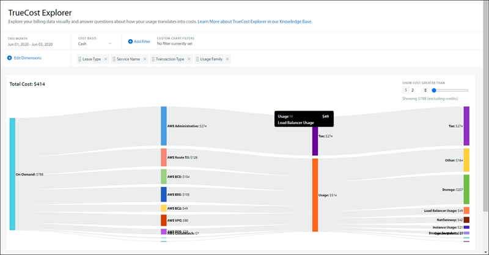
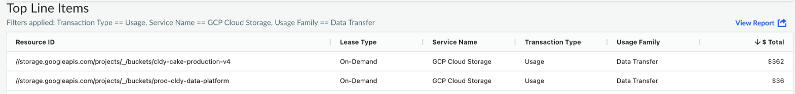

# TrueCost Explorer

TrueCost O Explorer ajuda você a entender a estruturação dos arquivos de faturamento na nuvem. Ele oferece uma maneira visualmente intuitiva de explorar seus dados de faturamento e responder a perguntas sobre os geradores de custos.

Caso de uso

A maioria dos clientes já teve uma experiência em que os custos de transferência de dados aumentaram. Na maioria dos casos, não é possível saber qual das dezenas de atributos seu fornecedor usa para identificar a transferência de dados, bem como as várias maneiras pelas quais a transferência de dados pode se manifestar no arquivo de faturamento (há mais de 20.000 itens de linha distintos relacionados à transferência de dados somente no site AWS ).

Com o TrueCost Explorer, você pode fazer o seguinte:

- Clique em Add Filter (Adicionar filtro ) e selecione a dimensão Usage Family (Família de uso ) que é igual a Data Transfer (Transferência de dados). Você pode ter uma visão única de seus custos de transferência de dados entre fornecedores. Além disso, independentemente do fornecedor, os custos de transferência de dados têm um LeaseType de On-Demand. Você também pode ver os serviços que estão gerando custos de transferência de dados, que, neste exemplo, são principalmente o AWS EC2 e o Azure Networking.
- Agora, reorganize as colunas e adicione a dimensão Operação para ver insights adicionais sobre os custos de transferência de dados. Aqui, você pode ver que, no lado Azure, seus custos de transferência de dados são impulsionados por Data Transfer out. Além disso, você pode ver que a grande maioria dos custos de transferência de dados são custos de transferência InterZone. Como esses custos estão relacionados à movimentação de dados entre as Zonas de Disponibilidade em AWS, chame a região e ajuste os filtros de plotagem para ver quantas pequenas taxas de transferência de dados estão disponíveis

Portanto, aprendemos isso aqui:

- Os custos de transferência de dados são impulsionados principalmente pelas redes AWS EC2 e Azure, com uma longa lista de outros 10 serviços que contribuem com valores menores
- Mais de 80% dos custos de transferência de dados estão relacionados à movimentação de dados entre AWS Zonas de disponibilidade em US-East-1
- Azure A transferência de dados é realizada principalmente nas regiões NorthCentralUS e WestEurope

Se quiser entender o que está gerando seus custos em um nível de recurso individual, clique no nó apropriado e selecione a opção View Top Line Items.

- **[Base de custos para redimensionamento e True Cost Explorer](../chatbot/cost-basis-for-rightsizing-true-cost-explorer.html)**
