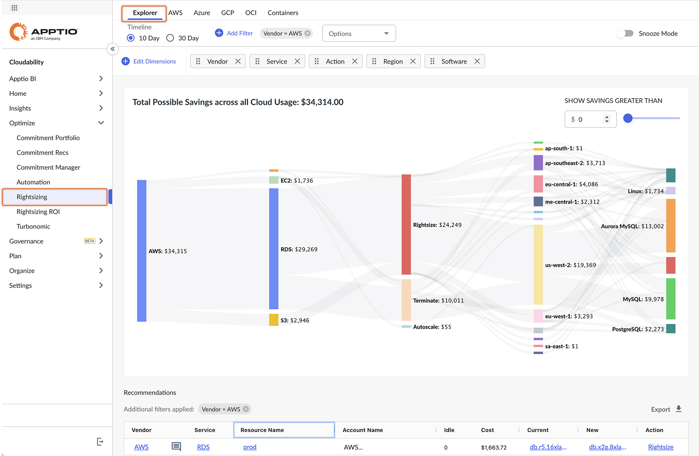

# Dimensionamento correto

Com o Rightsizing, você pode definir a infraestrutura de nuvem ideal mais adequada às suas necessidades atuais e de curto prazo, de forma a equilibrar riscos e custos para minimizar o desperdício.

Usando os painéis do Rightsizing, você pode ver a utilização dos recursos da nuvem ao longo do tempo. Em seguida, você pode visualizar os cenários recomendados para cada recurso para informar melhor suas decisões de dimensionamento da nuvem.

Há dois painéis de dimensionamento de direitos:

- Dimensionamento de direitos: Veja as recomendações de dimensionamento de direitos para seus serviços em nuvem. [Painel de dimensionamento](#get-recommendations-for-scaling-your-cloud-resources-with-rightsizing__Rightsiz).
- ROI do Rightsizing: Veja as economias potenciais e realizadas dos tíquetes sincronizados com o Jira [Rightsizing usando uma integração com o Jira](jira-for-rightsizing.html).

Painel de redimensionamento

O painel Rightsizing exibe a guia Explorer por padrão. O Rightsizing Explorer oferece uma visão geral das possíveis economias em todos os recursos de nuvem usados por sua empresa. Você pode usar esse painel para agrupar, filtrar e navegar pelas recomendações de dimensionamento de direitos.

[Rightsizing Explorer](rightsizing-explorer.html).

As guias adicionais em Rightsizing são recomendações para provedores de nuvem específicos.

## Perguntas frequentes sobre redimensionamento

Por que o período de tempo padrão da recomendação é de 10 dias?

10 dias captura as tendências de desempenho mais recentes e é mais preditivo do uso futuro de recursos.

Como a ociosidade é definida?

*A ociosidade* é definida de forma diferente com base no tipo de recurso, mas geralmente é representada da seguinte forma: Ocioso para computação (por exemplo, EC2 ) é o tempo gasto abaixo de 2% da CPU em uma escala de 1-100. Ocioso para Block Storage / Disco (por exemplo, EBS ) é a porcentagem de horas com zero IOPS. A ociosidade do armazenamento/banco de dados relacional (por exemplo, RDS ) baseia-se no número de conexões/sessões ativas do banco de dados em um determinado momento.

Como você determina o gasto?

Despesas são despesas de uso de instância para computação (por exemplo, EC2 ) e armazenamento/banco de dados relacional (por exemplo, RDS ). O Data Warehouse (por exemplo, Redshift ) exclui a transferência de dados. Para Object e Block Storage (por exemplo, S3 e EBS ), os gastos são determinados por GB Months.

Por que o Total de despesas no Rightsizing não corresponde exatamente aos valores mostrados no Reporting / True Cost Explorer?

O Rightsizing lista apenas os recursos para os quais encontrou pelo menos um recurso de economia de dinheiro, portanto, é provável que esses valores não sejam exatamente iguais.

Por que vejo (not set) em State (Estado) para EBS?

A conta tem permissões insuficientes (certifique-se de que sua política esteja atualizada com as permissões mais recentes) ou o recurso ficou ativo por menos de uma hora (os dados não aparecem no cache Describe Data de AWS ).

Por que vejo N/A para lastAttachedTime para volumes EBS não conectados?

Os volumes mostrarão o registro de data e hora de seu último anexo às instâncias do EC2 e o volumeID. Para volumes que não tenham sido anexados durante a janela de dimensionamento de direitos (os últimos 10 dias por padrão), será exibido N/A.

Para EC2, as recomendações levam em conta a explosão?

Usamos o desempenho da linha de base para recursos que podem ser interrompidos (por exemplo, tipos de instância T2 ) e não levamos em conta a interrupção na determinação das recomendações. Isso garante que façamos recomendações conservadoras que não resultem em redução de recursos.

Para EC2, como você determina a rede e o disco?

AWS não informa EC2 os limites de throughput da *rede* e *do disco*. Além disso, a capacidade de throughput variará com base na carga de trabalho (por exemplo, leitura e gravação sequencial versus aleatória) e na transferência (por exemplo, transferência de dados em uma região versus entre regiões). Usamos limites comumente observados em nosso portfólio de clientes para aproximar a capacidade.

Por que as instâncias Spot são excluídas das recomendações de dimensionamento?

Nosso mecanismo de rightsizing leva em conta sua carga de trabalho (métricas de utilização) e o custo para executá-la (tipo de instância atual e preço sob demanda) e gera uma lista de recomendações que você pode escolher para ajudá-lo a economizar dinheiro. As instâncias spot, por outro lado, já são oferecidas com grandes descontos; aplicar o rightsizing nessas situações resulta em uma economia insignificante. Por esse motivo, optamos por excluir as Instâncias Spot do rightsizing.

Nota:

Quando recomendamos que você mova um tipo de instância EC2 para uma instância sem armazenamento local, incorporamos à recomendação que você adicione EBS e contabilize ambos na economia.

Com que frequência as recomendações são atualizadas?

Atualizamos diariamente nossas recomendações de dimensionamento de direitos. Você pode acessar as recomendações de recursos 24 horas após a criação do recurso, desde que haja dados de utilização suficientes.

Como o site Cloudability determina as recomendações de dimensionamento de direitos?

As recomendações de dimensionamento de direitos são geradas usando o melhor algoritmo de dimensionamento de direitos proprietário da Cloudability. Essas recomendações variam para diferentes CSPs (Cloud Service Providers) e serviços, mas, normalmente, as métricas que estão sendo levadas em consideração são aquelas mostradas nos gráficos no painel de detalhes das recomendações. Por exemplo, as recomendações de computação normalmente analisam uma combinação de CPU, rede, disco, memória e, possivelmente, algumas outras métricas e a utilização durante os períodos de tempo selecionados para entender as melhores opções.

O que devo ter em mente ao analisar as recomendações de redimensionamento?

Ao examinar as recomendações de redimensionamento, primeiro é preciso entender a diferença entre as opções de base de custo disponíveis e qual delas você pretende usar. Em segundo lugar, use sua devida diligência ao implementar uma determinada recomendação, pois o site Cloudability não conhece a finalidade de cada recurso. Suas equipes podem ter mantido determinados recursos "ociosos" ou "subutilizados" para uma finalidade específica, mas o site Cloudability pode recomendar o encerramento ou a redução do tamanho dos recursos.

Na seção Rightsizing (Redimensionamento), podemos definir o período de retrospectiva (linha do tempo) para 60 dias?

Atualmente, o redimensionamento em Cloudability suporta apenas o período de retrospectiva ou a linha do tempo de 10 dias e 30 dias.

Quais são os vários valores de estado exibidos em Azure disk rightsizing e o que eles significam?

Em Rightsizing recommendations for Azure disk, os valores de estado são:

- ActiveSAS: O disco tem atualmente um Uri SAS ativo associado a ele.
- ActiveSASFrozen: O disco está conectado a um controlador de armazenamento ( VM ) em estado de hibernação e possui um URI SAS ativo associado a ele.
- ActiveUpload: Um disco foi criado para upload e um token de gravação foi emitido para fazer o upload para ele.
- Conectado: O disco está atualmente conectado a um servidor VM em execução.
- Congelado: O disco está conectado a um VM que se encontra em estado de hibernação.
- ReadyToUpload: Um disco está pronto para ser criado por upload, solicitando um token de gravação.
- Reservado: O disco está conectado a um objeto ` VM ` parado e desalocado.
- Não conectado: O disco não está sendo usado e pode ser conectado a um controlador de disco ( VM ).

Consulte a seguinte documentação do site Azure em "fields" para obter os valores mais recentes e suas definições [https://learn.microsoft.com/en-us/dotnet/api/microsoft.azure.management.compute.models.diskstate?view=azure-dotnet-legacy#fields](https://learn.microsoft.com/en-us/dotnet/api/microsoft.azure.management.compute.models.diskstate?view=azure-dotnet-legacy#fields "(Abre em uma nova guia ou janela)")

As recomendações de dimensionamento levam em conta os descontos do provedor de serviços em nuvem (CSP) devido a commits por hora? Se as recomendações forem aplicadas, o gasto por hora diminui?

Para AWS, uma métrica de custo personalizada deve estar em vigor. Para Azure e GCP, uma tabela de preços é fornecida por esses provedores de serviços em nuvem. Portanto, o preço personalizado não é necessário. Os gastos por hora entram em vigor na próxima vez que os dados de custo e uso forem ingeridos e processados.

- **[Explorador de redimensionamento](../product/rightsizing-explorer.html)**
- **[AWS EC2](../product/rightsizing-for-aws-ec2.html)**
- **[AWS EC2 Grupo de dimensionamento automático (ASG)](../product/rightsizing-for-aws-autoscaling-groups.html)**
- **[AWS EBS](../product/rightsizing-for-aws-elastic-block-store.html)**
- **[AWS ElasticIP](../product/aws_elasticip.html)**
- **[AWS Lambda](../product/rightsizing-aws-lambda.html)**
- **[AWS RDS](../product/rightsizing-for-aws-rds.html)**
- **[Amazon Redshift](../product/aws_redshift.html)**
- **[AWS S3](../product/rightsizing-amazon-s3.html)**
- **[Azure Calcular](../product/rightsizing-for-azure-compute.html)**
- **[Azure Conjuntos de escala de computação](../product/azure_compute_scale_sets.html)**
- **[Azure Disco](../product/rightsizing-for-azure-disks.html)**
- **[Azure SQL](../product/rightsizing-for-azure-sql.html)**
- **[Azure Blob Storage](../product/rightsizing-for-azure-blob-storage.html)**
- **[GCP Google Compute Engine (GCE)](../product/rightsizing-for-gce.html)**
- **[GCP Google Compute Engine (GCE) Grupos de Instâncias Gerenciadas (MIG)](../product/rightsizing-for-gcp-gce-mig.html)**
- **[GCP Google Disco persistente (GPD)](../product/rightsizing-for-gpd.html)**
- **[GCP Google Cloud Storage (GCS)](../product/rightsizing-for-gcp-cloud-storage.html)**
- **[Máquinas virtuais (VMs) da OCI](../product/rightsizing-for-oci-vms.html)**
- **[Ação de autoescala para redimensionamento](../product/rightsizing-autoscale-action.html)**
- **[Ajuste do tamanho para contêineres d Kubernetes](../product/k8s-container-rightsizing.html)**
- **[Preferências de redimensionamento](../product/rightsizing-preferences.html)**
- **[Recomendações de dimensionamento de sonecas](../product/rightsizing-snoozing-recommendations.html)**

**Tópico principal:** [Redimensionamento no Cloudability Premium](../product/rightsizing-in-cloudability-premium.html)
