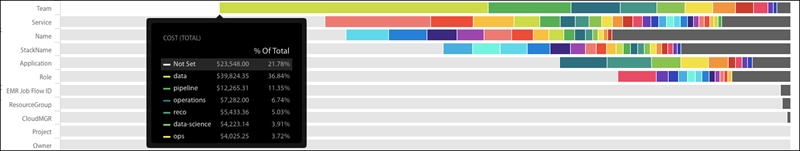
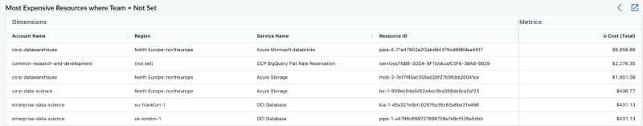
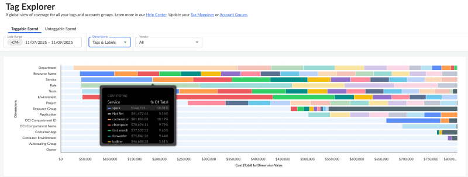
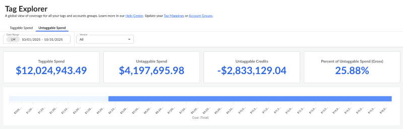

# Identifique as despesas marcadas e não marcadas com o Tag Explorer

Com o Tag Explorer, facilitamos a visualização das tags que sua organização está usando no momento. Por exemplo, se você sabe que sua empresa usa a tag Team (Equipe) para alocar gastos, mas não consegue se lembrar se os valores da equipe devem ser minúsculos, com letras maiúsculas, espaços, abreviados etc, O Tag Explorer está aqui para ajudar.

O cenário

Muitos clientes usam o Tag Explorer para o gerenciamento de ativos. Continuando o exemplo anterior, se quiser identificar quais recursos não têm tags de Equipe no momento, basta clicar no segmento Não definido para Equipe para exibir esses recursos na tabela abaixo.

Para os clientes que executam a infraestrutura em várias nuvens públicas, fornecemos uma maneira perfeita de ver o uso de tags em um único painel. Neste exemplo, usamos a tag “Service” para identificar um processo que é executado em paralelo em Azure, GCP e AWS.

Nem todos os recursos do site AWS suportam marcação. Na guia Untaggable Spend, você pode ver uma interface simples para visualizar todos os recursos do AWS que não suportam tags no momento. Observe que os Account Groups e as Business Dimensions não enfrentam restrições comparáveis e, portanto, não são exibidos nessa visualização.

A solução

Para revisar, o site Cloudability oferece uma variedade de tags para reunir seus recursos de nuvem em grupos significativos.

- As tags mapeadas oferecem uma maneira simples de trazer as tags existentes para o site Cloudability com a opção de combinar tags duplicadas em uma única dimensão. Isso inclui tags em AWS, rótulos de recursos e rótulos de projetos em GCP, além de tags e grupos de recursos em Azure.
- Os grupos de contas permitem que você aplique tags no nível da conta, que depois fluem para qualquer recurso que seja consumido por essa conta. Em termos de funcionalidade, elas são muito semelhantes às etiquetas de projeto no GCP.
- As Business Dimensions permitem que você aplique tags usando regras arbitrárias que você define.

Perguntas Frequentes

- Quantas tags são exibidas?

  Quinze tags mais usadas são mostradas nessa visualização. Observe que todas as tags com menos de 1% de cobertura são excluídas. As tags com gasto mínimo são reunidas em um grupo abrangente denominado "Outros" para essa visualização. Não é um valor de tag real em seus dados, e você pode ver quais valores de tag individuais estão sendo agregados em "Outros" selecionando o segmento "Outros".
- O Tag Explorer oferece visibilidade dos diferentes tipos de tags — tags de grupo de recursos, tags de assinatura, tags de “ GCP ” e rótulos, etc.?

  Sim. O Tag Explorer oferece visibilidade das tags de grupos de recursos, das tags de contas/assinaturas, das tags e rótulos do GCP, além das tags de recursos.
