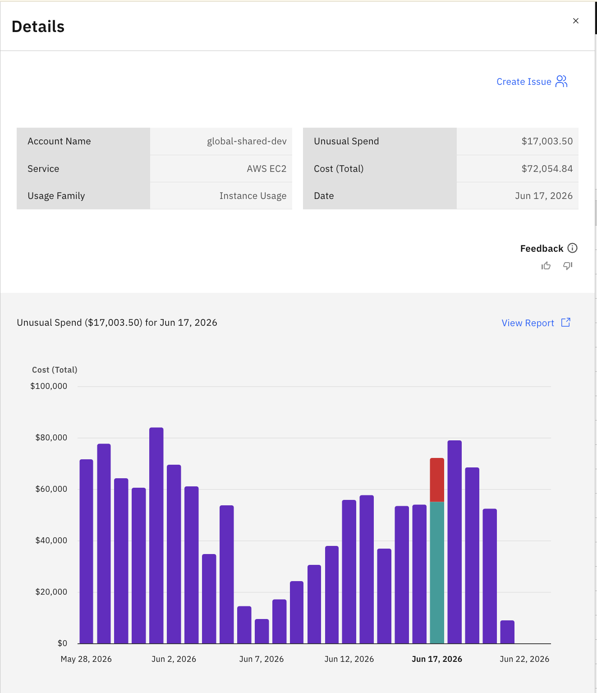
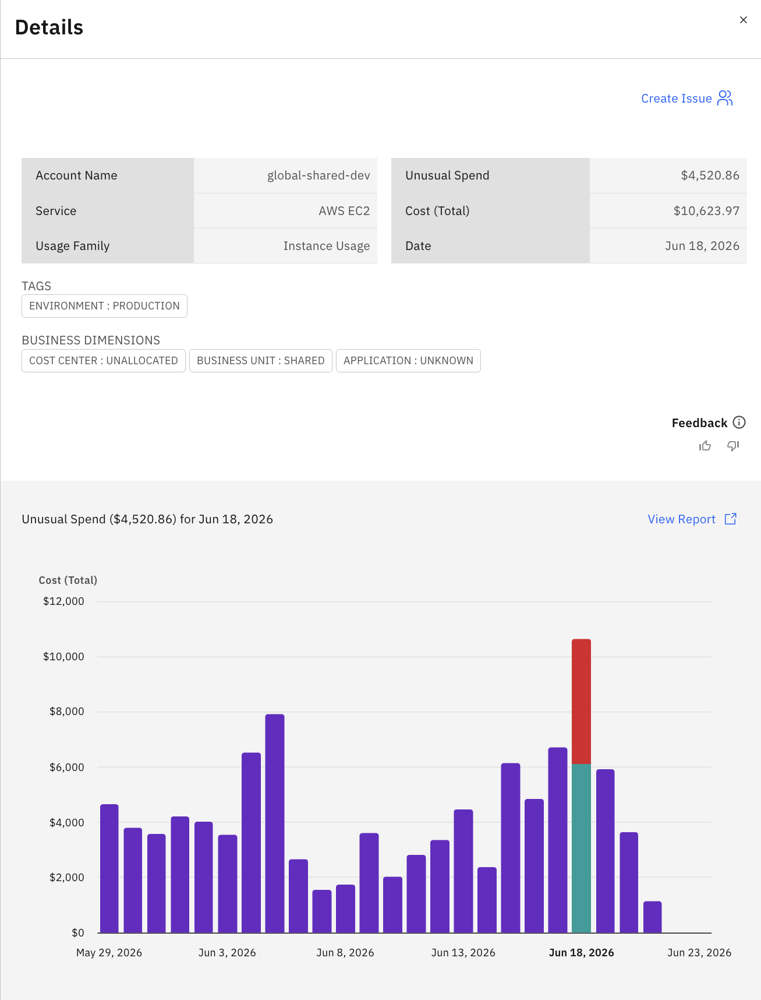
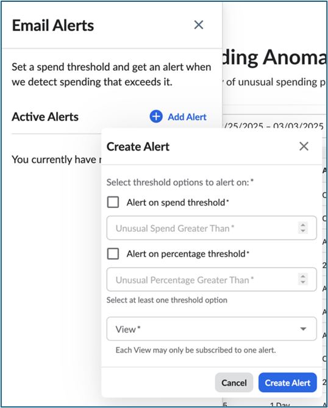
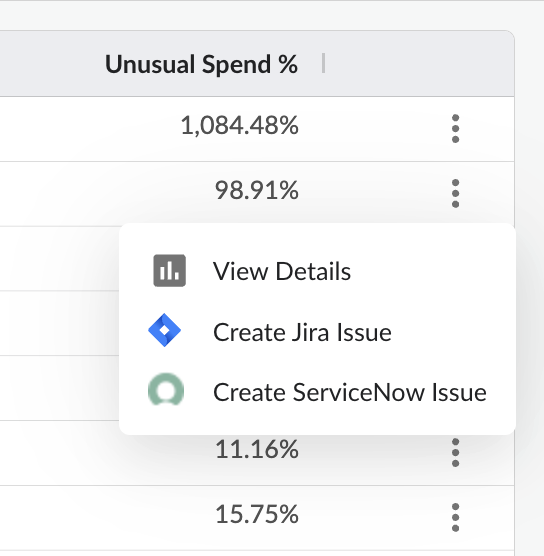

# Detecção de anomalias

A detecção de anomalias no Cloudability ajuda as organizações a identificar padrões incomuns ou inesperados em gastos de custos. Esse recurso independente de nuvem fornece uma análise abrangente de todos os serviços para detectar anomalias de custo, permitindo que os usuários reduzam os picos repentinos de faturamento por meio de alertas oportunos. Os usuários podem monitorar as anomalias diretamente no site Cloudability ou receber notificações por e-mail e Pager Duty.

**Principais recursos**

- Detecte anomalias nos dados de custo em seus ambientes de nuvem

- Configurar alertas usando limites absolutos (moeda) e percentuais

- Analise os detalhes da anomalia e exporte ou crie tíquetes (Jira, ServiceNow )

- Crie tíquetes no Jira ou em ServiceNow diretamente de dentro do site Cloudability

- Acesse anomalias de forma programática por meio da API REST

## **Como funciona a detecção de anomalias**

Formação de segmentos de custo

A formação de segmentos de custos é o processo de dividir os custos totais da nuvem em segmentos menores com base no tipo de serviço, na conta, na categoria de uso e nas tags e mapeamentos comerciais mais relevantes. Isso ajuda o sistema a identificar padrões de custo exclusivos e a detectar anomalias com mais precisão.

Há dois tipos de segmentos de custo:

**Segmento de custo por nível de serviço** e **segmento de custo configurável**

A formação do segmento de custo em nível de serviço é calculada **usando os custos totais por data, nome do serviço e família de uso.**

.

*As tags e as dimensões de mapeamento não são utilizadas no cálculo; portanto, a página **“Detalhes”** não exibe tags nem dimensões de negócios.*

**O Segmento de Custo Configurável** é calculado com base nos custos totais agregados por **data, nome do serviço, família de uso, conta** e até **4 tags e dimensões de mapeamento de negócios** selecionadas pelo administrador do Cloudability.

Abaixo está um exemplo em que definimos as tags e o algoritmo de mapeamento de negócios foi escolhido para identificar anomalias.

**As tags e as dimensões de mapeamento são utilizadas no cálculo; por isso, a página **“Detalhes”** exibe as tags e as dimensões de negócios.**

Nota:

- Somente administradores d Cloudability s podem selecionar até **4 dimensões** no total entre as dimensões de Tags e de Mapeamento de Negócios.
- Essas dimensões selecionadas são utilizadas para formar segmentos de custo para a detecção de anomalias.

**Seleção de dimensões de mapeamento de tags e negócios**

**Passos**

1. Acesse a página **“Anomalias”** em IBM Cloudability.
2. Clique em **“Configurações de anomalias”** na barra de ações superior.
   - Isso abre o painel “**Ajustar detecção de anomalias** ”.
3. Selecione uma **tag** ou uma dimensão **de mapeamento de negócios** no menu suspenso e clique em “**Adicionar** ”.
   - Repita esta etapa para adicionar até **4 dimensões de Tag e/ou Mapeamento de Negócios**.
4. Clique em **“Salvar”** para aplicar a configuração.
   - As alterações podem levar até **24 horas** para entrar em vigor.

## Configuração de um alerta

Para configurar um alerta, primeiro defina e identifique a situação que deseja monitorar.

Na janela de alerta, os usuários precisam preencher duas seções:

1. **Select a View (Selecionar uma visualização** ) - Especifique a visualização para a qual você deseja receber um alerta.
2. **Definir um limite** – Escolha um valor limite, seja como um número absoluto **OU** como uma porcentagem.

**O que é uma visualização em Cloudability?**

A **View** in Cloudability é uma ferramenta avançada de filtragem de dados que ajuda as organizações a personalizar e controlar como as informações de gastos e uso da nuvem são exibidas e compartilhadas. As visualizações permitem criar filtros em todo o aplicativo para seus dados e atribuí-los a diferentes usuários com base nas necessidades organizacionais.

Para obter mais detalhes, consulte [“Configurando visualizações” em Cloudability.](../admin/create-and-manage-views.html)

Depois que a visualização estiver configurada, crie um alerta na seção Anomaly Detection (Detecção de anomalias ) do Cloudabilty. Considere o exemplo a seguir.

Um usuário deseja monitorar os gastos de sua conta na nuvem usando o site Cloudability. Eles configuram um alerta para uma visualização selecionada com os seguintes limites:

- Limite de valor absoluto: US$ 50.000
- Limite baseado em porcentagem: 20% de porcentagem incomum (calculada a partir das despesas previstas).
- **Fórmula para porcentagem incomum:**

  Porcentagem incomum
  =

  Despesas incomuns
  Despesas previstas
  {Unusual Percentage} = {\text{Unusual Spend}} {\text{Expected Spend}}
- Em que:Despesas previstas=Custo total−Despesas incomuns\text {Expected Spend} = \text {Total Cost} - \text {Unusual Spend}

Agora considere os cenários:

Cenário 1 : **Limite de gastos incomuns acionado**

**Cenário 2: Limite de porcentagem incomum acionado**

Se suas **despesas previstas** forem de **US$ 40.000** e seu **limite de alerta** estiver definido como **20% de porcentagem** incomum, de acordo com a fórmula de porcentagem incomum, se as **despesas incomuns** forem de **US$ 8.000 ou mais**, o alerta será acionado.

Isso se deve ao fato de que:Porcentagem incomum=8,00040,000=20%\text {Unusual Percentage} = \frac {8,000}{40,000} = 20\%

Você também tem a flexibilidade de escolher um dos valores de limite ou ambos os valores.

Acesso aos detalhes da anomalia

Para explorar uma anomalia em mais detalhes, clique no botão View Report (Exibir relatório) na página de detalhes. Isso abrirá a interface de relatórios, onde você poderá adicionar dimensões adicionais ou ajustar o intervalo de datas para uma análise mais profunda.

Para acessar os detalhes da anomalia, siga as etapas abaixo.

1. Navegue até Insights > Anomaly Detection (Detecção de anomalias ).
2. Na página Spending Anomalies (Anomalias de despesas ), clique em Details (Detalhes ).
3. Selecione Exibir relatório para adicionar mais dimensões para análise.
4. Use a opção Editar para modificar o período de tempo ou o intervalo de datas de uma exibição personalizada.

Isso proporciona uma investigação abrangente das anomalias de custo, ajudando-o a obter melhores percepções sobre padrões de gastos incomuns.

## Criação de tíquetes Jira ou ServiceNow para anomalias

Você pode criar tíquetes em suas ferramentas de gerenciamento de serviços de TI (ITSM), como o **Jira Cloud** e o **ServiceNow** diretamente para cada **anomalia** mostrada na página Anomalia. Isso permite que você inicie investigações sobre anomalias identificadas sem sair do site Cloudability. Ambas as integrações incluem sincronização bidirecional para manter o status do tíquete atualizado em Cloudability e em sua plataforma de ITSM.

**Antes de começar**

**Integração com o Jira**

- Configurar o Jira Cloud em Cloudability.
- Saiba mais sobre [a integração com o Jira – Configuração](../admin/connect-jira-cloud.html)

**ServiceNow integração**

Saiba mais sobre [a integração ServiceNow - Configuração](../admin/connect-servicenow-integration.html)

**Criação de um tíquete**

Depois que a integração for configurada:

1. Navegue até as **Anomalias** na página Anomalia.
2. No **menu de três pontos (** ⋮) para qualquer anomalia, escolha uma das seguintes opções:

Clicar em **Criar problema do Jira Cloud** ou **Criar problema ServiceNow** abre uma caixa de diálogo para criar o problema.

Nota:

Se as credenciais do Jira Cloud ou ServiceNow não tiverem sido configuradas para sua organização, as opções de criação de tíquetes serão desativadas.

## Alertas de anomalias para vários usuários

Cloudability suporta o compartilhamento de assinaturas de alertas de anomalias com outros usuários. Esse recurso permite que as equipes recebam notificações de anomalias sem que cada usuário precise configurar alertas individualmente. Os administradores com permissão de compartilhamento podem compartilhar assinaturas de alertas com outros usuários, reduzindo a duplicação de esforços, mantendo critérios de alerta consistentes e simplificando a integração de novos usuários.

Depois que os alertas forem criados, os usuários poderão visualizar todos os alertas na guia Configuração de alertas. Esta página exibe todas as assinaturas de alertas, incluindo aquelas criadas pelo usuário e aquelas compartilhadas com ele. A visualização da configuração também identifica o criador de cada alerta.

## Ignorar alertas de anomalia

Cloudability agora oferece suporte à funcionalidade de ignorar alertas de anomalia. Essa funcionalidade permite que os usuários ignorem temporariamente alertas de anomalia diretamente da página de Configuração de Alertas. Isso ajuda a reduzir o ruído durante eventos de custo previstos e garante que apenas alertas relevantes e acionáveis sejam exibidos.

Ferramentas Importantes

1. Ignore os alertas no nível de alerta de anomalia individual.
2. Suporte à funcionalidade de ignorar alertas compartilhados.
3. Selecione a duração predefinida para ignorar (7, 14 ou 30 dias).
4. Defina um intervalo de datas personalizado para ignorar alertas.
5. Edite a duração de ignorar (aumente ou diminua conforme necessário)
6. Ignorar o agendamento para um período futuro
7. Ignore alertas em massa usando a opção Ignorar alertas de anomalia em massa.
8. Retomar automaticamente os alertas após o término do período de ignorar.

Essa funcionalidade proporciona maior controle sobre as notificações de anomalias e ajuda as equipes a se concentrarem em eventos de custo relevantes e acionáveis.

## Perguntas Frequentes

1. Com que frequência as anomalias são detectadas?

   As anomalias são detectadas a cada 24 horas, assim que os dados de custo são atualizados. Nosso objetivo é fornecer alertas oportunos e minimizar as notificações desnecessárias. Cada vez que o algoritmo de detecção de anomalias é executado, ele reavalia e gera novamente as anomalias dos últimos sete dias.
2. Por que as anomalias mudam/desaparecem?

   Cada vez que o algoritmo de detecção de anomalias é executado, ele regenera as anomalias dos últimos sete dias. Dentro dessa janela de sete dias, o modelo se torna mais informado, possibilitando que as anomalias mudem ou desapareçam.
   - Se o valor de uma determinada anomalia mudar, isso se deve principalmente a atualizações nos dados de custo.
   - Se uma anomalia desaparecer, isso se deve principalmente ao fato de as cinco tags/dimensões selecionadas diariamente serem diferentes, fazendo com que a anomalia anterior seja substituída.
3. A detecção de anomalias mostra uma redução nas despesas?

   Não, a detecção de anomalias mostra apenas gastos incomuns para cima.
4. Podemos mudar a forma como as anomalias são detectadas?

   As fórmulas que detectam uma anomalia não podem ser alteradas, mas os clientes podem alterar o limite das notificações que recebem.
5. Um reprocessamento pode acionar novas anomalias ou alertas?

   Sim, as anomalias podem aparecer ou desaparecer à medida que novos dados de faturamento chegam, ou à medida que os mapeamentos de tags e mapeamentos de negócios são atualizados.
6. Por que fui alertado sobre uma anomalia, mas ela não está mais visível na interface do usuário?

   Cloudability identifica anomalias com base nos últimos dados de faturamento disponíveis. Quando uma anomalia é detectada, um alerta é enviado para notificar o usuário. No entanto, os provedores de serviços em nuvem (CSPs) atualizam continuamente os arquivos de faturamento, o que pode levar a alterações nos custos informados.

   Se as atualizações de faturamento subsequentes modificarem o total de gastos de um determinado dia, o algoritmo de detecção de anomalias poderá não mais classificar os gastos desse dia como incomuns. Como resultado, a anomalia detectada anteriormente é removida da interface do usuário.

   Exemplo: Se um fornecedor aplicar um ajuste de crédito, reduzindo o total de despesas de um dia específico, a anomalia anteriormente sinalizada poderá não ser mais considerada incomum e não aparecerá mais na interface do usuário.
7. Quais são os cenários em que o usuário não receberá o alerta?

   - A anomalia relata um gasto incomum de US$ 300, mas o cliente definiu um limite de US$ 350. Nesse caso, não será enviado um alerta.
   - Um usuário define uma assinatura com uma visualização específica, mas suas permissões mudam e ele não tem mais acesso a essa visualização. Como resultado, um alerta não será enviado.
   - Uma visualização está configurada para acionar alertas quando a tag "team=cldy" aparecer. Se a tag estiver ausente ou for definida como "team=apptio", o Alerter não enviará um alerta.
   - Uma anomalia com a mesma data, total de despesas, despesas incomuns, conta, tags e mapeamentos de negócios já foi relatada para um determinado usuário. Se uma anomalia idêntica for recebida novamente, outro alerta não será enviado.

   As anomalias são detectadas a cada 24 horas, assim que os dados de custo são atualizados. Nosso objetivo é fornecer alertas oportunos e minimizar as notificações desnecessárias. Cada vez que o algoritmo de detecção de anomalias é executado, ele reavalia e gera novamente as anomalias dos últimos sete dias.
8. Posso personalizar a detecção de anomalias?

   Sim. A detecção de anomalias pode ser personalizada selecionando as dimensões que você deseja monitorar por meio **das “Dimensões configuráveis** ”. Isso permite que você detecte anomalias no nível de granularidade que melhor atenda às necessidades da sua organização.
9. **O que acontece quando uma anomalia é detectada tanto no nível do serviço quanto no segmento de custo configurável?**

   Quando é detectada uma anomalia para o mesmo serviço (ID da conta, família de uso, nome do serviço) e dimensões configuráveis, pode ocorrer um dos seguintes cenários:

   **Apenas a anomalia “Configurável” é relatada**

   - Se a anomalia for causada por uma única combinação de Dimensões Configuráveis e o valor do gasto anômalo no nível do Serviço for idêntico ao valor do gasto no nível das Dimensões Configuráveis, apenas a anomalia relacionada às Dimensões Configuráveis será relatada.
   - Isso ajuda a evitar que a mesma anomalia seja relatada duas vezes.

   **Ambas as anomalias foram relatadas**

   - Se o valor de despesa anômalo no nível “Serviço” diferir do valor de despesa no nível “Dimensões configuráveis”, ambas as anomalias serão relatadas.
   - Isso indica que a anomalia no nível de serviço não é totalmente explicada por uma única combinação de dimensões configuráveis.
