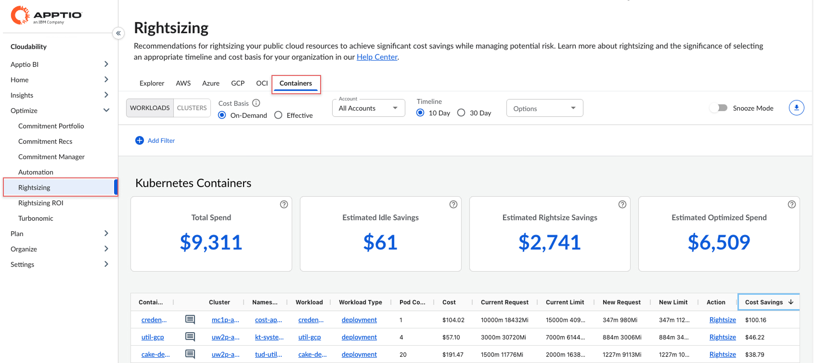
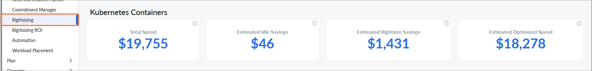
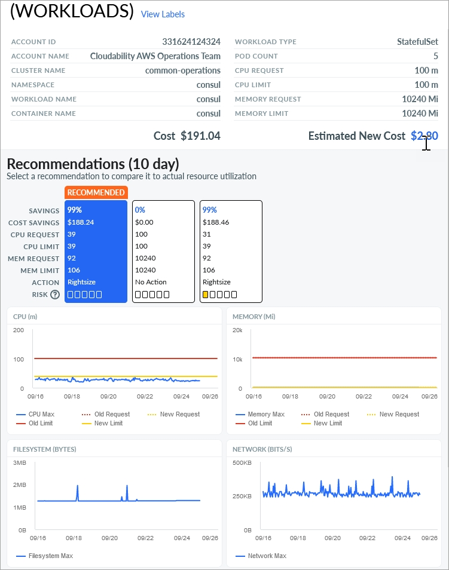

# Redimensionamento para Kubernetes Contêineres

Com o Cloudability rightsizing para contêineres Kubernetes, você pode visualizar recomendações para otimizar suas implantações de contêineres Kubernetes com base nos 10 ou 30 dias anteriores de uso de recursos.

Saiba mais sobre [Rightsizing em Cloudability](get-recommendations-for-scaling-your-cloud-resources-with-rightsizing.html)

Saiba mais sobre [Cloudability Alocação de custos de contêineres](https://www.apptio.com/products/cloudability/container-cost-allocation/ "(Abre em uma nova guia ou janela)")

Nota:

Visite o [blog](https://www.apptio.com/emerge/cloud-cost-optimization-10-day-vs-30-day-rightsizing/ "(Abre em uma nova guia ou janela)") para saber mais sobre como usar 10 ou 30 dias de uso de recursos para gerar recomendações.

Antes de começar

Observação: o rightsizing de contêineres usa o mesmo agente de relatórios e a mesma infraestrutura de dados que a funcionalidade de alocação de custos de contêineres. Se a sua organização já usa essa funcionalidade em Cloudability, você não precisa fazer nada para usar o rightsizing.

Observação: embora os custos alocados sejam reduzidos, não haverá nenhuma economia real no site Kubernetes até que os clusters sejam redimensionados.

Para usar o Rightsizing para GCP, certifique-se de que você tem:

- Provisione seus clusters Kubernetes implantando o agente de código aberto.

Saiba mais sobre o [provisionamento de cluster Kubernetes](k8s-cluster-provisioning.html)

Acessando o painel de contêineres

No menu inicial do site Cloudability, navegue até Optimize > Rightsizing > Containers.

Você pode selecionar Cargas de trabalho ou o botão de alternância Clusters para escolher o tipo de recomendações.

Por padrão, seus recursos são classificados por economia de custos. Os recursos no topo da lista têm o maior potencial de economia.

Selecione Exportar para fazer o download das recomendações como uma planilha. Informações adicionais da conta são incluídas, como região, sistema operacional, tags disponíveis por recurso e a taxa efetiva para tipos de recursos atuais e novos.

O painel exibe o seguinte:

Base de custo

- **Sob demanda** : Valores de economia baseados puramente em preços sob demanda. Embora o preço personalizado esteja incluído, o impacto potencial dos compromissos (instâncias reservadas (RIs) ou planos de economia (SPs)) não está incluído.
- **Efetivo** : O custo efetivo da execução de sua configuração atual. Isso leva em conta o impacto histórico dos compromissos de maneira semelhante à métrica de custo (amortizado), em que todos os custos iniciais e recorrentes associados são incluídos. Para o novo tipo de instância recomendado, os valores de custo são baseados nos preços sob demanda porque a nova configuração pode não se beneficiar de RIs ou SPs. Essa comparação é a opção mais conservadora. Mesmo que você se afaste inadvertidamente dos RIs ou SPs, sua nova taxa geral ainda será melhor. Como resultado, a economia total relatada usando essa metodologia às vezes será menor. O preço personalizado será aplicado a esses valores, se aplicável.

Filtros

Assim como na funcionalidade de alocação de custos de contêineres, você pode aproveitar as visualizações baseadas em contas para filtrar as recomendações para um subconjunto de contas da sua organização.

Para adicionar um filtro:

1. Selecione **Add Filter (Adicionar filtro** ) na barra de ferramentas.
2. Na sobreposição do filtro, escolha uma Dimensão.
3. Selecione um operador para fornecer uma condição lógica.
4. Escolha um valor para refinar seu filtro.
5. Selecione **Add Filter (Adicionar filtro** ) para aplicar o novo filtro à página.

Para remover um filtro:

1. Selecione o ícone de filtro .
2. Selecione X ao lado do filtro que você deseja remover.

Aplicar filtros com links

Você também pode adicionar filtros selecionando os valores azuis com hiperlink na tabela principal. Seus filtros são adicionados ao Filter Configurator.

Nota:

Somente um valor ou parâmetro de cada coluna pode ser selecionado por vez.

KPIs

Os indicadores-chave de desempenho (KPIs) resumidos são exibidos de acordo com as exibições e os filtros selecionados.

Os KPIs resumidos incluem:

- Total de despesas : O total de despesas alocadas atuais em todos os contêineres instrumentados na plataforma Cloudability.
- Economia ociosa estimada : Mostra a economia total estimada para todas as recomendações de encerramento.
- Economia estimada do Rightsize : Mostra a economia potencial total estimada que pode ser obtida com todas as recomendações do Rightsize.
- Despesas otimizadas estimadas : O total estimado de despesas em todos os contêineres exibidos após a aplicação das recomendações.

Nota:

O redimensionamento de contêineres ajusta a alocação de custos para os contêineres e pods com essa especificação de contêiner, mas normalmente não afeta sua fatura. O rightsizing da especificação do contêiner torna a capacidade disponível em sua implantação, que as organizações podem usar para outras cargas de trabalho ou para rightsize a instância de computação subjacente. O redimensionamento da instância de computação subjacente terá um impacto positivo na conta da organização.

Exibir detalhes da recomendação

Para exibir os detalhes de um determinado recurso, selecione   > View Details.

No painel Details (Detalhes ), o site Cloudability exibe pelo menos uma recomendação, sendo a opção de menor risco a seleção padrão.

Cada opção inclui recomendações de solicitação e limite de memória e CPU para uma determinada especificação de contêiner. Os gráficos de recursos individuais exibem a alocação de recursos atual (em vermelho) e o consumo (em azul), juntamente com as configurações recomendadas (em amarelo).

**Tópico principal:** [Redimensionamento](../product/get-recommendations-for-scaling-your-cloud-resources-with-rightsizing.html)
