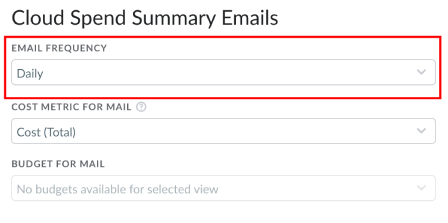
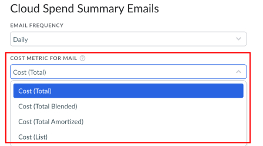
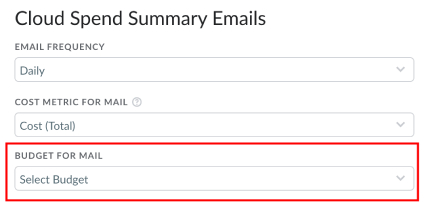
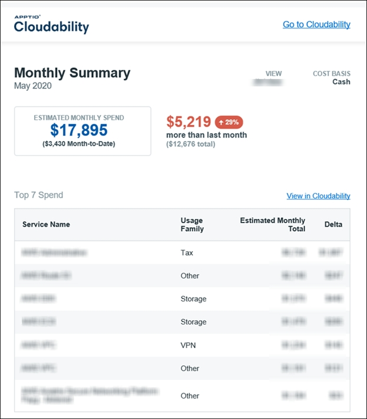
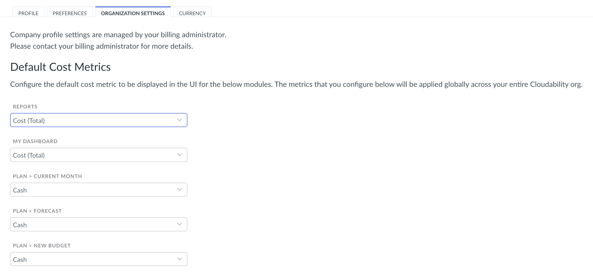

# Configuração das preferências de fuso horário

No site Cloudability, é possível definir ou atualizar a preferência de fuso horário seguindo estas etapas:

1. Clique no ícone **Usuário** no canto superior direito e selecione **Gerenciar perfil**.
2. Clique na guia **PREFERÊNCIAS** e defina a exibição e o fuso horário padrão na seção **Exibição e fuso horário**. O fuso horário será usado como seu fuso horário no Cloudability.

**Inscreva-se para receber e-mails com resumos**

Envie seus dados mais importantes da nuvem para o seu e-mail nos intervalos de tempo que você definir.

Para configurar seus e-mails com o resumo de gastos na nuvem:

1. Para definir com que frequência você deseja receber seus e-mails, na seção “E-mails de resumo de gastos na nuvem”, selecione uma opção na lista “FREQUÊNCIA DE E-MAILS”: Diária, Semanal, Mensal, Trimestral ou Desativada.
2. Selecione a guia PREFERÊNCIAS.
3. Para definir com que frequência você deseja receber seus e-mails, na seção E-mails de resumo de gastos com nuvem, selecione uma opção na lista FREQUÊNCIA DE E-MAILS.   

   

   Ao selecionar “Desativado”, você deixará de receber e-mails com resumos.
4. Para definir sua métrica de custo, clique na lista abaixo de “Métrica de custo para e-mails” e selecione uma opção.   
       
    Quando você possui contas vinculadas dentro de uma família de contas de Faturamento Consolidado, o serviço “ AWS ” inclui uma tarifa combinada e uma tarifa não combinada em seus relatórios detalhados de faturamento. Se você estiver usando Instâncias Reservadas, talvez faça sentido elaborar seus relatórios com base principalmente no custo não ajustado.   
      
    NOTA : Para utilizar custos amortizados, sua visualização padrão não pode incluir um filtro baseado em tags. As estimativas refletirão o Custo (Total) se a opção Custo (Amortizado) for selecionada.
5. Para definir seu orçamento, clique no menu suspenso abaixo de “Orçamento para correspondência” e selecione uma opção.   
     O e-mail com o resumo dos seus gastos com nuvem terá mais ou menos esta aparência: 

**Opções de entrega para empresas com atrasos**

*Esta é uma configuração personalizada para contas que utilizam o Cloudability Enterprise e deve ser ativada pela equipe de sucesso do Cloudability.*

Se seus dados estiverem constantemente atrasados no site AWS (devido ao volume de dados ou à análise realizada antes do envio para o Cloudability), isso pode levar a uma situação em que os usuários recebam constantemente o novo e-mail “Data Delayed”. Para evitar isso, adicionamos uma opção que permite que seus usuários escolham quando receber seus e-mails. Eles podem optar por receber seus e-mails com os dados mais atualizados (independentemente da data de atualização) ou decidir esperar até que tenhamos o último dia completo. A primeira opção é a padrão.

**Compreendendo as métricas**

- Gastos no mês até o momento : Veja quanto você gastou neste mês e compare esse valor com os gastos na mesma data do mês passado.
- Aprox. Gastos  mensais: Veja qual é a estimativa de quanto você vai gastar este mês com base em uma média móvel calculada sobre um número de dias definido pelo usuário e, em seguida, compare esse valor com o total do mês passado.
- Gastos de ontem : Esse valor reflete a estimativa dos seus gastos no dia anterior ao recebimento deste e-mail.
- Custo : Esta seção do Daily Mail apresentará uma lista das contas do AWS e dos serviços do AWS (como RDS, Elastic Compute Cloud, etc.) que geraram os maiores gastos neste mês até o momento.
- Horas de uso no mês até o momento : Veja quantas horas de uso você acumulou neste mês e compare esse valor com as horas de uso registradas nesta mesma data no mês passado.
- Horas de uso de ontem : Esse número reflete quantas horas de uso você gerou no dia anterior ao recebimento do e-mail e compara esse total com o do dia anterior.
- Contagem de instâncias em execução ontem : Veja em quantas instâncias se distribuíram as horas de uso de ontem e compare esse total com o do dia anterior.
- Utilização : Veja as cinco instâncias mais recentes que foram iniciadas na sua conta.
- Configurações de e-mail : analise detalhadamente os dados que são importantes para você com configurações que permitem filtrar por visualização, excluir certos tipos de despesas, como impostos ou custos pontuais, e escolher se seus dados serão calculados com base no custo combinado ou no custo não combinado.

Observação: caso você tenha dados incompletos do seu provedor de nuvem devido aos cronogramas de atualização de dados, o envio do e-mail diário com os gastos com nuvem poderá sofrer atrasos. Por exemplo, se você não tiver os dados completos até o final do dia anterior (UTC), é provável que seu e-mail seja enviado por volta das 10h, horário do Pacífico, para que os dados completos possam ser recebidos e processados. Isso minimiza a ocorrência de subnotificação dos “Gastos Estimados de Ontem” devido a dados incompletos fornecidos pelo provedor de serviços em nuvem para esse período.

Configurando as métricas de custo padrão para sua organização

Cada módulo do “ Cloudability ” (por exemplo: True Cost Explorer, Rightsizing etc.) suporta um conjunto específico de métricas de custo, como Custo (Total), Custo (de Tabela), Custo (Amortizado) etc. Embora o “Custo (Total)” seja a métrica de custo padrão para esses módulos, um usuário administrador pode alterá-la e definir uma métrica de custo padrão diferente acessando a página “**Gerenciar Perfil > Configurações da Organização** ”.

Essa tela exibiria todos os módulos do Cloudability que suportam mais de uma métrica de custo, juntamente com um menu suspenso contendo a lista de métricas atualmente suportadas por cada módulo. Como usuário administrador, você pode escolher a métrica de custo de sua preferência para cada um dos módulos e clicar no botão **“Salvar métricas de custo padrão”,** localizado na parte inferior da página, o que aplicará suas alterações a todos os usuários da sua organização do Cloudability.
