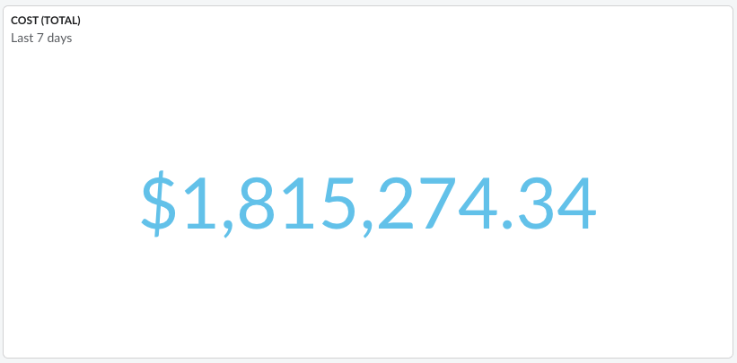

# Widget Número

O Widget de Números pode ser usado nos painéis do Cloudability para visualizar um resumo de uma única métrica em um painel. Este widget exibe um único valor de uma métrica (KPI) ao longo de um determinado intervalo de datas.

Qualquer métrica da fonte de dados “Custo e uso” ou “Utilização” pode ser usada para exibir o widget de número.

Os usuários também podem optar por exibir um pequeno gráfico de linhas ao lado do KPI no Widget de Números, para entender como a métrica evoluiu ao longo do tempo.

**Tópico principal:** [Criar ou editar um widget em um painel](../product/create-or-edit-a-widget-in-a-dashboard.html)
