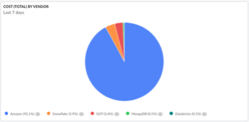

# Widget Pie

O Widget de Gráfico de Setor permite que os usuários do Cloudability visualizem seus dados de forma que as métricas possam ser exibidas como uma fração do todo, facilitando a compreensão de quais dimensões correspondem à maior parte do custo.

Ao configurar um widget de gráfico circular, os usuários podem escolher qualquer dimensão da fonte de dados “Custo e uso” ou “Utilização” para a divisão do gráfico circular.

Qualquer métrica da fonte de dados “Custo e uso” ou “Utilização” pode ser usada como dados do widget.

Para melhorar a visibilidade, os usuários podem restringir o número de resultados aos N primeiros ou aos N últimos valores.

**Tópico principal:** [Criar ou editar um widget em um painel](../product/create-or-edit-a-widget-in-a-dashboard.html)
