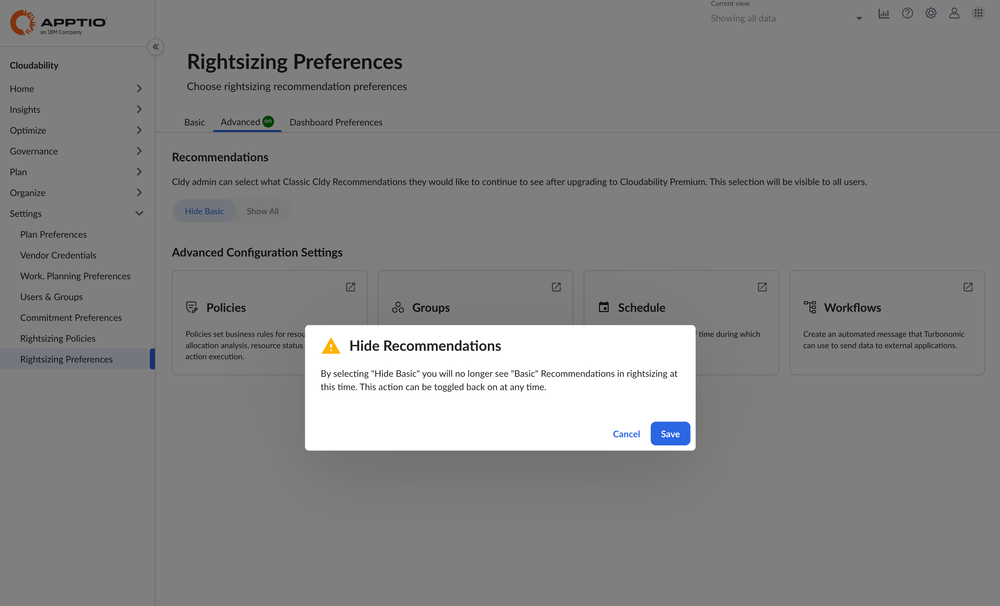
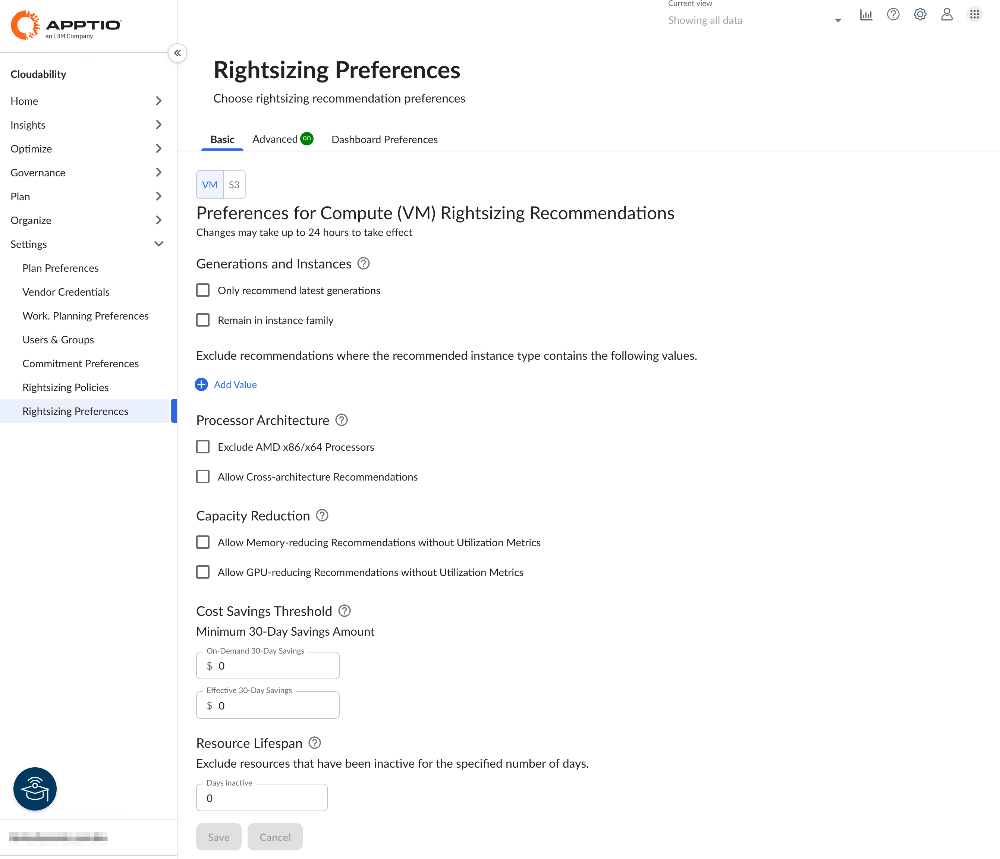
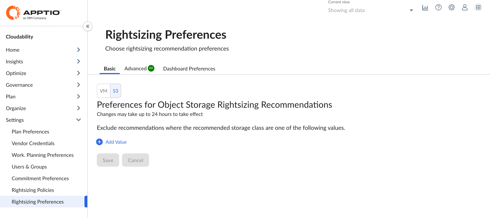

# Preferências de dimensionamento correto

## Sobre as preferências

Esta página permite que você configure as preferências globais para as recomendações de redimensionamento do Cloudability na guia “Básico”. Como parte do Cloudability Premium, as ações de otimização geradas pelo mecanismo Turbonomic são transferidas para o Cloudability e exibidas na guia “Avançado” da página “Otimizar > Redimensionamento”. Um administrador do Cloudability agora pode controlar se deseja que seus usuários vejam as recomendações de dimensionamento geradas pelo Cloudability ou ocultá-las.

## Preferências avançadas

Para configurar a visibilidade das recomendações de redimensionamento d Cloudability, navegue até Configurações > Preferências de redimensionamento > guia Avançado

A configuração padrão é “Mostrar tudo”, o que significa que a página Otimizar > Redimensionamento exibirá tanto as recomendações de redimensionamento geradas pelo Cloudability na guia “Básico” quanto as ações de otimização geradas pelo mecanismo Turbonomic na guia “Avançado”. No entanto, um administrador do Cloudability pode optar por ocultar as recomendações de redimensionamento geradas pelo Cloudability, o que tornará a guia “Básico” indisponível para todos os usuários na página Otimizar > Redimensionamento. Cloudability O administrador pode alternar essa configuração a qualquer momento. Embora as recomendações de redimensionamento continuem a ser geradas pelo Cloudability, este sinalizador é apenas a visibilidade das recomendações de redimensionamento na interface do usuário Cloudability para todos os usuários.

## Configurações avançadas

Esta seção permite configurar políticas que influenciam ou automatizam as ações de otimização geradas pelo mecanismo do Turbonomic, bem como as configurações relacionadas, incluindo Grupos, Agendamentos, Fluxos de Trabalho e Políticas. Estes são apresentados em forma de blocos. Ao clicar em qualquer um desses blocos, a página de configuração específica é aberta em uma nova guia no seu navegador.

- Grupos : Os grupos reúnem conjuntos de recursos para que o Turbonomic possa monitorar e gerenciar. Ao definir o escopo da sua sessão de conexão com o mecanismo do Turbonomic, você pode selecionar grupos para se concentrar nesses recursos específicos. Por exemplo, se você tiver máquinas virtuais dedicadas a um único cliente, poderá criar um grupo que inclua essas máquinas virtuais. Você pode, então, definir esse grupo como escopo ao criar uma política ou executar um plano. Turbonomic O mecanismo suporta grupos dinâmicos e estáticos.
- Horários : Os horários especificam um período de tempo durante o qual determinados eventos podem ocorrer. Uma programação de calendário é uma configuração que define um intervalo de tempo durante o qual uma política de automação entra em vigor. Esta política pode executar ações que não estejam em espera em entidades na nuvem pública ou no local, ou alterar configurações que afetem a análise e a geração de ações.
- Fluxos de trabalho : O fluxo de trabalho de automação determina se um mecanismo d Turbonomic ação executará uma ação ou se um mecanismo d Turbonomic ação automatizará fluxos de trabalho externos para implementar a alteração em seu ambiente. Dessa forma, você pode integrar orquestradores compatíveis para executar ações em conjuntos específicos de entidades no seu ambiente. Você pode criar um fluxo de trabalho de automação que acione um webhook sempre que um mecanismo Turbonomic recomendar a transferência de um VM, ou pode criar um fluxo de trabalho de automação que seja executado em substituição à ação que o mecanismo Turbonomic executaria.
- Políticas : As políticas definem regras de negócios para a análise da alocação de recursos, a exibição do status dos recursos e a execução de ações. Uma política de automação é um conjunto de regras que o Turbonomic deve cumprir ao executar ações que não sejam de estacionamento em entidades na nuvem pública ou no local, ou ao alterar configurações que afetem a análise e a geração de ações.

Observação: você só poderá gerenciar políticas se tiver funções relevantes do Turbonomic atribuídas a você no Frontdoor

## Preferências básicas

Para configurar as preferências globais para recomendações de redimensionamento d Cloudability, navegue até Configurações > Preferências de redimensionamento > guia Básico

Preferências do Compute ( VM )

Esta guia de preferências permite que você defina preferências globais para recomendações de redimensionamento do Cloudability.

| Nome do Campo | Descrição |
| --- | --- |
| Gerações e Instâncias | Opções para excluir tipos de instância não atuais ou recomendar apenas dentro da família de instâncias existente (por exemplo, para garantir a cobertura contínua com compromissos/reservas existentes) ao gerar recomendações de redimensionamento. |
| Arquitetura do processador | Opte por excluir tipos específicos de processadores das recomendações de redimensionamento e permita recomendações entre arquiteturas. Garanta a compatibilidade da carga de trabalho antes de trocar o tipo de processador. |
| Redução de capacidade | Opções para incluir recomendações que resultariam em uma redução na capacidade de recursos (por exemplo, redução da memória total disponível) se as métricas de utilização para a dimensão não forem fornecidas. |
| Limite de economia de custos | A configuração opcional para determinar as recomendações mínimas de economia deve ser prevista para ser alcançada, a fim de ser incluída nas exibidas.  Valor mínimo de poupança de 30 dias - Um valor zero indica que a configuração será ignorada. |
| Tempo de vida do recurso | Configuração opcional para eliminar recomendações para os recursos que estiveram inativos por um período de tempo especificado. Um valor zero indica que a configuração será ignorada. |

Insira os dados nos campos apropriados e selecione o botão Salvar. A mensagem *Preferências salvas com sucesso* é exibida.

Várias maneiras de filtrar recomendações de redimensionamento

Em Cloudability, há várias maneiras de filtrar recomendações de redimensionamento. Primeiro, você pode filtrar as recomendações usando as preferências globais disponíveis em Configurações > página Preferências de redimensionamento. Outra maneira de filtrar usando as opções disponíveis nas próprias páginas de redimensionamento em Otimizar > Redimensionamento. Existem opções de filtragem adicionais fornecidas no painel “detalhes” para as próprias recomendações.

Object Storage ( S3 ) Preferências

Esta guia de preferências permite excluir classes específicas para o Object Storage para recomendações de redimensionamento.

Para excluir uma classe de armazenamento:

1. Selecione o botão “Adicionar valor”.
2. Adicione um valor (classe de armazenamento) ao campo de entrada
3. Continue adicionando valores a serem excluídos, conforme necessário

S3 classes de armazenamento:

- Standard
- Classificação inteligente
- Acesso padrão pouco frequente
- Acesso pouco frequente à zona
- Recuperação instantânea de glaciares
- Recuperação flexível Glacier
- Arquivo Profundo Glaciar

## Perguntas Frequentes

1. Preciso refazer as configurações de política na interface do usuário do ` Cloudability `, na guia “Avançado”?

   Independentemente das configurações de política que você tenha definido na configuração do mecanismo Turbonomic com sua implantação Cloudability Premium, essas mesmas configurações agora também estarão disponíveis para você gerenciar por meio da interface do usuário Cloudability. Você não perderá nenhuma das suas configurações existentes ao migrar para o mecanismo Cloudability Premium Turbonomic.
2. Posso visualizar e gerenciar essas mesmas políticas também na interface do usuário do Turbonomic, além do que é exibido na guia “Avançado”?

   Sim, as mesmas configurações de política também podem ser gerenciadas pela interface do usuário do Turbonomic (acessível através do bloco Cloudability Premium no Frontdoor). Estamos oferecendo apenas a possibilidade de visualizar e gerenciar as configurações da política “ Turbonomic ” por meio da interface do usuário do Cloudability, na página “Rightsizing Preference > Advanced”, como uma opção.
3. As preferências definidas nas guias "Básico" e "Avançado" são diferentes?

   Sim, essas preferências de redimensionamento são muito diferentes. Enquanto as configurações definidas na guia “Básico” são utilizadas pelo mecanismo de recomendação Cloudability, as da guia “Avançado” são utilizadas pelo mecanismo Turbonomic. Eles não são nem intercambiáveis nem interoperáveis.

**Tópico principal:** [Redimensionamento avançado](../product/advanced-rightsizing-powered-by-turbonomic.html)
