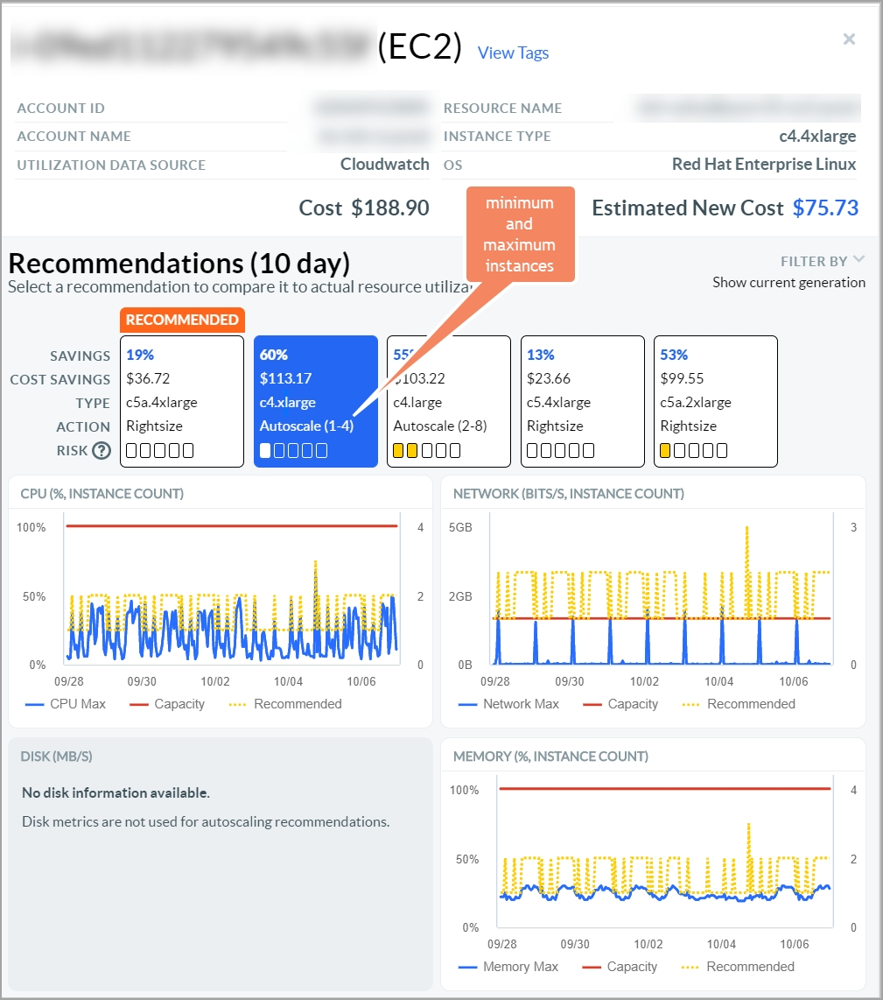

# Ação de autoescala para redimensionamento

Um desafio na otimização de recursos é o dimensionamento correto de cargas de trabalho que exibem cargas de trabalho amplamente flutuantes e com picos. Conforme ilustrado por grandes oscilações nos dados de métrica de utilização (CPU, rede, memória e GPU), esse cenário é normalmente abordado pelo provisionamento excessivo do recurso para acomodar os picos mais altos dessas cargas de trabalho, resultando em gastos excessivos com a nuvem.

Para adequar melhor os recursos de computação a essas cargas de trabalho altamente elásticas, estamos aprimorando a recomendação do Autoscale. A ação Autoscale recomenda a conversão de uma única instância em um Auto Scaling Group (ASG). Em vez de uma única instância de alta capacidade, o ASG compreende várias instâncias menores que são ativadas e desativadas para atender às demandas dessa carga de trabalho elástica. Se sua carga de trabalho puder acomodar o dimensionamento em várias máquinas, essa é uma opção econômica.

**Usando a recomendação de autoescala**

O painel de detalhes mostra a lista de ações recomendadas. Quando uma ação Autoscale for selecionada, as contagens mínima e máxima de instâncias serão exibidas. Modelamos o rastreamento de alvos nos dados de utilização de CPU, rede, memória (se disponível) e GPU (se disponível) para obter essas contagens de instâncias. A recomendação é para um ASG que varia de 1 a 4 do tipo c4.4xlarge instâncias no exemplo abaixo.

Observando os gráficos de CPU e memória acima, note que a legenda à direita representa o número de instâncias. Neste exemplo, a linha pontilhada amarela se move entre 1 e 3, indicando que esse intervalo é suficiente para cobrir a carga de trabalho. Ao determinar a contagem máxima de instâncias, recomendamos a contagem de instâncias que corresponda ao tamanho da memória da instância original. Especificamente, a instância atual c4.4xlarge tem 30 GiB,, enquanto a instância recomendada c4.xlarge tem 7.5 GiB memória. O original tem quatro vezes mais memória, portanto, recomendamos uma contagem máxima de instâncias que corresponda ao limite superior. Lembre-se de que você não será cobrado por instâncias em um ASG que não estejam ativas, portanto, essa é uma opção econômica.

[Leia este artigo](https://docs.aws.amazon.com/autoscaling/ec2/userguide/as-scaling-target-tracking.html "(Abre em uma nova guia ou janela)") para saber mais sobre as políticas de escalonamento de rastreamento de metas do ASG e os detalhes de implementação.

**Considerações**

Aqui está uma lista de questões a serem consideradas neste momento:

O risco é definido como um mínimo de 1, pois nem todas as cargas de trabalho são apropriadas para ASGs.

Os membros do Auto Scaling Group existente estão excluídos desse tipo de recomendação.

No momento, somente o Amazon EC2 ( Elastic Cloud Compute) é compatível.

No caso de instâncias instáveis, as famílias ( T2, T3, T3a e T4g ) são excluídas.

EC2 por padrão, as políticas de dimensionamento dinâmico de rastreamento de alvos são acionadas pela utilização da CPU, pelos bytes de entrada/saída da rede ou pela contagem de solicitações do Application Load Balancer. Opcionalmente, outras métricas do Cloudwatch ou personalizadas podem ser usadas como acionadores, com configuração adicional.

**Tópico principal:** [Redimensionamento](../product/get-recommendations-for-scaling-your-cloud-resources-with-rightsizing.html)
