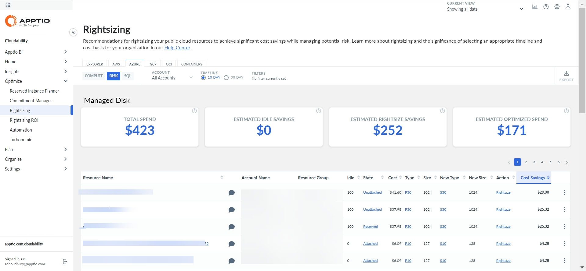
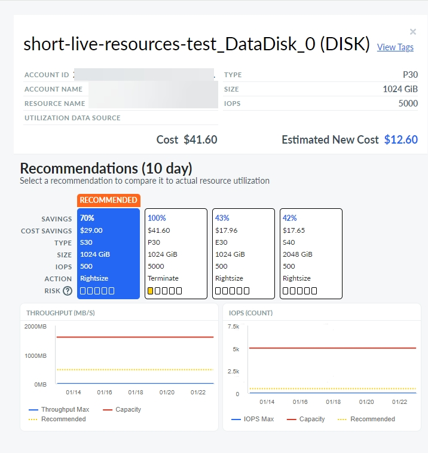

# Azure Disco

Você pode usar o painel Rightsizing para visualizar as recomendações de otimização de recursos para o Azure Disk. O painel mostra as recomendações de rightsizing e de inatividade (encerramento). Você pode visualizar as recomendações em várias contas a partir de um único painel.

[Rightsizing em Cloudability](get-recommendations-for-scaling-your-cloud-resources-with-rightsizing.html)

Antes de começar

Para visualizar o painel Azure Disk, certifique-se de que você conectou Cloudability às contas Azure corretas.

[Conecte Microsoft Azure](../admin/azure-cm-setup.html)

Acesse o painel de controle do disco Azure

Para acessar o painel do Azure Disk, abra a página inicial do Cloudability e, no menu de navegação esquerdo, selecione Optimize > Rightsizing. Na página Rightsizing (Redimensionamento ), selecione a guia Azure e, em seguida, selecione a subguia Disco.

Personalizar o painel de controle

Você pode definir as seguintes opções para personalizar seu painel.

Somente a base de custo sob demanda é compatível com o disco.

A base de custo On-Demand fornece uma comparação direta entre a instância listada na coluna Current (Atual ) e a instância recomendada na coluna New (Nova ) com base exclusivamente no preço On-Demand. Ele não inclui nenhum impacto potencial de instâncias reservadas (RIs) ou planos de economia (SPs). Observe que os preços sob demanda refletirão quaisquer acordos de preços personalizados que você tenha configurado em Cloudability.

Selecionar conta

Por padrão, o painel mostra recomendações para todas as contas. Para visualizar as recomendações de uma conta específica, selecione o nome da conta no menu suspenso Conta.

Especificar o cronograma

Você pode optar por revisar as despesas dos últimos 10 dias ou dos últimos 30 dias. Por padrão, a opção Linha do tempo é definida como 10 dias. Para a maioria dos usuários, 10 dias é o período de tempo recomendado porque captura as tendências de desempenho mais recentes e é mais preditivo do uso futuro de recursos.

Aplicar filtros

Você pode adicionar filtros para incluir ou excluir dados com base em uma ou mais condições.

Adicionar um filtro

Para adicionar um filtro:

1. Selecione Add Filter (Adicionar filtro ) na barra de ferramentas.
2. No menu Add Filter (Adicionar filtro ), escolha uma Dimensão.
3. Selecione um operador para fornecer uma condição lógica.
4. Escolha um valor para refinar seu filtro.
5. Selecione Add Filter (Adicionar filtro ) para aplicar o novo filtro à página.

Aplicar filtros com links

Você também pode adicionar filtros selecionando os valores azuis com hiperlink na tabela principal. A regra de filtro é aplicada automaticamente ao campo Filtros. Você pode selecionar apenas um valor ou parâmetro de cada coluna por vez.

Remover um filtro

Para remover um filtro:

1. Selecione o ícone de filtro 
2. Selecione X ao lado do filtro que você deseja remover.

Indicadores-chave de desempenho

Você pode visualizar os seguintes indicadores-chave de desempenho (KPIs) no painel do Rightsizing :

- Total de despesas : Mostra o total de despesas alocadas atuais.
- Economia ociosa estimada : Mostra a economia total estimada para todas as recomendações de encerramento.
- Economia estimada do Rightsize : Mostra a economia potencial total estimada que pode ser obtida com todas as recomendações do Rightsize.
- Despesas otimizadas estimadas : Mostra o total estimado de despesas após a aplicação das recomendações.

Tabela de recomendações de dimensionamento

O painel contém uma tabela de recomendações de dimensionamento de direitos, que fornece uma visão geral de seus recursos de disco Azure. A tabela inclui as seguintes colunas:

Nota:

Por padrão, os dados são classificados pela coluna Economia de custos. Para alterar a ordem de classificação, basta selecionar o nome da coluna.

- Nome do recurso : O nome do recurso de disco
- Nome da conta : O nome da conta Azure.
- Grupo de recursos : O grupo de recursos ao qual o volume pertence.
- Ocioso : A porcentagem de horas com zero IOPS.
- Estado : O estado do disco.
- Custo : O custo total do recurso de disco para a linha do tempo selecionada.
- Type (Tipo ): O tipo de recurso de disco atual.
- Tamanho : O tamanho do recurso (em GiB ).
- Novo tipo : O tipo de recurso de disco mais recomendado.
- Novo tamanho : O tamanho do recurso de disco mais recomendado (em GiB ).
- Ação : Recomendação para o recurso. A recomendação pode ser uma das seguintes.

  | Recomendação | Descrição |
  | --- | --- |
  | Dimensionamento correto | Redimensione para o tipo de recurso especificado na coluna Novo. |
  | Encerrar | Encerre seu recurso porque ele está predominantemente ocioso. |
  | Nenhuma ação | Nenhuma ação é recomendada por padrão, mas recomendações adicionais com níveis de risco mais altos podem estar disponíveis no painel Detalhes. |
- Economia de custos : O valor estimado de economia de custos em 10 ou 30 dias.

Exportar recomendações para um arquivo Excel

Para exportar as recomendações para um arquivo Excel, selecione Exportar. Observe que o arquivo do Excel incluirá várias colunas adicionais, como região, sistema operacional, preço unitário e outras.

Detalhes da recomendação

Para exibir os detalhes da recomendação de um determinado recurso, selecione View Details (Exibir detalhes ) no menu More Options (Mais opções) (3 pontos).

A figura a seguir mostra um exemplo de painel de detalhes de recomendação.

Para ver as descrições das dimensões e métricas de custo, consulte [Glossário de dimensões e métricas de custo](glossary-of-cost-dimensions-and-metrics.html).

Para ver detalhes sobre a dimensão e as métricas de utilização, consulte [Glossário de dimensões e métricas de utilização](glossary-of-utilization-dimensions-and-metrics.html).

**Tópico principal:** [Redimensionamento](../product/get-recommendations-for-scaling-your-cloud-resources-with-rightsizing.html)
