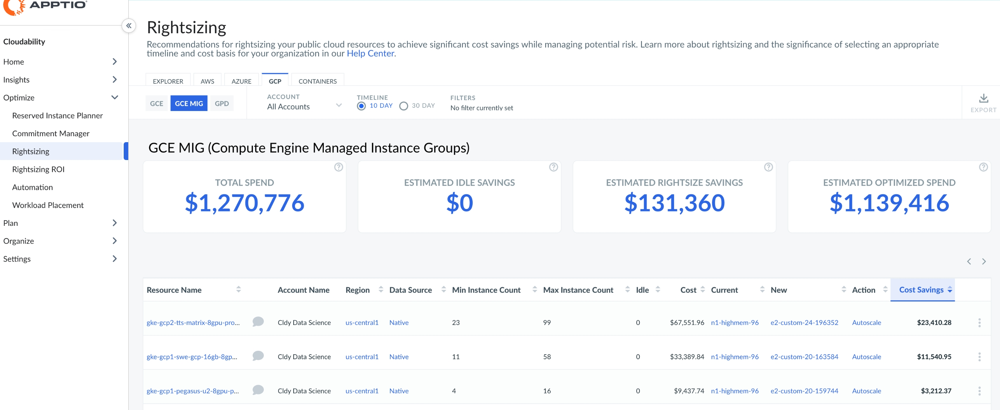
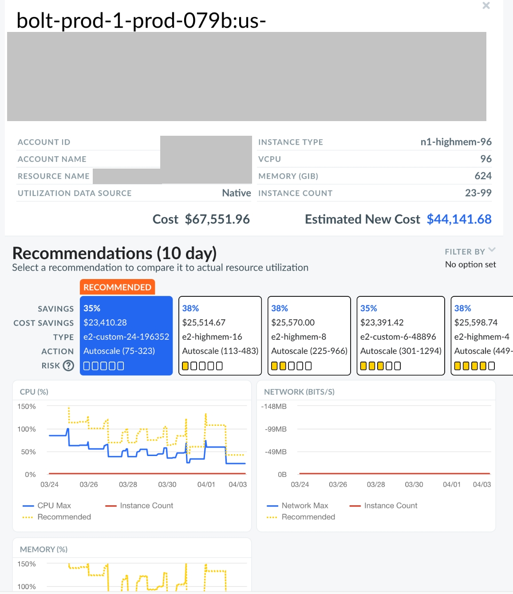

# GCP Google Compute Engine (GCE) Grupos de Instâncias Gerenciadas (MIG)

Você pode usar o painel Rightsizing para visualizar as recomendações de otimização de recursos para o Google Cloud Platform ( GCP ) Google Compute Engine (GCE) Managed Instance Groups (MIG). O painel mostra as recomendações de rightsizing e de inatividade (encerramento). Você pode visualizar as recomendações em várias contas a partir de um único painel.

Saiba mais sobre [Rightsizing em Cloudability](get-recommendations-for-scaling-your-cloud-resources-with-rightsizing.html)

Saiba mais sobre o [Autoscale Action for Rightsizing](rightsizing-autoscale-action.html)

Antes de começar

Para visualizar o painel do GCE MIG do GCP, certifique-se de que os seguintes requisitos sejam atendidos:

- Você conectou Cloudability às contas corretas do GCP.
- Você está usando grupos de instâncias gerenciadas d GCP.

Saiba mais sobre o [Connect Google Cloud](../admin/connect-google-cloud.html)

Nota:

Atualmente, esse recurso tem as seguintes limitações:

- As recomendações do GCE MIG não estão disponíveis para tipos de instâncias mistas. O painel mostra essas MIGs sem nenhuma recomendação acionável.
- As recomendações excluem instâncias pontuais. O painel mostra apenas as instâncias sob demanda.

Acesse o painel GCE MIG do GCP

Para acessar o painel GCE MIG do GCP, abra a página inicial do Cloudability e, no menu de navegação à esquerda, selecione Otimizar > Redimensionamento. Na página Rightsizing, selecione a guia GCP e, em seguida, selecione a subguia GCE MIG. 

Personalizar o painel de controle

Você pode definir as seguintes opções para personalizar seu painel.

Especificar a base de custos

A base de custo determina como as recomendações são calculadas. A base de custo pode ser On-Demand ou Effective. A base de custos On-Demand é selecionada por padrão.

Nota:

Se sua organização tiver ativado o Custom Pricing em Cloudability, as taxas personalizadas relevantes serão aplicadas aos cálculos da base de custo.

- **Sob demanda** : A base de custo On-Demand fornece uma comparação direta entre a instância listada na coluna Current (Atual ) e a instância recomendada na coluna **New (Nova** ) com base exclusivamente no **preço On-Demand**. Ele não inclui nenhum impacto potencial de instâncias reservadas (RIs) ou planos de economia (SPs). Observe que os preços on-demand refletirão quaisquer acordos de preços personalizados que você tenha configurado em Cloudability
- **Efetivo** : A base de custo efetiva leva em conta o impacto histórico das instâncias reservadas (RIs) e dos planos de economia (SPs) para calcular o custo do tipo de instância atual durante o período do relatório. Assim como a métrica de custo (amortizado), ela inclui todos os custos iniciais e recorrentes associados.

  em outras palavras, a base de custo efetivo mostra o custo efetivo da execução de sua instância atual. Os valores de custo para o novo tipo de instância recomendado são baseados nos preços sob demanda. Isso ocorre porque a nova configuração pode não se beneficiar de RIs ou SPs. Essa comparação é a opção mais conservadora. Mesmo que você se afaste inadvertidamente dos RIs ou SPs, sua nova taxa geral ainda será melhor. Como resultado, a economia total relatada usando essa metodologia às vezes será menor. O preço personalizado será aplicado a esses valores, se aplicável.

Nota:

Use a base de custo On-Demand se estiver procurando remover a natureza imprevisível dos descontos baseados em compromisso de sua análise e maximizar o número de recomendações fornecidas a você. Use a base de custo efetivo se preferir basear suas recomendações no custo real histórico da execução de suas instâncias e adotar uma abordagem conservadora.

Selecionar conta

Por padrão, o painel mostra recomendações para todas as contas. Para visualizar as recomendações de uma conta específica, selecione o nome da conta no menu suspenso Conta.

Especificar o cronograma

Você pode optar por revisar as despesas dos últimos 10 dias ou dos últimos 30 dias. Por padrão, a opção Linha do tempo é definida como 10 dias. Para a maioria dos usuários, 10 dias é o período de tempo recomendado porque captura as tendências de desempenho mais recentes e é mais preditivo do uso futuro de recursos.

Aplicar opções

Você também pode definir opções em nível de página para incluir ou excluir determinadas recomendações.

Aplicar filtros

Você pode adicionar filtros para incluir ou excluir dados com base em uma ou mais condições.

Adicionar um filtro

Para adicionar um filtro:

1. Selecione Add Filter (Adicionar filtro ) na barra de ferramentas.
2. No menu Add Filter (Adicionar filtro ), escolha uma Dimensão.
3. Selecione um operador para fornecer uma condição lógica.
4. Escolha um valor para refinar seu filtro.
5. Selecione Add Filter (Adicionar filtro ) para aplicar o novo filtro à página.

Selecione o ícone do filtro  que aparece quando você passa o mouse sobre Filtros.

Aplicar filtros com links

Você também pode adicionar filtros selecionando os valores azuis com hiperlink na tabela principal. A regra de filtro é aplicada automaticamente ao campo Filtros. Você pode selecionar apenas um valor ou parâmetro de cada coluna por vez.

Remover um filtro

Para remover um filtro:

1. Selecione o ícone de filtro .
2. Selecione X ao lado do filtro que você deseja remover.

Indicadores-chave de desempenho

Você pode visualizar os seguintes indicadores-chave de desempenho (KPIs) no painel do Rightsizing:

- **Total de despesas** : Mostra o total de despesas alocadas atuais.
- **Economia ociosa estimada** : Mostra a economia total estimada para todas as recomendações de **encerramento**.
- **Economia estimada do Rightsize** : Mostra a economia potencial total estimada que pode ser obtida com todas as recomendações **do Rightsize**.
- **Despesas otimizadas estimadas** : Mostra o total estimado de despesas após a aplicação das recomendações.

Nota:

Para a GCE, o gasto é determinado pelo uso da instância.

Tabela de recomendações de dimensionamento

O painel contém uma tabela de recomendações de dimensionamento de direitos, que fornece uma visão geral de todos os seus recursos do GCE MIG. A tabela inclui as seguintes colunas:

Nota:

Por padrão, os dados são classificados pela coluna Economia de custos. Para alterar a ordem de classificação, basta selecionar o nome da coluna.

- Nome do recurso: O nome do recurso MIG.
- Nome da conta: O nome da conta MIG
- Região : A região MIG.
- Fonte de dados: A fonte ou APM que fornece os dados.
- Contagem mínima de instâncias : O número mínimo de instâncias observadas.
- Contagem máxima de instâncias: O número máximo de instâncias observadas.
- Ocioso: O tempo gasto abaixo de 2% da CPU em uma escala de 1 a 100.
- Custo: O custo total de todas as instâncias em execução no MIG
- Atual: o tipo de recurso MIG atual. (para MIGs de tipo único)
- Novo: O tipo de recurso MIG mais recomendado.
- Ação: Recomendação para o recurso. A recomendação pode ser uma das seguintes

  | Recomendação | Descrição |
  | --- | --- |
  | Encerrar | Encerre seu recurso porque ele está predominantemente ocioso. |
  | Escala automática | Configure o dimensionamento automático para o recurso. |
  | Nenhuma ação | Nenhuma ação é recomendada por padrão, mas recomendações adicionais com níveis de risco mais altos podem estar disponíveis no painel Detalhes. |
- Economia de custos : O valor estimado de economia de custos em 10 ou 30 dias.

Exportar recomendações para um arquivo Excel

Para exportar as recomendações para um arquivo Excel, selecione Exportar. Observe que o arquivo do Excel incluirá várias colunas adicionais, como região, sistema operacional, preço unitário e outras.

Detalhes da recomendação

Para exibir os detalhes da recomendação de um determinado recurso, selecione View Details (Exibir detalhes ) no menu More Options (Mais opções) (3 pontos).

A figura a seguir mostra um exemplo de painel de detalhes de recomendação. 

Além das informações fornecidas no painel de detalhes do GCE, o painel de detalhes do MIG mostra as seguintes informações:

- **Contagem de instâncias** : A contagem mínima e máxima de instâncias observadas
- **Ação (Autoscale)** : Quando a ação recomendada para um MIG é **Autoscale**, a configuração recomendada de contagem mínima e máxima de instâncias é mostrada entre parênteses ao lado do texto. Para obter mais informações sobre como as recomendações de autoescala são utilizadas, consulte [Ação de](rightsizing-autoscale-action.html) autoescala para ajuste de capacidade.
- **Risco** : caracteriza a probabilidade de atingir os limites de capacidade de uma determinada recomendação, com base no aumento de escala para um número maior de instâncias com menor capacidade individual.

Nota:

- As métricas de disco não são usadas para recomendações de dimensionamento automático.
- Para MIGs baseados em GPU, o suporte é apenas para MIGs homogêneos baseados em máquina a2.

**Tópico principal:** [Redimensionamento](../product/get-recommendations-for-scaling-your-cloud-resources-with-rightsizing.html)
