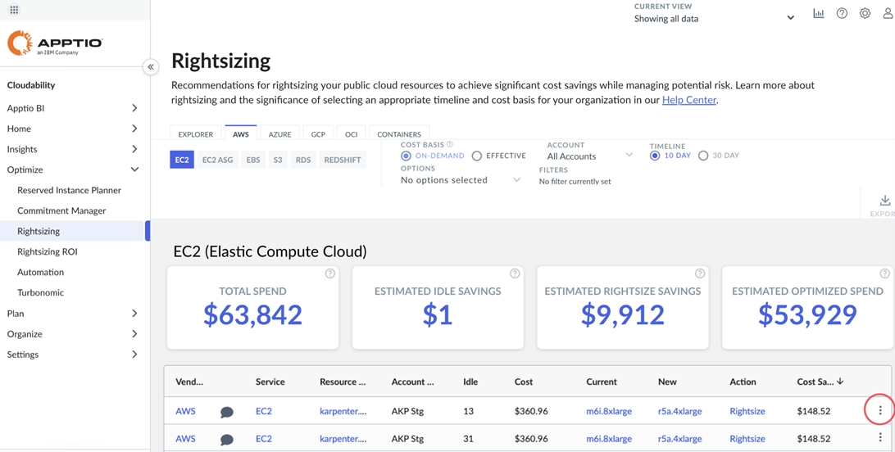

# Recomendações de dimensionamento de sonecas

Se necessário, você pode adiar as recomendações de dimensionamento de direitos para recursos específicos quando for determinado que nenhuma ação deve ser tomada no recurso no momento. Isso pode ajudar a aumentar a eficiência ao revisar e agir de acordo com as recomendações de dimensionamento de direitos, ocultando essas recomendações.

Antes de começar

Para adiar as recomendações de dimensionamento de direitos, você precisará das permissões administrativas adequadas.

[Funções e permissões no Cloudability](../admin/iam.html)

Acesse o painel Rightsizing

Para acessar o painel Rightsizing, abra a página inicial Cloudability e, no menu de navegação esquerdo, selecione Optimize > Rightsizing. O painel Rightsizing exibe a guia Explorer por padrão, mas os recursos de snoozing também estão disponíveis para serviços nas guias do fornecedor.

Recomendações para dormir

Para iniciar as recomendações de soneca, clique no botão de alternância do Modo Soneca no canto superior direito da página Rightsizing para ativar o Modo Soneca.

Quando o modo de soneca estiver ativado, vários métodos estarão disponíveis para as recomendações de soneca.

Método (em massa)

1. Agora haverá um botão “Adiar tudo” no canto superior direito da tabela de recomendações. 
2. A tabela de recomendações passará a exibir também uma coluna adicional (com caixas de seleção) como primeira coluna da tabela.
3. Para recomendações de soneca, também:
   - Clique no botão Snooze All (Suspender tudo ) para suspender todas as recomendações para os recursos na tabela.
   - Marque a caixa de seleção das recomendações que você deseja suspender e clique no botão Snooze Selected (x) para suspender apenas as recomendações dos recursos selecionados.
4. Será exibido um modal que permitirá que você escolha uma duração para o tempo em que as recomendações serão adiadas. Clique em Submit para adiar as recomendações ou em Cancel para cancelá-las.

Método (individual)

1. Clique nas reticências para abrir o submenu de recomendações. 
2. Para recomendações de soneca, também:
   - Clique no item do submenu Snooze (Soneca ).
   - Clique no item do submenu View Details (Exibir detalhes ) e, na parte superior do painel Details (Detalhes), no canto superior direito, clique no ícone Snooze (Soneca ).
3. Será exibido um modal que permitirá que você escolha uma duração para o tempo em que a recomendação será adiada. Clique em Submit para adiar as recomendações ou em Cancel para cancelá-las.

Recomendações para não dormir

Para cancelar as recomendações de soneca:

1. Clique no menu suspenso Options (Opções ) na parte superior da página Rightsizing (Redimensionamento) e selecione Show Snoozed Resources (Mostrar recursos suspensos ).
2. A tabela de recomendações passará a exibir as recomendações que estão atualmente adiadas..
3. Para cancelar a soneca das recomendações de um recurso, siga os mesmos processos usados para cancelar a soneca das recomendações:
   - Clique no botão Un-Snooze All para cancelar a soneca de todas as recomendações para os recursos na tabela.
   - Marque a caixa de seleção das recomendações que você deseja remover a soneca e clique no botão Un-Snooze Selected (x) exibido para remover a soneca apenas das recomendações dos recursos selecionados.
   - Clique nas elipses de uma recomendação suspensa para abrir o submenu de recomendações e clique na opção Un-snooze para cancelar a suspensão das recomendações.
   - Clique nas elipses de uma recomendação adiada para abrir o submenu de recomendações, clique no item do submenu Exibir detalhes e, na parte superior do painel Detalhes, no canto superior direito, clique no ícone Cancelar adiamento.

Edição da duração das recomendações adiadas

Para editar a duração das recomendações adiadas:

1. Clique no menu suspenso Options (Opções ) na parte superior da página Rightsizing (Redimensionamento) e selecione Show Snoozed Recommendations (Mostrar recomendações adiadas )
2. A tabela de recomendações agora exibirá as recomendações que estão suspensas no momento.
3. Clique nas elipses de uma recomendação adiada para abrir o submenu de recomendações.
4. No submenu, selecione a opção Editar son eca (a edição da duração da soneca também pode ser feita no Painel de detalhes com o ícone editar soneca no canto superior direito).
5. Será exibido um modal que permitirá que você escolha uma duração para o tempo em que a recomendação será adiada. Clique em Submit para adiar as recomendações ou em Cancel para cancelá-las.

**Tópico principal:** [Redimensionamento](../product/get-recommendations-for-scaling-your-cloud-resources-with-rightsizing.html)
