# Configure as credenciais de IBM Cloud usando o método Cloudability

## Resumo

Conecte ou credencie suas contas IBM Cloud a Cloudability para permitir a ingestão de dados de custo e uso. Este documento se concentra no método Cloudability e fornece um guia passo a passo para configurar um espaço de trabalho IBM Cloud usando o Terraform. O espaço de trabalho será usado para implantar a infraestrutura usando as configurações do Terraform hospedadas em um repositório GitHub.

## Pré-requisito

Habilitando sua conta IBM para exportar dados de uso

Antes de habilitar sua conta IBM para exportar dados de uso, você precisa ter a função de administrador ou editor no serviço de gerenciamento da conta de faturamento. Para obter mais informações, consulte [Acesso ao IAM](https://cloud.ibm.com/docs/account?topic=account-userroles "(Abre em uma nova guia ou janela)").

Para habilitar sua conta para exportar dados de uso, siga as etapas abaixo:

1. No console IBM Cloud, acesse Gerenciar > Faturamento e uso e selecione Configurações.
2. Clique em Connect.
3. Selecione uma Cloud Object Storage instância e Bucket. Ao selecioná-los, você está escolhendo qual bucket armazenará seus relatórios de uso.
   - Opcional: se você não quiser selecionar uma instância existente, clique em Select an instance > Create new.
   - Opcional: Selecione um compartimento ou crie um novo compartimento clicando em Create new bucket (Criar novo compartimento ) no menu suspenso. Para obter mais informações, consulte [Introdução ao site IBM Cloud Object Storage](https://cloud.ibm.com/docs/cloud-object-storage?topic=cloud-object-storage-getting-started-cloud-object-storage "(Abre em uma nova guia ou janela)").
4. Para obter autorizações de serviço para serviço, clique em Authorize (Autorizar ). Para o acesso necessário, selecione Object Writer e Content Reader. Clique em Review e depois em Assign.
5. Clique em Connect (Conectar ) depois de revisar os detalhes da pasta.

Referência: [Exportação de seus dados de uso para obter insights contínuos](https://cloud.ibm.com/docs/billing-usage?topic=billing-usage-exporting-your-usage&interface=ui "(Abre em uma nova guia ou janela)")

Copiar detalhes da conta para a conta em que o Enterprise está configurado

Copiar o Enterprise ID:

1. Navegue até Gerenciar.
2. Selecione Enterprise na lista suspensa.

   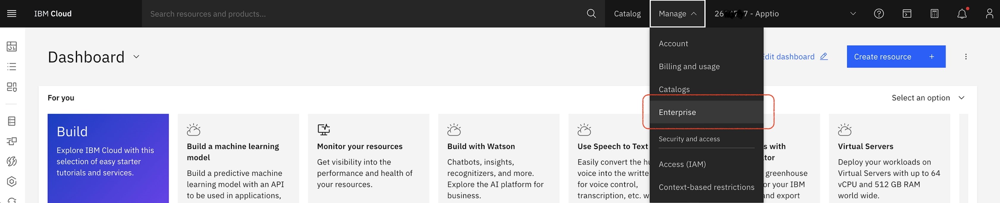
3. Acesse o Dashboard e localize o campo ID.

   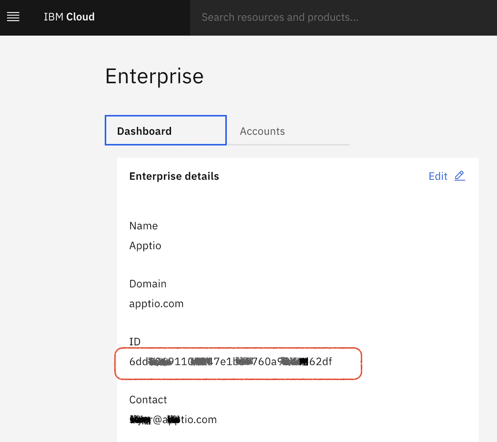

Copiar ID da conta

1. Navegue até Gerenciar.
2. Clique em Enterprise na lista suspensa e selecione Accounts (Contas ).
3. Identifique a conta rotulada como "Esta conta é a conta corporativa" e copie seu ID.

   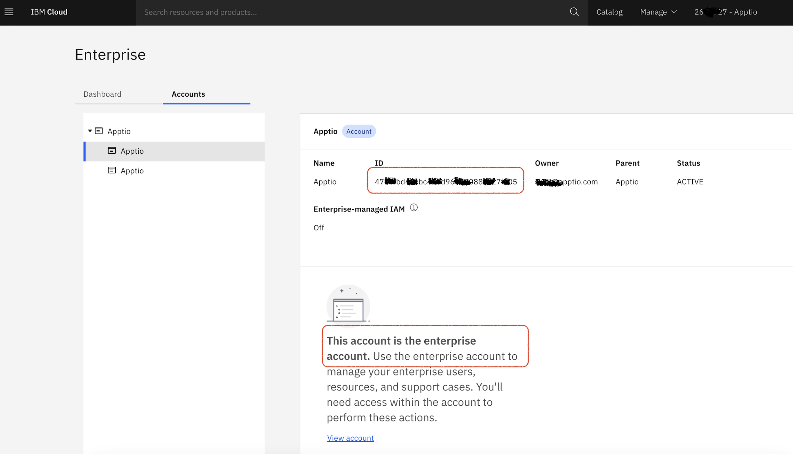

Copiar detalhes da conta para a conta em que o Enterprise não está configurado

Copiar ID da conta:

1. Navegue até Gerenciar.
2. Clique em Account (Conta ) na lista suspensa e selecione Account Settings (Configurações de conta ).
3. Copie sua ID.

   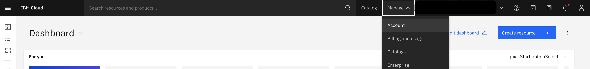

   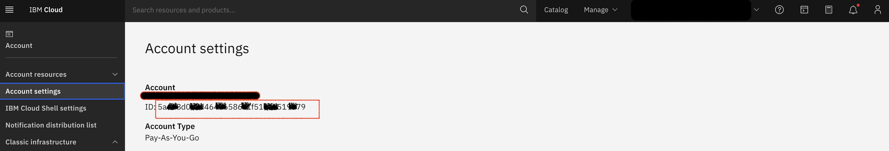

Copiar nome da instância de armazenamento

1. Acesse o menu de navegação IBM Cloud.
2. Vá para Resource List e selecione Storage.
3. Selecione a instância Cloud Object Storage que contém o Bucket para o qual o Relatório de uso é exportado.

   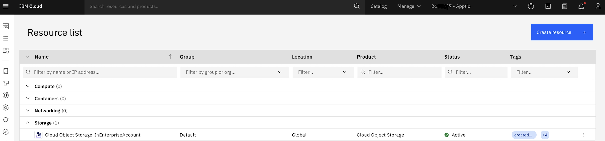

   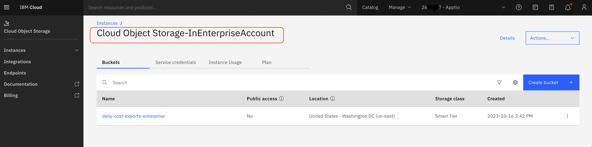

Copiar o nome e a região do bucket

1. Acesse o menu de navegação IBM Cloud.
2. Vá para Resource List (Lista de recursos ), selecione Storage (Armazenamento ) e, em seguida, escolha Storage Instance (Instância de armazenamento).
3. Localize a seção Compartimentos e selecione o Compartimento para o qual o Relatório de uso é exportado.
4. Navegue até Configuration e copie o Bucket Name e o Location (Region).

   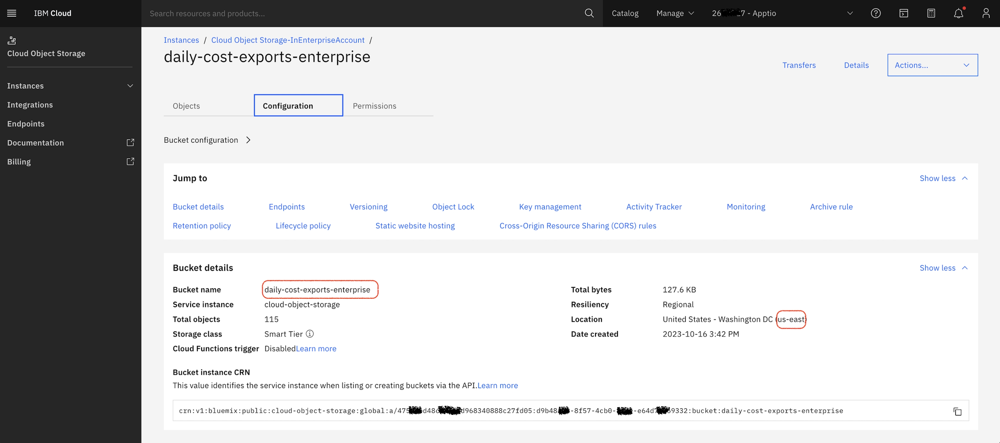

Prefixo de custo de cópia

1. Acesse o menu de navegação IBM Cloud.
2. Vá para Resource List (Lista de recursos ), selecione Storage (Armazenamento ) e, em seguida, escolha Storage Instance (Instância de armazenamento).
3. Localize a seção Compartimentos e selecione o Compartimento para o qual o Relatório de uso é exportado.
4. Acesse o menu de navegação IBM Cloud e selecione o compartimento para o qual o relatório de uso é exportado.

Copie o prefixo localizado entre o nome do compartimento e o nome da pasta (contendo o ano e o mês; por exemplo, 2023-10), excluindo o nome do compartimento e o nome da pasta Year-Month.

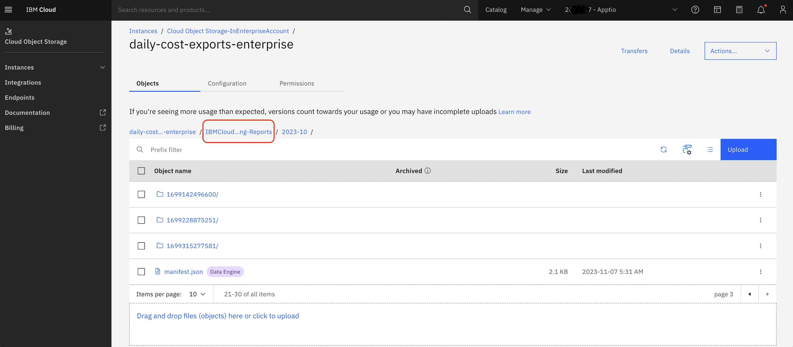

Cópia do relatório de custos Nome

1. Acesse o menu de navegação IBM Cloud.
2. Vá para Resource List (Lista de recursos ), selecione Storage (Armazenamento ) e, em seguida, escolha Storage Instance (Instância de armazenamento).
3. Localize a seção Compartimentos e selecione o Compartimento para o qual o Relatório de uso é exportado.
4. Acesse o menu de navegação IBM Cloud e selecione o compartimento para o qual o relatório de uso é exportado.
5. Navegue até qualquer pasta Year-Month e copie o nome do arquivo chamado 'manifest' (o nome do arquivo padrão é manifest).

   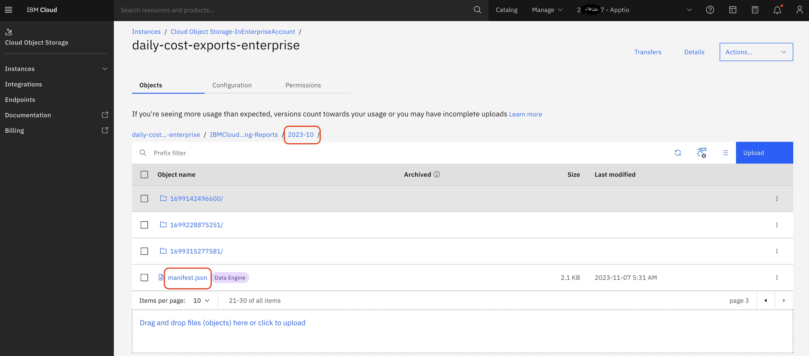

   Nota:

   Não copie a extensão do nome do arquivo. Deveria ser apenas "manifest" e não manifest.json.

## Gerar modelo do Terraform a partir de Cloudability

1. Certifique-se de que todos os detalhes estejam copiados e prontamente acessíveis.
2. Faça login na interface do usuário Cloudability e navegue até Settings (Configurações): Vendor Credentials (Credenciais do fornecedor): Clique em "Add Datasource" (Adicionar fonte de dados) e selecione " IBM ".

   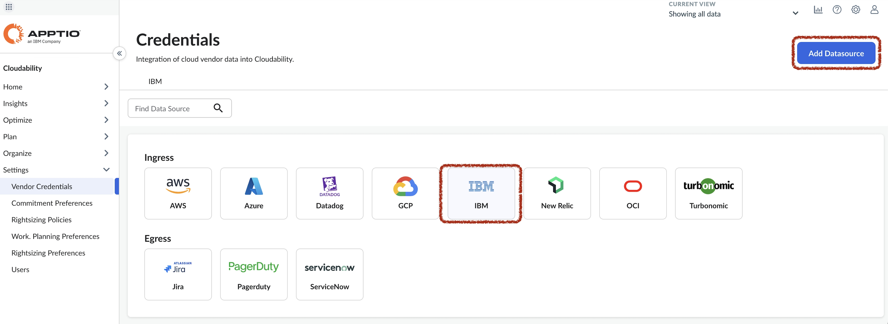
3. No painel lateral Add IBM Account (Adicionar conta ), clique em Next (Avançar ).
4. Digite todos os detalhes copiados anteriormente e clique em Generate Template (Gerar modelo ).

   Nota:

   O nome do relatório de custos não deve ter a extensão de nome de arquivo (.json).

   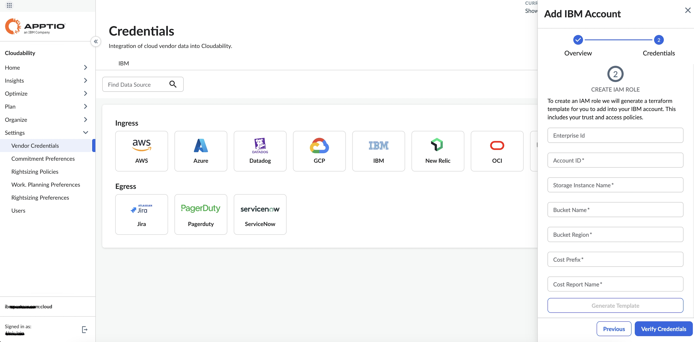

## Executando o Terraform

Pré-requisitos para o Terraform

1. Certifique-se de que o Terraform tenha sido baixado e esteja hospedado em um repositório, como GitHub.

   Observação: Se o seu repositório no GitHub for privado, você precisará gerar um Token de Acesso Pessoal (PAT), conforme descrito aqui.
2. Além disso, certifique-se de que você tenha acesso ao serviço de proprietário da conta ou gerente e acesso à plataforma de administrador para o serviço Schematics em seu acesso ao IAM.

Observação: O Terraform baixado também pode ser executado usando a CLI local

Etapas para a execução

**Etapa 1: Faça login em IBM Cloud**

1. Navegue até a página de login IBM Cloud.
2. Digite suas credenciais de IBM Cloud e faça login na sua conta IBM Cloud.

**Etapa 2: acessar esquemas e criar um espaço de trabalho**

1. Depois de fazer o login, acesse o menu Navigation (Navegação) em IBM Cloud.
2. No menu Navigation (Navegação), selecione Schematics (Esquemas ).
3. Clique em Workspaces para acessar a interface de gerenciamento do espaço de trabalho.

   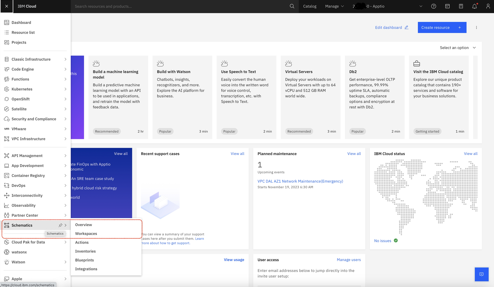

**Etapa 3: Configurar o espaço de trabalho**

1. Clique em Create Workspace para iniciar o processo de criação do espaço de trabalho.

   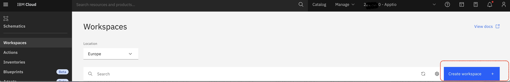
2. Forneça o repositório GitHub URL onde seus arquivos de configuração do Terraform estão hospedados.
3. Se o seu repositório GitHub for privado, forneça o Personal Access Token (PAT) que você gerou durante os pré-requisitos.

   Referência: [Gerenciando seus tokens de acesso pessoal](https://docs.github.com/en/authentication/keeping-your-account-and-data-secure/managing-your-personal-access-tokens#creating-a-fine-grained-personal-access-token "(Abre em uma nova guia ou janela)")
4. Selecione a versão mais recente do Terraform, neste caso, terraform\_v1.5.

   Nota:

   A versão do Terraform deve ser v1.5 e superior.
5. Clique em Next para continuar.

   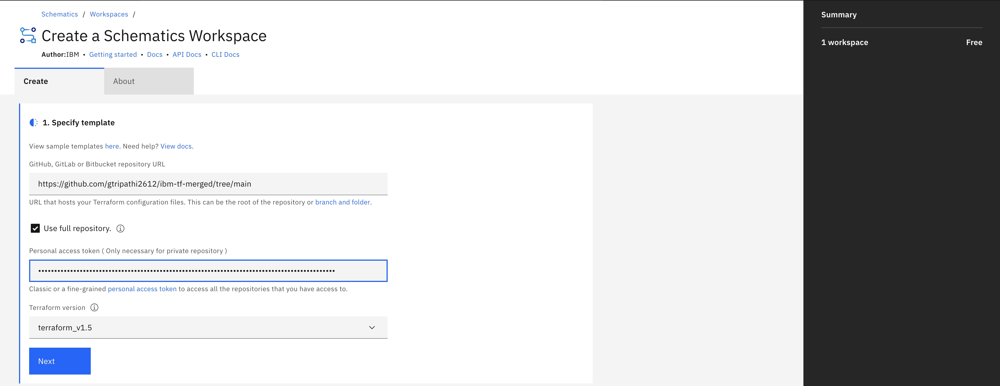

**Etapa 4: Definir variáveis**

1. Forneça um nome para seu espaço de trabalho, por exemplo, 'CldyWorkspace'.
2. Em Tags, adicione uma tag chamada "createdFor" com o valor 'Cldy'.
3. Deixe o grupo de recursos como "Padrão".
4. Escolha um local para seu espaço de trabalho, pois ele determina onde as ações do espaço de trabalho serão executadas.
5. A descrição é opcional.
6. Clique em Next para continuar.

   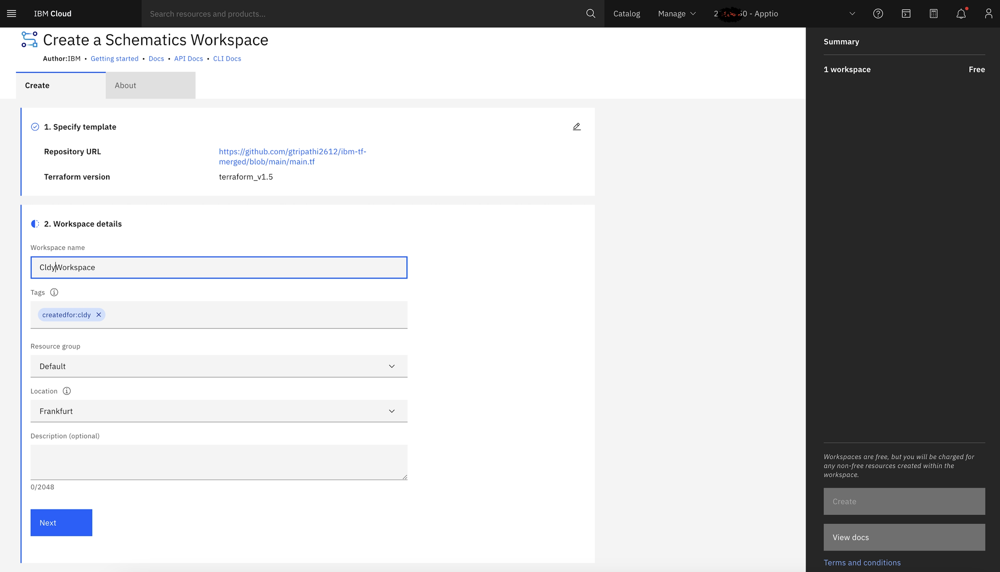

**Etapa 5: Aplicar o plano do Terraform**

1. Clique em Create para confirmar e criar o espaço de trabalho.
2. Seu CldyWorkspace será criado.

   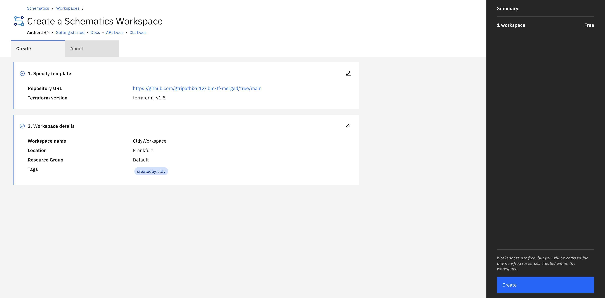

**Etapa 6: Acesse os recursos criados**

1. Selecione 'CldyWorkspace' na lista de espaços de trabalho.
2. Navegue até Settings for 'CldyWorkspace'.
3. Na seção Variables (Variáveis ), expanda os três pontos (reticências) e selecione Edit (Editar ).

   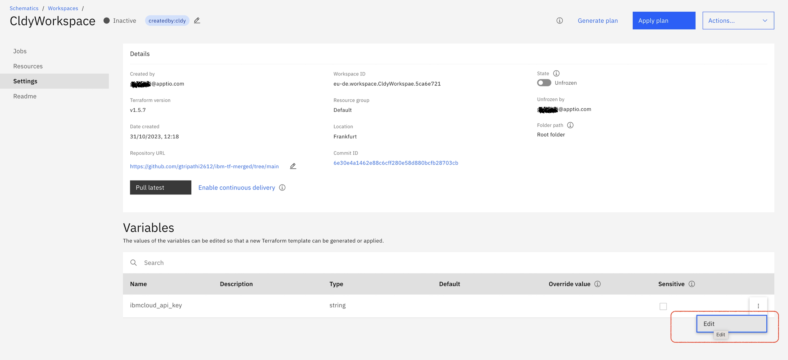
4. Seu CldyWorkspace será criado. Forneça sua ibmcloud\_api\_key, que deve ter o acesso necessário para criar recursos do IAM.

   Referência: [Gerenciamento de chaves de API de usuário](https://cloud.ibm.com/docs/account?topic=account-userapikey&interface=ui#create_user_key "(Abre em uma nova guia ou janela)")
5. Marque a caixa de seleção Sensitive (Sensível ) se quiser tratar esse valor de variável como informação sensível ou secreta. Isso impede que ele seja exposto nos detalhes do espaço de trabalho, na saída da CLI ou na saída do registro.

   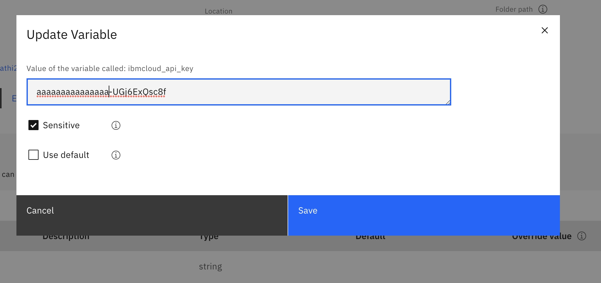
6. Depois de configurar as variáveis, volte para 'CldyWorkspace' e vá para a seção Jobs.
7. Clique em Apply plan (Aplicar plano) para iniciar a implantação da configuração do Terraform.

   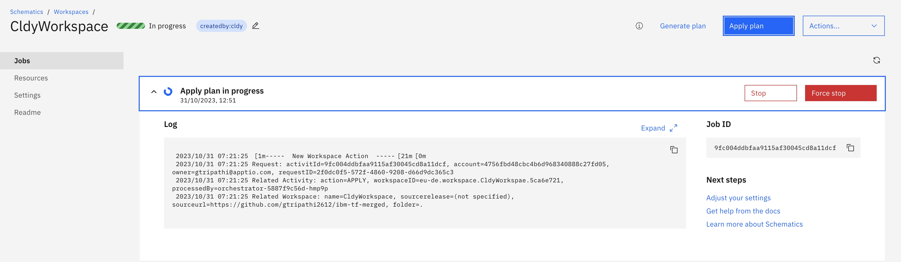

   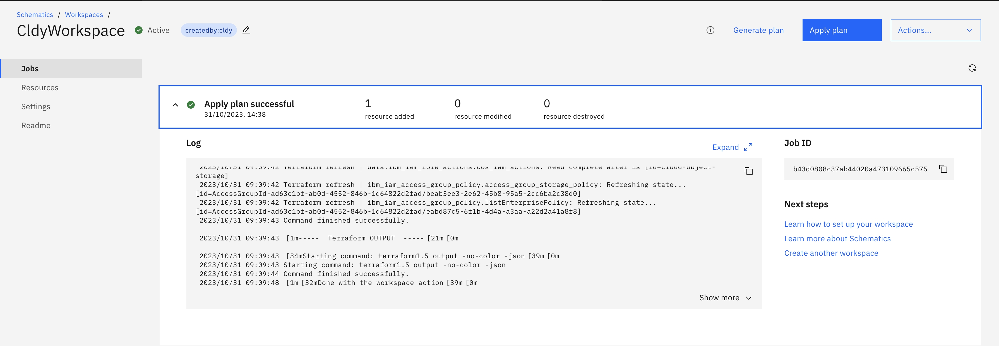
8. Quando a aplicação do plano for bem-sucedida, você poderá acessar os recursos que foram criados na seção Gerenciar.

   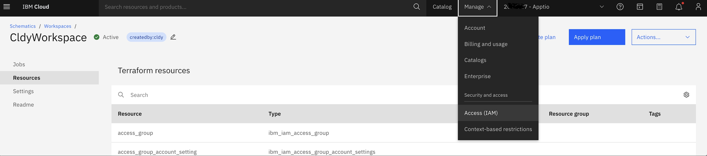
9. As funções personalizadas podem ser encontradas em Acesso (IAM) > Funções.

   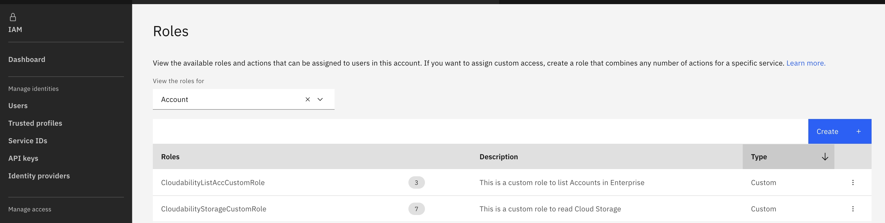
10. Isso conclui que você implantou os recursos com sucesso e pode gerenciar o acesso e as funções conforme necessário .

**Etapa 7: Verificar credenciais em Cloudability**

1. Depois que o plano de terraformação for aplicado com êxito, volte para a interface do usuário Cloudability e clique em Verify Credentials (Verificar credenciais ). A marca de verificação verde indica que o processo de credenciamento foi bem-sucedido. 

   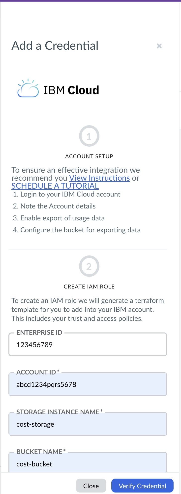

   **Verificar credenciais** **por meio de ações em massa**

   Para verificar várias contas rapidamente, clique no botão Ações em massa. Esta tela exibe todas as contas, exceto aquelas com o status Credenciais necessárias (X).

   1. Selecione as contas que precisam ser verificadas.
   2. Clique em **Revisar Seleção**
   3. Clique em **Verificar.**

   Isso acionaria o processo de verificação em massa e o botão de ações em massa ficaria desativado até que o processo fosse concluído.

   Depois de concluídas, as contas passarão para o status de Credencial verificada ou Credencial inválida (devido a erros).

   Observação: caso o número de contas seja muito grande, isso pode demorar alguns minutos.

   Exemplo de script do Terraform

   (Cabeçalho expansível)

   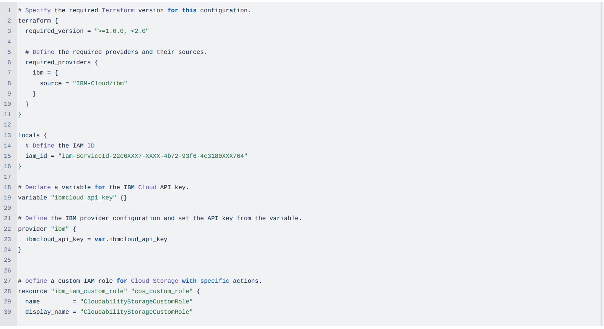

   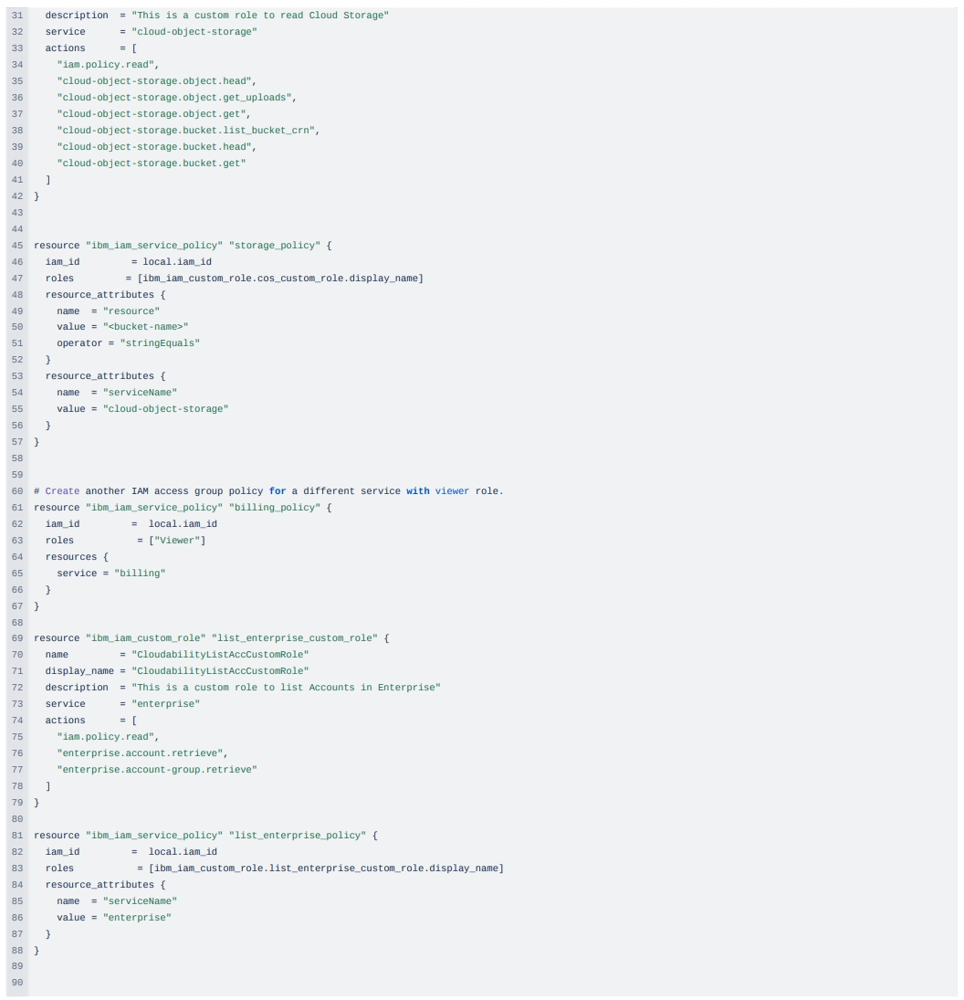

**Tópico principal:** [Conectar IBM Cloud](../product/apptio_help_center_ibm_cloud.html)
