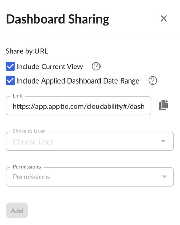

# Compartilhar um painel

Para melhorar a colaboração entre vários usuários e equipes, os painéis do Cloudability oferecem o recurso de compartilhamento de painéis.

Todos os usuários (tanto aqueles com permissões de visualização quanto de edição) podem compartilhar um painel por meio de URL. Essa funcionalidade permite gerar um URL que aponta diretamente para o painel que está sendo visualizado no momento.

Os usuários podem optar por incluir a Visualização atualmente aplicada e/ou o Intervalo de datas do nível do painel atualmente aplicado no “ URL ”, a fim de especificar melhor o contexto visível ao seguir o “ URL ”.

Além disso, os usuários com permissão de “Editar” em um determinado painel podem optar por compartilhá-lo com outros usuários do Cloudability ou com toda a organização.

O menu suspenso “Compartilhar com usuário” permite selecionar a lista de usuários com quem compartilhar o painel. O menu suspenso “Permissões” permite que os usuários decidam se o Painel será compartilhado com as permissões “Visualizar” ou “Editar”.

[NOTA] Os administradores podem editar qualquer painel compartilhado com eles; as permissões de apenas visualização não se aplicam.

**Tópico principal:** [Visualizar e configurar painéis](../product/view-and-configure-dashboards.html)
