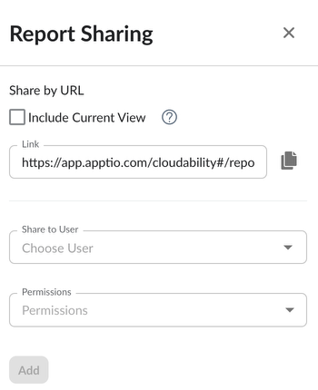

# Compartilhar um relatório

Os usuários podem decidir compartilhar um relatório salvo com outros usuários da sua organização. Os relatórios podem ser compartilhados clicando no ícone  “Compartilhar” na página do Relatório.

Então, o usuário pode decidir se o link de compartilhamento também deve incluir a visualização atualmente em uso, de modo que o outro usuário veja exatamente os mesmos dados que estão sendo visualizados no momento pelo usuário que está compartilhando o relatório.

Em seguida, os usuários podem decidir se o relatório deve ser compartilhado com um usuário específico ou com toda a organização. Por fim, os usuários podem decidir se o relatório será compartilhado com permissões de edição ou apenas com acesso de visualização.

**Tópico principal:** [Criar ou editar um relatório](../product/create-or-edit-a-report.html)
