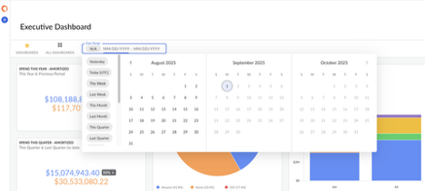
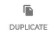
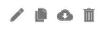
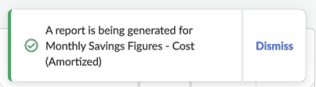
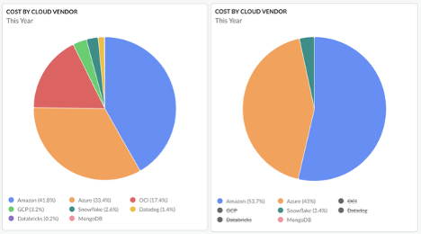
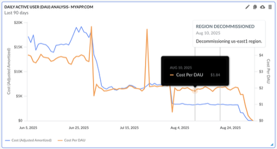
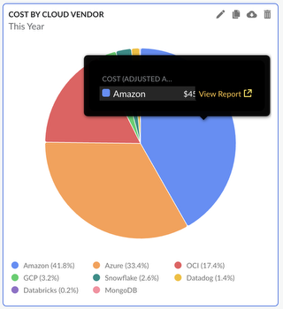

# Visualizar e configurar painéis

Acessar uma página do Painel é uma ótima maneira de explorar seus gastos com a nuvem em detalhes. Os painéis podem atender a uma variedade de casos de uso e podem ser personalizados de acordo com os requisitos exclusivos da sua empresa.

Existem diferentes ações que você pode realizar para cada configuração, dependendo de suas permissões.

**Incluir widget**

Clicar no ícone “Adicionar Widget” permite que os usuários criem um novo Widget no Painel atual. A descrição detalhada dessa funcionalidade pode ser encontrada na página “Criar ou editar um widget em um painel” da documentação.

A criação de um novo widget requer permissões de edição para o painel atual.

**Visualizações nos painéis**

Cloudability As visualizações são respeitadas ao trabalhar com painéis do Cloudability. As visualizações podem ser selecionadas usando o menu suspenso “Visualização atual” no canto superior direito da página. Os usuários também podem navegar até a página “Visualizações” ao selecionar a opção “Gerenciar visualizações...” no menu suspenso. Clicar no “X” ao lado do nome da Visualização neste menu suspenso resultará na limpeza da Visualização aplicada.

**Painéis favoritos**

Ao visualizar um painel, os usuários podem navegar rapidamente para outro painel favorito clicando no ícone de estrela amarela no canto superior esquerdo do painel. Isso abrirá um menu de contexto, exibindo todos os seus painéis favoritos, permitindo uma navegação rápida entre painéis importantes. A lista de Painéis Favoritos pode ser modificada a partir da lista “Todos os Painéis”.

**Intervalo de datas no painel**

Com esta opção, os usuários podem alterar o intervalo de datas aplicado a todos os widgets em um determinado painel. Essa configuração ajusta temporariamente o intervalo de datas, apenas para os usuários atuais, permitindo que diferentes pessoas trabalhem com o mesmo painel ao mesmo tempo. O intervalo de datas do painel não requer permissões de edição para o painel.

Existem várias seleções pré-configuradas disponíveis para esta opção:

- Ontem
- Hoje (UTC)
- Esta semana
- Última semana
- Este mês
- Último mês
- Este trimestre
- Último trimestre
- Este ano
- Ano passado
- Últimos 7 dias
- Últimos 14 dias
- Últimos 30 dias
- Últimos 60 dias
- Últimos 90 dias

Os usuários também podem selecionar qualquer intervalo de datas personalizado, escolhendo as datas usando o modal do calendário ou digitando o intervalo de datas manualmente.

A seleção do intervalo de datas pode ser apagada clicando no ícone “X” ao lado do intervalo de datas configurado.

[AVISO] Algumas fontes de dados não suportam as configurações de intervalo de datas do painel. Os widgets que utilizam fontes de dados **Rightsizing** ou **Estimate** manterão o intervalo de datas configurado no nível do widget.

**Compartilhar um painel**

Esta opção é descrita em detalhes na seção “Compartilhar um painel” desta documentação.

**Anotar**

Esta opção é descrita em detalhes na seção “Anotar em painéis” desta documentação.

**Duplicar um painel**

Clicar no ícone “Duplicar” resultará na criação de uma cópia do painel atual. Esta é outra opção para copiar um painel, conforme descrito em “Copiar um painel” na seção Lista de painéis.

**Excluir um painel**

Clicar no ícone “Excluir” excluirá permanentemente o painel atual. Esta funcionalidade é equivalente à funcionalidade “Excluir” da página “Lista de painéis”.

No painel, os usuários também podem realizar ações específicas do widget. Existem várias opções disponíveis ao passar o cursor sobre um widget.

**Editar**

Clicar no ícone “Editar” permite que os usuários modifiquem o widget existente. A descrição detalhada dessa funcionalidade pode ser encontrada na página “Criar ou editar um widget em um painel” da documentação.

A edição de um widget requer permissões de edição para o painel atual.

**Copiar**

Clicar no ícone “Copiar” permite que os usuários copiem o widget selecionado e o adicionem ao mesmo painel ou a um painel diferente. Copiar o widget requer apenas permissões de visualização do painel atual, mas salvar uma cópia do widget requer permissões de edição no painel de destino.

**Exportar**

Os usuários podem optar por baixar os dados de um determinado widget em um formato separado por vírgulas clicando no ícone “Exportar”. Esta opção exibirá um modal informativo no canto inferior esquerdo da página, informando ao usuário que o relatório está sendo gerado. Assim que os dados estiverem prontos, o download dos dados será iniciado. Cada camada do Widget e cada comparação de datas gerarão um arquivo separado com valores separados por vírgulas. A permissão “Visualizar” é suficiente para exportar os dados de um widget.

Os tipos de widget “Redimensionamento” e “Estimativa” não podem ser exportados.

**Excluir**

Os usuários podem excluir um widget clicando no ícone “Excluir”. Os usuários serão solicitados a confirmar a exclusão de um widget.

[AVISO] Esta ação não pode ser desfeita.

**Widgets interativos**

Os widgets nos painéis do Cloudability são interativos para permitir uma análise melhor e em tempo real dos seus dados.

Os usuários podem optar por ocultar ou exibir as dimensões clicando em cada nome de dimensão na legenda para se concentrar nos itens mais importantes no momento.

Passar o cursor sobre uma seção de um widget exibe informações adicionais, como o valor exato da métrica em um determinado ponto do gráfico, ou exibe anotações adicionais relevantes para um ponto de dados.

Clicar em uma seção de um widget permite que os usuários naveguem para um relatório mais detalhado para análise posterior.

- **[Criar ou editar um widget em um painel](../product/create-or-edit-a-widget-in-a-dashboard.html)**
- **[Compartilhar um painel](../product/share-a-dashboard.html)**
- **[Anotar em painéis](../product/annotate-in-dashboards.html)**

**Tópico principal:** [Cloudability Painéis](../product/cloudability-dashboards.html)
