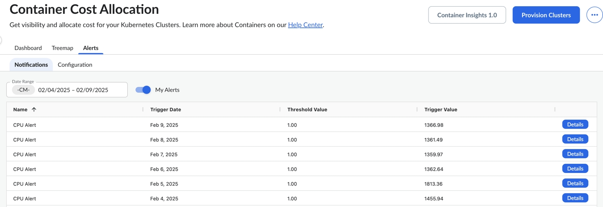
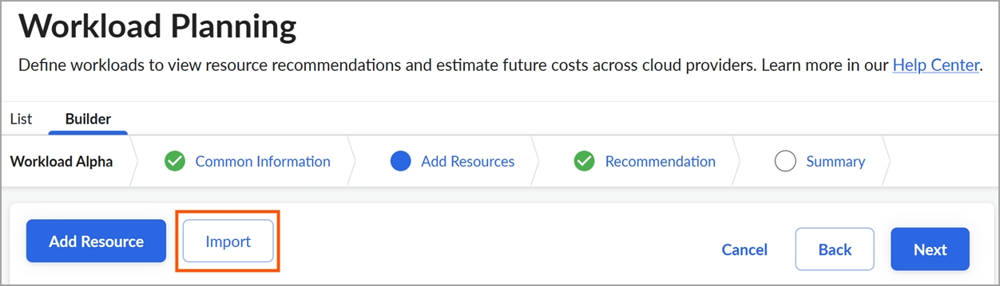
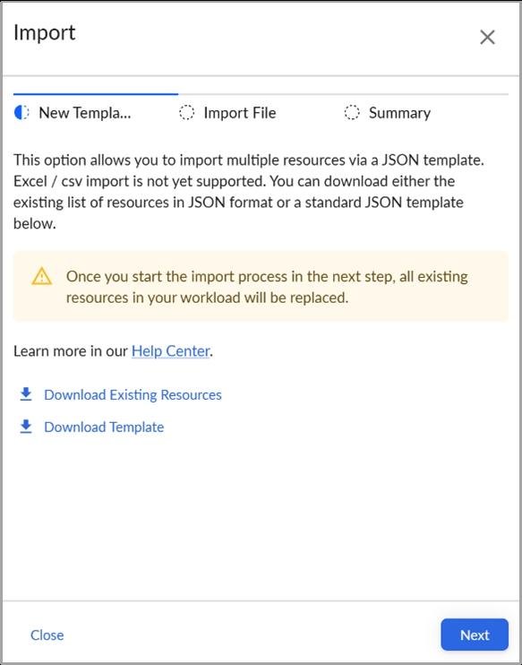
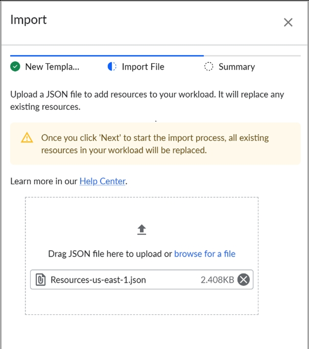
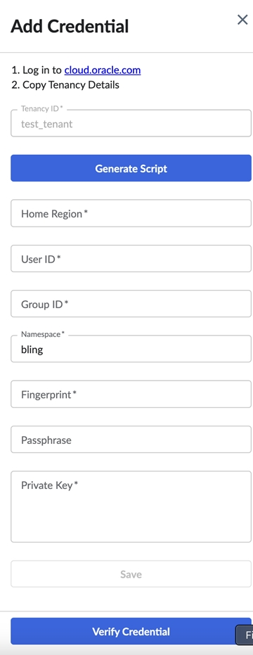

# Cloudability Premium : Novidades para 2025

## Aprimoramentos na interface do usuário de gerenciamento de usuários e na visualização padrão - 19 de dezembro de 2025

Esta versão apresenta melhorias na usabilidade **da gestão de usuários** e **na configuração da visualização padrão**, aumentando a visibilidade e a consistência tanto para administradores quanto para usuários.

- **Interface de usuário atualizada para gerenciamento de usuários** : a experiência de edição de usuários foi transferida do painel esquerdo para um novo painel direito em **Usuários e grupos → Usuários**. O novo painel agora:

  - Exibe todos os tipos de visualização, incluindo **Visualizações Hierárquicas (HVs)** e Visualizações compartilhadas por meio de Grupos de Usuários
  - Suporta pesquisa e filtragem por visualizações **selecionadas**, **não selecionadas** ou **todas**
- **Visualizações hierárquicas como visualizações padrão** : Agora, as HVs podem ser selecionadas como visualizações padrão:

  - Os administradores podem atribuir um HV como padrão de um usuário a partir do **Gerenciamento de usuários.**
  - Os usuários podem definir um HV como sua visualização padrão em **Gerenciar perfil → Preferências.**

    Apenas os HVs aos quais o usuário tem acesso aparecem na lista; e apenas o nó de nível mais alto ao qual o usuário tem acesso pode ser definido como padrão.
- **Comportamento aprimorado quando as visualizações são excluídas ou as permissões são alteradas**

  - Se uma visualização padrão (incluindo um HV) for excluída, a visualização padrão do usuário será automaticamente revertida para a visualização padrão no nível da organização.

    Se não existir um padrão no nível da organização, a visualização padrão será definida como em branco.
  - Os administradores agora verão uma mensagem de aviso ao excluir visualizações ou alterar permissões que possam afetar as configurações padrão do usuário.

## Alertas de anomalias para vários usuários - 19 de dezembro de 2025

Esta versão adiciona suporte para compartilhar alertas de anomalias. Os usuários agora podem incluir destinatários diretamente em um alerta, facilitando a notificação de outras pessoas sem a necessidade de configuração individual do alerta.

Além disso, uma nova guia Compartilhamento de alertas está disponível na página Configuração de alertas, fornecendo uma visualização centralizada de todas as assinaturas de alertas.

.

## Credenciais de fornecedores - Verificação em massa para Azure, OCI e IBM - 19 de dezembro de 2025

Esta versão adiciona suporte para a ação de verificação em massa nas credenciais de fornecedores para Azure, OCI e IBM, o que facilita a integração de contas CSP. Com esta versão, a funcionalidade Ações em massa estará disponível para todos os clientes que possuírem as opções abaixo.

- AWS - Salvar em massa, atualizar em massa, verificar em massa
- Azure - Verificação em massa
- GCP - Salvar em massa, verificar em massa
- OCI - Verificação em massa
- IBM - Verificação em massa

## Aprimoramentos nos alertas por e-mail para credenciais de fornecedores – 11 de dezembro de 2025

Cloudability anuncia melhorias nos alertas por e-mail sobre o status das credenciais do fornecedor. Os alertas por e-mail agora serão exibidos

- Cloudability estado da conta
- Turbonomic status da meta

Os e-mails resumirão os vários status e ações necessárias em várias contas dentro do Cloudability.

## Aprimoramentos no banner Credenciais do fornecedor – 10 de dezembro de 2025

Cloudability anuncia melhorias nos banners exibidos na página de credenciais do fornecedor para mostrar o seguinte:

- Cloudability estado da conta
- Turbonomic status da meta

Os banners resumirão as ações necessárias em várias contas dentro de Cloudability. O banner também funcionaria como filtros rápidos para vários status de conta/destino quando os números exibidos fossem clicados.

## Turbonomic status da meta em Credenciais do fornecedor – 10 de dezembro de 2025

Cloudability Anuncia o lançamento da exibição do status do alvo Turbonomic na tela de credenciais do fornecedor do Cloudability.

Você poderá ver o status geral em uma nova coluna chamada “Status da meta” e também poderá ver os detalhes na seção de detalhes da conta clicando em... e, em seguida, em detalhes.

Isso permite que os clientes Premium tenham uma visão única do status de suas contas Cloudability e Turbonomic.

Isso se aplica a todas as integrações de fornecedores disponíveis com o Cloudability Premium

- AWS
- Azure
- GCP
- New Relic
- DataDog

  Observação: há chances de que, em alguns casos específicos, os status entre Cloudability e Turbonomic não correspondam. Se isso for observado, por favor, abra um ticket de suporte com a equipe de suporte da IBM.

## Painel de serviços de IA multicloud – 8 de dezembro de 2025

Cloudability anuncia o lançamento do Multi Cloud AI Services Dashboard, uma solução abrangente para monitorar os custos de IA e aprendizado de máquina em AWS, Azure e Google Cloud Platform. Este novo painel fornece às equip FinOps es informações sobre os gastos com IA generativa, permitindo decisões baseadas em dados para controlar custos e, ao mesmo tempo, expandir iniciativas de IA.

**Introdução**

O Painel de Serviços de IA Multi Cloud está disponível para todos os clientes IBM Cloudability com contas conectadas AWS, Azure ou GCP. Para acessar o painel:

1. Navegue até Página inicial > Meu painel no console Cloudability
2. Selecione Multi Cloud | Painel de serviços de IA na sua lista de painéis
3. Use o seletor de intervalo de datas para personalizar o período da sua análise
4. Navegue pelas seções do painel para explorar os detalhes dos custos por serviço e provedor

Para saber mais, entre em contato com sua equipe de contas IBM Cloudability ou com o gerente técnico de contas.

## Credenciais do fornecedor - Prevenção da perda de dados se o usuário clicar fora do painel lateral – 25 de novembro de 2025

Esta versão adiciona um modal à página de credenciais do fornecedor se o usuário clicar fora do painel lateral enquanto preenche as informações de credenciais.

Antes desta versão, se o usuário clicasse fora do painel lateral da tela de credenciais do fornecedor, a tela desaparecia e os dados preenchidos no formulário eram perdidos, exigindo que o usuário preenchesse as informações novamente.

## Funcionalidade de gerenciamento automatizado de compromissos - 18 de novembro de 2025

A funcionalidade automatizada de gerenciamento de compromissos que sustenta o CSA ( Cloudability Savings Automation ) está agora disponível para todos os clientes novos e existentes do Cloudability Premium. Os usuários podem aproveitar essa funcionalidade para gerenciar automaticamente seus compromissos de computação do AWS para maximizar suas economias e flexibilidade.

Essa funcionalidade pode ser encontrada no bloco “ Cloudability Savings Automation ” (Controle de acesso e gerenciamento de identidade) no Frontdoor, que será provisionado automaticamente para todos os clientes novos e existentes do Cloudability Premium.

Para obter mais informações sobre o CSA, consulte os [documentos do usuário do CSA](https://www.ibm.com/docs/en/cloudability-commercial/savings-automation/saas "(Abre em uma nova guia ou janela)").

## Sustentabilidade na nuvem - Emissões incorporadas – 14 de novembro de 2025

Hoje lançamos a inclusão das Emissões Incorporadas como parte do relatório de Emissões de Carbono. Esta melhoria fornece uma representação mais abrangente do impacto total do carbono em toda a sua utilização da nuvem pública.

Os usuários agora podem visualizar as emissões de carbono, incluindo as emissões operacionais e incorporadas.

Antes deste lançamento, os usuários que desejavam medir suas emissões de carbono só tinham acesso às emissões operacionais.

Com a inclusão da Emissão Incorporada, a métrica “Emissão de Carbono Estimada” agora reflete a Emissão de Carbono total, que é a soma das Emissões Operacionais e Incorporadas.

Observação: você poderá observar um aumento nos valores estimados de emissões de carbono a partir da execução dos dados de sustentabilidade de novembro de 2025 (métricas de sustentabilidade para outubro de 2025), o que é esperado e está alinhado com a metodologia de cálculo mais inclusiva.

## Compartilhamento de custos para relatórios e painéis – 7 de novembro de 2025

Com esta versão, o Compartilhamento de Custos está agora disponível nos Relatórios e Widgets do Painel d Cloudability. Agora você pode visualizar seus dados de custos com os custos alocados aplicados, com uma visão completa dos custos diretos e compartilhados em seus relatórios e painéis.

- **Alternar compartilhamento de custos por relatório ou widget** : ative ou desative o compartilhamento de custos em relatórios e widgets nativos do Cloudability para ver como os custos alocados afetam seus dados.
- **Indicadores visuais em toda a interface** : as dimensões comerciais com regras de alocação agora exibem ícones de alocação nos seletores de dimensão, facilitando a identificação imediata das dimensões afetadas pelas suas regras de compartilhamento de custos.
- **Validação inteligente e tratamento de erros** : O editor gerencia automaticamente a compatibilidade de dimensões e métricas.
- **Integração perfeita entre recursos** : o compartilhamento de custos funciona de maneira consistente em relatórios e painéis.

- **Visibilidade completa dos custos** : tenha uma visão geral completa dos seus custos, incluindo despesas diretas e custos alocados a partir de recursos compartilhados.

  **Análise flexível** : alterne entre visualizações alocadas e não alocadas para entender o impacto de suas regras de distribuição de custos.

  **Erros evitados** : a validação automática garante que seus relatórios e widgets sempre utilizem combinações compatíveis de dimensões, métricas e filtros.

  **Experiência consistente** : o compartilhamento de custos funciona da mesma maneira em relatórios e painéis, facilitando a criação e o compartilhamento de insights.

Para obter mais informações, acesse [Compartilhamento de custos para relatórios e painéis](../product/cost-sharing-for-reports-and-dashboards.html).

## Cloudability : Insights centralizados para otimização de compromissos e recursos - 7 de novembro de 2025

Cloudability adicionou novas funcionalidades na seção Otimização para ajudar os usuários a obter uma visão centralizada de seus compromissos e iniciativas de otimização de recursos. Esses painéis mostram tanto as oportunidades de otimização futuras quanto as economias realizadas no passado e o impacto desses esforços.

Para obter visibilidade completa, os usuários precisam ter acesso aos dados de custos, bem como permissões para visualizar os dados de Compromisso, Redimensionamento e Retorno sobre o Investimento em Redimensionamento.

## Salvar e compartilhar relatórios em um inventário de recursos d Cloudability – 31 de outubro de 2025

Anteriormente, os dados do inventário de recursos só podiam ser visualizados na interface do usuário e, na melhor das hipóteses, exportados em formato CSV. Assim que o usuário saía do módulo Inventário de Recursos, os dados consultados e os filtros eram reiniciados. Com esta versão, oferecemos suporte à capacidade de salvar um relatório específico com sua data, serviço e seleções de filtro e compartilhar esse relatório com outros usuários na organização, concedendo-lhes permissões de “Somente visualização” ou “Editar”. Também oferecemos suporte à funcionalidade de data "rolante" para os relatórios salvos. A capacidade de salvar e compartilhar relatórios de inventário de recursos permitiria a criação de relatórios de retorno robustos para que as equipes compreendessem seu consumo e modelos de cobrança informados para faturamento interno.

## Opção para excluir recursos das recomendações e exibição dos nomes completos das regiões no Planejamento de carga de trabalho do Cloudability - 30 de outubro de 2025

Com esta versão, fizemos duas melhorias:

1. Opção para usuários administradores especificarem os tipos de recursos que não devem aparecer nas recomendações do WLP para sua organização. Isso pode ser feito usando uma destas duas opções:
   - adicionando a palavra-chave para que as recomendações ignorassem os tipos de recursos que contêm a palavra-chave. Por exemplo: atribuir o valor “xlarge” excluiria todos os recursos que têm “xlarge” em seus nomes.
   - adicionando um asterisco (\*) junto com a palavra-chave para que as recomendações ignorem os tipos de recursos que começam com essa palavra-chave. Por exemplo: atribuir o valor “ t4\* ” excluiria todos os recursos que começam com “ t4 ”.
2. Anteriormente, o WLP mostrava apenas os códigos regionais (por exemplo: us-east-1 ). Agora mostramos o nome completo da região junto com seus respectivos códigos regionais (entre parênteses). Por exemplo: us-east-1 agora será exibido como US East N. Virginia ( us-east-1 ). As regiões também são classificadas em ordem alfabética ao selecionar na seção Informações comuns

## Redimensionamento do ROI: exclusão de tickets e filtros – 24 de outubro de 2025

**Redimensionamento do ROI** : permita a exclusão de tickets e a filtragem por data

O recurso de ROI de redimensionamento da Cloudability foi aprimorado com novas funcionalidades para melhorar a usabilidade:

**Visualização de economia** : Um novo gráfico foi adicionado à página Retorno sobre o investimento do redimensionamento, que exibe o valor da economia em 30 dias no mês em que foi implementado/encerrado. Isso ajuda os usuários a compreender o impacto das ações realizadas ao longo de vários períodos de tempo.

**Exclusão de tickets** : Agora, os usuários do Rightsizing ROI podem excluir tickets existentes que não são mais relevantes. Os usuários podem eliminar o ruído das recomendações de tickets que não se aplicam mais ou que desejam excluir e criar novos tickets com base nas recomendações atualizadas.

**Filtragem por data** : os usuários agora podem filtrar por intervalos de datas (data de criação ou encerramento) no uI para concentrar suas análises ou relatórios de economia em períodos específicos

A funcionalidade de filtragem e exclusão de tickets é compatível com a interface do usuário Cloudability, bem como com a API Rightsizing ROI.

## Seleção hierárquica de contas para recomendações de compromisso d GCP – 16 de outubro de 2025

Hoje, disponibilizamos um recurso adicional para apoiar nossos clientes com várias contas de faturamento GCP. O seletor de contas na página de recomendações GCP agora permite a seleção múltipla e é hierárquico. Como resultado, as recomendações para diferentes contas de faturamento podem ser exibidas em uma única página. Todas as contas agora são a seleção padrão e a Conta de cobrança foi adicionada à tabela.

Agora, explicitamente, a seleção de conta no Recs é um seletor de uso. A recomendação é baseada em qualquer gasto que esteja nas contas selecionadas.

Para obter mais informações, consulte a documentação de ajuda sobre gerenciamento de compromissos.

## Exportar relatórios no formato de localidade definido pelo usuário – 16 de outubro de 2025

Hoje, **o** Cloudability Reports introduziu uma melhoria que permite aos usuários exportar os dados do relatório em um formato CSV consistente com o formato de localidade selecionado em seu ambiente, usando um ponto “.” ou uma vírgula "," como separador decimal separator.Locale As configurações podem ser modificadas na guia "Moeda" nas configurações "Gerenciar perfil" pelo administrador da conta.

## Maior transparência de preços e configuração simplificada do Object Storage no planejamento de carga de trabalho do Cloudability – 14 de outubro de 2025

1. Estamos introduzindo um novo ícone de calculadora ao lado de cada recomendação de preço no Planejamento de carga de trabalho. Ao clicar no ícone, agora é exibida a fórmula exata usada para calcular o preço, ajudando você a entender claramente a composição do custo. Esta melhoria responde aos comentários anteriores dos clientes sobre a reconciliação das diferenças de preço entre o Planejamento de Carga de Trabalho e as calculadoras de preços nativas da nuvem.
2. Além disso, removemos a seleção do tipo de recurso para o serviço Object Storage. Essa seleção era redundante, pois todas as opções de configuração para Object Storage já são exibidas na tela Recomendações. Esta atualização simplifica a experiência, mantendo total visibilidade das oportunidades de otimização de custos.

## FOCO 1.1 Apoio em Cloudability – 13 de outubro de 2025

A partir de hoje, os clientes podem facilmente importar qualquer conjunto de dados em Cloudability que esteja em conformidade com a especificação [FOCUS v1.1](https://focus.finops.org/focus-specification/v1-1/ "(Abre em uma nova guia ou janela)"), além do [FOCUS v1.0](https://focus.finops.org/focus-specification/v1-0/ "(Abre em uma nova guia ou janela)"), e obter visibilidade dos custos dos gastos importados.

Não há alterações no processo de credenciamento para o formato FOCUS 1.1, que segue o mesmo processo do FOCUS 1.0.

## Suporte de compromisso para instâncias reservadas de AWS OpenSearch – 10 de outubro de 2025

Hoje, disponibilizamos suporte para Instâncias Reservadas do AWS OpenSearch. O oitavo tipo de compromisso AWS suportado, os compromissos OpenSearch oferecem um desconto sob demanda em troca de um compromisso de um ou três anos de uso por hora. Esse tipo de compromisso é classificado como um compromisso baseado em recursos e, como tal, requer a seleção de parâmetros de uso específicos: tipo de instância, opção de pagamento e região. Este compromisso se comporta de maneira semelhante aos outros tipos de compromisso não computacionais AWS. Com esta versão, oferecemos suporte a este tipo de compromisso tanto na carteira de compromissos quanto nas recomendações.

Para obter mais informações, consulte a documentação de ajuda sobre gerenciamento de compromissos.

## Azure Exportações de gerenciamento de custos: suporte à compactação Gzip – 9 de outubro de 2025

Esta versão introduz suporte para compactação Gzip para exportações de gerenciamento de custos do Azure. Cloudability os clientes agora poderão usar:

- Formato de exportação: CSV
- Compressão: Nenhuma ou Gzip

Isso ajudaria a reduzir o tamanho do arquivo das exportações d Azure.

## Novas permissões do Turbonomic para AWS e Azure – 6 de outubro de 2025

Esta versão introduz novas permissões Turbonomic em Cloudability Premium.

**AWS**

- ec2:DescribeInstanceAttribute - Necessário para verificar os atributos de uma instância do EC2, incluindo o atributo “proteção contra parada”

**Azure**

- Microsoft.ContainerService/managedClusters/start/action - Exigido pelo Turbonomic para Azure AKS cluster parking
- Microsoft.ContainerService/managedClusters/stop/action - Exigido pelo Turbonomic para Azure AKS cluster parking
- Microsoft.Compute/disks/beginGetAccess/action - Necessário para executar ações de redimensionamento de disco/volume quando elas são criadas a partir de instantâneos

Visite [a referência Permissões](https://www.ibm.com/docs/en/cloudability-commercial/cloudability-premium/saas?topic=azure-permissions-reference-microsoft "(Abre em uma nova guia ou janela)") de acesso para saber mais.

Observação: essas permissões são de natureza adicional e não afetam o funcionamento das contas e permissões credenciadas existentes. No entanto, será necessário renovar as credenciais para adicionar essas novas permissões.

## Aprimoramento da configuração de compartilhamento de custos - Alocar automaticamente para novos valores de dimensão de negócios – 2 de outubro de 2025

Esta versão apresenta uma melhoria na forma como as regras de compartilhamento de custos lidam com novos valores de dimensão de negócios no Cloudability.

Você pode configurar suas regras de compartilhamento de custos e os respectivos buckets como uma instrução de inclusão ou exclusão. Ao selecionar “incluir”, você está explicitamente incluindo os valores da dimensão de negócios aos quais deseja alocar. Ao selecionar “excluir”, você atribuirá a todos os valores da dimensão de negócios (incluindo novos valores da dimensão de negócios) por padrão, a menos que opte por excluí-los explicitamente.

O novo recurso **Excluir** ajuda a eliminar o trabalho manual de atualizar cada regra de compartilhamento de custos sempre que você adiciona novos valores às dimensões do seu negócio.

## Cloudability Contêineres: IBM FinOps Agente – 1º de outubro de 2025

Esta versão apresenta o agente IBM FinOps. O agente IBM FinOps consolida e simplifica a coleta de métricas, ao mesmo tempo em que introduz novos recursos em segurança, resiliência e experiência de instalação.

IBM FinOps O Agente foi projetado para substituir o Agente de Métricas legado. Também servirá como base de dados para futuros lançamentos de recursos.

Observação: os agentes de métricas continuarão funcionando. No entanto, recomendamos enfaticamente que você comece a migrar para o IBM FinOps Agent para acessar os novos recursos e a confiabilidade aprimorada.

Novos recursos:

- **Helm Instalação baseada em:** Alinha-se às práticas recomendadas do Kubernetes para simplificar a implantação e as atualizações.
- **Chaves API autogerenciadas:** integra-se com as chaves API Frontdoor, permitindo que você crie, alterne e gerencie credenciais para atender aos seus requisitos de segurança.
- **Maior resiliência:**
  - **Recuperação de desastres para uploads:** usa volumes persistentes para preservar os dados coletados durante reinicializações ou problemas de serviço.
  - **Captura de pods de curta duração:** atribui custos com mais precisão a cargas de trabalho transitórias.
- **Arquitetura preparada para o futuro:** fornece a base para inovações futuras em insights sobre contêineres

Visite [o agente de contêineres Provision](../product/container-metrics-agent-provisioning.html) para saber mais.

## Apoio ao compromisso para Azure Banco de dados para PostgreSQL – 30 de setembro de 2025

Hoje, disponibilizamos suporte para o banco de dados Azure para PostgreSQL. O décimo tipo de compromisso Azure suportado, o banco de dados Azure para compromissos PostgreSQL, oferece um desconto na computação em troca de um compromisso de um ou três anos de uso por hora. Esse tipo de compromisso é classificado como compromisso baseado em recursos e, como tal, requer a seleção de parâmetros de uso específicos: Opção de implantação, Instância e Região. Com esta versão, oferecemos suporte a este tipo de compromisso tanto na carteira de compromissos quanto nas recomendações.

Para obter mais informações, consulte a documentação de ajuda sobre gerenciamento de compromissos.

## Apoio ao compromisso para a capacidade reservada de Azure Blob Storage – 29 de setembro de 2025

Hoje, disponibilizamos suporte para a Capacidade Reservada d Azure Blob Storage. O nono tipo de compromisso Azure suportado, Azure Blob Storage Os compromissos de capacidade reservada oferecem um desconto na capacidade para blobs em bloco e para dados do Data Lake Storage Azure em troca de um compromisso de um ou três anos de uso por hora. Esse tipo de compromisso é classificado como compromisso baseado em recursos e, como tal, requer a seleção de parâmetros de uso específicos: camada de acesso, redundância, tamanho e região. Com esta versão, oferecemos suporte a este tipo de compromisso tanto na carteira de compromissos quanto nas recomendações.

Para obter mais informações, consulte a documentação de ajuda sobre gerenciamento de compromissos.

## Melhorias na usabilidade – Visualizações, usuários e grupos – 29 de setembro de 2025

Esta versão oferece várias melhorias de usabilidade para os recursos Visualizações, Usuários e Grupos:

- **Duplicar/Clonar uma visualização** - Como administrador de visualizações, muitas vezes você precisa criar várias visualizações que compartilham filtros e permissões semelhantes. Recriar manualmente cada visualização pode ser demorado e repetitivo. Os administradores de visualizações agora podem usar a opção “Duplicar” para duplicar/clonar visualizações com um clique, copiando filtros, permissões e configurações instantaneamente. Basta renomear e ajustar conforme necessário. Isso economiza tempo e reduz erros ao criar visualizações semelhantes. Para obter mais informações, consulte [Duplicar uma exibição](https://www.ibm.com/docs/en/cloudability-commercial/cloudability-enterprise/saas?topic=administration-create-manage-views#topic__title__5 "(Abre em uma nova guia ou janela)").
- **Mostrar uso da visualização padrão** - Antes de excluir ou restringir o acesso a uma visualização, os administradores agora podem obter visibilidade sobre quem a está usando ativamente como padrão.

  A nova opção da interface do usuário “Mostrar uso padrão” permite que os administradores vejam os usuários que definiram uma visualização como padrão, seja compartilhada diretamente ou por meio de grupos. Isso ajudará os administradores de visualizações a tomar decisões informadas antes de excluir ou restringir visualizações. Para obter mais informações, consulte [Mostrar uso padrão](https://www.ibm.com/docs/en/cloudability-commercial/cloudability-enterprise/saas?topic=administration-create-manage-views#topic__title__9 "(Abre em uma nova guia ou janela)").
- **Exportação aprimorada de visualizações** para o CSV - As exportações do CSV agora incluem os campos Usuários da visualização padrão, Grupos compartilhados com, Proprietário e Descrição. A lista **de usuários da visualização padrão** ajuda o administrador a identificar os usuários que a estão usando como visualização padrão. Essas adições melhoram a visibilidade e a colaboração entre os administradores do View.
- **Validação de nomes de visualizações duplicados** - Os nomes das visualizações agora são validados à medida que você os digita durante a criação. Se um nome já existir, você verá uma mensagem de erro e o botão Salvar ficará desativado. Isso impede que o painel feche e garante que você insira um nome exclusivo sem perder seu trabalho.
- **Editar vários na interface do usuário de atribuição do View** - Esta correção na interface do usuário de atribuição do View restaura a visibilidade de usuários e grupos para o recurso “Editar vários”. Um novo aviso esclarece que as alterações se aplicam a todas as visualizações selecionadas, evitando edições em massa acidentais.
- **APIs públicas para grupos de usuários e grupos de IDs Entra** - Os grupos de usuários e os grupos de IDs Entra agora têm APIs públicas. Isso permite uma integração e automação mais fáceis dos fluxos de trabalho relacionados ao grupo. Para obter mais informações, consulte [a documentação da API](https://www.ibm.com/docs/en/cloudability-commercial/cloudability-enterprise/saas?topic=api-user-groups-entra-id-groups-end-point "(Abre em uma nova guia ou janela)").
- **Visibilidade e pesquisa de e-mails na gestão de usuários** - A interface de gestão de usuários (em Configurações > Usuários e grupos) agora mostra endereços de e-mail e oferece suporte à pesquisa por e-mail. Isso ajuda os administradores a identificar rapidamente os usuários, especialmente quando os nomes são semelhantes. Para obter mais informações, consulte [Gerenciar usuários](https://www.ibm.com/docs/en/cloudability-commercial/cloudability-enterprise/saas?topic=groups-manage-users-user-views-dashboards "(Abre em uma nova guia ou janela)").

## Tabelas dinâmicas em painéis – 24 de setembro de 2025

Cloudability Os painéis apresentam a funcionalidade de tabela dinâmica. Essa melhoria permite que os usuários utilizem valores de dimensão como colunas, facilitando a análise da divisão da métrica por qualquer dimensão.

As tabelas dinâmicas oferecem uma maneira poderosa de resumir, analisar e explorar seus dados usando os valores de qualquer dimensão como coluna da tabela. Os usuários podem agregar dados facilmente por categoria, data ou qualquer outra dimensão.

Essas tabelas estão habilitadas por padrão para todas as tabelas existentes do Painel do Cloudability. Funcionalidades de controle adicionais, como ativar/desativar pivôs e configurar um valor padrão para o pivô, serão adicionadas em breve.

## Integração com o Jira Cloud e o ServiceNow – 24 de setembro de 2025

Com esta versão, apresentamos o suporte para **a integração do Jira Cloud e do ServiceNow com o Anomaly Detection**. Isso permite que os usuários criem e acompanhem rapidamente tickets de investigação de anomalias, com atualizações automáticas bidirecionais de status, simplificando os fluxos de trabalho e acelerando a resolução de incidentes.

## Apoio à iniciativa “ AWS Lambda ” (Ação pela Natureza) no inventário de recursos “ Cloudability ” – 19 de setembro de 2025

Com esta versão, introduzimos o suporte para o serviço AWS Lambda no Inventário de Recursos, o que ajudará os clientes a criar uma lista oficial de seus recursos lambda AWS. Eles podem combinar informações sobre custos, utilização e outros recursos importantes para seus recursos Lambda, como tamanho da memória da função, última modificação da função, número médio de invocações etc., o que os ajudaria a tomar medidas de otimização de forma mais proativa.

## Ações em massa na credenciação de fornecedores AWS / GCP – 18 de setembro de 2025

Cloudability As credenciais do fornecedor introduzem ações em massa para AWS e GCP. Isso facilita a integração das contas AWS e GCP, pois os usuários podem salvar, atualizar ou verificar contas rapidamente.

AWS Documentação - [AWS Credenciamento usando ações em massa](../admin/aws-credentialing-bulk-actions.html)

GCP Documentação - [GCP Credenciamento usando ações em massa](../admin/gcp-credentialing-bulk-actions.html)

Observação: entre em contato com o Suporte ou com seu TAM/CSM/Gerente de Contas da Apptio para solicitar acesso a esse recurso.

## Melhorias na usabilidade do inventário de recursos do Cloudability – 10 de setembro de 2025

Esta versão inclui duas melhorias de usabilidade

- **Filtragem estatística aprimorada** - Anteriormente, os filtros Exibir superior/inferior no Inventário de recursos sempre se aplicavam ao relatório completo, mesmo que os usuários tivessem outros filtros globais em vigor. Com esta versão, a seleção Top/Bottom agora se aplica diretamente ao conjunto de dados filtrado, garantindo que os usuários vejam apenas os recursos mais relevantes. Por exemplo, se o usuário filtrou um relatório de 100 para 70 registros (usando filtros globais) e, em seguida, selecionou os 50% melhores, ele verá agora os 35 melhores d 70—not os dos 100 originais.
- **Novo KPI para Azure** - adicionamos um novo KPI chamado Total de instâncias no serviço de computação Azure, que permite aos usuários filtrar rapidamente as instâncias de computação pertencentes à família de uso de instâncias de outras famílias de uso, como Transferência de dados, Licenças etc.

## Cloudability Governança - Pré-visualização pública – 10 de setembro de 2025

Cloudability lança o Governance Public Preview, um novo recurso que oferece insights proativos sobre custos e aplicação de políticas diretamente no fluxo de trabalho de engenharia. A partir de hoje, as equipes podem garantir que as alterações na infraestrutura sejam **econômicas** e **estejam em conformidade** com as políticas organizacionais antes de serem implementadas.

Cloudability A governança agora está disponível para **engenheiros** do DevOps, **administradores de plataforma** e **equipes** do FinOps que gerenciam recursos do AWS e usam **o Terraform** — seja por meio **da Comunidade Terraform**, **do HCP Terraform** ou **do Terraform Enterprise** — para sua solução de infraestrutura como código. Esse recurso foi projetado para equipes que hospedam seus repositórios de código em **GitHub.com**, incluindo **GitHub Enterprise Cloud**.

Anteriormente, as práticas de FinOps eram frequentemente introduzidas muito tarde no ciclo de vida do desenvolvimento, levando a um desalinhamento entre as áreas financeira e de engenharia. Esse atraso exigiu um retrabalho dispendioso, pois as equipes dependiam de revisões manuais ou auditorias pós-implantação para detectar ineficiências de custo e violações de políticas — resultando em gastos excessivos, riscos de conformidade e tarefas de correção inesperadas para os engenheiros.

**Cloudability Governança (Pré-visualização pública)**

**Descrição**

Cloudability A governança se integra ao GitHub e ao Terraform para trazer a aplicação de políticas FinOps e a visibilidade dos custos para o pipeline de CI/CD. As principais capacidades incluem:

- **Estimativa de custos pré-implantação** : estimativas de custos em tempo real do AWS, incluindo preços personalizados e descontos EA, diretamente nos fluxos de trabalho do GitHub e do Terraform
- **Obtenha uma seleção de recursos com custo otimizado** : recomendações para alternativas mais econômicas de EC2 e RDS com configurações semelhantes
- **Aplicação de políticas em nível d IaC** : aplique tags obrigatórias, bloqueie recursos legados e defina limites de orçamento
- **Monitoramento de conformidade** : painel centralizado para acompanhar a adesão às políticas d FinOps
- **Gerenciamento de RP** : identifique e analise solicitações de pull não conformes com fluxos de trabalho de aprovação integrados
- **Executar integração de tarefas com o HCP Terraform** : integre perfeitamente a governança do Cloudability como uma **tarefa de execução** nos espaços de trabalho do HCP Terraform. Isso permite que as verificações de política sejam acionadas automaticamente durante a fase de planejamento de uma execução do Terraform, possibilitando a aplicação de recomendações ou exigências antes do provisionamento da infraestrutura.

  Esse recurso transforma o gerenciamento de custos da nuvem de reativo para proativo, ajudando as equipes a evitar gastos excessivos e violações de políticas antes da implantação da infraestrutura.

Para obter mais informações, consulte [Governança - Introdução.](../admin/governance-getting-started.html)

## Desmarcar todas as dimensões no Painel – 4 de setembro de 2025

Cloudability Os painéis apresentam uma melhoria que permite aos usuários selecionar uma única dimensão na legenda do gráfico. Eles podem se concentrar facilmente em uma única dimensão, sem precisar descartar outras dimensões da legenda individualmente.

## Suporte para bancos de dados gerenciados pela OCI no planejamento de carga de trabalho – 28 de agosto de 2025

Os usuários do Planejamento de carga de trabalho podem criar estimativas de carga de trabalho para o Banco de dados gerenciado OCI. Anteriormente, o serviço de bancos de dados gerenciados era compatível com todos os fornecedores de nuvem, exceto OCI. Com esta versão, oferecemos suporte ao MySQL e ao PostgreSQL, que são os serviços de banco de dados gerenciados disponíveis atualmente para o OCI.

## Ajustar valores negativos nos gráficos dos painéis – 27 de agosto de 2025

Esta versão apresenta uma melhoria que permite aos usuários dimensionar automaticamente o eixo Y dos gráficos para ajustar valores negativos. Anteriormente, todos os eixos dos gráficos começavam em 0 e a visualização de valores negativos exigia a configuração manual da opção estática “escala inicial”. Esta opção está ativada por padrão para novos gráficos e os usuários ainda podem desativar a funcionalidade desmarcando a caixa de seleção “Iniciar escala a partir do valor mais baixo”. Os gráficos existentes e previamente configurados não mudarão seu comportamento.

## Copiar e colar lista de filtros separados por vírgulas em painéis e relatórios – 27 de agosto de 2025

Esta versão apresenta uma melhoria que permite aos usuários copiar e colar uma lista de filtros separados por vírgulas nos painéis e relatórios d Cloudability.

Os usuários podem:

- Copie a lista de valores dos filtros usando Ctrl+C no campo de valores.
- Cole uma lista separada por vírgulas no campo de valor, usando Ctrl+V, que será automaticamente separada em valores individuais.
- Os valores que contêm a vírgula “,” como parte do valor são escapados da seguinte forma: “valor único\”.

## Grupos de usuários e melhorias na usabilidade do grupo Entra ID – 25 de agosto de 2025

Esta versão apresenta mais melhorias de usabilidade para os recursos Grupos de usuários e Grupos de identificação Entra:

- A confirmação de exclusão para grupos de usuários/IDs de entrada agora exibe o número de usuários no grupo.
- Os nomes de grupos, limitados a 63 caracteres, agora oferecem validação em tempo real e mensagens de erro aprimoradas.
- A classificação está ativada em todas as colunas das listas Grupos de IDs de Usuários e Entras, com classificação padrão por Data de Criação (mais recente primeiro)
- Escopo padrão e texto de dica adicionados ao modal de sincronização do Entra ID para melhorar a usabilidade.
- Pequenas alterações na interface do usuário na tela Usuários.

Para obter mais informações sobre Grupos de usuários e Grupos Entra ID, consulte [Gerenciar usuários e grupos de usuários.](../admin/manage-users-and-user-groups.html)

## Cloudability Contêineres: Apresentando o filtro de pré e pós-visualização – 14 de agosto de 2025

Esta versão apresenta os Filtros de Pré e Pós-Visualização, permitindo um controle preciso sobre o filtro de dados e a exibição em painéis e widgets do contêiner Cloudability.

- Os filtros de pré-visualização são aplicados antes da agregação de dados, de forma semelhante aos filtros atualmente utilizados no Cloudability.
- Os filtros pós-visualização são aplicados após a agregação de dados, permitindo o refinamento e o foco nos resultados exibidos sem alterar os valores agregados.

Os novos filtros estão disponíveis na Visualização de Tabela do Painel, bem como nos seguintes Widgets Personalizados:

- Série temporal personalizada
- Personalizar parte superior/inferior
- Alocação personalizada vs. Ocioso

Os widgets de KPI personalizados suportam apenas filtros de pré-visualização.

Observação: os filtros pré e pós aplicados nos widgets são transferidos automaticamente ao criar alertas.

**Melhorias adicionais** :

- Tratamento dinâmico de entradas para ajustar automaticamente os tipos de entrada com base nas métricas selecionadas.
- Regras de validação para evitar combinações incompatíveis de filtro/métrica.
- Interface de usuário nova e aprimorada para facilitar a navegação.
- Capacidade dos filtros de usar o operador AND para combinar várias condições.

Para obter mais informações sobre contêineres do Cloudability, consulte [Informações sobre contêineres: Guia do painel e do widget](../product/containers-insight-2-dashboard-widget-guide.html).

## Cloudability Contêineres: Apresentando a ferramenta de observabilidade do Metrics Agent – 14 de agosto de 2025

Esta versão apresenta a Ferramenta de Observabilidade do Agente, que oferece visibilidade em tempo real da integridade e do status dos agentes de métricas do Cloudability em todos os seus clusters do Kubernetes. Os dados são representados em uma tabela com os seguintes campos como colunas:

- Lista de clusters – Exibe todos os clusters nos quais um agente de métricas Cloudability está instalado.
- Status do agente – Mostra se o seu agente está ativo ou inativo. O status é definido como Inativo se o valor Última visualização for superior a 12 horas para o cluster.
- Versão do agente – Mostra a versão instalada do agente de métricas para que você possa garantir que está executando a versão mais recente.
- Versão do cluster – Exibe a versão do Kubernetes / Openshift em uso para cada cluster.
- Última visualização – Indica a última vez que Cloudability recebeu dados do agente de métricas.
- Tipo de cluster – Identifica o tipo de cluster (por exemplo, EKS, ROSA ).
- Fornecedor – Mostra o provedor de serviços em nuvem associado ao cluster (por exemplo, AWS ).
- Filtro
  - Filtro de status do agente – Filtra a lista por agentes ativos, inativos ou todos os agentes para se concentrar nos clusters que requerem atenção.
  - Filtro de fornecedor – Filtre clusters em execução em provedores de nuvem específicos para monitoramento direcionado.

Para obter mais informações, consulte [Ferramenta de Observatório de Agentes](../product/agent-observatory-tool.html).

## Aprimoramentos no recurso Usuários e Grupos – 13 de agosto de 2025

Esta versão apresenta duas melhorias nas funcionalidades recém-lançadas Grupos de Usuários e Grupos de Identificação Entra:

- **Acesso baseado em permissão** : anteriormente limitado à função “Administrador do Cloudability ”, o acesso a grupos de usuários e grupos de IDs do Entra agora está alinhado com as permissões existentes. Isso garante que os administradores que anteriormente tinham acesso ao recurso Gerenciamento de usuários continuem a ter acesso a Usuários e grupos sem precisar de uma função adicional.
- **Excluir grupos Entra ID** : Agora você pode excluir grupos Entra ID em Cloudability. Esta atualização cumpre um compromisso pós-GA, fornecendo o suporte prometido para a exclusão do Entra ID Group.

## FinOps Validador da Fundação FOCUS em outras fontes de dados (FOCUS) – 7 de agosto de 2025

Esta versão adiciona o link do validador FOCUS da Fundação FinOps na tela de credenciamento para Outras fontes de dados (FOCUS) em Cloudability.

Isso ajudaria a validar o arquivo formatado no FOCUS e verificar se há erros antes de carregar o arquivo no armazenamento compartilhado para entrada de dados.

## Detecção de anomalias: melhorias na experiência do usuário – 6 de agosto de 2025

Esta versão lança atualizações para a interface do usuário de detecção de anomalias:

- A funcionalidade Exportar exporta dados de anomalias do conjunto de dados escolhido usando as dimensões existentes.
- A coluna Porcentagem permite visualizar o impacto contextual da anomalia, melhorando a análise offline, simplificando os relatórios e facilitando o compartilhamento de insights entre as equipes sem intervenção manual
- A coluna Porcentagem incomum ajuda a comparar picos de custos anormais com os gastos esperados.

Para obter mais informações, consulte [Detecção de anomalias](../product/identify-unusual-spending-patterns-with-anomaly-detection.html).

## Apoiando o Kubernetes Service no planejamento da carga de trabalho – 5 de agosto de 2025

Os usuários do Planejamento de carga de trabalho podem criar estimativas de carga de trabalho para um serviço Kubernetes em diferentes fornecedores de nuvem. Assim como máquinas virtuais e bancos de dados, você pode fazer isso para AWS, Azure, GCP e OCI. Selecione “ Kubernetes ” (Cluster de código de acesso) no menu suspenso “Service Type” (Tipo de serviço) e forneça o número de clusters para gerar diferentes opções de preços. Opcionalmente, defina sua configuração de nó específica para obter recomendações de preços combinadas para clusters e VMs.

## Cloudability Informações sobre contêineres: Mudança na estratégia de alocação de custos para clusters do Azure – 4 de agosto de 2025

Cloudability introduz o agrupamento de métricas e dimensões no modo de edição do widget para facilitar a navegação. Os administradores podem expandir e recolher as listas de medidas com base na fonte de dados. Esse recurso está disponível nos painéis e nos relatórios.

Esta versão aprimora a metodologia de alocação de custos para clusters Azure Kubernetes para o Cloudability Container Insights. Os custos agora são alocados no nível do nó, permitindo a alocação de PVC (Persistent Volume Claim) para o armazenamento gerenciado por CSI ( Azure ).

As seguintes melhorias foram feitas para otimizar a distribuição de custos entre as cargas de trabalho:

- Alocação de custos no nível do nó: os custos agora são alocados com precisão com base no nó real em que um pod é executado, levando em consideração o tipo de nó, o tempo de atividade e os padrões de uso.
- Alocação de custos de PVC: os custos de PVC provisionados por meio do driver CSI do Azure agora são atribuídos diretamente às cargas de trabalho que os consomem.
- Custos diversos: Azure - As despesas gerais do cluster nativo, como IPs públicos e balanceadores de carga, agora são categorizadas distintamente em “Diversos” para melhorar a visibilidade.
- Maior precisão no nível do contêiner: a alocação de custos agora reflete o uso real dos recursos da carga de trabalho, em vez de valores médios em todos os nós.

FinOps e as equipes de engenharia agora podem:

- Obtenha maior visibilidade dos custos reais da carga de trabalho.
- Otimize os tipos de nós e a programação para obter eficiência de custos.
- Separe as despesas gerais para aplicação e infraestrutura.

Para obter mais informações, consulte [Alocação de custos de contêineres](https://www.ibm.com/docs/en/cloudability-commercial/cloudability-enterprise/saas?topic=insights-container-cost-allocation "(Abre em uma nova guia ou janela)").

## Agrupamento de métricas e dimensões na edição de widgets – 30 de julho de 2025

Cloudability introduz o agrupamento de métricas e dimensões no modo de edição do widget para facilitar a navegação. Os administradores podem expandir e recolher as listas de medidas com base na fonte de dados. Esse recurso está disponível nos painéis e nos relatórios.

## Aprimoramentos no e-mail de resumo de gastos com nuvem – 30 de julho de 2025

As seguintes melhorias foram feitas no conteúdo do e-mail com o resumo dos gastos:

- Adicionado o nome do ambiente Cloudability no e-mail
- Adicionada a data da última atualização para a estimativa do final do mês
- Reduzimos o prazo de entrega de e-mails de 10 para 3 horas

## Novas permissões do Turbonomic para GCP para usuários Premium – 28 de julho de 2025

Esta versão introduz duas novas permissões Turbonomic em Cloudability Premium para a descoberta de MIGs GCP :

- *compute.autoscalers.list*
- *compute.instanceTemplates*

Essas permissões permitem que o Turbonomic descubra e recupere recursos MIG em seu ambiente, melhorando a otimização.

Para obter uma lista detalhada das permissões do Turbonomic em Cloudability, [consulte Referência de permissões somente leitura - GCP](https://www.ibm.com/docs/en/cloudability-commercial/cloudability-premium/saas?topic=gcp-read-only-permissions-reference "(Abre em uma nova guia ou janela)").

## Redimensionamento do ROI: correção do cálculo das economias realizadas – 25 de julho de 2025

Esta versão corrige o problema com a exibição do valor normalizado de economia realizada em Cloudability Rightsizing ROI.

Os tickets de ROI de redimensionamento mostram as economias realizadas normalizadas para um período de 30 dias. Anteriormente, para alguns tickets criados manualmente com recursos encerrados, o valor da economia realizada era calculado apenas para um período de 10 dias.

Todos os bilhetes refletirão um período de cálculo de 30 dias, resultando em um aumento no valor de suas economias históricas realizadas.

Para obter mais informações, consulte [Dimensionamento adequado dos pontos finais de ROI](../api-v3/rightsizing-roi-end-points.html).

## Apoio a alertas por e-mail para o status das credenciais dos fornecedores – 24 de julho de 2025

Esta versão introduz alertas por e-mail para o status das contas em Credenciais de fornecedores em Cloudability.

- Alertas opcionais: os administradores podem se inscrever para receber alertas diários, semanais ou mensais. Verifique se suas contas estão totalmente credenciadas ou se estão incompletas ou contêm erros.
- Informações úteis: cada e-mail inclui links diretos para Cloudability com filtros de fornecedores e contas pré-aplicados, facilitando a ação quando necessário.

## Adicionando novos banners para ações de credenciais de fornecedores – 24 de julho de 2025

Esta versão adiciona dois banners na página Credenciais do fornecedor, que resumem as ações necessárias em várias contas em Cloudability. Esses banners, que funcionam como filtros rápidos, destacam o número de contas inválidas e incompletas que requerem ação.

## Melhorias na usabilidade do planejamento de carga de trabalho – 16 de julho de 2025

Esta versão aborda os seguintes desafios de usabilidade no Planejamento de Carga de Trabalho:

- Forneça uma lista de todos os tipos de recursos suportados para importação em massa
- Preencher automaticamente os parâmetros de entrada no Armazenamento Conectado de acordo com a configuração do VM inserida
- Categorização dos tipos de recursos de computação e banco de dados na lista suspensa de tipos de recursos
- Suporte para notificações por e-mail quando uma carga de trabalho foi compartilhada

Para obter mais informações, consulte [Obter recomendações para planejamento de carga de trabalho.](../product/get-recommendations-for-workload-planning.html)

## Cloudability Premium : Desativação da integração do Turbonomic para clientes – 15 de julho de 2025

Esta versão desativa o Turbonomic como fonte de dados nas credenciais de fornecedores para clientes do Cloudability Premium. Agora você pode selecionar qualquer período para atualizações automáticas diárias no painel.

Cloudability Premium Os clientes têm credenciais unificadas entre Cloudability e Turbonomic. Eles continuarão a visualizar essas métricas no Turbonomic, alternando através do seu ambiente Frontdoor. Para clientes do Cloudability Standard e Essentials, o Turbonomic ainda está disponível para ser adicionado como fonte de dados no Cloudability.

Para mais informações, consulte [Turbonomic](../product/turbonomic.html).

## Cloudability Painéis: Alterações personalizadas da data de rolagem – 9 de julho de 2025

Esta versão adiciona outra opção aos painéis do Cloudability para configurar os intervalos de datas contínuos. Agora você pode selecionar qualquer período para atualizações automáticas diárias no painel.

## Cloudability Credenciais do fornecedor: Descontinuidade do suporte às APIs de relatórios EA d Azure – 9 de julho de 2025

Esta versão descontinua o suporte para APIs em credenciais de fornecedores Cloudability para Microsoft Azure.

Daqui em diante, use as APIs de gerenciamento de custos ou as exportações Azure para adicionar contas EA Azure ao Cloudability.

Para obter mais informações, consulte [Conectando-se a um EA ( Azure ) – API de detalhes de custos](../admin/azure-cmapi-ea.html).

## Suporte para grupos de usuários e grupos Entra ID no Cloudability – 8 de julho de 2025

Esta versão inclui suporte para grupos de usuários e grupos Microsoft Entra ID no Cloudability. Os administradores agora podem criar grupos de usuários manualmente ou importá-los do Entra ID. Isso ajuda você a atribuir visualizações aos usuários de maneira eficiente com base em equipes, funções ou unidades de negócios.

Aprimoramentos:

- Criação manual de grupos de usuários: crie e gerencie grupos de usuários personalizados em Cloudability e adicione usuários a eles. Depois de criados, você pode trabalhar com esses grupos em Exibir atribuição.
- Integração do Microsoft Entra ID Group : credencie seu Microsoft Entra ID e importe grupos Entra ID para o Cloudability usando os critérios de sincronização personalizados.

Para obter mais informações, consulte [Gerenciar usuários e grupos de usuários](../admin/manage-users-and-user-groups.html) e [Conectar o Microsoft Entra ID.](../admin/connect-microsoft-entra-ID.html)

## Cloudability Contêineres: Configuração para configurar proxy em GetUploadURL– 7 de julho de 2025

Esta versão apresenta novas opções de configuração no agente de métricas Cloudability. Isso proporciona mais flexibilidade para gerenciar as configurações de proxy para chamadas específicas feitas pelo agente.

O agente de métricas Cloudability faz duas chamadas de saída:

- A primeira chamada gera um URL. A segunda chamada carrega os dados para o bucket S3 usando o URL.
- O novo sinalizador de configuração CLOUDABILITY\_USE\_PROXY\_FOR\_GETTING\_UPLOAD\_URL\_ONLY para o agente de métricas de capacidade da nuvem, quando definido como verdadeiro, aplica o proxy apenas à primeira chamada.

Para obter mais informações, consulte [Kubernetes Provisionamento de cluster](../product/k8s-cluster-provisioning.html)

## Cloudability Descontinuação do 1.0 para contêineres – 7 de julho de 2025

Esta versão descontinua o Container Insights 1.0. Você será redirecionado para o Container Insights 2.0.

Daqui em diante, use as APIs de gerenciamento de custos ou as exportações Azure para adicionar contas EA Azure ao Cloudability.

Para obter mais informações, consulte [Cloudability Container Insights 2.0.](https://community.ibm.com/community/user/blogs/apptio-community-member/2024/07/10/cloudability-container-insights-20 "(Abre em uma nova guia ou janela)").

## Alterar intervalos de datas nos painéis d Cloudability – 1º de julho de 2025

Esta versão inclui atualizações nos painéis do Cloudability, permitindo que você altere o intervalo de datas para todos os widgets em um relatório.

O seletor de intervalo de datas global está disponível em todos os relatórios por padrão.

## Cloudability 2.13.0 e do agente de métricas – Gerenciamento de segredos e atualizações de modelos – 1º de julho de 2025

Esta versão atualiza o Metrics Agent versão 2.13.0 com a capacidade para CLOUDABILITY\_API\_KEY se alinhar com as práticas recomendadas da Kubernetes para gerenciamento de segredos. Isso aumenta a segurança das credenciais utilizadas pelo agente.

As melhorias incluíram:

- Gerenciamento secreto montado em volume : A CLOUDABILITY\_API\_KEY agora é armazenada como um volume no pod do Metrics Agent, substituindo o método anterior de defini-la diretamente como uma variável de ambiente.
- Suporte para provisionamento da interface do usuário e do Helm : essa alteração se reflete no fluxo de trabalho de provisionamento na interface do usuário e nas instalações do Helm a partir da versão 2.13.0. Para instalações d Helm, decodifique primeiro a chave base64. Para obter instruções detalhadas de configuração, consulte [https://cloudability.github.io/metrics-agent/](https://cloudability.github.io/metrics-agent/ "(Abre em uma nova guia ou janela)").
- Atualização do endpoint de provisionamento : as seguintes atualizações são feitas para o endpoint de provisionamento para todos os clientes, independentemente da versão do Metrics Agent.
  - A chave API foi automaticamente transferida para o segred Kubernetes.
  - Base64 usado para codificar os dados da chave API, garantindo a execução perfeita do kubectl apply -f <template> durante o provisionamento.
- Caminho do arquivo configurável : agora você pode definir onde armazenar a chave API usando a variável de ambiente CLOUDABILITY\_API\_KEY\_FILEPATH para caminhos de montagem personalizados.

O Agente de Métricas do Cloudability continuará a suportar a CLOUDABILITY\_API\_KEY como uma variável de ambiente para compatibilidade com versões anteriores, mas recomendará a transição para segredos montados em volume.

Para obter mais informações, consulte [o documento “ Kubernetes : Cluster Provisioning](../product/k8s-cluster-provisioning.html) ”.

## Cloudability Dados e visualizações hierárquicas – 30 de junho de 2025

Esta versão adiciona suporte à hierarquia para mapeamentos e visualizações de negócios para gerenciar rollups de custos no Cloudability.

Cloudability gerará automaticamente:

- Um mapeamento de negócios para cada camada com lógica de rollup
- Um conjunto correspondente de visualizações aninhadas por mapeamento

Aprimoramentos:

Crie mapeamentos hierárquicos de negócios com precisão de custos

- Automatize mapeamentos de negócios para dar suporte a rollups de custos
- Habilite relatórios multiníveis com dimensões de negócios

Simplifique a criação e a manutenção de visualizações agregadas

- Gerar automaticamente visualizações hierárquicas a partir de mapeamentos hierárquicos de negócios
- Gerencie dados e visualizações a partir de um único ponto de controle
- Simplifique o compartilhamento de usuários e o gerenciamento de acesso com a herança de acesso ao View

- Integração CFP
- Vários níveis de responsabilidade pelos custos nos planos
  - Suporte para até 5 dimensões de propriedade de custos
  - Acumule automaticamente os custos por hierarquia orçamentária
- Use visualizações para filtrar planos
  - Aplique visualizações hierárquicas para filtrar planos
  - Controle o acesso e a visibilidade com base nos níveis de rollup

Para obter mais informações, consulte [Organizar visualizações usando visualizações hierárquicas](../admin/hierarchical-views.html).

## Suporte para Kubernetes v1.33 e OpenShift 4.18 – 30 de junho de 2025

Esta versão inclui suporte para Kubernetes versão 1.33 e OpenShift 4.18 para o agente de contêiner Cloudability. Esta atualização permite manter total visibilidade dos custos de contêineres para Kubernetes v1.33 no EKS, GKE, AKS e ambientes OKE e Open Shift 4.18.

Para obter mais informações, consulte [o documento “ Kubernetes : Cluster Provisioning](../product/k8s-cluster-provisioning.html) ”.

## Melhorias na usabilidade das visualizações – 30 de junho de 2025

Lançamos as seguintes melhorias importantes na usabilidade do Views:

- Exibição dos nomes dos proprietários ao lado de cada vista para maior transparência, responsabilidade e melhor manutenção
- Adição de um campo de descrição para cada Visualização para adicionar informações contextuais sobre sua finalidade e uso, para um melhor gerenciamento de Visualizações desatualizadas e redundantes

## Custos compartilhados na API de relatórios – 27 de junho de 2025

Esta versão introduz os Custos Compartilhados na API de Relatórios d Cloudability. Com dimensões recém-adicionadas, como Tipo de custo e Fonte de alocação, agora você pode acessar dados sobre custos alocados com mais eficiência

Para obter mais informações, consulte [Ponto final do relatório de custos](../api-v3/cost_reporting_endpoints.html).

## Apoio ao Inventário de Recursos de GCP – 26 de junho de 2025

Esta versão introduz suporte para o Inventário de Recursos do GCP. Esse recurso permite que você relate seus metadados de custo, utilização e nível de recursos para serviços de computação e disco persistente em uma única tela.

Você pode ativar o recurso Inventário de Recursos no respectivo portal Active Admin, dependendo da sua localização geográfica. Dentro de 3 a 4 dias úteis após a ativação, você receberá os dados completos do inventário em Cloudability.

Para obter mais informações sobre esse recurso, consulte [Inventário de recursos](../product/gcp-resource-inventory.html) do GCP.

## Remoção do menu suspenso Filtro de etiquetas do painel do contêiner – 25 de junho de 2025

O filtro suspenso Etiqueta foi removido da página Alocação de custos do contêiner. Os filtros de etiqueta existentes são salvos automaticamente em Adicionar filtro. Navegue até Adicionar filtro > Dimensão > Rótulo para adicionar os mesmos filtros por Chave e Valor do rótulo.

## Alerta de detecção de anomalia para aumento inicial – 25 de junho de 2025

Esta versão inclui melhorias no algoritmo de detecção de anomalias. Essas melhorias garantem alertas imediatos aos clientes sobre gastos repentinos pela primeira vez em qualquer serviço. Também inclui cobertura para anomalias de gastos reativadas.

Para obter mais informações sobre esse recurso, consulte [Detecção de anomalias](../product/identify-unusual-spending-patterns-with-anomaly-detection.html).

## Suporte para o Google BigQuery no planejamento de carga de trabalho – 25 de junho de 2025

Os usuários do Planejamento de carga de trabalho agora podem criar estimativas de carga de trabalho para um serviço d Google BigQuery. Selecione “ Google BigQuery ” (Serviço de gerenciamento de infraestrutura) no menu suspenso “Service Type” (Tipo de serviço), forneça os requisitos de serviço específicos para sua carga de trabalho e gere diferentes opções de preços para o “ BigQuery ” (Plano de serviço de gerenciamento de infraestrutura).

Observação: ao contrário de outros serviços no Planejamento de carga de trabalho, como Máquinas virtuais e Bancos de dados, que fornecem recomendações de preços para todos os fornecedores de nuvem, este serviço oferece opções de preços apenas para um servid Google BigQuery, com base nos seus requisitos de recursos.

## Cloudability Totais da tabela de painéis – 17 de junho de 2025

Adicionamos uma linha extra para painéis d Cloudability, que inclui a soma de todas as linhas visíveis da tabela em todos os widgets da tabela. Esse comportamento está habilitado por padrão e se aplica a todas as tabelas. Para colunas que contêm números ou moedas, a linha extra mostrará a soma de todas as colunas visíveis. Para colunas que contêm porcentagens, a linha extra reavaliará o cálculo da porcentagem para todo o conjunto de dados.

## Métricas de sustentabilidade da nuvem GA – 16 de junho de 2025

Lançamos métricas de sustentabilidade em nuvem múltipla em Cloudability. Cloudability Os clientes podem visualizar essas métricas de forma rápida e fácil para obter informações sobre as emissões de carbono da nuvem pública, que antes tinham acesso limitado.

As seguintes métricas de sustentabilidade agora podem ser acessadas nos relatórios e painéis do Cloudability :

- Emissões estimadas de carbono ( MTCO2e ) – Captura as emissões estimadas de carbono em toneladas métricas de dióxido de carbono equivalente.
- kWh (Consumo de energia) – Registra o consumo de energia em quilowatts-hora.

Configuramos um painel padrão em Cloudability para começar, em Todos os painéis, intitulado Painel de amostra - Sustentabilidade na nuvem.

Para usar as métricas de sustentabilidade da nuvem, siga as etapas abaixo:

1. Navegue até Cloudability Home.
2. Clique em Novo relat ório/Adicionar widget.
3. Na seção de métricas d Cloudability, role até a categoria Sustentabilidade.
4. Selecione as métricas.

## Adicionando suporte para tags GCP – 28 de maio de 2025

Lançamos o suporte para tags GCP em Cloudability.

Anteriormente, Cloudability oferecia suporte a etiquetas GCP. Com esta versão, o Cloudability suporta tanto rótulos ( GCP ) quanto tags (Tags) para visualizar custos em todo o Cloudability.

Com esta versão, o Cloudability começará a incorporar tags do GCP obtidas juntamente com os dados de faturamento do GCP, disponíveis para configuração na página Tags e rótulos do Cloudability. Depois de configuradas, elas serão tratadas como outra dimensão de tag e poderão ser usadas como tags atuais, rótulos ou até mesmo como parte dos mapeamentos comerciais no Cloudability.

GCP As tags são exibidas no formato abaixo:

Chave = cldy:gcp:tag:<tagkey>

## Contêineres: Permitir que os widgets “Top 10” suportem limites diferentes – 27 de maio de 2025

Os usuários agora podem escolher entre uma gama mais ampla de opções de classificação ao adicionar um widget personalizado superior/inferior no painel de controle de alocação de custos do contêiner. Além dos 10 existentes, o widget agora oferece a opção de widgets superiores/inferiores de 25 a até 50, proporcionando maior flexibilidade e visibilidade dos recursos que geram custos. Esse aprimoramento permite que você adapte as informações às suas necessidades de escala e análise.

## IU/UX aprimorada no planejamento de carga de trabalho - 27 de maio de 2025

Com esta versão, estamos fazendo melhorias na interface do usuário para:

1. Seção de informações comuns, adicionando uma nova carga de trabalho com uma única visualização em painel para cada CSP
2. O slide “Adicionar recurso” se abre, acomodando mais campos de entrada quando são fornecidos requisitos específicos de recursos de um CSP
3. Adicionada informação de ajuda na interface do usuário para orientar os usuários na navegação pelo recurso
4. Seleção simplificada de regiões, restringindo-a à seção Prestadores de serviços em Informações comuns apenas
5. O menu suspenso Tipo de recurso na seção Adicionar recurso com informações detalhadas e descritivas. Como a configuração completa do recurso (`g5.12xlarge - 48 CPUs, 192 GB RAM,
   3800 GB Local Storage`) em vez de apenas o seu nome (`g5.12xlarge`).

## Cloudability : aprimoramento no cálculo de métricas de sustentabilidade e suporte expandido a GPU para Azure e OCI Compute – 15 de maio de 2025

Lançamos algumas melhorias nas métricas de sustentabilidade da nuvem.

Aprimoramos a metodologia de cálculo das métricas de sustentabilidade em IBM Cloudability. Como resultado, os clientes notarão um aumento nos valores métricos daqui para frente. Essas alterações se devem a uma correção aplicada aos cálculos subjacentes e não serão aplicadas aos meses históricos.

Além disso, também expandimos o suporte à métrica da GPU. Embora já existisse suporte para AWS e GCP, esta versão aprimora e adiciona suporte para Azure e Oracle também.

## Cloudability Premium Atualização das credenciais do fornecedor para ON/OFF em Ações automatizadas – 14 de maio de 2025

Lançamos atualizações para o status ON/OFF nas ações automatizadas na página Credenciais do fornecedor em Cloudability Premium.

Anteriormente, para Credenciais do Fornecedor:

- OFF era exibido se a Otimização estivesse definida como Somente leitura.
- ON era exibido se a Otimização estivesse definida como Otimizar Recursos.

Com esta versão, o ON/OFF funcionará da seguinte forma:

- Para AWS e GCP, se a opção de credenciamento automatizado for selecionada.
  - Automatizar ações : ON/OFF seguirá a seleção com base na conta principal ( AWS Pagador principal/ GCP Faturamento).
    - Se a conta principal estiver ativada, todas as contas secundárias (contas vinculadas ao AWS /projetos GCP ) estarão ativadas.
    - Se a conta principal estiver desativada, todas as contas secundárias também serão desativadas.
  - As contas infantis não podem ser alteradas individualmente quando se opta pela Credenciação Automatizada.
- Para AWS e GCP, se a opção de credenciamento automatizado não estiver selecionada
  - Tanto as contas dos pais quanto as dos filhos podem ter status ON/OFF diferentes em Ações automatizadas.
  - O status ON/OFF pode ser alterado individualmente, sem qualquer dependência entre pai e filho.
- Para Azure, o status é refletido apenas nas assinaturas durante a credenciação.

Observação: o status ON/OFF é baseado na seleção da interface do usuário feita em Cloudability em relação à escolha dos modelos Somente leitura ou Otimizar recursos e não reflete o status de Turbonomic.

## Cloudability Compartilhamento de custos - Fonte de alocação em ApptioBI – 13 de maio de 2025

Cloudability anuncia a linhagem para relatórios sobre custos compartilhados em ApptioBI. Introduzimos uma nova dimensão chamada “Fonte de alocação” em ApptioBI,, aumentando a visibilidade dos custos compartilhados configurados em “Compartilhamento de custos”.

Anteriormente, os usuários podiam ver apenas os custos compartilhados resumidos, o que tornava difícil rastrear as origens. A nova dimensão Fonte de alocação, disponível na projeção Custo e uso (alocado), oferece clareza ao identificar as fontes específicas que contribuem para os custos compartilhados. Os usuários agora podem contextualizar facilmente os dados de custos compartilhados em seus relatórios do ApptioBI.

Principais recursos

- Rastreie os custos compartilhados até suas fontes originais de forma clara
- Melhore a compreensão e a transparência da partilha de custos para obter melhores insights de negócios

Limitações

A fonte de alocação não é compatível com widgets que incluem simultaneamente duas ou mais dimensões de negócios com compartilhamento de custos ativo. Tentar essa configuração resultará em um erro.

Melhorias futuras

Integração da fonte de alocação nos relatórios. Estamos trabalhando nos painéis e esperamos que eles estejam disponíveis em uma versão futura.

## Cloudability Premium : Credenciais de fornecedores: Adicionar e reclassificar permissões Turbonomic – 12 de maio de 2025

Hoje lançamos atualizações nas permissões exigidas pelo Cloudability Premium ( Cloudability e Turbonomics) para que funcionem perfeitamente entre si.

Anteriormente, algumas permissões em AWS, Azure e GCP estavam ausentes ou precisavam ser reclassificadas nos fluxos de credenciais do fornecedor durante o download dos scripts AWS, Azure e GCP. Esta versão atualizou essas permissões nos scripts para fluxos de credenciais de fornecedores do Cloudability Premium.

Observação: para uma experiência perfeita com Cloudability Premium, recomenda-se renovar as credenciais com base nessas permissões. Também publicamos essas permissões no IBM Docs para Cloudability Premium em cada integração do provedor de serviços em nuvem.

## Cloudability Suporte para versões mais recentes de IBM Cloud Arquivos de custos – 30 de abril de 2025

Hoje lançamos atualizações para a ingestão da versão mais recente dos arquivos de custos do IBM Cloud, o que permite que o cliente continue visualizando os gastos no IBM Cloud dentro do Cloudability.

Recentemente, IBM Cloud atualizou as versões e os formatos dos arquivos de custos, sendo a versão mais recente:

- Resumo da conta CSV – v1.3
- CSV o em nível de instância – v1.4

Anteriormente, a versão mais antiga dos arquivos de custos da nuvem IBM, suportada até o momento, continuará funcionando normalmente, tornando essa alteração reversível.

Não há alterações nas etapas de credenciamento ou nas permissões necessárias para uma nuven IBM. Também não há novas dimensões ou adições métricas nesta versão.

## Métricas de negócios GA – 22 de abril de 2025

Estamos anunciando o lançamento oficial do Business Metrics com uma nova interface de usuário de gerenciamento em Cloudability. Anteriormente disponível apenas por meio de nossa API, agora as métricas de negócios podem ser criadas e gerenciadas diretamente pela interface do usuário, facilitando a criação de métricas personalizadas para as necessidades da sua empresa.

Principais recursos

- Nova interface do usuário: crie e gerencie métricas de negócios diretamente da interface do usuário em uma guia dedicada ao lado dos mapeamentos de negócios
- Criação intuitiva de métricas: defina métricas personalizadas usando uma interface fácil de usar, sem precisar de conhecimento de API
- Construtor de declarações personalizadas: use um prático recurso de preenchimento automático para criar fórmulas (Expressão de valor) e aproveite a sofisticada correspondência condicional (Expressão de correspondência)
- Integração perfeita: use suas métricas de negócios nos recursos de relatórios e painéis d Cloudability

Principais benefícios

- Contextualize os gastos com a nuvem: relacione os custos da nuvem aos KPIs específicos do negócio que são importantes para a sua organização
- Economia unitária: calcule o custo por cliente, transação ou usuário para entender melhor a economia da sua nuvem
- Calcular economias: crie fórmulas para calcular tipos de economias ou outras medidas

Introdução

Agora é possível acessar as métricas de negócios em uma guia ao lado de Mapeamentos de negócios na interface do usuário. Você pode criar até cinco métricas de negócios por conta.

Suporte de API

Para usuários que preferem gerenciar regras programaticamente, nossa API abrangente para métricas de negócios continua totalmente compatível, com documentação disponível através do Business Mappings End Point. Para obter mais informações, consulte nosso portal de documentação ou entre em contato com seu gerente de sucesso do cliente.

## Recomendações entre regiões no planejamento da carga de trabalho – 21 de abril de 2025

Com esta versão, você pode selecionar várias regiões preferidas nas seções Informações comuns e Tipo de recurso, com as recomendações sendo exibidas para o recurso em diferentes regiões.

Anteriormente, as recomendações no Planejamento da carga de trabalho eram restritas apenas à região específica selecionada pelo usuário em Informações comuns (se o usuário não tivesse definido o tipo exato de recurso) ou à região específica selecionada ao definir o tipo exato de recurso.

## Nova função padrão - Administrador de faturamento da Cloudability – 21 de abril de 2025

Hoje, introduzimos uma nova função autônoma intitulada “ Cloudability Billing admin” (Administrador de faturamento do Cloudability ) para atribuir privilégios de administrador de faturamento no.

Anteriormente, para atribuir a alguém a permissão de administrador de faturamento em uma organização, era necessário que um administrador criasse uma função personalizada com a permissão denominada “OrgCurrencyFeatureAccess ”. Daqui em diante, um administrador precisaria apenas atribuir a função chamada “Administrador de faturamento do Cloudability ” para fornecer a um usuário os privilégios de administrador de faturamento. Esta seria uma função padrão disponível para todas as organizações de clientes em todas as SKUs do Cloudability.

## Compartilhamento de custos para métricas de negócios – 4 de abril de 2025

Os clientes agora podem alocar custos compartilhados em todas as suas métricas de negócios ao usar o compartilhamento de custos.

Como esse recurso pode ajudá-lo

Anteriormente, apenas eram suportadas regras de partilha de custos nas métricas de custos padrão suportadas. Com esta versão, você pode alocar em qualquer métrica de negócios monetária (exceto métricas de negócios não monetárias) existente em seu ambiente para uma alocação mais precisa de custos compartilhados em diferentes contextos. Isso está disponível para todos os clientes e pode ser visto na página Explorer de compartilhamento de custos e ApptioBI ao selecionar uma métrica para relatar.

## Importação e exportação de regras de alocação de custos – 4 de abril de 2025

Hoje, introduzimos a funcionalidade de importação e exportação para nossas regras de alocação de custos. Agora, você pode carregar suas regras de alocação de custos sem precisar configurá-las na interface do usuário ou fazer isso programaticamente por meio da API.

Oferecemos suporte à importação de tipos de arquivos CSV para os clientes que desejam aproveitar a geração de regras de alocação em massa. O modelo do CSV pode ser encontrado na [documentação](../product/cost-sharing.html) da Central de Ajuda.

Como esse recurso pode ajudá-lo

Para aqueles que desejam editar e/ou adicionar regras, agora é possível exportar a lista de regras que você possui atualmente em uma dimensão de negócios, o que fornecerá a lista de regras que existem atualmente no formato necessário.

Além da importação/exportação para regras de alocação de custos, também lançamos a funcionalidade de exportação para os dados que se encontram na página Explorer, facilitando a exportação dos custos diretos e compartilhados para um determinado conjunto de regras de alocação de custos.

## Solicitação de dados de preços desatualizados no planejamento de carga de trabalho – 27 de março de 2025

Com esta versão, os usuários verão um banner de notificação para cargas de trabalho com seis meses ou mais. Use o botão Regenerar no banner para regenerar recomendações para essas cargas de trabalho com preços atualizados.

## Navegação aprimorada para notificações de e-mail sobre anomalias - 26 de março de 2025

Hoje, introduzimos melhorias na experiência de Notificação por E-mail de Anomalias, projetadas para simplificar a navegação e fornecer informações mais claras aos usuários.

Anteriormente, clicar no link “Exibir anomalia” nas notificações por e-mail redirecionava os usuários para uma página geral de detecção de anomalias, exibindo todas as anomalias em vez da específica mencionada no e-mail. Além disso, às vezes as anomalias desapareciam ou apresentavam detalhes incorretos após o processamento dos arquivos de custos atualizados, aumentando a confusão.

Com esta versão, ambos os desafios são abordados para garantir um processo de revisão de anomalias mais suave e intuitivo.

As seguintes melhorias aprimoram a experiência geral, fornecendo atualizações claras sobre anomalias:

- Navegação direta com o link “Exibir anomalia”: agora, os usuários são redirecionados diretamente para a anomalia específica mencionada no e-mail, com a página de detalhes aberta para análise imediata.
- Dica de custo atualizada: se o custo de uma anomalia for alterado devido à atualização dos arquivos de custo, uma dica exibirá o custo revisado da anomalia para maior clareza.
- Notificação de anomalia desaparecida: se uma anomalia desaparecer após o processamento dos arquivos de custos atualizados, uma mensagem pop-up notificará os usuários de que a anomalia não existe mais.

## A alocação de custos de contêineres agora é compatível com Kubernetes Versão 1.32 - 19 de março de 2025

A alocação de custos de contêineres agora é compatível com a versão Kubernetes 1.32 - 19 de março de 2025Today, anunciamos a compatibilidade da alocação de custos de contêineres com a versão Kubernetes 1.32 em todos os provedores. Esse recurso permite que os clientes obtenham informações detalhadas sobre o uso de recursos de contêineres e os custos associados para clusters em execução em Kubernetes 1.32.

A alocação de custos de contêineres agora é compatível com a versão Kubernetes 1.32 - 19 de março de 2025Today, anunciamos a compatibilidade da alocação de custos de contêineres com a versão Kubernetes 1.32 em todos os provedores. Esse recurso permite que os clientes obtenham informações detalhadas sobre o uso de recursos de contêineres e os custos associados para clusters em execução em Kubernetes 1.32.

## Validações no acesso à visualização compartilhada - 18 de março de 2025

Nesta versão, adicionamos uma validação adicional quando os autores do Views desejam reduzir as permissões da Visualização Compartilhada para Privada ou remover o acesso dos usuários.

Anteriormente, Cloudability permitia que os autores de visualizações alterassem a permissão das visualizações compartilhadas para Privadas ou removessem usuários do acesso à visualização sem quaisquer restrições. Como resultado, os usuários que anteriormente haviam definido a Visualização Compartilhada como Visualização Padrão continuaram a receber alertas para essa Visualização mesmo após as permissões terem sido alteradas para Privadas ou terem sido removidos do acesso. Isso ocorreu apenas quando a Visualização Compartilhada foi definida como Visualização Padrão.

Daqui em diante, antes que os autores da Visualização reduzam a permissão de uma Visualização Compartilhada, eles verão uma lista dos usuários que definiram a Visualização Compartilhada como Visualização Padrão. Caso contrário, o autor da visualização poderia alterar a permissão de visualização para “Privada” ou remover o usuário do acesso à visualização sem qualquer restrição.

Mais informações sobre esta versão

Alterar a visualização padrão para a visualização padrão da organização para usuários afetados:

Como Cloudability permitiu isso anteriormente, os usuários que ainda têm Visualizações Privadas como Visualização Padrão continuam a receber alertas por e-mail. Corrigiremos a visualização padrão para esses usuários no backend e definiremos sua visualização padrão como a visualização padrão da organização. Isso garantirá que os usuários não tenham uma Visualização Padrão “ausente” ou inacessível.

Além disso, os usuários afetados podem fazer login em Cloudability e alterar sua Visualização Padrão da Visualização Padrão da organização para outra Visualização à qual tenham acesso. Para definir sua visualização padrão:

1. Clique no ícone do seu perfil e selecione Gerenciar perfil.
2. Na sua página de perfil, selecione a guia Preferências.
3. Selecione uma visualização na Visualização padrão da conta

## Importação em massa por meio de arquivo Excel para planejamento de carga de trabalho - 6 de março de 2025

Atualmente, o Planejamento de carga de trabalho oferece suporte para importação em massa usando arquivos JSON. Com esta versão, será possível importar arquivos do Excel, facilitando a vida dos usuários do Excel. Assim como o recurso de importação em massa JSON, você pode primeiro baixar o modelo do Excel e, em seguida, inserir todas as informações dos seus recursos de acordo com as instruções fornecidas no arquivo do modelo. Carregar este arquivo Excel novamente criaria todos os recursos de acordo com as informações fornecidas.

## AWS e Recomendações de Compromisso d Azure s Aprimoradas para Acessibilidade - 4 de março de 2025

Hoje, a Commitments lançou as páginas acessíveis AWS e Azure com recomendações de compromissos. A versão, embora principalmente estética, move as opções do cabeçalho da gaveta para um menu suspenso simples.

## Filtragem aprimorada na página de detecção de anomalias - 26 de fevereiro de 2025

Hoje, introduzimos novos recursos de filtragem ao recurso Detecção de anomalias, facilitando o monitoramento, a análise e a ação eficiente em relação a anomalias de custo.

A detecção de anomalias permite que as organizações identifiquem comportamentos incomuns ou inesperados em seus gastos. Ele fornece uma análise abrangente e independente da nuvem em todos os serviços para detectar anomalias nos dados de custos, ajudando a mitigar surpresas inesperadas na faturação através do envio de alertas e permitindo que os usuários tomem medidas.

Como esse recurso pode ajudá-lo

Anteriormente, só era possível filtrar por visualizações ou ordenar colunas. Agora, você pode restringir instantaneamente os resultados aos serviços ou contas relevantes e filtrar anomalias com base em limites de custo específicos para se concentrar nas questões mais significativas.

Esses novos filtros proporcionarão:

- Filtragem ampliada: filtre anomalias por nome da conta, serviço, família de uso, custo total e gastos incomuns para obter uma visão mais detalhada
- Filtragem baseada em limites: defina limites específicos para custos e gastos incomuns para identificar rapidamente anomalias de alto impacto
- Suporte a vários filtros: combine vários filtros para refinar os resultados e analisar variações de custo com precisão

## Suporte à coluna Inventário de recursos para grupos de contas - 21 de fevereiro de 2025

Com esta versão, os usuários do inventário de recursos podem adicionar grupos de contas como uma coluna na interface do usuário para seus relatórios de inventário. Esse detalhe adicional pode ser útil ao analisar recursos e categorizá-los de maneiras relevantes para o negócio.

## Alerta baseado em limite - Interface do usuário do Container Insights - 17 de fevereiro de 2025

Esta versão apresenta o recurso de alerta baseado em limite na interface do usuário do Container Insights, permitindo que as empresas monitorem e gerenciem proativamente os custos de contêineres em todo o ambiente do Kubernetes. Esse recurso resolve o desafio de monitorar manualmente as alterações nos gastos em vários clusters e namespaces, facilitando para as organizações manter o controle sobre os custos dos contêineres.

Como esse recurso pode ajudá-lo

- Elimine o monitoramento manual com alertas automatizados para limites de custo e utilização
- Economize tempo recebendo notificações imediatas quando as métricas excederem os limites definidos
- Melhore o controle de custos em implantações de contêineres em grande escala
- Permita a otimização proativa de custos com notificações oportunas
- Melhore a visibilidade das tendências de gastos com contêineres

Mais informações sobre esta versão

Esse novo recurso de alerta simplifica o gerenciamento de custos de contêineres, fornecendo sistemas automatizados de monitoramento e notificação, ajudando as organizações a manter um melhor controle sobre seus gastos com contêineres, sem a necessidade de supervisão manual constante.

Aqui estão os detalhes dos recursos:

- Defina e gerencie limites personalizados para métricas de custo e utilização diretamente dos widgets do painel do Container Insights 2.0
- Configure notificações por e-mail para violações de limites, com suporte para até 100 alertas por organização
- Gerenciamento simples de alertas, onde todos os usuários podem configurar alertas para si mesmos, enquanto usuários com privilégios de administrador d Cloudability também podem atribuir alertas a outros usuários
- Suporte para notificações por e-mail, com planos de expansão para canais de notificação PagerDuty no futuro

Para obter instruções detalhadas sobre como configurar alertas e entender a interface de gerenciamento de alertas, consulte [Container Insights: Guia de configuração de alertas baseados em limites](../product/container-insights-threshold-based-alerting-configuration-guide.html).

## Preenchimento automático de fornecedor e região para armazenamento ao criar um recurso de máquina virtual no planejamento de carga de trabalho - 14 de fevereiro de 2025

Hoje, lançamos uma melhoria para preencher automaticamente o fornecedor e a região para armazenamento (e torná-los não editáveis) durante a criação de um recurso de máquina virtual no Planejamento de carga de trabalho.

Anteriormente, ao adicionar um recurso de máquina virtual, as opções Fornecedor e Região costumavam aparecer para o recurso de armazenamento anexado. Isso não é lógico, pois o fornecedor e a região do armazenamento anexado devem ser os mesmos da máquina virtual. Com esta versão, preencheremos automaticamente os campos Fornecedor e Região para armazenamento (e os tornaremos não editáveis) ao criar um recurso de máquina virtual no Planejamento de carga de trabalho

## Custo dinâmico de transferência de dados para insights sobre custos de contêineres - 10 de fevereiro de 2025

Hoje, lançamos uma melhoria na alocação de custos de contêineres, que inclui custos dinâmicos de transferência de dados em sua metodologia de alocação.

Como esse recurso pode ajudá-lo

Com esta versão, o Container Insights e a ferramenta de análise irão alocar dinamicamente custos precisos de transferência de dados para fornecedores de nuvem que oferecem itens de faturamento separados para transferência de dados.

Especificamente, iremos:

- Avalie os dados de faturamento de cada provedor de nuvem.
- Alocar custos de rede para fornecedores que suportam itens de faturamento de transferência de dados (EKS, AKS, GKE ).
- Distribua os custos de rede para agrupamentos de custos individuais do Kubernetes (Cluster, Namespace, Workloads, Containers, etc.).

Isso significa que não utilizaremos mais a alocação padrão de 5% do custo das instâncias para a rede.

Mais informações sobre esta versão

Para fornecedores que não oferecem itens de faturamento separados para transferência de dados, continuaremos a alocar 5% do custo das instâncias para redes. Isso se deve à falta de dados específicos de faturamento de rede vinculados a IDs de instância, tornando impossível alocar com precisão os custos aos nós ou pods corretos.

Nota:

Esta melhoria aplicará a nova lógica a partir da data de lançamento. Para clientes que precisam de dados históricos para refletir essa alteração, entre em contato com sua equipe de contas ou suporte. Atenderemos às solicitações de preenchimento de dados históricos até 1º de fevereiro de 2025, para nos alinharmos com a nova metodologia de alocação.

## Informações aprimoradas sobre contêineres com o faturamento por nível de recurso d GCP - 10 de fevereiro de 2025

Hoje, anunciamos o aprimoramento do nosso recurso Container Insights para oferecer suporte ao faturamento no nível de recursos do GCP dentro do Cloudability. Esta atualização representa um avanço significativo no fornecimento de uma visibilidade mais detalhada dos custos para os nossos clientes do GCP.

Como esse recurso pode ajudá-lo

Anteriormente, as exportações de faturamento GCP eram limitadas a informações no nível de SKU, ao contrário de AWS e Azure, que forneciam dados de faturamento mais detalhados no nível de recursos. Essa limitação restringiu a profundidade dos relatórios disponíveis em ferramentas como Cloudability. No entanto, com a introdução do faturamento por nível de recurso pelo GCP, nossos clientes agora podem acessar essas informações detalhadas na solução Cloudability para contêineres.

Seus principais benefícios são:

Relatórios de custos aprimorados : com esta versão, os clientes que optarem pelo faturamento por recurso do GCP poderão aproveitar o recurso Container Insights para obter informações mais detalhadas sobre seus custos. Isso inclui relatórios detalhados sobre instâncias, proporcionando uma compreensão mais clara da utilização de recursos e dos custos associados.

Melhoria na tomada de decisões : a granularidade adicional nos dados de custos permite que os clientes tomem decisões mais informadas sobre seus gastos com nuvem e alocação de recursos.

Como parte desta versão, estamos introduzindo uma nova coluna na página Container Insights chamada Custos diversos. Esta coluna refletirá os custos específicos do cluster e estará inicialmente disponível para GCP, com planos de expandir o suporte para outros provedores de serviços em nuvem (CSPs) em um futuro próximo. Esses custos abrangem despesas adicionais associadas a aplicativos em contêineres que vão além de nós, volumes e transferência de dados. Eles incluem vários serviços e recursos necessários para as operações do cluster, fornecendo uma visão abrangente de todos os custos relacionados à execução de aplicativos em contêineres.

Os clientes que utilizam o GCP são incentivados a optar pelo faturamento por nível de recurso para aproveitar ao máximo esses novos recursos. Para obter mais assistência ou informações, consulte nossa documentação de suporte ou entre em contato com nossa equipe de atendimento ao cliente.

Nota:

Considerando nossas capacidades avançadas, não planejamos oferecer suporte à [alocação de custos nativa do GKE](https://cloud.google.com/kubernetes-engine/docs/how-to/cost-allocations "(Abre em uma nova guia ou janela)") GCP neste momento.

## Automatização das atualizações de SKU ( GCP ) e classificação aprimorada nas dimensões de relatórios - 3 de fevereiro de 2025

Hoje, lançamos uma atualização em que fizemos a transição do processo de atualização da lista de SKUs do GCP de manual para automatizado. GCP atualiza regularmente a lista de SKUs e essa melhoria automatiza a obtenção da lista de SKUs mais recente em Cloudability, o que melhora a classificação dos SKUs.

Como esse recurso pode ajudá-lo

Antes deste lançamento, atualizávamos manualmente a lista de SKUs do GCP. Essa melhoria elimina a possibilidade de erros humanos, reduzindo significativamente a frequência de atualização de SKUs e garantindo a precisão e a consistência dos dados para relatórios de e GCP.

Agora, os clientes d GCP podem visualizar os valores mais recentes em várias dimensões nos relatórios, utilizando GCP como fornecedor.

Com esta versão, também iniciaremos um processo de reprocessamento de dados para todos os clientes do GCP, para que seus SKUs reflitam as atualizações mais recentes.

Nota:

Com este lançamento e a execução do reprocessamento, o custo total para um cliente GCP permaneceria o mesmo. No entanto, pode haver reclassificação de alguns valores dentro das dimensões/relatórios, o que pode afetar os relatórios ou previsões se houver filtros aplicados nos relatórios.

## Disponibilidade de compartilhamento de custos em Cloudability - 30 de janeiro de 2025

Hoje, anunciamos o lançamento do Cost Sharing, um novo recurso poderoso que traz recursos automatizados e granulares de alocação de custos para o seu fluxo de trabalho de gerenciamento financeiro na nuvem.

Principais recursos

Regras de alocação flexíveis

- Configure várias estratégias de alocação, incluindo divisão igualitária, ponderação fixa, distribuição proporcional e alocação baseada em telemetria
- Aplique várias regras de alocação dentro da mesma dimensão de negócios
- Divida os custos entre equipes, departamentos, unidades de negócios e outras dimensões

Maior visibilidade dos custos

- A nova interface do Explorer fornece confirmação visual das regras de alocação
- Acompanhe os custos diretos e compartilhados por meio de relatórios dedicados
- Acesse valores pós-alocados diretamente na análise de custos
- Visualize os padrões de distribuição de custos em toda a sua organização

Relatórios abrangentes

- Nova projeção de custo e uso (alocado) do Cloudability em Apptio BI
- A filtragem de visualização integrada respeita as hierarquias organizacionais
- Suporte para relatórios de showback e chargeback
- Visualize os padrões de distribuição de custos em toda a sua organização

 Impacto comercial 

Automatize a última etapa : finalmente elimine a lacuna nos gastos não alocados, distribuindo automaticamente os custos de infraestrutura compartilhada

Reduza o esforço manual : substitua planilhas propensas a erros por alocações automatizadas e baseadas em regras

Melhore a precisão : crie regras de alocação consistentes e repetíveis que se adaptem à sua organização

Permita a responsabilização : dê às equipes visibilidade sobre seu perfil completo de custos, incluindo recursos compartilhados

Introdução

O recurso de compartilhamento de custos agora está disponível para todos os clientes. Siga os passos abaixo:

1. Navegue até a guia Compartilhamento de custos na seção Organizar para Cloudability.
2. Crie sua primeira regra de alocação usando nossa configuração guiada.
3. Use o Explorer para visualizar suas alocações.
4. Gere relatórios usando a nova projeção Alocada.
5. Para obter documentação detalhada e melhores práticas, visite nossa Central de Ajuda.

## Planejamento da carga de trabalho – Importação de requisitos de recursos – 24 de janeiro de 2025

Hoje, apresentamos o Planejamento de carga de trabalho – Importação de requisitos de recursos. Esse recurso permite que você carregue vários recursos e requisitos por meio de um arquivo JSON para uma determinada carga de trabalho. Com isso, você pode baixar um modelo JSON ou a lista dos recursos existentes e importá-los para ajudá-lo a inserir e atualizar os requisitos com eficiência.

Como esse recurso pode ajudá-lo

Anteriormente, os usuários do Planejamento de carga de trabalho só podiam adicionar recursos às suas cargas de trabalho manualmente, o que tornava o processo de criação de cargas de trabalho mais lento. Com essa nova funcionalidade, os usuários agora podem enviar vários requisitos de uma só vez e aproveitar a API de planejamento de carga de trabalho, que deve ser compartilhada em breve na Central de Ajuda.

Nota:

Embora o Cloudability atualmente suporte o formato JSON para essa funcionalidade, planejamos oferecer suporte a formatos adicionais no futuro, com base no feedback dos clientes.

Como importar recursos

Para importar recursos, siga as etapas abaixo.

1. Crie uma carga de trabalho.
2. Selecione “Adicionar recursos ”.
3. Selecione Importar para baixar um modelo ou a lista dos recursos existentes no formato JSON.
4. Faça o upload do arquivo JSON após fazer as alterações necessárias. O arquivo importado substituirá os recursos de carga de trabalho atuais.

   

Se a importação for bem-sucedida, seus recursos serão atualizados. Em caso de erro(s), um relatório de erros estará disponível para download. Você precisará atualizar seu arquivo com base no relatório antes de importar os recursos novamente.

Depois que os recursos forem carregados, você poderá visualizar suas recomendações e o resumo da carga de trabalho na próxima etapa.

## Capacidade de adicionar namespace personalizado durante a credenciação OCI - 20 de janeiro de 2025

Hoje, lançamos atualizações nas credenciais de fornecedores OCI que permitem aos clientes adicionar um namespace personalizado ao credenciar OCI em Cloudability. Anteriormente, o padrão era o namespace sugerido pelo Oracle como “Bling”. Esta atualização é aplicável tanto para clientes novos quanto para clientes existentes que utilizam OCI em Cloudability.

Etapas para adicionar o namespace personalizado no OCI para novos clientes

1. Em Cloudability, navegue até Configurações > Credenciais do fornecedor.
2. Selecione o botão Adicionar fonte de dados > OCI.
3. O novo campo de namespace personalizado está habilitado para preenchimento.
4. Conclua as etapas conforme mencionado em [Conectar- Oracle Cloud](../admin/connect-oracle-cloud.html).

Etapas para adicionar o namespace personalizado no OCI para clientes existentes

1. Em Cloudability, navegue até Configurações > Credenciais do fornecedor.
2. Selecione a fonte de dados existente > OCI.
3. Selecione a entrada de credencial que deseja editar e clique em Editar.
4. O novo campo de namespace personalizado está habilitado para atualização.
5. Atualize o campo conforme necessário e conclua as outras etapas, conforme mencionado em [Conectar-se à](../admin/connect-oracle-cloud.html) nuven Oracle.

   

## ATUM Mapeando dimensões - 17 de janeiro de 2025

Hoje, o Cloudability lançou cinco dimensões ATUM no Reporting. Essas dimensões ampliam a taxonomia TBM para Cloudability, permitindo que os clientes compreendam os gastos com nuvem por meio dessa categorização padronizada.

As cinco novas dimensões do ATUM lançadas são:

1. ATUM Torre : Representa uma visão de TI de alto nível das funções tecnológicas da sua organização, fornecendo uma ampla categorização de custos. Exemplos de valores incluem Rede, Plataforma, Usuário Final e Aplicação.
2. ATUM Sub-Torre : Oferece uma categorização mais detalhada em cada torre, por exemplo, dividindo a Plataforma em Middleware e Banco de Dados.
3. ATUM Tipo de serviço : representa uma visão geral de alto nível dos seus gastos com a nuvem. Esta é a categorização de nível superior em serviços com valores como Serviços de Plataforma, Serviços de Entrega e Serviços ao Usuário Final.
4. ATUM Categoria de serviço : oferece uma categorização mais detalhada em cada tipo de serviço, por exemplo, dividindo os serviços de entrega em operações, segurança e conformidade e suporte.
5. ATUM Nome do serviço : esta é a categorização mais detalhada relacionada aos serviços, por exemplo, dividir a categoria de serviços de operações em Gerenciamento de Eventos, Gerenciamento de Serviços de TI e Implantação e Administração.

Como esse recurso pode ajudá-lo

As novas dimensões do ATUM, alinhadas com a taxonomia TBM, fornecem uma categorização de custos mais detalhada, permitindo que as organizações compreendam seus gastos com tecnologia em vários níveis de granularidade.

Essas dimensões são perfeitamente integradas aos relatórios e painéis d Cloudability para todos os clientes.

## Planejamento da carga de trabalho – Suporte ao plano de poupança Azure – 7 de janeiro de 2025

Hoje, estamos fornecendo aos usuários do Planejamento de carga de trabalho estimativas de custo para recursos de computação do Azure com a opção de compromisso do Plano de economia.

Anteriormente, o Planejamento de carga de trabalho só oferecia suporte a Reservas de Azure como o tipo de compromisso padrão para novas cargas de trabalho. Agora existe a opção de selecionar o Plano de Poupança Azure ou as ReservasAzure com prazo de um ou três anos e obter estimativas de custos com base nas economias associadas.
